# Copy/Paste Ready — Quick Reference
## FashionOS Supabase Schema

**For:** Rapid database setup  
**Time:** 30 minutes to full deployment

---

## 🚀 DEPLOYMENT STEPS

### Step 1: Open Supabase SQL Editor

1. Go to your Supabase project
2. Click "SQL Editor" in sidebar
3. Create new query
4. Copy/paste blocks below in order

---

### Step 2: Execute Foundation (Required)

```sql
-- ============================================================================
-- EXTENSIONS & SETUP
-- ============================================================================
CREATE EXTENSION IF NOT EXISTS "uuid-ossp";
CREATE EXTENSION IF NOT EXISTS pg_trgm;
```

---

### Step 3: Execute Complete Schema

```sql
-- ============================================================================
-- COMPLETE FASHIONOS SCHEMA — PRODUCTION V2.0
-- ============================================================================
-- Execute this entire block as one transaction

BEGIN;

-- CORE IDENTITY
CREATE TABLE IF NOT EXISTS profiles (
  id UUID PRIMARY KEY REFERENCES auth.users(id) ON DELETE CASCADE,
  full_name TEXT,
  email TEXT NOT NULL UNIQUE,
  avatar_url TEXT,
  role TEXT NOT NULL DEFAULT 'viewer' CHECK (role IN ('owner', 'admin', 'organizer', 'viewer')),
  created_at TIMESTAMPTZ NOT NULL DEFAULT NOW()
);

CREATE TABLE IF NOT EXISTS organizations (
  id UUID PRIMARY KEY DEFAULT uuid_generate_v4(),
  owner_id UUID NOT NULL REFERENCES profiles(id) ON DELETE CASCADE,
  name TEXT NOT NULL,
  slug TEXT NOT NULL UNIQUE,
  industry TEXT,
  logo_url TEXT,
  plan TEXT NOT NULL DEFAULT 'free' CHECK (plan IN ('free', 'pro', 'enterprise')),
  created_at TIMESTAMPTZ NOT NULL DEFAULT NOW(),
  updated_at TIMESTAMPTZ NOT NULL DEFAULT NOW()
);

-- (See full SQL in 04-Complete-Documentation.md)
-- Continue with remaining tables...

COMMIT;
```

**⚠️ NOTE:** The full SQL is ~1,500 lines. See `04-Complete-Documentation.md` for complete schema.

---

## 📋 MERMAID ERD (Copy to Documentation)


---

## 🔐 RLS UNIVERSAL PATTERN (Copy for New Tables)

```sql
-- Template for any new table
ALTER TABLE your_table_name ENABLE ROW LEVEL SECURITY;

-- SELECT: View if in same org
CREATE POLICY "your_table_select" 
  ON your_table_name FOR SELECT 
  USING (
    organization_id IN (
      SELECT organization_id FROM profiles WHERE id = auth.uid()
    )
  );

-- INSERT: Create if in org
CREATE POLICY "your_table_insert" 
  ON your_table_name FOR INSERT 
  WITH CHECK (
    organization_id IN (
      SELECT organization_id FROM profiles WHERE id = auth.uid()
    )
  );

-- UPDATE: Creator or admin only
CREATE POLICY "your_table_update" 
  ON your_table_name FOR UPDATE 
  USING (
    created_by = auth.uid() OR
    organization_id IN (
      SELECT organization_id FROM profiles 
      WHERE id = auth.uid() AND role IN ('owner', 'admin')
    )
  );

-- DELETE: Admins only
CREATE POLICY "your_table_delete" 
  ON your_table_name FOR DELETE 
  USING (
    organization_id IN (
      SELECT organization_id FROM profiles 
      WHERE id = auth.uid() AND role IN ('owner', 'admin')
    )
  );
```

---

## 💾 STORAGE BUCKETS (Execute in SQL Editor)

```sql
-- Create all storage buckets
INSERT INTO storage.buckets (id, name, public) VALUES
  ('avatars', 'avatars', true),
  ('event-assets', 'event-assets', false),
  ('shoot-assets', 'shoot-assets', false),
  ('sponsor-logos', 'sponsor-logos', true),
  ('organization-logos', 'organization-logos', true)
ON CONFLICT (id) DO NOTHING;
```

---

## 🔒 STORAGE RLS (Execute After Creating Buckets)

```sql
-- Avatars (public)
CREATE POLICY "Avatars publicly readable"
  ON storage.objects FOR SELECT
  USING (bucket_id = 'avatars');

CREATE POLICY "Users can upload own avatar"
  ON storage.objects FOR INSERT
  WITH CHECK (
    bucket_id = 'avatars' AND
    (storage.foldername(name))[1] = auth.uid()::text
  );

CREATE POLICY "Users can update own avatar"
  ON storage.objects FOR UPDATE
  USING (
    bucket_id = 'avatars' AND
    (storage.foldername(name))[1] = auth.uid()::text
  );

CREATE POLICY "Users can delete own avatar"
  ON storage.objects FOR DELETE
  USING (
    bucket_id = 'avatars' AND
    (storage.foldername(name))[1] = auth.uid()::text
  );

-- Event Assets (private, org-scoped)
CREATE POLICY "Event assets viewable by org"
  ON storage.objects FOR SELECT
  USING (
    bucket_id = 'event-assets' AND
    (storage.foldername(name))[1] IN (
      SELECT e.id::text FROM events e
      WHERE e.organization_id IN (
        SELECT organization_id FROM profiles WHERE id = auth.uid()
      )
    )
  );

CREATE POLICY "Users can upload event assets"
  ON storage.objects FOR INSERT
  WITH CHECK (
    bucket_id = 'event-assets' AND
    (storage.foldername(name))[1] IN (
      SELECT e.id::text FROM events e
      WHERE e.organization_id IN (
        SELECT organization_id FROM profiles WHERE id = auth.uid()
      )
    )
  );

-- Sponsor Logos (public)
CREATE POLICY "Sponsor logos publicly readable"
  ON storage.objects FOR SELECT
  USING (bucket_id = 'sponsor-logos');

CREATE POLICY "Users can upload sponsor logos"
  ON storage.objects FOR INSERT
  WITH CHECK (bucket_id = 'sponsor-logos' AND auth.uid() IS NOT NULL);
```

---

## 📊 TABLE LIST SUMMARY (Copy for Documentation)

### Core Identity (4 tables)
1. `profiles` — User authentication
2. `organizations` — Multi-tenant orgs
3. `organizer_teams` — Event production teams
4. `stakeholders` — External contacts

### Event Management (15 tables)
5. `events` — Core event data
6. `event_phases` — Workflow phases
7. `tasks` — Task management
8. `task_assignees` — Multi-assignee join table
9. `ticket_tiers` — Ticket types/pricing
10. `registrations` — Attendee registrations
11. `payments` — Payment tracking
12. `sponsors` — Sponsor pipeline
13. `event_sponsors` — Event-sponsor join table
14. `budget_items` — Budget line items
15. `event_assets` — Event media gallery
16. `event_schedules` — Event timeline
17. `event_rehearsals` — Rehearsal scheduling
18. `event_stakeholders` — Event-stakeholder join table
19. `call_times` — Call time schedules

### Casting & Models (7 tables)
20. `model_profiles` — Model portfolios
21. `model_agencies` — Agency directory
22. `event_models` — Model casting
23. `model_availability` — Model calendar
24. `fashion_brands` — Designer brands
25. `fashion_show_designer_profiles` — Designer profiles
26. `event_designers` — Designer lineup

### Venues (2 tables)
27. `venues` — Venue directory
28. `venue_availability` — Venue calendar

### Team Management (4 tables)
29. `organizer_team_members` — Team roster
30. `sponsor_organizations` — Sponsor companies
31. `sponsorship_packages` — Sponsorship tiers
32. `designer_availability` — Designer calendar

### Shoots (4 tables)
33. `shoots` — Photo shoot jobs
34. `shoot_items` — Items to photograph
35. `shoot_assets` — Shoot deliverables
36. `shoot_payments` — Shoot invoicing

### Media & Assets (10 tables)
37. `media_size_specs` — Platform size requirements
38. `assets` — Unified asset library
39. `asset_variants` — Multi-size versions
40. `asset_links` — Polymorphic entity links
41. `cloudinary_assets` — Cloudinary metadata

### Social Media (6 tables)
42. `instagram_connections` — Instagram OAuth
43. `instagram_posts` — Post scheduling
44. `facebook_connections` — Facebook OAuth
45. `facebook_posts` — Post scheduling

### E-Commerce (6 tables)
46. `shopify_shops` — Shopify stores
47. `shopify_products` — Synced products
48. `shopify_media_links` — Asset export tracking
49. `amazon_connections` — Amazon Seller OAuth
50. `amazon_products` — Amazon products
51. `amazon_media_links` — Asset export tracking

### Campaigns (1 table)
52. `campaigns` — Brand shoot wizard output

**Total:** 52 tables | ~546 columns | 78+ foreign keys

---

## 🧪 TEST QUERIES (Run After Schema Creation)

```sql
-- Verify tables exist
SELECT table_name 
FROM information_schema.tables 
WHERE table_schema = 'public' 
ORDER BY table_name;
-- Expected: 52 rows

-- Verify RLS enabled
SELECT tablename, rowsecurity 
FROM pg_tables 
WHERE schemaname = 'public' AND tablename LIKE 'events';
-- Expected: rowsecurity = true

-- Verify indexes
SELECT tablename, indexname 
FROM pg_indexes 
WHERE schemaname = 'public' AND tablename = 'events';
-- Expected: 7+ indexes

-- Verify triggers
SELECT trigger_name, event_object_table 
FROM information_schema.triggers 
WHERE trigger_schema = 'public';
-- Expected: 7+ triggers (updated_at)

-- Verify storage buckets
SELECT id, name, public FROM storage.buckets;
-- Expected: 5 buckets
```

---

## 📦 GENERATE TYPESCRIPT TYPES (Run in Terminal)

```bash
# Install Supabase CLI (if not installed)
npm install -g supabase

# Login to Supabase
supabase login

# Generate types
supabase gen types typescript \
  --project-id YOUR_PROJECT_ID \
  --schema public \
  > lib/supabase/types.ts

# Or using npx (no install)
npx supabase gen types typescript \
  --project-id YOUR_PROJECT_ID \
  > lib/supabase/types.ts
```

---

## 🌱 SEED DATA (Optional — Development Only)

```sql
-- Insert sample organization
INSERT INTO organizations (owner_id, name, slug, industry, plan)
SELECT 
  auth.uid(),
  'Luxe Fashion House',
  'luxe-fashion',
  'High Fashion',
  'enterprise'
WHERE NOT EXISTS (SELECT 1 FROM organizations WHERE slug = 'luxe-fashion');

-- Insert sample event
INSERT INTO events (
  organization_id,
  organizer_id,
  title,
  slug,
  event_type,
  status,
  event_date,
  start_time,
  budget_total
)
SELECT
  (SELECT id FROM organizations WHERE slug = 'luxe-fashion'),
  auth.uid(),
  'Spring/Summer 2025 Runway Show',
  'ss2025-runway',
  'runway_show',
  'planning',
  '2025-09-15',
  '2025-09-15 18:00:00+00',
  150000.00
WHERE NOT EXISTS (SELECT 1 FROM events WHERE slug = 'ss2025-runway');

-- Insert sample tasks
INSERT INTO tasks (event_id, title, priority, status, due_date)
SELECT
  (SELECT id FROM events WHERE slug = 'ss2025-runway'),
  'Book venue',
  'critical',
  'to_do',
  '2025-03-01'
WHERE EXISTS (SELECT 1 FROM events WHERE slug = 'ss2025-runway');

INSERT INTO tasks (event_id, title, priority, status, due_date, is_critical_path)
SELECT
  (SELECT id FROM events WHERE slug = 'ss2025-runway'),
  'Cast models',
  'high',
  'in_progress',
  '2025-04-15',
  true
WHERE EXISTS (SELECT 1 FROM events WHERE slug = 'ss2025-runway');

-- Insert sample sponsor
INSERT INTO sponsors (event_id, company_name, tier, status, value)
SELECT
  (SELECT id FROM events WHERE slug = 'ss2025-runway'),
  'Champagne Moët',
  'platinum',
  'negotiating',
  50000.00
WHERE EXISTS (SELECT 1 FROM events WHERE slug = 'ss2025-runway');
```

---

## ✅ VERIFICATION CHECKLIST

After executing all SQL:

```sql
-- 1. Count tables
SELECT COUNT(*) FROM information_schema.tables 
WHERE table_schema = 'public';
-- Expected: 52

-- 2. Check RLS
SELECT COUNT(*) FROM pg_tables 
WHERE schemaname = 'public' AND rowsecurity = true;
-- Expected: 52

-- 3. Count foreign keys
SELECT COUNT(*) FROM information_schema.table_constraints 
WHERE constraint_type = 'FOREIGN KEY';
-- Expected: 78+

-- 4. Count indexes
SELECT COUNT(*) FROM pg_indexes 
WHERE schemaname = 'public';
-- Expected: 120+

-- 5. Test organization isolation
-- Switch to test user, verify can't see other org's events
SELECT COUNT(*) FROM events WHERE organization_id != (
  SELECT organization_id FROM profiles WHERE id = auth.uid()
);
-- Expected: 0 (RLS blocks cross-org access)
```

---

## 🔄 DATA FLOW DIAGRAM (Copy for Documentation)

### Event Creation to Task Assignment

```mermaid
sequenceDiagram
    participant User
    participant Frontend
    participant Supabase
    participant RLS
    
    User->>Frontend: Create Event
    Frontend->>Supabase: INSERT events
    Supabase->>RLS: Check INSERT policy
    RLS->>RLS: Verify user.organization_id = event.organization_id
    RLS-->>Supabase: ✅ Allowed
    Supabase-->>Frontend: event_id
    
    Frontend->>Supabase: INSERT event_phases (default 5 phases)
    Supabase-->>Frontend: phase_ids
    
    Frontend->>Supabase: INSERT tasks (default tasks per phase)
    Supabase-->>Frontend: task_ids
    
    Frontend-->>User: Event created with tasks ✅
    
    User->>Frontend: Assign task to teammate
    Frontend->>Supabase: INSERT task_assignees
    Supabase->>RLS: Check team member in same org
    RLS-->>Supabase: ✅ Allowed
    Supabase-->>Frontend: Assignment successful
    Frontend-->>User: Task assigned ✅
```



---

## 📝 QUICK QUERY EXAMPLES

### Get all events for current user's organization

```sql
SELECT * FROM events 
WHERE organization_id = (
  SELECT organization_id FROM profiles WHERE id = auth.uid()
)
ORDER BY event_date DESC;
```

### Get event with task count

```sql
SELECT 
  e.*,
  COUNT(t.id) as total_tasks,
  COUNT(t.id) FILTER (WHERE t.status = 'done') as completed_tasks
FROM events e
LEFT JOIN tasks t ON t.event_id = e.id
WHERE e.organization_id = (
  SELECT organization_id FROM profiles WHERE id = auth.uid()
)
GROUP BY e.id
ORDER BY e.event_date DESC;
```

### Get critical path tasks due soon

```sql
SELECT * FROM tasks
WHERE is_critical_path = true
  AND status != 'done'
  AND due_date <= CURRENT_DATE + INTERVAL '7 days'
  AND event_id IN (
    SELECT id FROM events WHERE organization_id = (
      SELECT organization_id FROM profiles WHERE id = auth.uid()
    )
  )
ORDER BY due_date ASC;
```

### Get sponsor pipeline value

```sql
SELECT 
  tier,
  COUNT(*) as count,
  SUM(value) as total_value
FROM sponsors
WHERE event_id = '<event-id>'
  AND status IN ('negotiating', 'committed', 'confirmed')
GROUP BY tier
ORDER BY total_value DESC;
```

---

## 🎯 NEXT STEPS

1. ✅ Execute SQL schema (see `04-Complete-Documentation.md`)
2. ✅ Configure storage buckets (SQL above)
3. ✅ Apply RLS policies (SQL above)
4. ✅ Generate TypeScript types (command above)
5. ✅ Test with seed data (SQL above)
6. ✅ Verify with test queries (SQL above)
7. ✅ Update frontend contexts to use Supabase
8. ✅ Remove all localStorage usage
9. ✅ Test all features end-to-end
10. ✅ Deploy to production

**Estimated Time:** 2-3 hours for complete setup

---

**For Full Documentation:** See other files in `/docs/supabase/`

- `01-Executive-Summary.md` — Status & planning
- `02-Table-Catalog.md` — Complete table reference
- `03-Entity-Relationships.md` — ERD diagrams
- `04-Complete-Documentation.md` — Full SQL + migration guide
- `README.md` — Navigation guide

---

*Last Updated: December 20, 2024*  
*Version: 2.0*  
*Status: Production-ready*
