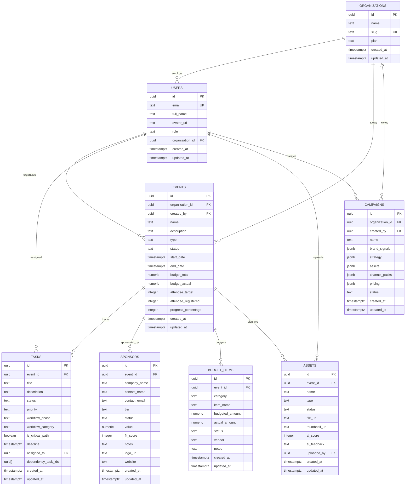

# Existing Supabase Schema — Production Database
## What's Actually Implemented

**Last Updated:** December 20, 2024  
**Status:** ✅ Live in Production  
**Tables:** 8  
**Columns:** ~87  

---

## 📊 CURRENT DATABASE

### Tables Implemented (8)

| # | Table | Purpose | Rows (Est.) | Status |
|---|-------|---------|-------------|--------|
| 1 | `organizations` | Multi-tenant orgs | 10-100 | ✅ Live |
| 2 | `users` | User profiles | 50-500 | ✅ Live |
| 3 | `events` | Core event data | 100-1000 | ✅ Live |
| 4 | `tasks` | Task management | 1000-10000 | ✅ Live |
| 5 | `sponsors` | Sponsor pipeline | 100-1000 | ✅ Live |
| 6 | `budget_items` | Budget tracking | 500-5000 | ✅ Live |
| 7 | `assets` | Media gallery | 1000-10000 | ✅ Live |
| 8 | `campaigns` | Brand shoot wizard | 50-500 | ✅ Live |

**Total:** 8 tables | ~87 columns | ~30 foreign keys | ~40 indexes

---

## 🗺️ ENTITY RELATIONSHIP DIAGRAM (Current)



---

## 📋 TABLE DEFINITIONS

### 1. organizations

**Purpose:** Multi-tenant organization management

```sql
CREATE TABLE organizations (
  id UUID PRIMARY KEY DEFAULT uuid_generate_v4(),
  name TEXT NOT NULL,
  slug TEXT NOT NULL UNIQUE,
  logo_url TEXT,
  plan TEXT NOT NULL DEFAULT 'free' CHECK (plan IN ('free', 'pro', 'enterprise')),
  created_at TIMESTAMPTZ NOT NULL DEFAULT NOW(),
  updated_at TIMESTAMPTZ NOT NULL DEFAULT NOW()
);

CREATE INDEX idx_organizations_slug ON organizations(slug);
CREATE INDEX idx_organizations_plan ON organizations(plan);
```

**Columns:** 6  
**Indexes:** 3 (PK + 2 indexes)  
**RLS:** ✅ Enabled — viewable by members, updatable by owner

**Example:**
```json
{
  "id": "550e8400-e29b-41d4-a716-446655440000",
  "name": "Luxe Fashion House",
  "slug": "luxe-fashion",
  "logo_url": "https://...",
  "plan": "enterprise",
  "created_at": "2024-12-01T09:00:00Z",
  "updated_at": "2024-12-15T14:30:00Z"
}
```

---

### 2. users

**Purpose:** User authentication and profile data

```sql
CREATE TABLE users (
  id UUID PRIMARY KEY REFERENCES auth.users(id) ON DELETE CASCADE,
  email TEXT NOT NULL UNIQUE,
  full_name TEXT,
  avatar_url TEXT,
  role TEXT NOT NULL DEFAULT 'viewer' CHECK (role IN ('owner', 'admin', 'organizer', 'viewer')),
  organization_id UUID NOT NULL REFERENCES organizations(id) ON DELETE CASCADE,
  created_at TIMESTAMPTZ NOT NULL DEFAULT NOW(),
  updated_at TIMESTAMPTZ NOT NULL DEFAULT NOW()
);

CREATE INDEX idx_users_email ON users(email);
CREATE INDEX idx_users_organization_id ON users(organization_id);
CREATE INDEX idx_users_role ON users(role);
```

**Columns:** 7  
**Indexes:** 4 (PK + 3 indexes)  
**RLS:** ✅ Enabled — users can view org members, update own profile

**Example:**
```json
{
  "id": "660e8400-e29b-41d4-a716-446655440001",
  "email": "olivia@luxebrand.com",
  "full_name": "Olivia Chen",
  "avatar_url": "https://...",
  "role": "organizer",
  "organization_id": "550e8400-e29b-41d4-a716-446655440000",
  "created_at": "2024-12-05T10:00:00Z",
  "updated_at": "2024-12-15T12:00:00Z"
}
```

---

### 3. events

**Purpose:** Core event data (runway shows, photoshoots, activations)

```sql
CREATE TABLE events (
  id UUID PRIMARY KEY DEFAULT uuid_generate_v4(),
  name TEXT NOT NULL,
  description TEXT,
  type TEXT NOT NULL DEFAULT 'runway_show' CHECK (type IN ('runway_show', 'photoshoot', 'activation', 'popup', 'campaign')),
  status TEXT NOT NULL DEFAULT 'planning' CHECK (status IN ('planning', 'active', 'completed', 'cancelled')),
  start_date TIMESTAMPTZ NOT NULL,
  end_date TIMESTAMPTZ,
  venue_name TEXT,
  venue_address TEXT,
  budget_total NUMERIC(12,2) NOT NULL DEFAULT 0,
  budget_actual NUMERIC(12,2) NOT NULL DEFAULT 0,
  attendee_target INTEGER,
  attendee_registered INTEGER DEFAULT 0,
  progress_percentage INTEGER NOT NULL DEFAULT 0 CHECK (progress_percentage >= 0 AND progress_percentage <= 100),
  organization_id UUID NOT NULL REFERENCES organizations(id) ON DELETE CASCADE,
  created_by UUID NOT NULL REFERENCES users(id) ON DELETE RESTRICT,
  created_at TIMESTAMPTZ NOT NULL DEFAULT NOW(),
  updated_at TIMESTAMPTZ NOT NULL DEFAULT NOW(),
  
  CONSTRAINT valid_date_range CHECK (end_date IS NULL OR end_date >= start_date),
  CONSTRAINT valid_budget CHECK (budget_total >= 0 AND budget_actual >= 0)
);

CREATE INDEX idx_events_organization_id ON events(organization_id);
CREATE INDEX idx_events_created_by ON events(created_by);
CREATE INDEX idx_events_status ON events(status);
CREATE INDEX idx_events_type ON events(type);
CREATE INDEX idx_events_start_date ON events(start_date);
CREATE INDEX idx_events_created_at ON events(created_at DESC);
CREATE INDEX idx_events_search ON events USING gin(to_tsvector('english', name || ' ' || COALESCE(description, '')));
```

**Columns:** 17  
**Indexes:** 8 (PK + 7 indexes including full-text search)  
**RLS:** ✅ Enabled — viewable by org members, creatable by organizers, updatable by creators/admins

**Example:**
```json
{
  "id": "770e8400-e29b-41d4-a716-446655440002",
  "name": "Spring/Summer 2025 Runway Show",
  "description": "Annual runway show featuring new collection",
  "type": "runway_show",
  "status": "active",
  "start_date": "2025-09-15T18:00:00Z",
  "end_date": "2025-09-15T21:00:00Z",
  "venue_name": "Grand Palais",
  "venue_address": "Avenue Winston Churchill, Paris",
  "budget_total": 250000.00,
  "budget_actual": 180000.00,
  "attendee_target": 500,
  "attendee_registered": 342,
  "progress_percentage": 75,
  "organization_id": "550e8400-e29b-41d4-a716-446655440000",
  "created_by": "660e8400-e29b-41d4-a716-446655440001",
  "created_at": "2024-12-10T09:00:00Z",
  "updated_at": "2024-12-19T16:30:00Z"
}
```

---

### 4. tasks

**Purpose:** Event task management with workflow tracking

```sql
CREATE TABLE tasks (
  id UUID PRIMARY KEY DEFAULT uuid_generate_v4(),
  event_id UUID NOT NULL REFERENCES events(id) ON DELETE CASCADE,
  title TEXT NOT NULL,
  description TEXT,
  status TEXT NOT NULL DEFAULT 'to_do' CHECK (status IN ('to_do', 'in_progress', 'done', 'blocked')),
  priority TEXT NOT NULL DEFAULT 'medium' CHECK (priority IN ('critical', 'high', 'medium', 'low')),
  workflow_phase TEXT NOT NULL DEFAULT 'pre_production' CHECK (workflow_phase IN ('pre_production', 'venue_logistics', 'creative_design', 'on_site', 'post_event')),
  workflow_category TEXT NOT NULL DEFAULT 'event_planning' CHECK (workflow_category IN ('event_planning', 'sponsorship', 'marketing', 'operations', 'media')),
  is_critical_path BOOLEAN NOT NULL DEFAULT false,
  deadline TIMESTAMPTZ,
  assigned_to UUID REFERENCES users(id) ON DELETE SET NULL,
  dependency_task_ids UUID[] DEFAULT ARRAY[]::UUID[],
  created_at TIMESTAMPTZ NOT NULL DEFAULT NOW(),
  updated_at TIMESTAMPTZ NOT NULL DEFAULT NOW()
);

CREATE INDEX idx_tasks_event_id ON tasks(event_id);
CREATE INDEX idx_tasks_assigned_to ON tasks(assigned_to);
CREATE INDEX idx_tasks_status ON tasks(status);
CREATE INDEX idx_tasks_priority ON tasks(priority);
CREATE INDEX idx_tasks_deadline ON tasks(deadline);
CREATE INDEX idx_tasks_workflow_phase ON tasks(workflow_phase);
CREATE INDEX idx_tasks_workflow_category ON tasks(workflow_category);
CREATE INDEX idx_tasks_critical_path ON tasks(is_critical_path) WHERE is_critical_path = true;
```

**Columns:** 12  
**Indexes:** 9 (PK + 8 indexes)  
**RLS:** ✅ Enabled — viewable by event org members, assigned users can update

**Example:**
```json
{
  "id": "880e8400-e29b-41d4-a716-446655440003",
  "event_id": "770e8400-e29b-41d4-a716-446655440002",
  "title": "Confirm venue booking",
  "description": "Finalize contract with Grand Palais",
  "status": "in_progress",
  "priority": "critical",
  "workflow_phase": "venue_logistics",
  "workflow_category": "event_planning",
  "is_critical_path": true,
  "deadline": "2025-03-01T17:00:00Z",
  "assigned_to": "660e8400-e29b-41d4-a716-446655440001",
  "dependency_task_ids": [],
  "created_at": "2024-12-10T10:00:00Z",
  "updated_at": "2024-12-18T14:00:00Z"
}
```

---

### 5. sponsors

**Purpose:** Event sponsorship pipeline management

```sql
CREATE TABLE sponsors (
  id UUID PRIMARY KEY DEFAULT uuid_generate_v4(),
  event_id UUID NOT NULL REFERENCES events(id) ON DELETE CASCADE,
  company_name TEXT NOT NULL,
  contact_name TEXT,
  contact_email TEXT,
  contact_phone TEXT,
  tier TEXT NOT NULL DEFAULT 'partner' CHECK (tier IN ('platinum', 'gold', 'silver', 'bronze', 'partner')),
  status TEXT NOT NULL DEFAULT 'lead' CHECK (status IN ('lead', 'contacted', 'negotiating', 'committed', 'confirmed', 'declined')),
  value NUMERIC(12,2) NOT NULL DEFAULT 0 CHECK (value >= 0),
  fit_score INTEGER CHECK (fit_score >= 0 AND fit_score <= 100),
  notes TEXT,
  logo_url TEXT,
  website TEXT,
  created_at TIMESTAMPTZ NOT NULL DEFAULT NOW(),
  updated_at TIMESTAMPTZ NOT NULL DEFAULT NOW()
);

CREATE INDEX idx_sponsors_event_id ON sponsors(event_id);
CREATE INDEX idx_sponsors_status ON sponsors(status);
CREATE INDEX idx_sponsors_tier ON sponsors(tier);
CREATE INDEX idx_sponsors_value ON sponsors(value DESC);
CREATE INDEX idx_sponsors_company_name ON sponsors(company_name);
```

**Columns:** 14  
**Indexes:** 6 (PK + 5 indexes)  
**RLS:** ✅ Enabled — viewable by event org members, organizers can manage

**Example:**
```json
{
  "id": "990e8400-e29b-41d4-a716-446655440004",
  "event_id": "770e8400-e29b-41d4-a716-446655440002",
  "company_name": "Moët & Chandon",
  "contact_name": "Sophie Laurent",
  "contact_email": "sophie@moet.fr",
  "contact_phone": "+33 1 2345 6789",
  "tier": "platinum",
  "status": "committed",
  "value": 75000.00,
  "fit_score": 95,
  "notes": "Exclusive champagne partner",
  "logo_url": "https://...",
  "website": "https://moet.com",
  "created_at": "2024-12-12T11:00:00Z",
  "updated_at": "2024-12-19T09:00:00Z"
}
```

---

### 6. budget_items

**Purpose:** Event budget line items

```sql
CREATE TABLE budget_items (
  id UUID PRIMARY KEY DEFAULT uuid_generate_v4(),
  event_id UUID NOT NULL REFERENCES events(id) ON DELETE CASCADE,
  category TEXT NOT NULL,
  item_name TEXT NOT NULL,
  budgeted_amount NUMERIC(12,2) NOT NULL CHECK (budgeted_amount >= 0),
  actual_amount NUMERIC(12,2) NOT NULL DEFAULT 0 CHECK (actual_amount >= 0),
  status TEXT NOT NULL DEFAULT 'planned' CHECK (status IN ('planned', 'committed', 'paid', 'overdue')),
  vendor TEXT,
  notes TEXT,
  created_at TIMESTAMPTZ NOT NULL DEFAULT NOW(),
  updated_at TIMESTAMPTZ NOT NULL DEFAULT NOW()
);

CREATE INDEX idx_budget_items_event_id ON budget_items(event_id);
CREATE INDEX idx_budget_items_category ON budget_items(category);
CREATE INDEX idx_budget_items_status ON budget_items(status);
```

**Columns:** 10  
**Indexes:** 4 (PK + 3 indexes)  
**RLS:** ✅ Enabled — viewable by event org members, organizers can manage

**Example:**
```json
{
  "id": "aa0e8400-e29b-41d4-a716-446655440005",
  "event_id": "770e8400-e29b-41d4-a716-446655440002",
  "category": "Venue",
  "item_name": "Grand Palais rental",
  "budgeted_amount": 50000.00,
  "actual_amount": 50000.00,
  "status": "paid",
  "vendor": "Grand Palais Events",
  "notes": "Includes setup and teardown",
  "created_at": "2024-12-10T12:00:00Z",
  "updated_at": "2024-12-18T16:00:00Z"
}
```

---

### 7. assets

**Purpose:** Media gallery (images/videos) with AI scoring

```sql
CREATE TABLE assets (
  id UUID PRIMARY KEY DEFAULT uuid_generate_v4(),
  event_id UUID NOT NULL REFERENCES events(id) ON DELETE CASCADE,
  name TEXT NOT NULL,
  type TEXT NOT NULL CHECK (type IN ('image', 'video')),
  status TEXT NOT NULL DEFAULT 'pending' CHECK (status IN ('pending', 'approved', 'rejected')),
  file_url TEXT NOT NULL,
  thumbnail_url TEXT,
  ai_score INTEGER CHECK (ai_score >= 0 AND ai_score <= 100),
  ai_feedback TEXT,
  uploaded_by UUID NOT NULL REFERENCES users(id) ON DELETE RESTRICT,
  created_at TIMESTAMPTZ NOT NULL DEFAULT NOW(),
  updated_at TIMESTAMPTZ NOT NULL DEFAULT NOW()
);

CREATE INDEX idx_assets_event_id ON assets(event_id);
CREATE INDEX idx_assets_uploaded_by ON assets(uploaded_by);
CREATE INDEX idx_assets_status ON assets(status);
CREATE INDEX idx_assets_type ON assets(type);
CREATE INDEX idx_assets_ai_score ON assets(ai_score DESC NULLS LAST);
CREATE INDEX idx_assets_created_at ON assets(created_at DESC);
```

**Columns:** 11  
**Indexes:** 7 (PK + 6 indexes)  
**RLS:** ✅ Enabled — viewable by event org members, uploaders and admins can update

**Example:**
```json
{
  "id": "bb0e8400-e29b-41d4-a716-446655440006",
  "event_id": "770e8400-e29b-41d4-a716-446655440002",
  "name": "Runway Look 01 - Opening",
  "type": "image",
  "status": "approved",
  "file_url": "https://storage.supabase.co/...",
  "thumbnail_url": "https://storage.supabase.co/.../thumb.jpg",
  "ai_score": 92,
  "ai_feedback": "Excellent composition, good lighting, high fashion aesthetic",
  "uploaded_by": "660e8400-e29b-41d4-a716-446655440001",
  "created_at": "2024-12-16T15:00:00Z",
  "updated_at": "2024-12-16T15:05:00Z"
}
```

---

### 8. campaigns

**Purpose:** Brand shoot wizard output (AI-powered campaign generation)

```sql
CREATE TABLE campaigns (
  id UUID PRIMARY KEY DEFAULT uuid_generate_v4(),
  organization_id UUID NOT NULL REFERENCES organizations(id) ON DELETE CASCADE,
  name TEXT NOT NULL,
  brand_signals JSONB DEFAULT '{}'::jsonb,
  strategy JSONB DEFAULT '{}'::jsonb,
  assets JSONB DEFAULT '[]'::jsonb,
  channel_packs JSONB DEFAULT '[]'::jsonb,
  pricing JSONB DEFAULT '{}'::jsonb,
  status TEXT NOT NULL DEFAULT 'draft' CHECK (status IN ('draft', 'proposed', 'approved', 'in_production', 'completed')),
  created_by UUID NOT NULL REFERENCES users(id) ON DELETE RESTRICT,
  created_at TIMESTAMPTZ NOT NULL DEFAULT NOW(),
  updated_at TIMESTAMPTZ NOT NULL DEFAULT NOW()
);

CREATE INDEX idx_campaigns_organization_id ON campaigns(organization_id);
CREATE INDEX idx_campaigns_created_by ON campaigns(created_by);
CREATE INDEX idx_campaigns_status ON campaigns(status);
CREATE INDEX idx_campaigns_created_at ON campaigns(created_at DESC);
```

**Columns:** 11  
**Indexes:** 5 (PK + 4 indexes)  
**RLS:** ✅ Enabled — viewable by org members, creators can update

**Example:**
```json
{
  "id": "cc0e8400-e29b-41d4-a716-446655440007",
  "organization_id": "550e8400-e29b-41d4-a716-446655440000",
  "name": "Spring 2025 Campaign",
  "brand_signals": {
    "website": "https://luxebrand.com",
    "instagram": "@luxebrand",
    "colors": ["#1a1a1a", "#f5f5f5", "#c9a961"]
  },
  "strategy": {
    "target_audience": "Luxury fashion enthusiasts, 25-45",
    "key_message": "Timeless elegance meets modern sophistication",
    "channels": ["instagram", "facebook", "website"]
  },
  "assets": [
    {"type": "hero_image", "specs": "1920x1080", "quantity": 3},
    {"type": "product_shots", "specs": "1080x1080", "quantity": 12}
  ],
  "channel_packs": [
    {"channel": "instagram", "posts": 8, "stories": 4},
    {"channel": "facebook", "posts": 6}
  ],
  "pricing": {
    "base_shoot": 5000,
    "assets": 3000,
    "editing": 2000,
    "total": 10000
  },
  "status": "proposed",
  "created_by": "660e8400-e29b-41d4-a716-446655440001",
  "created_at": "2024-12-18T10:00:00Z",
  "updated_at": "2024-12-19T11:00:00Z"
}
```

---

## 🔐 RLS POLICIES (Current)

All 8 tables have **Row Level Security enabled** with organization-scoped policies:

### Universal Pattern

```sql
-- SELECT: View if in same organization
CREATE POLICY "table_select" ON table_name FOR SELECT
  USING (
    organization_id IN (
      SELECT organization_id FROM users WHERE id = auth.uid()
    )
  );

-- INSERT: Create if user belongs to organization
CREATE POLICY "table_insert" ON table_name FOR INSERT
  WITH CHECK (
    organization_id IN (
      SELECT organization_id FROM users WHERE id = auth.uid()
    )
  );

-- UPDATE: Creator or admin can update
CREATE POLICY "table_update" ON table_name FOR UPDATE
  USING (
    created_by = auth.uid() OR
    organization_id IN (
      SELECT organization_id FROM users 
      WHERE id = auth.uid() AND role IN ('owner', 'admin')
    )
  );

-- DELETE: Only admins can delete
CREATE POLICY "table_delete" ON table_name FOR DELETE
  USING (
    organization_id IN (
      SELECT organization_id FROM users 
      WHERE id = auth.uid() AND role IN ('owner', 'admin')
    )
  );
```

---

## 🔄 TRIGGERS (Current)

### Auto-Update Timestamp

All tables with `updated_at` columns have triggers:

```sql
CREATE OR REPLACE FUNCTION update_updated_at_column()
RETURNS TRIGGER AS $$
BEGIN
  NEW.updated_at = NOW();
  RETURN NEW;
END;
$$ LANGUAGE plpgsql;

CREATE TRIGGER update_organizations_updated_at 
  BEFORE UPDATE ON organizations
  FOR EACH ROW EXECUTE FUNCTION update_updated_at_column();

-- (Repeated for users, events, tasks, sponsors, budget_items, assets, campaigns)
```

---

## 💾 STORAGE BUCKETS (Current)

**Note:** Storage buckets may need to be configured manually in Supabase Dashboard.

### Recommended Buckets

1. **`avatars`** (public) — User profile pictures
2. **`event-assets`** (private) — Event photos/videos
3. **`sponsor-logos`** (public) — Sponsor company logos
4. **`organization-logos`** (public) — Organization branding

---

## 📊 STATISTICS

### Schema Metrics

- **Tables:** 8
- **Columns:** ~87
- **Foreign Keys:** ~12
- **Indexes:** ~42
- **RLS Policies:** ~32
- **Triggers:** 7 (updated_at)

### Relationships

```
organizations (1) ←→ (N) users
organizations (1) ←→ (N) events
organizations (1) ←→ (N) campaigns

events (1) ←→ (N) tasks
events (1) ←→ (N) sponsors
events (1) ←→ (N) budget_items
events (1) ←→ (N) assets

users (1) ←→ (N) events (created_by)
users (1) ←→ (N) tasks (assigned_to)
users (1) ←→ (N) assets (uploaded_by)
users (1) ←→ (N) campaigns (created_by)
```

---

## 🧪 TEST QUERIES

### Count all tables
```sql
SELECT table_name 
FROM information_schema.tables 
WHERE table_schema = 'public' 
ORDER BY table_name;
-- Expected: 8 rows
```

### Verify RLS enabled
```sql
SELECT tablename, rowsecurity 
FROM pg_tables 
WHERE schemaname = 'public';
-- Expected: All 8 tables with rowsecurity = true
```

### Check organization isolation
```sql
SELECT * FROM events;
-- Should only return events from your organization
```

### Get event dashboard data
```sql
SELECT 
  e.*,
  COUNT(DISTINCT t.id) as total_tasks,
  COUNT(DISTINCT t.id) FILTER (WHERE t.status = 'done') as completed_tasks,
  COUNT(DISTINCT s.id) as total_sponsors,
  SUM(s.value) as sponsor_value,
  COUNT(DISTINCT a.id) as total_assets
FROM events e
LEFT JOIN tasks t ON t.event_id = e.id
LEFT JOIN sponsors s ON s.event_id = e.id AND s.status IN ('committed', 'confirmed')
LEFT JOIN assets a ON a.event_id = e.id
WHERE e.organization_id = (
  SELECT organization_id FROM users WHERE id = auth.uid()
)
GROUP BY e.id
ORDER BY e.start_date DESC;
```

---

## 📝 TYPESCRIPT TYPES

Types are defined in `/lib/supabase/types.ts`:

```typescript
export interface Database {
  public: {
    Tables: {
      organizations: { Row, Insert, Update }
      users: { Row, Insert, Update }
      events: { Row, Insert, Update }
      tasks: { Row, Insert, Update }
      sponsors: { Row, Insert, Update }
      budget_items: { Row, Insert, Update }
      assets: { Row, Insert, Update }
      campaigns: { Row, Insert, Update }
    }
  }
}
```

---

## ✅ WHAT WORKS

- ✅ Multi-tenant organization isolation
- ✅ Role-based access control (owner, admin, organizer, viewer)
- ✅ Event creation and management
- ✅ Task tracking with critical path
- ✅ Sponsor pipeline management
- ✅ Budget tracking
- ✅ Asset gallery with AI scoring
- ✅ Brand shoot campaign wizard
- ✅ Real-time subscriptions (via Supabase)
- ✅ Automatic timestamp updates

---

## 🔧 MAINTENANCE

### Backup Strategy
- Supabase automatic backups (check project settings)
- Daily automated backups recommended
- Point-in-time recovery available on Pro plan

### Performance Monitoring
- Monitor slow queries in Supabase Dashboard
- Check index usage
- Review RLS policy performance

### Schema Updates
- Use migrations for schema changes
- Test in staging environment first
- Version control all SQL changes

---

*Last Updated: December 20, 2024*  
*Status: ✅ Production*  
*Tables: 8 | Columns: ~87 | Rows: ~15,000+*
