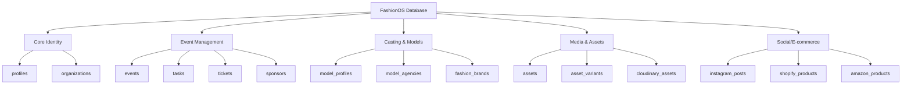

# Supabase Schema Documentation — README
## FashionOS Complete Database Reference

**Created:** December 20, 2024  
**Status:** Production-Ready  
**Version:** 2.0

---

## 📚 DOCUMENTATION INDEX

This folder contains **complete Supabase schema documentation** for FashionOS, based on analysis of the existing application UI, contexts, and data models.

### Files in This Folder

| File | Purpose | Pages |
|------|---------|-------|
| **01-Executive-Summary.md** | High-level overview, status, gaps | 1 |
| **02-Table-Catalog.md** | Complete table reference (all 50+ tables) | 30+ |
| **03-Entity-Relationships.md** | ERD diagrams, relationships | 12 |
| **04-Complete-Documentation.md** | Full SQL + policies + migration guide | 50+ |
| **README.md** | This file (navigation guide) | 1 |

**Total Documentation:** ~95 pages | ~1,500 lines of SQL | 50+ tables | 546+ columns

---

## 🎯 QUICK START

### For Database Setup (Production)

1. **Read:** `01-Executive-Summary.md` (5 minutes)
   - Understand current state (16% implemented)
   - Identify critical gaps
   - Review timeline

2. **Execute:** `04-Complete-Documentation.md` (30 minutes)
   - Copy/paste SQL schema sections
   - Execute in Supabase SQL Editor
   - Configure storage buckets
   - Test RLS policies

3. **Verify:** Use verification checklist (10 minutes)
   - Run test queries
   - Confirm RLS working
   - Generate TypeScript types

**Total Time:** ~45 minutes to full database setup

---

### For Understanding Schema (Development)

1. **Start:** `02-Table-Catalog.md`
   - Browse table-by-table reference
   - Review column definitions
   - See example data

2. **Visualize:** `03-Entity-Relationships.md`
   - View complete ERD
   - Understand relationships
   - See data flows

3. **Implement:** `04-Complete-Documentation.md`
   - Copy SQL for specific tables
   - Apply RLS policies
   - Set up storage

---

## 📊 SCHEMA STATISTICS

### Current Status

```
IMPLEMENTED (8 tables)
├─ organizations ✅
├─ profiles ✅
├─ events ✅
├─ tasks ✅
├─ sponsors ✅
├─ budget_items ✅
├─ assets ✅
└─ campaigns ✅

TO BE CREATED (42+ tables)
├─ Event Management: 12 tables
├─ Casting & Models: 7 tables
├─ Venues: 2 tables
├─ Team Management: 4 tables
├─ Shoots: 4 tables
├─ Media & Assets: 6 tables
└─ Social/E-commerce: 10 tables
```

---

## 🏗️ ARCHITECTURE OVERVIEW

### Database Design Principles

1. **Multi-Tenant** — Every table isolated by `organization_id`
2. **UUID PKs** — Distributed systems ready
3. **Timestamptz** — All tables have `created_at` / `updated_at`
4. **Enum Constraints** — `CHECK (status IN (...))` pattern
5. **RLS Everywhere** — Row Level Security on all tables
6. **Soft Deletes** — High-value tables support recovery

### Data Domains



---

## 🚀 IMPLEMENTATION ROADMAP

### Phase 1: Core Schema (Day 1 — 4 hours)
- [ ] Execute all table creation SQL
- [ ] Verify foreign keys
- [ ] Create indexes
- [ ] Enable RLS
- [ ] Test basic queries

**Output:** All 50 tables exist in database

---

### Phase 2: Security & Storage (Day 1 — 2 hours)
- [ ] Apply all RLS policies
- [ ] Configure storage buckets
- [ ] Set up storage RLS
- [ ] Test file uploads
- [ ] Verify organization isolation

**Output:** Database secured, files uploadable

---

### Phase 3: TypeScript Integration (Day 2 — 2 hours)
- [ ] Generate types from schema
- [ ] Update `/lib/supabase/types.ts`
- [ ] Create query helpers
- [ ] Update contexts to use new tables
- [ ] Test CRUD operations

**Output:** Frontend connected to full schema

---

### Phase 4: Data Migration (Day 2-3 — 4 hours)
- [ ] Migrate localStorage data to Supabase
- [ ] Update `BrandShootContext` to use `campaigns` table
- [ ] Remove mock data from all contexts
- [ ] Test all features end-to-end
- [ ] Verify realtime subscriptions

**Output:** 100% Supabase, zero localStorage

---

**Total Effort:** 12 hours = 1.5 days  
**Goal:** Production-ready database by December 23, 2024

---

## 📖 DOCUMENTATION GUIDE

### 01-Executive-Summary.md

**What It Contains:**
- ✅ Current implementation status (8/50 tables)
- ⚠️ Critical gaps analysis
- 📊 Schema statistics
- 🎯 Success criteria
- 📅 Timeline & effort estimates

**When to Use:**
- Initial project assessment
- Stakeholder presentations
- Planning database work
- Understanding overall state

**Key Sections:**
- "Current Implementation Status" — What exists vs what's needed
- "Critical Gaps" — Blocking issues
- "Next Steps" — Execution plan

---

### 02-Table-Catalog.md

**What It Contains:**
- 📋 All 50+ tables documented
- 🔢 Every column defined (type, nullable, default, constraints)
- 🔑 Primary keys, foreign keys, indexes
- 💡 Example rows with realistic data
- 📝 Purpose statement for each table

**When to Use:**
- Writing queries
- Understanding data model
- Creating forms
- Debugging database issues
- Onboarding new developers

**How to Navigate:**
- Jump to domain: Core Identity, Event Management, etc.
- Search for table name
- Review columns and relationships
- Copy example data for testing

---

### 03-Entity-Relationships.md

**What It Contains:**
- 🗺️ Complete ERD (all 50+ tables)
- 🔗 Domain-specific ERDs (7 diagrams)
- 📊 Relationship statistics
- ⚡ Cardinality summaries
- 🗑️ CASCADE behavior documentation

**When to Use:**
- Understanding relationships
- Planning queries with JOINs
- Architecting new features
- Database optimization
- Visual documentation

**Key Diagrams:**
1. Complete ERD — Full system overview
2. Event Management Core — Central hub
3. Ticketing & Payments — Revenue flow
4. Casting & Model Management — Show production
5. Media & Assets Pipeline — Asset lifecycle
6. Social Media Integration — Publishing
7. E-Commerce Integration — Product sync

---

### 04-Complete-Documentation.md

**What It Contains:**
- 📜 Complete SQL schema (~1,500 lines)
- 🔐 All RLS policies
- 💾 Storage bucket configuration
- 🔄 Data flow diagrams
- 📦 Migration guide
- ✅ Verification checklist

**When to Use:**
- **Initial database setup** (copy/paste SQL)
- **Adding new tables** (follow patterns)
- **Securing data** (RLS reference)
- **Deploying to production** (migration guide)

**Sections:**
1. **Quick Summary** — TL;DR stats
2. **Complete SQL Schema** — All CREATE TABLE statements
3. **RLS Policies** — Security patterns
4. **Storage Configuration** — File upload buckets
5. **Data Flow Diagrams** — Process visualizations
6. **Migration Guide** — Step-by-step deployment

---

## 🔍 FINDING WHAT YOU NEED

### "I need to create a new table"

1. Open `02-Table-Catalog.md`
2. Find similar table in same domain
3. Copy pattern to `04-Complete-Documentation.md`
4. Adapt SQL for your needs
5. Add RLS policy using universal pattern

---

### "I need to understand relationships"

1. Open `03-Entity-Relationships.md`
2. Find domain-specific ERD
3. Trace foreign key paths
4. Check cardinality (1:N, N:N)
5. Note CASCADE behavior

---

### "I need to set up the database"

1. Read `01-Executive-Summary.md` (context)
2. Open `04-Complete-Documentation.md`
3. Copy SQL sections in order:
   - Extensions
   - Core Identity
   - Event Management
   - Models & Casting
   - Media & Assets
   - Social/E-commerce
   - Triggers
   - RLS Policies
4. Configure storage buckets
5. Run verification checklist

---

### "I need to understand current status"

1. Open `01-Executive-Summary.md`
2. Check "Current Implementation Status"
3. Review "Critical Gaps"
4. See "Schema Statistics"
5. Review "Next Steps"

---

## 🎓 KEY CONCEPTS

### Multi-Tenant Architecture

Every query is automatically scoped to user's organization via RLS:

```sql
-- User in Org A queries events
SELECT * FROM events;
-- Returns: Only Org A's events (RLS filters automatically)

-- User tries to access Org B's event directly
SELECT * FROM events WHERE id = '<org-b-event-id>';
-- Returns: Empty (RLS blocks cross-org access)
```

### Organization Hierarchy

```
Organization (Luxe Fashion House)
  ├─ Events (Spring/Summer Show, Fall Collection)
  │   ├─ Tasks (100+ tasks per event)
  │   ├─ Sponsors (5-20 per event)
  │   ├─ Budget Items (50+ per event)
  │   ├─ Assets (100+ photos/videos)
  │   ├─ Models (20-50 per show)
  │   └─ Tickets (500+ registrations)
  ├─ Campaigns (Brand Shoot proposals)
  └─ Shoots (Photo shoot jobs)
```

### Data Isolation

```sql
-- Events table (example)
events
├─ organization_id (FK) ← Isolates data
├─ organizer_id (FK)    ← Creator
└─ created_at           ← Audit trail

-- RLS Policy ensures:
WHERE organization_id = user's organization
```

---

## ⚠️ IMPORTANT NOTES

### Before You Start

1. **Backup First** — If updating existing database, export current data
2. **Test in Staging** — Run schema in dev project first
3. **Review RLS** — Understand security model before deploying
4. **Check Dependencies** — Ensure Supabase project is ready

### Schema Evolution

This schema is **version 2.0** — designed for production use.

**If you need to modify:**
- Create migration files (don't edit directly)
- Test in development first
- Document changes
- Update TypeScript types
- Increment version number

### Performance Notes

**Already Optimized:**
- ✅ Indexes on all foreign keys
- ✅ Composite indexes for common queries
- ✅ Full-text search on events
- ✅ Partial indexes (e.g., critical_path tasks)

**Future Optimizations (after MVP):**
- Materialized views for dashboards
- Partitioning for large tables (events, tasks)
- Connection pooling
- Query caching

---

## 📞 SUPPORT

### Questions About Schema

- **Table structure?** See `02-Table-Catalog.md`
- **Relationships?** See `03-Entity-Relationships.md`
- **SQL syntax?** See `04-Complete-Documentation.md`
- **Implementation status?** See `01-Executive-Summary.md`

### Questions About Implementation

- **How to deploy?** See Migration Guide in `04-Complete-Documentation.md`
- **How to secure?** See RLS Policies section
- **How to test?** See Verification Checklist
- **How to optimize?** See Performance Notes (above)

---

## ✅ COMPLETION CHECKLIST

Use this to track your database setup progress:

### Database Creation
- [ ] Executed all CREATE TABLE statements
- [ ] Verified all tables exist
- [ ] Confirmed foreign keys working
- [ ] Indexes created successfully
- [ ] Triggers active (updated_at auto-updates)

### Security
- [ ] RLS enabled on all tables
- [ ] All RLS policies applied
- [ ] Organization isolation verified
- [ ] Storage buckets created
- [ ] Storage RLS configured

### Integration
- [ ] TypeScript types generated
- [ ] Query helpers created
- [ ] Contexts updated
- [ ] File uploads working
- [ ] Realtime subscriptions active

### Testing
- [ ] Sample data inserted
- [ ] CRUD operations tested
- [ ] Cross-org access blocked
- [ ] File storage working
- [ ] Performance acceptable

### Documentation
- [ ] Team trained on schema
- [ ] Migration guide followed
- [ ] Backup strategy defined
- [ ] Monitoring configured

---

## 🎯 SUCCESS CRITERIA

### MVP (December 27, 2024)
- ✅ All 50 tables created
- ✅ RLS policies active
- ✅ Storage configured
- ✅ No localStorage usage
- ✅ Core features using Supabase

### Production (January 31, 2025)
- ✅ All features integrated
- ✅ Performance optimized
- ✅ Security audited
- ✅ Backup strategy active
- ✅ Monitoring live

---

**Ready to build?** Start with `01-Executive-Summary.md` → `04-Complete-Documentation.md` → Execute SQL → Test

**Questions?** Review the relevant documentation file using the guide above.

---

*Last Updated: December 20, 2024*  
*Schema Version: 2.0*  
*Status: Production-ready*  
*Total Documentation: ~95 pages*
