```mermaid
graph TB
    MAIN[Main Sponsorship Page<br/>/sponsors]
    
    subgraph "Luxury Tier"
        BEAUTY[Beauty & Cosmetics<br/>/sponsors/beauty]
        AUTO[Automotive<br/>/sponsors/automotive]
        JEWELRY[Jewelry & Watches<br/>/sponsors/jewelry]
        SPIRITS[Spirits & Wine<br/>/sponsors/spirits]
    end
    
    subgraph "Premium Tier"
        REAL[Real Estate<br/>/sponsors/real-estate]
        TECH[Technology<br/>/sponsors/technology]
        FINANCE[Financial Services<br/>/sponsors/finance]
        TRAVEL[Travel & Hospitality<br/>/sponsors/travel]
    end
    
    subgraph "Lifestyle Tier"
        WELLNESS[Wellness & Fitness<br/>/sponsors/wellness]
        FOOD[Food & Beverage<br/>/sponsors/food-beverage]
        MEDIA[Media & Entertainment<br/>/sponsors/media]
        RETAIL[Retail & E-commerce<br/>/sponsors/retail]
    end
    
    MAIN --> BEAUTY
    MAIN --> AUTO
    MAIN --> JEWELRY
    MAIN --> SPIRITS
    
    MAIN --> REAL
    MAIN --> TECH
    MAIN --> FINANCE
    MAIN --> TRAVEL
    
    MAIN --> WELLNESS
    MAIN --> FOOD
    MAIN --> MEDIA
    MAIN --> RETAIL
    
    style MAIN fill:#e1f5ff
    style BEAUTY fill:#ffe1e1
    style AUTO fill:#ffe1e1
    style JEWELRY fill:#ffe1e1
    style SPIRITS fill:#ffe1e1
    style REAL fill:#fff4e1
    style TECH fill:#fff4e1
    style FINANCE fill:#fff4e1
    style TRAVEL fill:#fff4e1
```

# FashionOS Sponsor Pages — Complete Directory

**Status:** In Progress  
**Version:** 1.0  
**Last Updated:** December 23, 2024  
**Total Sponsor Pages:** 12

---

## 📊 Sponsor Pages Overview

---

## 📋 All Sponsor Pages Summary Table

| # | Sponsor Category | Route | Tier | Status | Sections | Images | Animations | Priority | Est. Investment |
|---|-----------------|-------|------|--------|----------|--------|------------|----------|-----------------|
| 1 | **Main Sponsorship Hub** | `/sponsors` | Landing | Complete | 8 | 12 | 5 | P0 | - |
| 2 | **Beauty & Cosmetics** | `/sponsors/beauty` | Luxury | Complete | 12 | 15 | 8 | P0 | $150K-$500K |
| 3 | **Automotive** | `/sponsors/automotive` | Luxury | Complete | 12 | 18 | 10 | P0 | $200K-$1M |
| 4 | **Real Estate** | `/sponsors/real-estate` | Premium | Complete | 11 | 14 | 7 | P0 | $100K-$400K |
| 5 | **Jewelry & Watches** | `/sponsors/jewelry` | Luxury | In Progress | 12 | 16 | 9 | P1 | $250K-$800K |
| 6 | **Spirits & Wine** | `/sponsors/spirits` | Luxury | Not Started | 11 | 14 | 8 | P1 | $150K-$600K |
| 7 | **Technology** | `/sponsors/technology` | Premium | Not Started | 10 | 12 | 6 | P1 | $100K-$300K |
| 8 | **Financial Services** | `/sponsors/finance` | Premium | Not Started | 10 | 10 | 5 | P2 | $150K-$500K |
| 9 | **Travel & Hospitality** | `/sponsors/travel` | Premium | Not Started | 11 | 16 | 7 | P2 | $100K-$400K |
| 10 | **Wellness & Fitness** | `/sponsors/wellness` | Lifestyle | Not Started | 10 | 13 | 6 | P2 | $75K-$250K |
| 11 | **Food & Beverage** | `/sponsors/food-beverage` | Lifestyle | Not Started | 10 | 15 | 6 | P3 | $50K-$200K |
| 12 | **Media & Entertainment** | `/sponsors/media` | Lifestyle | Not Started | 9 | 12 | 5 | P3 | $75K-$300K |
| 13 | **Retail & E-commerce** | `/sponsors/retail` | Lifestyle | Not Started | 10 | 14 | 6 | P3 | $50K-$250K |

---

## 🎯 Sponsorship Tiers Explanation

| Tier | Average Investment | Typical Brands | Activation Types | ROI Multiplier |
|------|-------------------|----------------|------------------|----------------|
| **Luxury** | $200K-$1M | Chanel, Mercedes-Benz, Cartier, Moët | Title sponsor, Exclusive lounge, Runway branding | 15-70× |
| **Premium** | $100K-$500K | Sotheby's, American Express, Four Seasons | VIP experience, Venue naming, Digital takeover | 10-40× |
| **Lifestyle** | $50K-$300K | Lululemon, Whole Foods, Netflix | Pop-up activation, Product sampling, Social media | 5-25× |

---

## 🏠 Main Sponsorship Hub (`/sponsors`)

**Purpose:** Central landing page for all sponsorship opportunities  
**Design Style:** Luxury editorial with interactive category exploration  
**Priority:** P0 - Critical  
**Status:** ✅ Complete

### Content Sections (8 Total)

| Section | Type | Content | Images | Animations | CTA |
|---------|------|---------|--------|------------|-----|
| **Hero** | Full-screen video | "Partner With Fashion's Future" headline over fashion show video | 1 video background | Parallax on scroll | 1 (Explore Opportunities) |
| **Why Sponsor** | Value props | 4 reasons to sponsor with FashionOS events | 4 icons | Fade-in on scroll | 0 |
| **By Category** | Interactive grid | 12 sponsor categories with hover states | 12 category images | Scale + glow on hover | 12 (View Details) |
| **Success Stories** | Carousel | 6 sponsor case studies with ROI data | 6 brand logos + photos | Auto-rotate carousel | 6 (Read Story) |
| **Activation Types** | Tab switcher | 8 activation types (VIP, Runway, Digital, etc.) | 8 activation photos | Fade transition | 0 |
| **Pricing Tiers** | 3-column | Luxury, Premium, Lifestyle tier cards | 0 | Slide-in from bottom | 3 (Learn More) |
| **Testimonials** | Video grid | 4 sponsor testimonials with video quotes | 4 video thumbnails | Play on hover | 0 |
| **Contact** | Form | "Become a Sponsor" lead capture form | 1 background image | None | 1 (Submit) |

### Headlines & Taglines

| Section | Headline | Subheading |
|---------|----------|------------|
| **Hero** | "Partner With Fashion's Future" | "Elevate your brand at luxury events reaching 1M+ affluent consumers" |
| **Why Sponsor** | "Why World-Class Brands Choose FashionOS Events" | "Access, exposure, and measurable ROI" |
| **Categories** | "Find Your Perfect Audience" | "12 sponsorship categories tailored to your brand" |
| **Success** | "Real Sponsors, Real Results" | "See how leading brands achieved 15-70× ROI" |
| **Activations** | "8 Ways to Activate Your Brand" | "From runway integration to exclusive lounges" |
| **Pricing** | "Flexible Investment Levels" | "Packages from $50K to $1M+ with custom options" |
| **Testimonials** | "Hear From Our Partners" | "Sponsors share their experience and results" |
| **Contact** | "Let's Create Something Extraordinary" | "Schedule a consultation with our partnerships team" |

### Category Cards (12 Total)

| Category | Icon | Tagline | Hover Image | Link |
|----------|------|---------|-------------|------|
| **Beauty & Cosmetics** | 💄 | "Backstage to consumer" | Makeup artist backstage | `/sponsors/beauty` |
| **Automotive** | 🚗 | "Luxury meets luxury" | Car at venue entrance | `/sponsors/automotive` |
| **Real Estate** | 🏛️ | "Lifestyle alignment" | Luxury property exterior | `/sponsors/real-estate` |
| **Jewelry & Watches** | 💎 | "Timeless elegance" | Jewelry on model | `/sponsors/jewelry` |
| **Spirits & Wine** | 🍾 | "Toast to success" | Champagne at VIP lounge | `/sponsors/spirits` |
| **Technology** | 💻 | "Innovation meets fashion" | Tech product display | `/sponsors/technology` |
| **Financial Services** | 💳 | "Affluent audience access" | Exclusive card activation | `/sponsors/finance` |
| **Travel & Hospitality** | ✈️ | "Destination inspiration" | Luxury hotel suite | `/sponsors/travel` |
| **Wellness & Fitness** | 🧘 | "Health meets style" | Yoga class at pop-up | `/sponsors/wellness` |
| **Food & Beverage** | 🍽️ | "Culinary excellence" | Catered event spread | `/sponsors/food-beverage` |
| **Media & Entertainment** | 🎬 | "Content amplification" | Film crew at event | `/sponsors/media` |
| **Retail & E-commerce** | 🛍️ | "Direct consumer connection" | Pop-up shop | `/sponsors/retail` |

---

## 💄 Beauty & Cosmetics Sponsor Page (`/sponsors/beauty`)

**Status:** ✅ Complete  
**Investment Range:** $150K-$500K  
**Target Brands:** L'Oréal, Estée Lauder, MAC, NARS, Charlotte Tilbury, Fenty Beauty

### Content Sections (12 Total)

| Section | Type | Content | Images | Animations | CTA |
|---------|------|---------|--------|------------|-----|
| **Hero** | Split-screen | Left: Headline, Right: Backstage makeup application video | 1 video | Parallax video | 1 (Download Package) |
| **Opportunity Overview** | Stats grid | "400M beauty consumers, 92% purchase intent" | 0 | Count-up numbers | 0 |
| **Why Beauty Brands** | 3-column | Backstage access, Product placement, Influencer reach | 3 images | Slide-in sequence | 0 |
| **Activation Options** | Accordion | 6 activation types with pricing | 6 images | Expand/collapse | 6 (Learn More) |
| **Backstage Integration** | Feature spotlight | Exclusive backstage makeup area branding | 5 images | Image carousel | 1 (Reserve Now) |
| **Product Showcase** | Interactive | Virtual tour of product display setup | 1 360° image | 360° drag | 0 |
| **Social Media Reach** | Instagram feed | Live social wall showing beauty content | 12 social posts | Real-time update | 1 (View Analytics) |
| **Influencer Network** | Grid | 20 beauty influencer profiles with reach stats | 20 headshots | Hover expand | 0 |
| **ROI Calculator** | Interactive | Input budget, see projected impressions/sales | 0 | Dynamic calculation | 1 (Calculate ROI) |
| **Case Study** | Long-form | "MAC Cosmetics: 2.1M Impressions, 47K Sales" | 8 images | Scroll-triggered | 1 (Read Full Story) |
| **Package Options** | Pricing table | Bronze ($150K), Silver ($250K), Gold ($500K) | 0 | Hover highlight | 3 (Select Package) |
| **Contact Form** | Multi-step | 3-step form: Brand info → Goals → Schedule call | 1 background | Progress bar | 1 (Submit) |

### Activation Options (6 Types)

| Activation Type | Description | Investment | ROI Estimate | Key Deliverables |
|----------------|-------------|------------|--------------|------------------|
| **Backstage Takeover** | Exclusive makeup/hair station branding | $200K-$500K | 15-25× | Logo placement, product use, photo rights, social posts |
| **VIP Gift Bags** | Luxury samples in 200 VIP gift bags | $50K-$100K | 8-15× | Branded bags, full-size products, discount codes |
| **Runway Model Beauty** | Official makeup/hair sponsor | $150K-$400K | 20-40× | All models use products, backstage signage, credits |
| **Beauty Lounge** | Dedicated touch-up station for guests | $100K-$250K | 12-20× | Branded lounge, staff, product sampling, photos |
| **Digital Campaign** | Pre/post event social media integration | $75K-$200K | 10-30× | Instagram stories, TikTok videos, influencer posts |
| **Product Launch** | Exclusive first-look at new product | $200K-$600K | 25-60× | On-model debut, press coverage, social amplification |

### Beauty-Specific Metrics

| Metric | Benchmark | How We Measure |
|--------|-----------|----------------|
| **Backstage Impressions** | 500K-2M per event | Photographer credits, social posts, press coverage |
| **Product Trial Rate** | 65-85% of attendees | Gift bag pickup, lounge visits, sample distribution |
| **Social Media Reach** | 1M-5M impressions | Instagram, TikTok, Twitter mentions and hashtags |
| **Influencer Posts** | 15-30 posts per event | Tracked via #EventTag and @BrandMentions |
| **Post-Event Sales Lift** | 12-35% increase | Promo code redemptions, website traffic, retail sales |
| **Press Mentions** | 20-50 publications | Vogue, Elle, Harper's Bazaar, WWD, beauty blogs |

### Package Comparison

| Feature | Bronze ($150K) | Silver ($250K) | Gold ($500K) |
|---------|---------------|----------------|--------------|
| **Backstage Presence** | Shared station | Dedicated station | Exclusive takeover |
| **VIP Gift Bags** | 100 bags | 200 bags | 500 bags |
| **Social Posts** | 5 posts | 15 posts | 30 posts |
| **Influencer Reach** | 500K followers | 1M followers | 3M followers |
| **Press Kit Inclusion** | Logo mention | Product feature | Headline sponsor |
| **Model Usage** | 10 models | 25 models | All models |
| **Photo Rights** | Social use | Commercial use | Exclusive rights |
| **Duration** | Single event | 3-event series | Annual partnership |

### Target Beauty Brands (20)

| Brand | Category | Est. Investment | Past Fashion Sponsorships | Contact Status |
|-------|----------|----------------|---------------------------|----------------|
| **L'Oréal** | Mass Premium | $300K-$600K | NYFW, PFW, Cannes | In Conversation |
| **Estée Lauder** | Prestige | $250K-$500K | NYFW, Met Gala | Prospecting |
| **MAC Cosmetics** | Professional | $200K-$400K | NYFW, LFW, Fashion East | Past Sponsor (2023) |
| **NARS** | Prestige | $150K-$350K | NYFW, Art Basel | In Conversation |
| **Charlotte Tilbury** | Luxury | $200K-$450K | LFW, Brit Awards | Prospecting |
| **Fenty Beauty** | Celebrity | $300K-$700K | Paris Couture Week | Prospecting |
| **Dior Beauty** | Ultra-Luxury | $400K-$1M | Dior Shows, Cannes | Prospecting |
| **Tom Ford Beauty** | Luxury | $250K-$600K | NYFW, Met Gala | Prospecting |
| **Chanel Beauty** | Ultra-Luxury | $500K-$1M | Chanel Shows, Met Gala | Prospecting |
| **Pat McGrath Labs** | Professional | $200K-$500K | Met Gala, Vanity Fair | In Conversation |

---

## 🚗 Automotive Sponsor Page (`/sponsors/automotive`)

**Status:** ✅ Complete  
**Investment Range:** $200K-$1M  
**Target Brands:** Mercedes-Benz, BMW, Porsche, Tesla, Audi, Jaguar, Range Rover

### Content Sections (12 Total)

| Section | Type | Content | Images | Animations | CTA |
|---------|------|---------|--------|------------|-----|
| **Hero** | Full-bleed video | Luxury car arriving at fashion show entrance | 1 video | Slow-motion video | 1 (Explore Partnership) |
| **Lifestyle Alignment** | Split-screen | Why automotive + fashion = perfect match | 2 lifestyle images | Parallax | 0 |
| **Audience Profile** | Infographic | "78% HNW individuals, $250K+ income" | 0 | Animated chart | 0 |
| **Vehicle Display** | 360° showcase | Interactive 3D vehicle at venue entrance | 1 3D model | 360° rotation | 1 (Configure Display) |
| **VIP Transportation** | Feature block | Chauffeured arrival for 50 VIP guests | 4 images | Fade carousel | 1 (Reserve Service) |
| **Test Drive Lounge** | Virtual tour | Dedicated test drive booking area | 6 images | Slideshow | 1 (Book Space) |
| **QR Code Integration** | Interactive demo | Guest scans → lands on custom page | 3 mockup images | Screen animation | 0 |
| **Success Metrics** | Chart visualization | "287 test drives, 89 sales, $8.2M revenue" | 0 | Animated graph | 1 (View Case Study) |
| **Activation Timeline** | Gantt chart | 12-week setup to post-event follow-up | 0 | Scroll-reveal | 0 |
| **Case Study** | Video + text | Mercedes-Benz NYFW 2024: 68× ROI | 1 video + 5 images | Video autoplay | 1 (Read More) |
| **Package Options** | Tiered pricing | Presence ($200K), Experience ($500K), Exclusivity ($1M) | 0 | Hover effect | 3 (Select) |
| **Contact Form** | Smart form | Auto-calculates projected ROI based on inputs | 1 background | Live calculation | 1 (Submit) |

### Activation Options (6 Types)

| Activation Type | Description | Investment | ROI Multiplier | Key Deliverables |
|----------------|-------------|------------|----------------|------------------|
| **Vehicle Display** | Flagship vehicle at venue entrance with branding | $100K-$250K | 8-15× | Prime location, lighting, signage, photo ops |
| **VIP Transportation** | Chauffeured service for 50 VIP guests | $150K-$350K | 12-25× | Fleet of vehicles, branded, white-glove service |
| **Test Drive Lounge** | On-site or nearby test drive booking center | $200K-$500K | 20-50× | Staffed lounge, QR codes, iPad booking, follow-up |
| **Exclusive Parking** | Reserved VIP parking with valet service | $75K-$150K | 6-12× | Branded valet, vehicle care, departure gifts |
| **Digital Experience** | AR/VR vehicle configurator at event | $100K-$300K | 10-30× | Interactive kiosks, custom configurator, lead capture |
| **Title Sponsorship** | Event named: "Mercedes-Benz Fashion Night" | $500K-$1M | 40-80× | Naming rights, exclusive branding, press mentions |

### Automotive-Specific Metrics

| Metric | Benchmark | Measurement Method |
|--------|-----------|-------------------|
| **Vehicle Display Impressions** | 1,000-5,000 attendees | Foot traffic sensors, photo analytics |
| **QR Code Scans** | 30-70% of attendees | QR analytics dashboard |
| **Test Drive Bookings** | 15-40% of scans | Booking platform data |
| **Test Drive Attendance** | 70-90% show-up rate | Confirmation tracking |
| **Finance Applications** | 25-45% of test drivers | Dealership CRM data |
| **Closed Sales** | 15-35% of applicants | 90-day sales tracking |
| **Revenue Generated** | $2M-$15M per event | Dealership sales reports |
| **Brand Favorability Lift** | +18-35% among attendees | Pre/post event surveys |

### Package Comparison

| Feature | Presence ($200K) | Experience ($500K) | Exclusivity ($1M) |
|---------|-----------------|-------------------|-------------------|
| **Vehicle Display** | 1 vehicle, 48h | 2 vehicles, 72h | 3 vehicles, 1 week |
| **VIP Transportation** | 10 guests | 50 guests | 100 guests |
| **Test Drive Lounge** | Off-site booking | On-site booking center | Luxury on-site lounge |
| **QR Code Landing Page** | Standard template | Custom branded page | Fully custom experience |
| **Event Naming Rights** | Logo mention | Co-branded event | Exclusive title sponsor |
| **Social Media** | 5 posts | 20 posts | 50 posts + influencer |
| **Press Coverage** | Sponsor mention | Featured sponsor | Headline sponsor |
| **Lead Follow-Up** | Email list | Email + phone | Dedicated sales team |
| **Post-Event Access** | 30 days | 90 days | 12 months |

### Success Story: Mercedes-Benz NYFW 2024

| Metric | Result | ROI Impact |
|--------|--------|------------|
| **Investment** | $120,000 | - |
| **Event Attendance** | 1,000 guests | High net worth audience |
| **QR Code Scans** | 720 (72%) | Strong engagement |
| **Test Drive Bookings** | 287 (40% of scans) | High conversion |
| **Test Drives Completed** | 241 (84% show-up) | Exceptional attendance |
| **Finance Applications** | 89 (37% of drivers) | Above industry avg |
| **Closed Sales (90 days)** | 31 (35% of apps) | Strong close rate |
| **Average Vehicle Price** | $87,000 | AMG and S-Class models |
| **Total Revenue Generated** | $2,697,000 | $8.2M (31 sales) |
| **ROI Multiplier** | **68.3×** | Industry-leading |

---

## 🏛️ Real Estate Sponsor Page (`/sponsors/real-estate`)

**Status:** ✅ Complete  
**Investment Range:** $100K-$400K  
**Target Brands:** Sotheby's, Christie's, Douglas Elliman, Compass, Corcoran

### Content Sections (11 Total)

| Section | Type | Content | Images | Animations | CTA |
|---------|------|---------|--------|------------|-----|
| **Hero** | Luxury property video | Penthouse with skyline view, fashion-forward staging | 1 video | Slow pan video | 1 (View Opportunities) |
| **Lifestyle Synergy** | Narrative | "Fashion buyers are property buyers" with data | 3 lifestyle images | Fade-in scroll | 0 |
| **Audience Wealth** | Stat cards | "$5M+ investable assets, 40% property buyers" | 0 | Count-up animation | 0 |
| **Property Showcase** | Gallery | Digital screens showing luxury listings | 8 property images | Auto-scroll gallery | 1 (Advertise Properties) |
| **VIP Lounge Branding** | Feature | Luxury real estate themed VIP lounge | 6 lounge images | Carousel | 1 (Reserve Lounge) |
| **Consultation Bookings** | Interactive | Private real estate consultation bookings | 3 consultation images | Calendar widget | 1 (Book Consultations) |
| **Market Reports** | Content offer | Exclusive market report in VIP gift bags | 2 report mockups | Page flip animation | 1 (Provide Reports) |
| **Social Content** | Instagram grid | Property tours featured on event social | 9 social posts | Grid hover effect | 0 |
| **ROI Metrics** | Chart | "15 consultations → 7 viewings → 2 sales ($18M)" | 0 | Funnel visualization | 0 |
| **Case Study** | Story format | "Sotheby's: 2 sales, $18M, 180× ROI" | 6 images | Scroll chapters | 1 (Read Case Study) |
| **Contact Form** | Form | "Partner With Us" lead capture | 1 luxury interior | None | 1 (Get in Touch) |

### Activation Options (5 Types)

| Activation Type | Description | Investment | ROI Estimate | Key Deliverables |
|----------------|-------------|------------|--------------|------------------|
| **VIP Lounge Branding** | Exclusive real estate themed lounge with property displays | $150K-$300K | 10-30× | Branded lounge, digital screens, consultation area, staff |
| **Property Showcase** | Large-format screens displaying luxury listings | $75K-$150K | 8-20× | 3-5 screens, curated listings, QR codes, lead capture |
| **Private Consultations** | On-site booking for private viewings | $50K-$100K | 15-40× | Booking system, consultation slots, follow-up coordination |
| **Gift Bag Inserts** | Market reports and property brochures in VIP bags | $25K-$75K | 5-15× | Custom reports, property cards, contact cards, QR codes |
| **Title Sponsorship** | "Presented by Sotheby's International Realty" | $300K-$500K | 20-50× | Naming rights, exclusive branding, press mentions, social |

### Real Estate-Specific Metrics

| Metric | Benchmark | How Measured |
|--------|-----------|--------------|
| **Consultation Bookings** | 10-25 per event | iPad booking system |
| **Property Inquiries** | 30-60 inquiries | QR scans, business cards |
| **Property Viewings** | 40-60% of consultations | CRM follow-up data |
| **Serious Buyers** | 20-40% of viewings | Agent qualification |
| **Closed Sales (12 months)** | 10-25% of serious buyers | Transaction records |
| **Average Deal Size** | $3M-$12M per sale | Closing data |
| **Total Revenue Impact** | $10M-$50M per event | 12-month tracking |
| **ROI Multiplier** | 100-500× | Revenue vs. investment |

### Package Options

| Feature | Foundation ($100K) | Prestige ($250K) | Elite ($400K) |
|---------|-------------------|------------------|--------------|
| **VIP Lounge** | Co-branded corner | Exclusive room | Two-room suite |
| **Property Displays** | 2 screens | 5 screens | 10 screens + VR |
| **Consultation Slots** | 5 per day | 15 per day | Unlimited |
| **Gift Bag Materials** | Business cards | Market report | Luxury brochure + gift |
| **Listing Promotion** | 5 properties | 15 properties | 30 properties |
| **Social Media** | Logo mention | 10 property posts | 25 posts + video tour |
| **Press Materials** | Sponsor list | Press release | Feature interview |
| **Lead Follow-Up** | Self-managed | Shared leads | Exclusive leads |
| **Duration** | Single event | 3-event series | Annual partnership |

### Case Study: Sotheby's International Realty

| Phase | Activity | Results |
|-------|----------|---------|
| **Pre-Event** | VIP lounge designed, 25 luxury listings selected, marketing materials | 150 consultation bookings |
| **Event Day** | Branded lounge, property displays, on-site agents | 18 consultations held, 52 inquiries |
| **Week 1-4** | Follow-up calls, property viewings scheduled | 12 viewings scheduled, 7 attended |
| **Month 2-3** | Second viewings, due diligence, offers | 4 offers submitted |
| **Month 4-12** | Negotiations, closings | 2 sales closed |
| **Final Results** | $100K investment → 2 sales @ $9M each = $18M revenue | **180× ROI** |

---

## 💎 Jewelry & Watches Sponsor Page (`/sponsors/jewelry`)

**Status:** 🟡 In Progress (60% Complete)  
**Investment Range:** $250K-$800K  
**Target Brands:** Cartier, Tiffany & Co., Bulgari, Chopard, Rolex, Patek Philippe

### Content Sections (12 Total)

| Section | Type | Content | Images | Animations | Status |
|---------|------|---------|--------|------------|--------|
| **Hero** | Cinematic video | Close-up jewelry on runway model | 1 video | Slow motion | ✅ Complete |
| **Heritage & Fashion** | Editorial | Why jewelry belongs at fashion events | 3 editorial images | Parallax | ✅ Complete |
| **Audience Profile** | Wealth stats | "85% luxury consumers, $1M+ net worth" | 0 | Count-up | ✅ Complete |
| **Runway Integration** | Feature | Models wear jewelry on runway | 8 runway images | 🟡 In Progress |
| **VIP Display Case** | 360° view | Secure display with security | 1 3D model | 🔴 Not Started |
| **Try-On Experience** | Interactive | Private try-on appointments | 4 images | 🟡 In Progress |
| **Gift & Giveaway** | Feature | Exclusive piece as door prize | 3 images | ✅ Complete |
| **Social Amplification** | Feed | Influencer unboxing content | 12 posts | 🟡 In Progress |
| **ROI Calculator** | Tool | Impression value calculator | 0 | 🔴 Not Started |
| **Case Study** | Long-form | "Cartier: 8.5M impressions, 142 sales" | 10 images | 🟡 In Progress |
| **Packages** | Pricing | Elegance, Prestige, Legacy tiers | 0 | ✅ Complete |
| **Contact** | Form | Partnership inquiry | 1 background | ✅ Complete |

### Activation Options (6 Types)

| Activation Type | Description | Investment | ROI Estimate | Status |
|----------------|-------------|------------|--------------|--------|
| **Runway Showcase** | All models wear brand jewelry | $300K-$800K | 30-100× | Spec Complete |
| **VIP Gift** | Exclusive piece for top 10 VIPs | $150K-$400K | 15-50× | Spec Complete |
| **Try-On Lounge** | Private appointments with pieces | $200K-$500K | 20-60× | In Progress |
| **Display Case** | Museum-quality display of heritage pieces | $100K-$250K | 12-30× | Design Phase |
| **Door Prize** | Luxury giveaway ($25K+ value) | $75K-$200K | 25-80× | Spec Complete |
| **Social Campaign** | Influencer seeding + content rights | $200K-$600K | 40-120× | In Progress |

---

## 🍾 Spirits & Wine Sponsor Page (`/sponsors/spirits`)

**Status:** 🔴 Not Started  
**Investment Range:** $150K-$600K  
**Target Brands:** Moët & Chandon, Dom Pérignon, Hennessy, Grey Goose, Belvedere, Veuve Clicquot

### Planned Content Sections (11 Total)

| Section | Type | Planned Content |
|---------|------|----------------|
| **Hero** | Video | Champagne toast at VIP lounge |
| **Celebration & Fashion** | Narrative | Why spirits elevate fashion events |
| **Audience Demographics** | Stats | "Premium drinkers, $200K+ income" |
| **Signature Bar** | Feature | Branded bar with signature cocktails |
| **Champagne Service** | Feature | Bottle service during show |
| **Tasting Experience** | Interactive | Pre-show tasting lounge |
| **Gift Bottles** | Feature | Branded bottles in VIP gift bags |
| **Social Integration** | Campaign | #ToastTo[Event] social campaign |
| **Case Study** | Story | "Moët NYFW: 800 bottles, $2M sales lift" |
| **Packages** | Pricing | Toast ($150K), Celebration ($300K), Legacy ($600K) |
| **Contact** | Form | Partnership inquiry |

### Activation Options (6 Types)

| Activation Type | Investment | ROI Estimate |
|----------------|------------|--------------|
| **Signature Bar** | $150K-$350K | 15-35× |
| **Champagne Service** | $100K-$250K | 12-28× |
| **VIP Tasting** | $75K-$200K | 10-25× |
| **Gift Bottles** | $50K-$150K | 8-20× |
| **After Party Sponsor** | $200K-$500K | 20-50× |
| **Title Sponsorship** | $400K-$800K | 35-80× |

---

## 💻 Technology Sponsor Page (`/sponsors/technology`)

**Status:** 🔴 Not Started  
**Investment Range:** $100K-$300K  
**Target Brands:** Apple, Samsung, Google, Microsoft, Adobe, Sony

### Planned Content Sections (10 Total)

| Section | Type | Planned Content |
|---------|------|----------------|
| **Hero** | Video | Technology powering fashion events |
| **Innovation Showcase** | Feature | Latest tech products on display |
| **Photo Booth** | Interactive | Branded photo booth with tech |
| **Charging Stations** | Feature | Branded charging lounges |
| **Livestream Partner** | Feature | Official livestream technology |
| **Content Creation** | Feature | Behind-the-scenes content tech |
| **Social Integration** | Campaign | Tech-enabled social experiences |
| **Case Study** | Story | "Apple: 2,000 photos shared, 15M impressions" |
| **Packages** | Pricing | Connect ($100K), Innovate ($200K), Transform ($300K) |
| **Contact** | Form | Partnership inquiry |

---

## 💳 Financial Services Sponsor Page (`/sponsors/finance`)

**Status:** 🔴 Not Started  
**Investment Range:** $150K-$500K  
**Target Brands:** American Express, Visa Infinite, Mastercard, J.P. Morgan Private Bank

### Planned Activation Options (5 Types)

| Activation Type | Investment | Key Deliverable |
|----------------|------------|----------------|
| **Exclusive Card Member Lounge** | $200K-$400K | VIP lounge for cardholders |
| **Payment Partnership** | $100K-$250K | Exclusive payment method |
| **Concierge Service** | $150K-$350K | On-site concierge for VIPs |
| **Rewards Integration** | $75K-$200K | Exclusive event access via points |
| **Title Sponsorship** | $400K-$700K | Card member exclusive event |

---

## ✈️ Travel & Hospitality Sponsor Page (`/sponsors/travel`)

**Status:** 🔴 Not Started  
**Investment Range:** $100K-$400K  
**Target Brands:** Four Seasons, Ritz-Carlton, St. Regis, Aman, Emirates, Singapore Airlines

### Planned Activation Options (6 Types)

| Activation Type | Investment | Key Deliverable |
|----------------|------------|----------------|
| **Hotel Partnership** | $150K-$350K | Official accommodation partner |
| **VIP Guest Services** | $100K-$250K | Concierge services for guests |
| **Destination Showcase** | $75K-$200K | Luxury destination displays |
| **Travel Prizes** | $100K-$300K | Weekend getaway giveaways |
| **Lounge Design** | $200K-$500K | Hotel-inspired VIP lounge |
| **Title Sponsorship** | $300K-$600K | [Brand] Fashion Weekend |

---

## 🧘 Wellness & Fitness Sponsor Page (`/sponsors/wellness`)

**Status:** 🔴 Not Started  
**Investment Range:** $75K-$250K  
**Target Brands:** Lululemon, Alo Yoga, Equinox, SoulCycle, Peloton, Goop

### Planned Activation Options (5 Types)

| Activation Type | Investment | Key Deliverable |
|----------------|------------|----------------|
| **Pre-Show Yoga Class** | $50K-$125K | Morning yoga session for guests |
| **Wellness Lounge** | $100K-$225K | Meditation/recovery lounge |
| **Gift Bag Products** | $25K-$75K | Wellness products in bags |
| **Activewear Integration** | $75K-$200K | Models wear athleisure pre-show |
| **Digital Campaign** | $100K-$250K | #WellnessAtFashion content |

---

## 🍽️ Food & Beverage Sponsor Page (`/sponsors/food-beverage`)

**Status:** 🔴 Not Started  
**Investment Range:** $50K-$200K  
**Target Brands:** Whole Foods, Erewhon, Blue Bottle Coffee, Pressed Juicery

### Planned Activation Options (5 Types)

| Activation Type | Investment | Key Deliverable |
|----------------|------------|----------------|
| **Catering Partner** | $75K-$175K | Exclusive event catering |
| **Coffee Bar** | $50K-$125K | Branded coffee station |
| **Juice Bar** | $40K-$100K | Fresh juice station |
| **Gift Bag Samples** | $25K-$75K | Food/beverage samples |
| **Influencer Dining** | $100K-$250K | Exclusive pre-event dinner |

---

## 🎬 Media & Entertainment Sponsor Page (`/sponsors/media`)

**Status:** 🔴 Not Started  
**Investment Range:** $75K-$300K  
**Target Brands:** Vogue, Netflix, Hulu, HBO, Spotify, Apple Music

### Planned Activation Options (5 Types)

| Activation Type | Investment | Key Deliverable |
|----------------|------------|----------------|
| **Media Partner** | $100K-$250K | Exclusive coverage rights |
| **Content Series** | $150K-$350K | Behind-the-scenes documentary |
| **Streaming Partnership** | $75K-$200K | Livestream on platform |
| **Playlist Curation** | $50K-$125K | Official event playlist |
| **Press Lounge** | $100K-$275K | Media lounge sponsorship |

---

## 🛍️ Retail & E-commerce Sponsor Page (`/sponsors/retail`)

**Status:** 🔴 Not Started  
**Investment Range:** $50K-$250K  
**Target Brands:** Net-a-Porter, Farfetch, Shopify, Amazon Fashion, Revolve

### Planned Activation Options (5 Types)

| Activation Type | Investment | Key Deliverable |
|----------------|------------|----------------|
| **Pop-Up Shop** | $100K-$225K | On-site branded pop-up |
| **Exclusive Offers** | $50K-$150K | Event-only discount codes |
| **Shopping Integration** | $75K-$200K | "Shop the Look" QR codes |
| **Gifting Suite** | $100K-$275K | VIP shopping experience |
| **Live Shopping** | $125K-$300K | Livestream shopping event |

---

## 📊 Universal Sponsor Page Structure (Template)

Every sponsor page follows this proven structure:

### Section Template (Standard Order)

| # | Section Name | Purpose | Required Elements |
|---|-------------|---------|-------------------|
| 1 | **Hero** | Immediate visual impact + value prop | Video/image, headline, CTA |
| 2 | **Why [Category]** | Justify category fit with fashion | 3 reasons, supporting images |
| 3 | **Audience Profile** | Prove affluent audience | Demographics, stats, wealth data |
| 4 | **Activation Options** | Show 5-6 sponsorship types | Pricing, ROI, deliverables |
| 5 | **Feature Spotlight 1** | Deep dive on hero activation | Images, details, benefits |
| 6 | **Feature Spotlight 2** | Deep dive on unique offering | Interactive elements |
| 7 | **Social/Digital** | Prove social amplification | Live feeds, influencer reach |
| 8 | **ROI Metrics** | Quantify value | Charts, benchmarks |
| 9 | **Case Study** | Real client success story | Before/after, numbers, testimonial |
| 10 | **Packages** | Tiered pricing options | Comparison table, CTAs |
| 11 | **Contact Form** | Conversion point | Multi-step form, smart fields |

---

## 🎨 Design System for Sponsor Pages

### Visual Style Guidelines

| Element | Specification | Purpose |
|---------|--------------|---------|
| **Hero Videos** | 1920×1080, 15-30s loops, slow-motion | Luxury feel, aspirational |
| **Color Palette** | Black (#000), White (#FFF), Gold accent (#D4AF37) | Sophisticated, high-end |
| **Typography** | Playfair Display (headings), Inter (body) | Editorial elegance |
| **Image Style** | High-contrast, editorial photography | Match fashion aesthetic |
| **Animations** | Smooth (0.6s), subtle parallax | Refined, not flashy |
| **CTA Buttons** | Black bg, white text, 48px height | High contrast, clear |

### Scroll Effects (Standard Across All Pages)

| Effect | Trigger Point | Animation | Duration |
|--------|--------------|-----------|----------|
| **Parallax Hero** | Page load | Background moves slower than foreground | Continuous |
| **Fade-In Sections** | Section enters viewport | Opacity 0 → 1, translateY(20px → 0) | 0.6s |
| **Count-Up Numbers** | Stats section visible | Animate from 0 to target number | 2s |
| **Carousel Auto-Play** | Image gallery loaded | Slide every 4 seconds | 0.8s transition |
| **Hover Scale** | Mouse over card | Scale 1 → 1.05 | 0.3s |
| **Video Play on Scroll** | Video 50% in viewport | Autoplay (muted) | Instant |

### Interactive Elements

| Element | Interaction | Feedback |
|---------|------------|----------|
| **Package Cards** | Hover | Shadow elevation, gold border |
| **CTA Buttons** | Hover | Background lightens 10%, cursor pointer |
| **Form Inputs** | Focus | Border color black → gold, label moves up |
| **Image Galleries** | Click | Lightbox modal, zoom effect |
| **Accordion Sections** | Click | Smooth expand (0.4s), rotate arrow |
| **ROI Calculator** | Input change | Live calculation, number count-up |

---

## 📸 Image Requirements Summary

### Per Sponsor Page Image Breakdown

| Image Type | Count per Page | Total Dimensions | Format | Priority |
|-----------|---------------|------------------|--------|----------|
| **Hero Video/Image** | 1 | 1920×1080 | MP4/JPG | P0 |
| **Feature Images** | 6-8 | 1200×800 | JPG | P0 |
| **Product/Detail Shots** | 4-6 | 800×600 | JPG/PNG | P1 |
| **Social Media Screenshots** | 9-12 | 400×400 | JPG | P2 |
| **Diagram/Infographic** | 2-3 | 1000×800 | SVG/PNG | P1 |
| **Case Study Photos** | 8-10 | 1200×800 | JPG | P1 |
| **Logo/Brand Assets** | 3-5 | Variable | SVG | P0 |

**Total Images per Page:** 35-45  
**Total Images (12 Pages):** 420-540 images needed

---

## 🚀 Implementation Roadmap

### Phase 1 (Weeks 1-4) — Luxury Tier Priority
- [x] Main Sponsorship Hub (Complete)
- [x] Beauty & Cosmetics (Complete)
- [x] Automotive (Complete)
- [x] Real Estate (Complete)
- [ ] Jewelry & Watches (60% → 100%)
- [ ] Spirits & Wine (0% → 80%)

### Phase 2 (Weeks 5-8) — Premium Tier
- [ ] Technology (0% → 100%)
- [ ] Financial Services (0% → 100%)
- [ ] Travel & Hospitality (0% → 100%)

### Phase 3 (Weeks 9-12) — Lifestyle Tier
- [ ] Wellness & Fitness (0% → 100%)
- [ ] Food & Beverage (0% → 100%)
- [ ] Media & Entertainment (0% → 100%)
- [ ] Retail & E-commerce (0% → 100%)

---

## 📊 Success Metrics Tracking

### Per-Page KPIs

| Metric | Target | Measurement |
|--------|--------|-------------|
| **Page Views** | 500+/month per page | Google Analytics |
| **Avg. Time on Page** | 3+ minutes | GA engagement |
| **Form Submissions** | 10+/month per page | Form analytics |
| **CTA Click Rate** | 15%+ | Heatmap tracking |
| **Video Completion** | 60%+ watch to end | Video analytics |
| **Lead Quality Score** | 7+/10 average | Sales team feedback |
| **Conversion to Demo** | 25%+ of leads | CRM tracking |
| **Closed Deals** | 2-3 per quarter per category | Sales reports |

---

## 🎯 Target Sponsor Lists by Category

### Beauty & Cosmetics (20 Brands)
1. L'Oréal ($300K-$600K)
2. Estée Lauder ($250K-$500K)
3. MAC Cosmetics ($200K-$400K)
4. NARS ($150K-$350K)
5. Charlotte Tilbury ($200K-$450K)
6. Fenty Beauty ($300K-$700K)
7. Dior Beauty ($400K-$1M)
8. Tom Ford Beauty ($250K-$600K)
9. Chanel Beauty ($500K-$1M)
10. Pat McGrath Labs ($200K-$500K)
11. Lancôme ($200K-$450K)
12. YSL Beauty ($250K-$550K)
13. Giorgio Armani Beauty ($300K-$650K)
14. Guerlain ($200K-$500K)
15. La Mer ($250K-$600K)
16. Sisley Paris ($200K-$500K)
17. Clé de Peau ($250K-$550K)
18. Drunk Elephant ($150K-$350K)
19. Glossier ($150K-$400K)
20. Rare Beauty ($200K-$450K)

### Automotive (15 Brands)
1. Mercedes-Benz ($300K-$1M)
2. BMW ($250K-$800K)
3. Porsche ($300K-$900K)
4. Tesla ($200K-$600K)
5. Audi ($250K-$750K)
6. Jaguar ($200K-$500K)
7. Range Rover ($250K-$700K)
8. Lexus ($200K-$600K)
9. Maserati ($250K-$700K)
10. Bentley ($400K-$1M)
11. Rolls-Royce ($500K-$1.5M)
12. Ferrari ($500K-$1.5M)
13. Lamborghini ($400K-$1.2M)
14. Aston Martin ($300K-$900K)
15. McLaren ($350K-$1M)

### Real Estate (12 Brands)
1. Sotheby's International ($150K-$500K)
2. Christie's International ($150K-$500K)
3. Douglas Elliman ($100K-$400K)
4. Compass ($100K-$350K)
5. Corcoran ($100K-$350K)
6. Coldwell Banker Luxury ($100K-$400K)
7. Related Companies ($200K-$600K)
8. Toll Brothers ($150K-$450K)
9. Extell Development ($150K-$500K)
10. Silverstein Properties ($150K-$450K)
11. Vornado Realty ($150K-$500K)
12. CBRE Global Luxury ($150K-$500K)

---

**Sponsor Pages Directory Version:** 1.0  
**Status:** 4/13 Pages Complete (31%)  
**Total Planned Investment Range:** $50K-$1M per sponsor  
**Target: 50+ sponsors across 12 categories by end of 2025**  
**Estimated Total Sponsorship Revenue:** $15M-$40M annually

