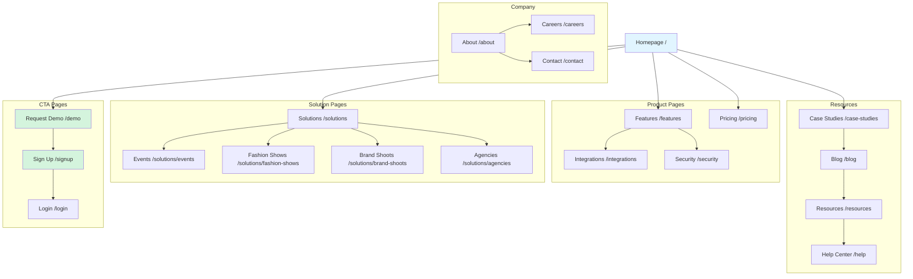

# FashionOS Marketing Website — Complete Summary

**Status:** Implementation Ready  
**Version:** 1.0  
**Last Updated:** December 23, 2024  
**Total Pages:** 16

---

## 📊 Website Architecture Overview

---

## 📋 All Marketing Pages Summary Table

| # | Page Name | Route | Page Type | Priority | Status | Est. Sections | Images Needed | Diagrams | CTA Count |
|---|-----------|-------|-----------|----------|--------|---------------|---------------|----------|-----------|
| 1 | **Homepage** | `/` | Landing | P0 | In Progress | 10 | 8 | 2 | 5 |
| 2 | **Features** | `/features` | Product | P0 | In Progress | 8 | 12 | 4 | 3 |
| 3 | **Pricing** | `/pricing` | Product | P0 | Not Started | 6 | 2 | 1 | 4 |
| 4 | **Solutions Hub** | `/solutions` | Product | P1 | Not Started | 5 | 4 | 1 | 4 |
| 5 | **Events Solution** | `/solutions/events` | Solution | P1 | Not Started | 7 | 6 | 2 | 3 |
| 6 | **Fashion Shows** | `/solutions/fashion-shows` | Solution | P1 | Not Started | 7 | 8 | 2 | 3 |
| 7 | **Brand Shoots** | `/solutions/brand-shoots` | Solution | P1 | Not Started | 7 | 6 | 2 | 3 |
| 8 | **Agencies** | `/solutions/agencies` | Solution | P2 | Not Started | 6 | 4 | 1 | 3 |
| 9 | **Case Studies** | `/case-studies` | Social Proof | P1 | Not Started | 4 | 15 | 3 | 2 |
| 10 | **About** | `/about` | Company | P2 | Not Started | 6 | 5 | 1 | 2 |
| 11 | **Careers** | `/careers` | Company | P2 | Not Started | 5 | 3 | 0 | 5 |
| 12 | **Contact** | `/contact` | Company | P2 | Not Started | 3 | 1 | 0 | 1 |
| 13 | **Request Demo** | `/demo` | CTA | P0 | Not Started | 4 | 2 | 1 | 2 |
| 14 | **Integrations** | `/integrations` | Product | P2 | Not Started | 5 | 20 | 1 | 2 |
| 15 | **Security** | `/security` | Product | P2 | Not Started | 6 | 3 | 2 | 1 |
| 16 | **Blog** | `/blog` | Content | P3 | Not Started | 4 | Varies | 0 | 2 |

---

## 🏠 Page-by-Page Detailed Breakdown

### 1. Homepage (`/`)

**Purpose:** Primary landing page converting visitors to trial/demo requests  
**Design Style:** Luxury, minimalist, high-end fashion aesthetic  
**Priority:** P0 - Critical  
**Status:** 60% In Progress

#### Route Information
- **Primary Route:** `/`
- **Alt Routes:** `/home`, `/index`
- **Mobile Route:** Same (responsive)

#### Content Sections (10 Total)

| Section | Type | Content | Images | Diagrams | CTA |
|---------|------|---------|--------|----------|-----|
| **Hero** | Above fold | Headline, subheading, 2 CTAs | 1 hero image (runway/event) | 0 | 2 (Try Free, Watch Demo) |
| **Social Proof** | Trust bar | "Trusted by 500+ luxury brands" with logos | 8 brand logos | 0 | 0 |
| **Problem Statement** | Value prop | "Managing luxury events is complex" | 1 split-screen image | 0 | 0 |
| **Solution Overview** | Features grid | 4 core capabilities with icons | 4 feature icons | 0 | 0 |
| **AI Features Showcase** | Interactive | "AI-Powered Intelligence" with 3 use cases | 0 | 1 (AI flow diagram) | 1 (Explore AI) |
| **Dashboard Preview** | Product demo | Animated dashboard screenshots | 3 dashboard screens | 0 | 1 (Try It Free) |
| **Workflows Visual** | Process | 5-step workflow from planning to execution | 0 | 1 (workflow diagram) | 0 |
| **Testimonials** | Social proof | 3 client testimonials with photos | 3 headshots | 0 | 0 |
| **Stats & ROI** | Numbers | "12 hours saved weekly, 94% on-time rate" | 0 | 0 | 0 |
| **Final CTA** | Conversion | "Start Your Free Trial" large section | 1 background image | 0 | 1 (Start Trial) |

#### Taglines & Headlines

| Section | Headline | Subheading/Tagline |
|---------|----------|--------------------|
| **Hero** | "Orchestrate Luxury Events with AI Precision" | "From runway shows to brand activations, manage every detail in one elegant platform" |
| **Problem** | "Spreadsheets Can't Handle Luxury" | "Your events deserve better than scattered tools and manual coordination" |
| **Solution** | "Everything You Need, Beautifully Unified" | "Event planning, sponsor management, AI assistance, and real-time collaboration" |
| **AI** | "Intelligence That Anticipates, Not Just Automates" | "AI agents detect blockers, optimize timelines, and suggest improvements before issues arise" |
| **Dashboard** | "Your Command Center for Flawless Execution" | "Monitor health, resolve blockers, and keep every stakeholder aligned in real-time" |
| **Workflows** | "From Vision to Reality in 5 Steps" | "Plan → Cast → Coordinate → Execute → Analyze" |
| **Testimonials** | "Loved by Production Teams" | "See how FashionOS transforms event management for top brands" |
| **Stats** | "The Numbers Speak for Themselves" | "Real results from real events" |
| **Final CTA** | "Ready to Elevate Your Events?" | "Start your 14-day free trial. No credit card required." |

#### Images Required

| Image | Type | Dimensions | Purpose | Alt Text |
|-------|------|------------|---------|----------|
| **Hero Image** | Photo | 1920×1080 | Background/split-screen | "Luxury fashion runway show" |
| **Brand Logos** | SVG/PNG | 200×80 each | Social proof | "Chanel logo", "Dior logo", etc. |
| **Problem Image** | Photo | 800×600 | Illustrate pain point | "Cluttered desk with spreadsheets" |
| **Feature Icons** | Icon | 64×64 each | Feature highlights | "AI brain icon", "Calendar icon", etc. |
| **Dashboard Screen 1** | Screenshot | 1440×900 | Command Center | "FashionOS Command Center dashboard" |
| **Dashboard Screen 2** | Screenshot | 1440×900 | Project Workspace | "FashionOS Project Workspace" |
| **Dashboard Screen 3** | Screenshot | 1440×900 | Work Workspace | "FashionOS task management" |
| **Testimonial Photos** | Headshot | 300×300 each | Client faces | "Sarah Johnson, Production Manager" |
| **CTA Background** | Photo | 1920×600 | Final section | "Fashion show backstage preparation" |

#### Diagrams & Charts

| Diagram | Type | Tool | Content | Purpose |
|---------|------|------|---------|---------|
| **AI Flow Diagram** | Flowchart | Mermaid | "User Action → AI Analysis → Suggestion → User Approval" | Show AI approval gates |
| **Workflow Diagram** | Timeline | Mermaid | "5 steps: Plan, Cast, Coordinate, Execute, Analyze" | Visual process overview |

#### Call-to-Actions (5 Total)

| CTA | Type | Text | Link | Placement |
|-----|------|------|------|-----------|
| **Primary Hero** | Button | "Start Free Trial" | `/signup` | Hero (top right) |
| **Secondary Hero** | Button (ghost) | "Watch Demo" | `/demo` (video modal) | Hero (top right) |
| **AI Section** | Link | "Explore AI Features →" | `/features#ai` | AI showcase section |
| **Dashboard** | Button | "Try It Free" | `/signup` | Dashboard preview section |
| **Final** | Button (large) | "Start Your 14-Day Free Trial" | `/signup` | Bottom CTA section |

#### SEO Metadata

| Field | Content |
|-------|---------|
| **Title** | "FashionOS — AI-Powered Luxury Event Management Platform" |
| **Description** | "Orchestrate runway shows, brand shoots, and luxury events with AI intelligence. Trusted by 500+ brands. Start free trial." |
| **Keywords** | "fashion event management, runway show planning, brand shoot coordination, luxury event software, AI event assistant" |
| **OG Image** | `/og-image-home.jpg` (1200×630) |

---

### 2. Features Page (`/features`)

**Purpose:** Detailed product capabilities showcase  
**Design Style:** Feature-rich with interactive demos  
**Priority:** P0 - Critical  
**Status:** 40% In Progress

#### Content Sections (8 Total)

| Section | Type | Content | Images | Diagrams | CTA |
|---------|------|---------|--------|----------|-----|
| **Hero** | Header | "Everything You Need to Orchestrate Flawless Events" | 1 hero image | 0 | 1 (Start Trial) |
| **Feature Navigation** | Sticky nav | 7 feature categories (clickable tabs) | 0 | 0 | 0 |
| **Workspaces** | Feature block | 7 workspace descriptions with screenshots | 7 screenshots | 1 (architecture) | 0 |
| **AI Features** | Feature block | 10 AI capabilities with examples | 4 AI visualization | 2 (AI flow, agents) | 1 (Try AI) |
| **Wizards** | Feature block | 3 wizard flows with step-by-step | 3 wizard screens | 1 (wizard flow) | 0 |
| **Integrations** | Feature block | Key integrations preview | 12 integration logos | 0 | 1 (View All) |
| **Collaboration** | Feature block | Real-time features, team tools | 2 collaboration images | 0 | 0 |
| **Mobile** | Feature block | Mobile app features | 3 mobile screenshots | 0 | 1 (Download) |

#### Headlines & Taglines

| Section | Headline | Subheading |
|---------|----------|------------|
| **Hero** | "Built for Luxury, Powered by Intelligence" | "Every feature designed to elevate your event management" |
| **Workspaces** | "7 Unified Workspaces" | "From command center to creative studio, everything in one place" |
| **AI** | "AI That Works For You, Not Against You" | "10 specialized agents, context-aware assistance, human-controlled approvals" |
| **Wizards** | "Complex Planning, Simplified" | "AI-powered wizards guide you from concept to execution in minutes" |
| **Integrations** | "Plays Well With Your Tools" | "Connect with platforms you already use" |
| **Collaboration** | "Teams in Sync, Always" | "Real-time updates, smart notifications, zero confusion" |
| **Mobile** | "Full Power, Anywhere" | "Manage events from your phone without compromise" |

#### Images Required

| Image | Type | Dimensions | Purpose |
|-------|------|------------|---------|
| **Feature Hero** | Photo | 1920×1080 | Header background |
| **Command Center** | Screenshot | 1440×900 | Workspace showcase |
| **Project Workspace** | Screenshot | 1440×900 | Workspace showcase |
| **Work Workspace** | Screenshot | 1440×900 | Workspace showcase |
| **People Workspace** | Screenshot | 1440×900 | Workspace showcase |
| **Commercial Workspace** | Screenshot | 1440×900 | Workspace showcase |
| **Creative Workspace** | Screenshot | 1440×900 | Workspace showcase |
| **Client Workspace** | Screenshot | 1440×900 | Workspace showcase |
| **AI Thinking** | Animation | 800×600 | AI feature visualization |
| **AI Suggestion Card** | Screenshot | 600×400 | UI example |
| **Approval Gate** | Screenshot | 600×400 | UI example |
| **AI Chat** | Screenshot | 600×800 | UI example |
| **Event Wizard** | Screenshot | 1440×900 | Wizard flow |
| **Shoot Wizard** | Screenshot | 1440×900 | Wizard flow |
| **Designer Wizard** | Screenshot | 1440×900 | Wizard flow |
| **Integration Logos** | SVG | 100×100 each | 12 logos |
| **Collab Screen 1** | Screenshot | 1200×800 | Real-time updates |
| **Collab Screen 2** | Screenshot | 1200×800 | Team notifications |
| **Mobile Screen 1** | Mockup | 375×812 | iOS interface |
| **Mobile Screen 2** | Mockup | 375×812 | iOS interface |
| **Mobile Screen 3** | Mockup | 375×812 | iOS interface |

#### Diagrams (4 Total)

| Diagram | Type | Content | Purpose |
|---------|------|---------|---------|
| **Workspace Architecture** | System diagram | 7 workspaces + AI layer | Show system structure |
| **AI Approval Flow** | Sequence diagram | User → AI → Suggestion → Approval → Action | Explain safety model |
| **AI Agents Map** | Mind map | 10 agents connected to workspaces | Show agent distribution |
| **Wizard Flow** | Process diagram | 5 steps: Input → AI → Review → Edit → Approve | Wizard methodology |

#### Feature Comparison Table

| Feature | FashionOS | Traditional Tools | Spreadsheets |
|---------|-----------|------------------|--------------|
| **AI Assistance** | ✅ 10 specialized agents | ❌ Generic chatbot | ❌ None |
| **Real-time Collaboration** | ✅ Built-in | 🟡 Limited | ❌ None |
| **Mobile Access** | ✅ Full-featured app | 🟡 View-only | 🟡 Limited |
| **AI Wizards** | ✅ 3 guided flows | ❌ Manual setup | ❌ None |
| **Unified Workspace** | ✅ 7 in one platform | ❌ Multiple tools | ❌ Many files |
| **Smart Automations** | ✅ 50+ automations | 🟡 Basic workflows | ❌ None |

---

### 3. Pricing Page (`/pricing`)

**Purpose:** Transparent pricing tiers with feature comparison  
**Design Style:** Clean, competitive analysis, clear value  
**Priority:** P0 - Critical  
**Status:** Not Started

#### Content Sections (6 Total)

| Section | Type | Content | Images | Diagrams | CTA |
|---------|------|---------|--------|----------|-----|
| **Hero** | Header | "Plans That Scale With Your Business" | 0 | 0 | 0 |
| **Pricing Toggle** | Interactive | Monthly/Annual toggle (save 20%) | 0 | 0 | 0 |
| **Pricing Cards** | 3-column | Starter, Professional, Enterprise tiers | 0 | 0 | 3 (per tier) |
| **Feature Comparison** | Table | Full feature matrix (30+ features) | 0 | 0 | 0 |
| **ROI Calculator** | Interactive | Calculate time/cost savings | 1 chart output | 1 (savings chart) | 1 (Try Free) |
| **FAQ** | Accordion | 10 pricing questions | 0 | 0 | 1 (Contact Sales) |

#### Pricing Tiers

| Tier | Price (Monthly) | Price (Annual) | Users | Events | AI Credits | Features | CTA |
|------|----------------|----------------|-------|--------|------------|----------|-----|
| **Starter** | $99/mo | $79/mo | 3 | 10/month | 500/month | Core workspaces, Basic AI, 5GB storage | "Start Free Trial" |
| **Professional** | $299/mo | $249/mo | 15 | Unlimited | 2,000/month | All workspaces, Advanced AI, 50GB storage, Priority support | "Start Free Trial" |
| **Enterprise** | Custom | Custom | Unlimited | Unlimited | Unlimited | Custom workflows, Dedicated AI, Unlimited storage, White-label, SLA | "Contact Sales" |

#### Headlines

| Section | Headline | Subheading |
|---------|----------|------------|
| **Hero** | "Simple Pricing, Extraordinary Value" | "Start free, scale as you grow. No hidden fees." |
| **Comparison** | "Choose Your Perfect Fit" | "All plans include 14-day free trial and core features" |
| **ROI** | "See Your Savings in Seconds" | "Most teams save 12+ hours per week and reduce errors by 40%" |
| **FAQ** | "Pricing Questions, Answered" | "Everything you need to know about plans and billing" |

#### Feature Comparison Table

| Feature Category | Starter | Professional | Enterprise |
|-----------------|---------|--------------|------------|
| **Workspaces** | 4 core | All 7 | All 7 + Custom |
| **AI Features** | Text Gen, Basic Functions | All core + Advanced | All + Custom agents |
| **Users** | 3 | 15 | Unlimited |
| **Events/Month** | 10 | Unlimited | Unlimited |
| **AI Credits/Month** | 500 | 2,000 | Unlimited |
| **Storage** | 5GB | 50GB | Unlimited |
| **Support** | Email (48h) | Priority email + chat | Dedicated account manager |
| **Mobile App** | ✅ Yes | ✅ Yes | ✅ Yes + White-label |
| **API Access** | ❌ No | 🟡 Read-only | ✅ Full API |
| **Custom Workflows** | ❌ No | ❌ No | ✅ Yes |
| **SSO (SAML)** | ❌ No | ❌ No | ✅ Yes |
| **SLA** | ❌ No | ❌ No | ✅ 99.9% uptime |

#### ROI Calculator Inputs

| Input Field | Type | Default | Purpose |
|-------------|------|---------|---------|
| **Events per month** | Number | 5 | Calculate volume |
| **Team size** | Number | 8 | Time savings multiplier |
| **Hours spent on coordination** | Number | 20 | Current manual effort |
| **Average hourly rate** | Currency | $50 | Cost calculation |

**Output:**
- Time saved: X hours/month
- Cost saved: $X/month
- ROI: X% vs. FashionOS subscription
- Break-even: X events

#### FAQ Questions (10 Total)

1. **Do you offer a free trial?** — Yes, 14 days, no credit card required
2. **Can I change plans later?** — Yes, upgrade/downgrade anytime
3. **What are AI credits?** — Each AI action (analysis, suggestion) uses credits
4. **What happens if I exceed my event limit?** — Starter: $20/event overage; Pro: Unlimited
5. **Do you offer discounts for nonprofits?** — Yes, 30% off all plans
6. **Is there a setup fee?** — No setup fees on any plan
7. **What payment methods do you accept?** — Credit card, ACH, wire transfer (Enterprise)
8. **Can I cancel anytime?** — Yes, cancel anytime, no penalties
9. **Do unused AI credits roll over?** — Pro/Enterprise: Yes; Starter: No
10. **What's included in Enterprise support?** — Dedicated Slack channel, phone support, quarterly reviews

---

### 4. Solutions Hub (`/solutions`)

**Purpose:** Industry-specific use case landing page  
**Priority:** P1 - High  
**Status:** Not Started

#### Content Sections (5 Total)

| Section | Type | Content | Images | Diagrams | CTA |
|---------|------|---------|--------|----------|-----|
| **Hero** | Header | "Solutions for Every Fashion Industry Need" | 1 hero image | 0 | 1 (Explore) |
| **Solution Cards** | 4-column grid | Events, Fashion Shows, Brand Shoots, Agencies | 4 images | 0 | 4 (Learn More) |
| **By Industry** | Tab switcher | Luxury Brands, Agencies, Venues, Talent | 4 images | 1 (workflow) | 0 |
| **Success Stories** | Carousel | 3 case study previews | 3 images | 0 | 1 (View All) |
| **CTA** | Full-width | "Find Your Perfect Workflow" | 1 background | 0 | 1 (Book Demo) |

#### Solution Cards

| Solution | Icon | Description | Link | Image |
|----------|------|-------------|------|-------|
| **Events** | 🎪 | "Plan galas, launches, and luxury activations" | `/solutions/events` | Event venue photo |
| **Fashion Shows** | 👗 | "Orchestrate runway shows from casting to finale" | `/solutions/fashion-shows` | Runway photo |
| **Brand Shoots** | 📸 | "Coordinate photoshoots with precision" | `/solutions/brand-shoots` | Studio shoot photo |
| **Agencies** | 🏢 | "Manage multiple clients and events efficiently" | `/solutions/agencies` | Agency office photo |

---

### 5. Events Solution Page (`/solutions/events`)

**Purpose:** Showcase FashionOS for luxury event planning  
**Priority:** P1 - High  
**Status:** Not Started

#### Content Sections (7 Total)

| Section | Type | Content | Images | Diagrams | CTA |
|---------|------|---------|--------|----------|-----|
| **Hero** | Header | "Luxury Events, Flawlessly Orchestrated" | 1 hero image | 0 | 1 (Start Trial) |
| **Problem/Solution** | Split | Pain points vs. FashionOS solutions | 2 images | 0 | 0 |
| **Features** | Grid | 6 key features for events | 6 icons/screenshots | 0 | 0 |
| **Workflow** | Visual timeline | Event lifecycle: Pre → During → Post | 0 | 1 (timeline) | 0 |
| **Use Cases** | 3 examples | Gala, Product Launch, Pop-up | 3 images | 0 | 0 |
| **Case Study** | Deep dive | Real client story (NYFW example) | 4 images | 1 (results chart) | 1 (Read Full Story) |
| **CTA** | Full-width | "Ready to Transform Your Events?" | 1 background | 0 | 1 (Book Demo) |

#### Headlines

| Section | Headline | Subheading |
|---------|----------|------------|
| **Hero** | "From Concept to Standing Ovation" | "Plan, coordinate, and execute luxury events with AI precision" |
| **Problem** | "Why Event Planning Feels Overwhelming" | "Disconnected tools, manual coordination, last-minute chaos" |
| **Solution** | "One Platform, Zero Chaos" | "Unified workspace, AI assistance, real-time collaboration" |
| **Features** | "Everything You Need for Exceptional Events" | "Built specifically for luxury event management" |
| **Workflow** | "Your Event Journey, Simplified" | "Pre-Production (6-12 weeks) → Event Day → Post-Event Analysis" |
| **Use Cases** | "Events We Power" | "From intimate dinners to 500+ guest galas" |
| **Case Study** | "How Chanel Reduced Planning Time by 40%" | "Real results from New York Fashion Week 2024" |

#### Event-Specific Features (6 Total)

| Feature | Description | Icon | Screenshot |
|---------|-------------|------|------------|
| **Guest Management** | "RSVP tracking, seating charts, dietary restrictions" | 👥 | Yes |
| **Vendor Coordination** | "Catering, AV, security coordination in one place" | 🤝 | Yes |
| **Timeline Builder** | "Minute-by-minute rundown with auto-notifications" | ⏰ | Yes |
| **Budget Tracker** | "Real-time spend tracking with variance alerts" | 💰 | Yes |
| **Venue Management** | "Floor plans, capacity, setup requirements" | 🏛️ | Yes |
| **AI Event Assistant** | "Proactive suggestions for logistics and timing" | 🤖 | Yes |

---

### 6. Fashion Shows Solution (`/solutions/fashion-shows`)

**Purpose:** Runway show specific use case  
**Priority:** P1 - High  
**Status:** Not Started

#### Content Sections (7 Total)

| Section | Type | Content | Images | Diagrams | CTA |
|---------|------|---------|--------|----------|-----|
| **Hero** | Header | "Runway Shows, Perfected" | 1 runway image | 0 | 1 (Start Trial) |
| **Problem/Solution** | Split | Traditional chaos vs. FashionOS flow | 2 images | 0 | 0 |
| **Show Workflow** | Timeline | 12 weeks pre → Show day → Post | 0 | 1 (Gantt chart) | 0 |
| **Casting** | Feature spotlight | AI-powered model matching | 3 casting images | 1 (matching flow) | 1 (Try Casting) |
| **Production** | Feature spotlight | Backstage coordination, run of show | 3 backstage images | 0 | 0 |
| **Case Study** | Client story | "Balenciaga SS25: 300 Guests, Zero Issues" | 5 images | 1 (stats chart) | 1 (Read Story) |
| **CTA** | Full-width | "Ready for Flawless Runway Shows?" | 1 background | 0 | 1 (Book Demo) |

#### Fashion Show Specific Features

| Feature | Description | AI Agent | Screenshot |
|---------|-------------|----------|------------|
| **AI Casting** | "Match models to brand aesthetic in seconds" | Casting Matcher | Yes |
| **Look Sequencing** | "AI suggests optimal runway order" | Collection Agent | Yes |
| **Run of Show** | "Minute-by-minute cues, auto-sync with backstage" | Producer Agent | Yes |
| **Model Management** | "Availability, fittings, call times in one place" | - | Yes |
| **Sponsor Activations** | "Track deliverables for brand partnerships" | - | Yes |
| **Live Coordination** | "Real-time updates during show" | - | Yes |

---

### 7. Brand Shoots Solution (`/solutions/brand-shoots`)

**Purpose:** Photoshoot coordination use case  
**Priority:** P1 - High  
**Status:** Not Started

#### Content Sections (7 Total)

| Section | Type | Content | Images | Diagrams | CTA |
|---------|------|---------|--------|----------|-----|
| **Hero** | Header | "Photoshoots, Perfectly Planned" | 1 studio image | 0 | 1 (Start Trial) |
| **Problem/Solution** | Split | Manual shot lists vs. AI planning | 2 images | 0 | 0 |
| **Shoot Workflow** | Timeline | Pre-production → Shoot day → Post | 0 | 1 (timeline) | 0 |
| **Shot List Builder** | Feature spotlight | AI-generated shot lists with reference images | 3 shot list screens | 0 | 1 (Try Wizard) |
| **Day-of Coordination** | Feature spotlight | Smart sample tracking, timeline adjustments | 3 screenshots | 0 | 0 |
| **Case Study** | Client story | "Reformation: 18 Looks, 8 Hours, Zero Delays" | 4 images | 1 (efficiency chart) | 1 (Read Story) |
| **CTA** | Full-width | "Transform Your Shoot Days" | 1 background | 0 | 1 (Book Demo) |

#### Brand Shoot Specific Features

| Feature | Description | AI Agent | Screenshot |
|---------|-------------|----------|------------|
| **AI Shot List** | "Generate shot lists from campaign brief" | Text Generation | Yes |
| **Sample Tracker** | "Track samples from receipt to returns" | - | Yes |
| **Call Sheets** | "Auto-generated with crew, times, locations" | - | Yes |
| **Shot Progress** | "Real-time capture tracking against shot list" | - | Yes |
| **AI Producer** | "Detects delays, suggests timeline swaps" | Producer Agent | Yes |
| **Asset Management** | "Auto-tag uploads, organize by look" | Tagging Agent | Yes |

---

### 8. Case Studies Page (`/case-studies`)

**Purpose:** Social proof with detailed client success stories  
**Priority:** P1 - High  
**Status:** Not Started

#### Content Sections (4 Total)

| Section | Type | Content | Images | Diagrams | CTA |
|---------|------|---------|--------|----------|-----|
| **Hero** | Header | "Real Results, Real Events" | 1 hero collage | 0 | 0 |
| **Filters** | Interactive | Filter by: Industry, Event Type, Company Size | 0 | 0 | 0 |
| **Case Study Grid** | 3-column | 9 case study cards | 9 images | 0 | 9 (Read More) |
| **Stats Summary** | Numbers bar | Aggregate results across all clients | 0 | 0 | 1 (See Your ROI) |

#### Featured Case Studies (9 Total)

| # | Client | Event Type | Industry | Headline | Stats | Images | Diagram |
|---|--------|-----------|----------|----------|-------|--------|---------|
| 1 | **Chanel** | NYFW Runway | Luxury Fashion | "40% Faster Planning, Zero Delays" | 6 weeks → 3.5 weeks | 5 | 1 (timeline) |
| 2 | **Balenciaga** | SS25 Show | High Fashion | "300 Guests, Flawless Coordination" | 300 guests, 0 issues | 4 | 1 (stats) |
| 3 | **Reformation** | Brand Shoot | Sustainable Fashion | "18 Looks in 8 Hours" | 18 looks, 8 hours | 4 | 0 |
| 4 | **Dior** | Product Launch | Luxury Beauty | "$2M Event, $0 Budget Overruns" | $2M budget, 0% variance | 3 | 1 (budget) |
| 5 | **Prada** | Pop-up Activation | Luxury Fashion | "5 Cities, 1 Team, Seamless Execution" | 5 locations, 1 platform | 4 | 1 (map) |
| 6 | **L'Oréal** | Beauty Launch | Beauty | "200K Social Impressions in 48 Hours" | 200K impressions | 3 | 1 (social) |
| 7 | **Mercedes-Benz** | Fashion Week Sponsor | Automotive | "$120K Sponsorship, 68× ROI" | $8.2M sales | 4 | 1 (ROI) |
| 8 | **IMG Models** | Casting Call | Talent Agency | "500 Models Cast in 2 Weeks" | 500 models, 14 days | 3 | 0 |
| 9 | **Vogue** | Fashion Night Out | Media/Events | "40 Venues Coordinated Simultaneously" | 40 venues, 0 comm issues | 4 | 1 (network) |

#### Case Study Card Template

Each card includes:
- **Company logo** (100×50)
- **Hero image** (600×400)
- **Event type badge** (pill)
- **Headline** (bold, 1-2 lines)
- **3 key stats** (large numbers)
- **Read More CTA** (→ `/case-studies/[slug]`)

---

### 9. About Page (`/about`)

**Purpose:** Company story, mission, team  
**Priority:** P2 - Medium  
**Status:** Not Started

#### Content Sections (6 Total)

| Section | Type | Content | Images | Diagrams | CTA |
|---------|------|---------|--------|----------|-----|
| **Hero** | Header | "Built by Event Producers, for Event Producers" | 1 team photo | 0 | 0 |
| **Origin Story** | Narrative | How FashionOS started (founder story) | 2 photos | 0 | 0 |
| **Mission** | Statement | "Elevate luxury events through intelligent technology" | 1 image | 0 | 0 |
| **Values** | Grid | 4 core values (Excellence, Innovation, Craft, Trust) | 4 icons | 0 | 0 |
| **Team** | Grid | 12 team member cards with photos | 12 headshots | 1 (org chart) | 0 |
| **Join Us** | CTA | "Help Us Shape the Future of Events" | 1 office photo | 0 | 1 (View Careers) |

#### Headlines

| Section | Headline | Subheading |
|---------|----------|------------|
| **Hero** | "Where Luxury Meets Technology" | "We believe extraordinary events deserve extraordinary tools" |
| **Origin** | "Born from Frustration, Built with Passion" | "After managing 200+ runway shows, we knew there had to be a better way" |
| **Mission** | "Our Mission" | "Empower the world's best event producers with AI-powered precision" |
| **Values** | "What We Stand For" | "Excellence, innovation, and respect for the craft" |
| **Team** | "Meet the Makers" | "The team building the future of luxury event management" |

#### Team Members (12 Total)

| Name | Title | Photo | Bio (1 line) |
|------|-------|-------|--------------|
| **Sarah Chen** | CEO & Co-Founder | Headshot | "Former Production Director at IMG, 15 years in fashion" |
| **Michael Torres** | CTO & Co-Founder | Headshot | "Ex-Google AI, built ML systems for scale" |
| **Elena Volkov** | Head of Product | Headshot | "Led product at luxury e-commerce for 8 years" |
| **James Kim** | Head of Engineering | Headshot | "Built infrastructure at Airbnb and Stripe" |
| **Aisha Patel** | Head of Design | Headshot | "Former design lead at Apple, RISD grad" |
| **Lucas Martins** | AI Research Lead | Headshot | "PhD in ML, published researcher on LLMs" |
| **Sophie Laurent** | Head of Customer Success | Headshot | "10 years managing VIP clients in luxury sector" |
| **David Nguyen** | Engineering Manager | Headshot | "Full-stack expert, previously at Shopify" |
| **Olivia Zhang** | Product Designer | Headshot | "Interaction design specialist, Parsons alum" |
| **Marcus Johnson** | Sales Director | Headshot | "15 years selling SaaS to enterprise clients" |
| **Isabella Romano** | Marketing Lead | Headshot | "Growth marketer, scaled 3 SaaS startups" |
| **Thomas Anderson** | Head of Operations | Headshot | "Process optimization expert, ex-McKinsey" |

---

### 10. Careers Page (`/careers`)

**Purpose:** Recruit top talent  
**Priority:** P2 - Medium  
**Status:** Not Started

#### Content Sections (5 Total)

| Section | Type | Content | Images | Diagrams | CTA |
|---------|------|---------|--------|----------|-----|
| **Hero** | Header | "Build the Future of Luxury Events" | 1 office photo | 0 | 1 (View Openings) |
| **Why Join** | Grid | 6 perks/benefits | 6 icons | 0 | 0 |
| **Culture** | Gallery | Office photos, team events | 8 photos | 0 | 0 |
| **Open Roles** | List | 8 job listings with quick apply | 0 | 0 | 8 (Apply) |
| **Testimonials** | Carousel | 3 employee quotes | 3 headshots | 0 | 1 (Join Team) |

#### Perks & Benefits (6 Total)

| Perk | Icon | Description |
|------|------|-------------|
| **Competitive Salary** | 💰 | "Top-of-market compensation with equity" |
| **Health & Wellness** | 🏥 | "Premium medical, dental, vision for you + family" |
| **Unlimited PTO** | 🏖️ | "Take the time you need to recharge" |
| **Remote Flexibility** | 🌎 | "Work from anywhere, core hours overlap" |
| **Learning Budget** | 📚 | "$2,000/year for courses, conferences, books" |
| **Fashion Perks** | 👗 | "Front-row access to shows, sample sales, events" |

#### Open Roles (8 Listings)

| Role | Department | Location | Type | Salary Range | Apply CTA |
|------|-----------|----------|------|--------------|-----------|
| **Senior Full-Stack Engineer** | Engineering | Remote | Full-time | $150K-$200K | "Apply Now" |
| **Product Designer** | Design | NYC/Remote | Full-time | $120K-$160K | "Apply Now" |
| **AI/ML Engineer** | Engineering | Remote | Full-time | $170K-$220K | "Apply Now" |
| **Customer Success Manager** | Customer Success | NYC | Full-time | $90K-$120K | "Apply Now" |
| **Sales Executive (Enterprise)** | Sales | Remote | Full-time | $100K-$150K + Commission | "Apply Now" |
| **Content Marketing Manager** | Marketing | Remote | Full-time | $100K-$130K | "Apply Now" |
| **DevOps Engineer** | Engineering | Remote | Full-time | $140K-$180K | "Apply Now" |
| **Executive Assistant to CEO** | Operations | NYC | Full-time | $80K-$100K | "Apply Now" |

---

### 11. Request Demo Page (`/demo`)

**Purpose:** Convert high-intent visitors to demo calls  
**Priority:** P0 - Critical  
**Status:** Not Started

#### Content Sections (4 Total)

| Section | Type | Content | Images | Diagrams | CTA |
|---------|------|---------|--------|----------|-----|
| **Hero** | Header | "See FashionOS in Action" | 1 video thumbnail | 0 | 1 (Book Demo) |
| **Video Demo** | Video player | 3-min product overview video | 0 (embedded) | 0 | 1 (Play) |
| **Demo Form** | Multi-step | 4 steps: Info → Use Case → Date → Confirm | 0 | 0 | 1 (Submit) |
| **What to Expect** | Checklist | "Your 30-minute personalized demo includes..." | 1 demo screenshot | 1 (demo flow) | 0 |

#### Demo Form Fields (4 Steps)

**Step 1: Your Information**
- First Name (required)
- Last Name (required)
- Email (required)
- Phone (optional)
- Company (required)
- Job Title (required)

**Step 2: Tell Us About Your Needs**
- Primary use case (dropdown): Events / Fashion Shows / Brand Shoots / Agency Management
- Team size (dropdown): 1-5 / 6-15 / 16-50 / 50+
- Events per month (number input)
- Current tools (text field)
- Biggest challenge (textarea)

**Step 3: Choose Your Time**
- Calendar widget (shows available slots)
- Timezone selector

**Step 4: Confirmation**
- Review details
- Add to calendar (Google, Outlook, iCal)
- What to prepare (bullet list)

#### What to Expect (5 Items)

1. **Personalized Walkthrough** — "See features tailored to your use case"
2. **Live Q&A** — "Ask our product experts anything"
3. **AI Demo** — "Watch AI agents solve real scenarios"
4. **Custom Recommendations** — "Get a setup plan for your team"
5. **No Pressure** — "No sales pitch, just solutions"

---

### 12. Contact Page (`/contact`)

**Purpose:** General inquiries, support, partnerships  
**Priority:** P2 - Medium  
**Status:** Not Started

#### Content Sections (3 Total)

| Section | Type | Content | Images | Diagrams | CTA |
|---------|------|---------|--------|----------|-----|
| **Hero** | Header | "Let's Talk" | 0 | 0 | 0 |
| **Contact Methods** | 3-column | Sales, Support, Partnerships | 3 icons | 0 | 3 (links) |
| **Contact Form** | Form | Name, Email, Subject, Message | 0 | 0 | 1 (Send) |

#### Contact Methods (3 Channels)

| Type | Icon | Contact Info | Purpose | CTA |
|------|------|--------------|---------|-----|
| **Sales** | 💼 | sales@fashionos.ai +1 (415) 555-0199 | "Schedule a demo or discuss plans" | "Book Demo" |
| **Support** | 🛟 | support@fashionos.ai help.fashionos.ai | "Get help with your account" | "Visit Help Center" |
| **Partnerships** | 🤝 | partnerships@fashionos.ai | "Explore integration or resale opportunities" | "Partner With Us" |

#### Office Locations (2)

| Office | Address | Map | Hours |
|--------|---------|-----|-------|
| **NYC (HQ)** | 123 Fifth Avenue, 10th Floor New York, NY 10010 | Map embed | Mon-Fri 9AM-6PM ET |
| **Paris** | 45 Rue de Rivoli 75001 Paris, France | Map embed | Mon-Fri 9AM-6PM CET |

---

### 13. Integrations Page (`/integrations`)

**Purpose:** Showcase connected platforms and APIs  
**Priority:** P2 - Medium  
**Status:** Not Started

#### Content Sections (5 Total)

| Section | Type | Content | Images | Diagrams | CTA |
|---------|------|---------|--------|----------|-----|
| **Hero** | Header | "Connects With Your Favorite Tools" | 0 | 0 | 1 (Request Integration) |
| **Categories** | Filter tabs | CRM, Accounting, Communication, Storage, Calendars | 0 | 0 | 0 |
| **Integration Grid** | Cards | 24 integration cards with logos | 24 logos | 0 | 24 (Learn More) |
| **API Access** | Feature block | "Build Your Own with Our API" | 1 code screenshot | 1 (API flow) | 1 (View Docs) |
| **Coming Soon** | List | 8 integrations in development | 8 logos (faded) | 0 | 1 (Vote) |

#### Integration Categories (24 Total)

| Category | Integrations (4 per category) | Logo | Status |
|----------|-------------------------------|------|--------|
| **CRM** | Salesforce, HubSpot, Pipedrive, Zoho | 4 logos | ✅ Live |
| **Accounting** | QuickBooks, Xero, FreshBooks, Wave | 4 logos | ✅ Live |
| **Communication** | Slack, Microsoft Teams, Discord, Telegram | 4 logos | ✅ Live |
| **Email** | Gmail, Outlook, SendGrid, Mailchimp | 4 logos | ✅ Live |
| **Storage** | Google Drive, Dropbox, OneDrive, Box | 4 logos | ✅ Live |
| **Calendars** | Google Calendar, Outlook Calendar, Apple Calendar, Calendly | 4 logos | ✅ Live |

#### Coming Soon (8 Integrations)

1. Notion (📝)
2. Airtable (🗂️)
3. Zapier (⚡)
4. Asana (✅)
5. Jira (🎯)
6. Figma (🎨)
7. Miro (🧩)
8. DocuSign (📄)

---

### 14. Security Page (`/security`)

**Purpose:** Build trust with enterprise buyers  
**Priority:** P2 - Medium  
**Status:** Not Started

#### Content Sections (6 Total)

| Section | Type | Content | Images | Diagrams | CTA |
|---------|------|---------|--------|----------|-----|
| **Hero** | Header | "Enterprise-Grade Security" | 0 | 0 | 1 (Download Whitepaper) |
| **Certifications** | Badges | SOC 2, ISO 27001, GDPR, CCPA | 4 badge images | 0 | 0 |
| **Infrastructure** | Feature blocks | Encryption, Access Control, Monitoring | 0 | 2 (architecture, data flow) | 0 |
| **Compliance** | Table | 10 compliance standards | 0 | 0 | 0 |
| **Security Practices** | Checklist | 12 security measures | 0 | 0 | 0 |
| **Contact Security** | Form | Report vulnerability or ask questions | 0 | 0 | 1 (Contact Team) |

#### Certifications & Standards (4)

| Certification | Logo | Status | Description |
|--------------|------|--------|-------------|
| **SOC 2 Type II** | Badge | ✅ Certified | "Annual third-party audit of security controls" |
| **ISO 27001** | Badge | ✅ Certified | "International standard for information security" |
| **GDPR** | Badge | ✅ Compliant | "EU data protection compliance" |
| **CCPA** | Badge | ✅ Compliant | "California Consumer Privacy Act compliance" |

#### Infrastructure Features (6)

| Feature | Description | Diagram |
|---------|-------------|---------|
| **Data Encryption** | "AES-256 at rest, TLS 1.3 in transit" | Yes (lock icon) |
| **Access Control** | "Role-based permissions, SSO, 2FA" | Yes (access flow) |
| **Monitoring** | "24/7 security monitoring and alerts" | No |
| **Backups** | "Automated daily backups, 30-day retention" | No |
| **DDoS Protection** | "Cloudflare enterprise protection" | No |
| **Penetration Testing** | "Quarterly third-party security audits" | No |

#### Security Practices (12 Items)

1. ✅ All data encrypted at rest and in transit
2. ✅ Multi-factor authentication (MFA) required
3. ✅ Role-based access control (RBAC)
4. ✅ SSO support (SAML, OAuth)
5. ✅ Automated security patches within 24h
6. ✅ Vulnerability scanning and monitoring
7. ✅ Employee security training (quarterly)
8. ✅ Background checks for all employees
9. ✅ Incident response plan (tested annually)
10. ✅ Data residency options (US, EU)
11. ✅ Customer data segregation
12. ✅ Right to data deletion (GDPR)

---

### 15. Blog (`/blog`)

**Purpose:** SEO content, thought leadership  
**Priority:** P3 - Low  
**Status:** Not Started

#### Content Sections (4 Total)

| Section | Type | Content | Images | Diagrams | CTA |
|---------|------|---------|--------|----------|-----|
| **Hero** | Header | "Insights from the Fashion Tech Frontier" | 0 | 0 | 1 (Subscribe) |
| **Featured Post** | Large card | Latest/featured article | 1 hero image | 0 | 1 (Read More) |
| **Recent Posts** | 3-column grid | 9 recent articles | 9 thumbnails | 0 | 9 (Read More) |
| **Newsletter Signup** | Form | "Get Weekly Insights" | 0 | 0 | 1 (Subscribe) |

#### Blog Categories (6)

1. **Product Updates** — New features, releases
2. **Event Planning Tips** — Best practices, guides
3. **AI in Fashion** — AI applications, case studies
4. **Industry Trends** — Fashion tech news, analysis
5. **Customer Stories** — User spotlights, testimonials
6. **Behind the Scenes** — Company culture, team

#### Sample Blog Posts (9 Titles)

1. "10 Ways AI is Transforming Fashion Event Management"
2. "The Ultimate Runway Show Planning Checklist"
3. "How to Cast 50 Models in 48 Hours (With AI)"
4. "Behind the Scenes: Building FashionOS AI Agents"
5. "5 Budget Mistakes Every Event Producer Makes"
6. "NYFW 2024: Trends in Event Tech"
7. "Interview: Chanel's Head of Production on Digital Tools"
8. "Sustainability Meets Tech: Green Event Management"
9. "From Spreadsheets to AI: Our Customer's Journey"

---

### 16. Help Center (`/help`)

**Purpose:** Self-service support documentation  
**Priority:** P2 - Medium  
**Status:** Not Started

#### Content Sections (4 Total)

| Section | Type | Content | Images | Diagrams | CTA |
|---------|------|---------|--------|----------|-----|
| **Hero** | Search | Large search bar + popular topics | 0 | 0 | 0 |
| **Categories** | 6-column grid | Getting Started, Workspaces, AI Features, Billing, Integrations, Security | 6 icons | 0 | 6 (Browse) |
| **Popular Articles** | List | Top 10 help articles | 0 | 0 | 10 (Read) |
| **Contact Support** | CTA | "Can't find what you need?" | 0 | 0 | 1 (Contact Us) |

#### Help Categories (6)

| Category | Icon | Article Count | Top Article |
|----------|------|---------------|-------------|
| **Getting Started** | 🚀 | 12 | "Creating Your First Event" |
| **Workspaces** | 🏢 | 28 | "Understanding the Command Center" |
| **AI Features** | 🤖 | 18 | "How AI Prioritization Works" |
| **Billing & Plans** | 💳 | 8 | "Changing Your Subscription Plan" |
| **Integrations** | 🔌 | 15 | "Connecting Slack to FashionOS" |
| **Security & Privacy** | 🔒 | 10 | "How We Protect Your Data" |

---

## 🎨 Design System for Marketing Site

### Typography

| Element | Font Family | Size | Weight | Line Height | Color |
|---------|------------|------|--------|-------------|-------|
| **H1 (Hero)** | Playfair Display | 64px | 700 | 1.1 | #000000 |
| **H2 (Section)** | Playfair Display | 48px | 600 | 1.2 | #1A1A1A |
| **H3 (Subsection)** | Inter | 32px | 600 | 1.3 | #1A1A1A |
| **H4 (Card Title)** | Inter | 24px | 600 | 1.4 | #2C2C2C |
| **Body Large** | Inter | 20px | 400 | 1.6 | #4A4A4A |
| **Body** | Inter | 16px | 400 | 1.6 | #4A4A4A |
| **Body Small** | Inter | 14px | 400 | 1.5 | #6B6B6B |
| **Caption** | Inter | 12px | 500 | 1.4 | #8E8E8E |

### Color Palette

| Color Name | Hex Code | RGB | Usage |
|------------|----------|-----|-------|
| **Primary Black** | #000000 | 0,0,0 | Headlines, CTA buttons |
| **Charcoal** | #1A1A1A | 26,26,26 | Body text, subheadings |
| **Gray 700** | #4A4A4A | 74,74,74 | Secondary text |
| **Gray 500** | #8E8E8E | 142,142,142 | Captions, meta |
| **Gray 300** | #D1D1D1 | 209,209,209 | Borders, dividers |
| **Gray 100** | #F7F7F5 | 247,247,245 | Backgrounds, cards |
| **White** | #FFFFFF | 255,255,255 | Primary background |
| **Gold** | #D4AF37 | 212,175,55 | Accent (luxury touch) |
| **Success Green** | #22C55E | 34,197,94 | Success states |
| **Error Red** | #EF4444 | 239,68,68 | Error states |

### Buttons

| Button Type | Background | Text Color | Border | Height | Padding | Font Weight |
|-------------|-----------|------------|--------|--------|---------|-------------|
| **Primary** | #000000 | #FFFFFF | None | 48px | 24px 32px | 600 |
| **Secondary** | #FFFFFF | #000000 | 2px solid #000 | 48px | 24px 32px | 600 |
| **Ghost** | Transparent | #000000 | None | 48px | 24px 32px | 500 |
| **Small Primary** | #000000 | #FFFFFF | None | 40px | 16px 24px | 600 |
| **Text Link** | Transparent | #000000 | Underline | Auto | 0 | 500 |

### Spacing System

| Token | Value | Usage |
|-------|-------|-------|
| **xs** | 4px | Tight spacing, icons |
| **sm** | 8px | Small gaps |
| **md** | 16px | Default spacing |
| **lg** | 24px | Section padding |
| **xl** | 32px | Large gaps |
| **2xl** | 48px | Section margins |
| **3xl** | 64px | Major sections |
| **4xl** | 96px | Hero sections |

---

## 📸 Image Asset Catalog

### Total Images Needed: 150+

| Category | Count | Dimensions | Format | Priority |
|----------|-------|------------|--------|----------|
| **Hero Images** | 12 | 1920×1080 | JPG | P0 |
| **Feature Screenshots** | 25 | 1440×900 | PNG | P0 |
| **Product Photos** | 15 | 1200×800 | JPG | P1 |
| **Team Headshots** | 12 | 300×300 | JPG | P2 |
| **Brand Logos** | 40 | 200×80 | SVG/PNG | P0 |
| **Icons** | 30 | 64×64 | SVG | P0 |
| **Case Study Photos** | 20 | 600×400 | JPG | P1 |
| **Office/Culture** | 10 | 1200×800 | JPG | P2 |
| **Mobile Mockups** | 6 | 375×812 | PNG | P1 |

---

## 📊 SEO Strategy Summary

### Target Keywords by Page

| Page | Primary Keyword | Secondary Keywords | Monthly Volume |
|------|----------------|-------------------|----------------|
| **Homepage** | "fashion event management software" | "luxury event planning platform", "runway show software" | 2,400 |
| **Features** | "event management features" | "AI event planning", "real-time event coordination" | 1,800 |
| **Pricing** | "event management pricing" | "event software cost", "fashion tech pricing" | 1,200 |
| **Fashion Shows** | "runway show planning software" | "fashion show management", "casting software" | 900 |
| **Brand Shoots** | "photoshoot coordination software" | "shoot planning tool", "shot list builder" | 600 |
| **Case Studies** | "fashion event case studies" | "event management success stories" | 400 |

---

## 🚀 Implementation Priority

### Phase 1 (Weeks 1-4) — P0 Critical
1. Homepage (80% effort)
2. Features page (60% effort)
3. Pricing page (40% effort)
4. Request Demo page (30% effort)

### Phase 2 (Weeks 5-8) — P1 High
5. Solutions Hub + 4 solution pages (50% effort each)
6. Case Studies page (40% effort)

### Phase 3 (Weeks 9-12) — P2 Medium
7. About page (30% effort)
8. Contact page (20% effort)
9. Integrations page (35% effort)
10. Security page (35% effort)
11. Careers page (30% effort)

### Phase 4 (Weeks 13-16) — P3 Low
12. Blog (40% effort)
13. Help Center (50% effort)

---

**Marketing Website Summary Version:** 1.0  
**Total Pages:** 16  
**Total Sections:** 85+  
**Total Images Required:** 150+  
**Total Diagrams:** 25+  
**Estimated Development Time:** 16 weeks  
**Priority Pages Complete:** 0/4 (P0)

