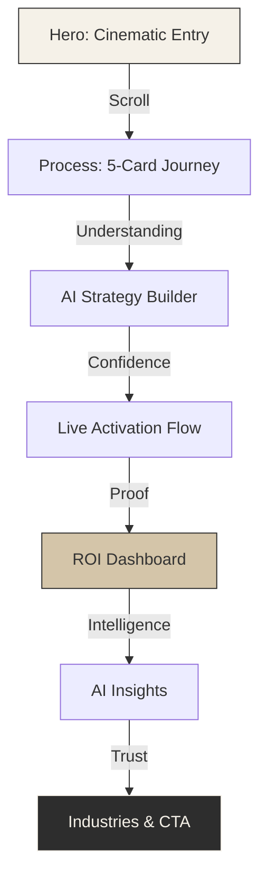
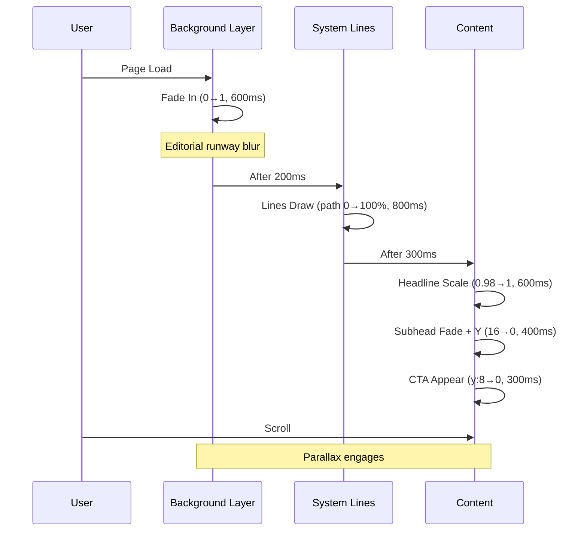
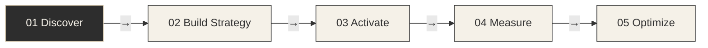
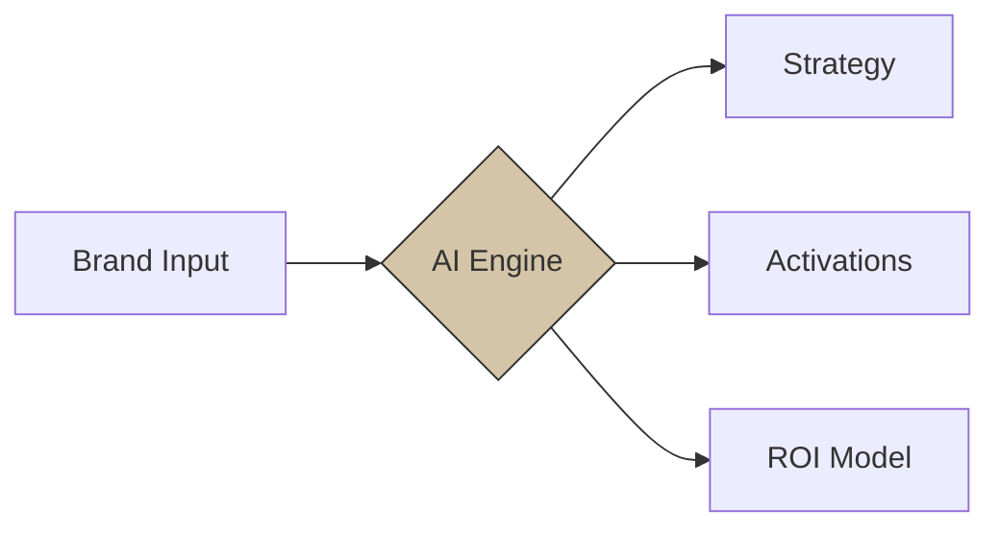
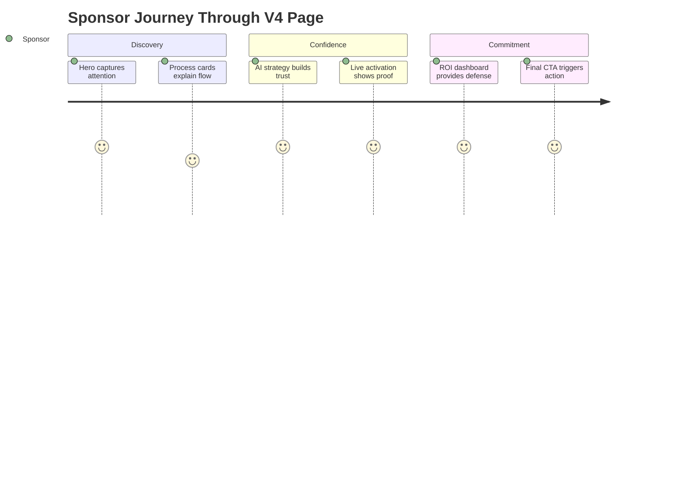

# FashionOS Sponsorship V4 — Motion Design System
**Route:** `/sponsorship-v4`  
**Philosophy:** Cinematic, Sponsor-First, Performance-Driven Storytelling

> **⚠️ Note:** V5 specification available at `02-sponsor-v5.md` with enhanced sponsor outcomes, Figma implementation details, and refined motion system.

---

## 🎯 Core Narrative
**Sponsor Question:** "If I sponsor a fashion event, how does this turn into real performance and ROI?"

**Motion Rule:** Every animation must explain cause → effect. Motion = meaning.

---

## 🎨 Motion Design Tokens

### Timing
```typescript
motion: {
  instant: 150,    // Micro-interactions
  fast: 250,       // UI feedback
  standard: 400,   // Content reveals
  slow: 600,       // Hero moments
  cinematic: 800   // Section transitions
}
```

### Easing
```typescript
easing: {
  entrance: [0.22, 1, 0.36, 1],      // Calm luxury ease-out
  exit: [0.32, 0, 0.67, 0],          // Quick departure
  elastic: [0.68, -0.55, 0.265, 1.55] // Subtle bounce (CTAs only)
}
```

### Parallax Layers
```typescript
parallax: {
  background: 0.3,   // Slowest (30% scroll speed)
  midground: 0.5,    // Medium depth
  foreground: 0.7,   // Near-normal
  content: 1.0       // Anchored
}
```

### Transforms
```typescript
transforms: {
  lift: { y: -4 },           // Hover elevation
  fadeIn: { y: 16, opacity: 0 },
  scaleSubtle: 0.98,         // Inactive state
  scaleActive: 1.0
}
```

---

## 📐 Architecture



---

## 🎬 Section 1: Hero — Cinematic Entry

### Layout (900px height)
- **3 Parallax Layers:** BG (0.3) → MID (0.5) → FG (0.7)
- **Center-aligned editorial composition**
- **Vertical light beam anchor**

### Content
```
H1: Turn Sponsorship into Performance
H2: FashionOS connects live events, commerce, and ROI 
    into one intelligent system.

[Primary CTA: Start Sponsor Strategy]
[Secondary: See How It Works ↓]
```

### Motion Sequence


### Images
- **BG:** Runway silhouette (editorial, desaturated, grain overlay)
- **MID:** Vertical light beam vector (subtle glow)
- **Micro:** Thin connecting lines (1px, 20% opacity)

### Micro-Interactions
- **CTA Hover:** Underline draws left→right (250ms)
- **CTA Press:** Scale 0.98 + opacity 0.92

---

## 🔄 Section 2: How Sponsorship Works — 5-Card Journey

### Concept
Sequential storytelling with directional flow. Only one card is "active" at a time.



### Card Structure (Each)
- Step badge (outlined circle)
- Title (18px, charcoal)
- 3 bullets (14px, 0.7 opacity)
- Minimal icon (24px, line style)

### Motion System
**Scroll-triggered activation:**
- **Active Card:** opacity 1, scale 1, shadow (0 4 16 rgba(0,0,0,0.06))
- **Inactive Cards:** opacity 0.4, scale 0.98
- **Arrow Draw:** SVG path strokeDashoffset (100→0, 400ms)

### Stagger Logic
```typescript
cards.forEach((card, i) => {
  delay: i * 120ms
  y: 16 → 0
  opacity: 0 → 1
})
```

---

## 🤖 Section 3: AI Strategy Builder

### Visual
3 horizontal cards with progress indicator

**Cards:**
1. Brand & Goals Analyzed (AI icon)
2. Activations Recommended (Target icon)
3. ROI Projected Pre-Launch (Chart icon)

### Motion
- Cards fade-in with stagger (80ms)
- Progress bar fills (scaleX: 0→1, 600ms, 200ms delay)

### Diagram


---

## 💰 Section 4: Live Activation & Commerce Flow

### Flow Diagram (Horizontal)
```
Runway Moment → Product Tag → Mobile (QR/WhatsApp/IG) → Shopify → Revenue
```

### Visual Treatment
- **Nodes:** Rounded rectangles (ivory bg, charcoal border)
- **Arrows:** Curved connectors with draw animation
- **Metrics:** Small badges below nodes (Clicks, Purchases, $)

### Motion
```typescript
sequence: [
  { element: 'runway', action: 'fadeIn', delay: 0 },
  { element: 'arrow1', action: 'draw', delay: 200 },
  { element: 'productTag', action: 'fadeIn', delay: 400 },
  { element: 'arrow2', action: 'draw', delay: 600 },
  // ... continues
]
```

---

## 📊 Section 5: ROI Dashboard

### KPI Cards (2×2 Grid)
- Reach: 2.4M impressions
- Engagement: 18.3% interaction rate
- Conversions: 1,247 attributed sales
- ROI: 4.2× return

### Motion
- All cards fade together (no stagger — cohesive data)
- Bars fill left→right (400ms, ease-out)
- No aggressive counters (static numbers = luxury)

### Micro-Interaction
**Hover Card:** Lift -4px + shadow increase

---

## 🎯 Section 6: AI Insights

### Layout
3 insight cards (stacked, slight rotation for depth)

**Content:**
- "Peak engagement: 8:34 PM runway finale"
- "Best channel: Instagram Stories (4.1× avg)"
- "Recommendation: Increase video activations 30%"

### Motion
- Cards appear with slight rotation (−2°, 0°, 2°)
- Subtle ambient float (y: ±2px, 3s loop, offset per card)

---

## 🏢 Section 7: Industries

**Grid:** 5 chips (horizontal, centered)  
Beauty · Automotive · Beverage · Jewelry · Electronics

**Motion:** Simple fade-in (no distraction)

---

## 🚀 Section 8: Final CTA

### Content
```
Turn Sponsorship into Performance
Start a sponsor strategy and preview ROI before committing.

[Start Sponsor Strategy →]
```

### Motion
- Hero-style emphasis (larger scale, centered)
- CTA: Hover underline draw (250ms)
- Press: opacity 0.92 + y +2px

---

## ✅ Success Criteria

### Performance
- [ ] Page load < 2s (3G)
- [ ] Smooth 60fps scroll
- [ ] No layout shift (CLS < 0.1)

### Narrative
- [ ] Every motion explains sponsor value
- [ ] Clear progression: Discovery → Strategy → Proof
- [ ] No motion for motion's sake

### Luxury Aesthetics
- [ ] Calm color palette (ivory/charcoal/sand)
- [ ] Editorial typography (no aggressive weights)
- [ ] Subtle animations (max 600ms)

---

## 📦 Production Checklist

### Assets Required
- [ ] Editorial runway image (hero BG, 1920×1080)
- [ ] Light beam vector (vertical, SVG)
- [ ] 5 step icons (line style, 24×24)
- [ ] 3 AI strategy icons
- [ ] Flow diagram nodes (SVG components)

### Components to Build
- [ ] `HeroParallax.tsx` — 3-layer parallax system
- [ ] `ProcessCards.tsx` — 5-card scroll sequence
- [ ] `DrawingArrow.tsx` — SVG path animation
- [ ] `KPICard.tsx` — Dashboard metrics
- [ ] `InsightCard.tsx` — AI recommendations

### Motion Implementation
- [ ] Global motion tokens (constants file)
- [ ] Scroll-triggered animations (Intersection Observer)
- [ ] Parallax system (Motion + useScroll)
- [ ] Micro-interactions (hover/press states)

### Integration
- [ ] Add `/sponsorship-v4` route
- [ ] Update footer with "V4" link
- [ ] Test on mobile (simplified parallax)

---

## 🎭 Narrative Arc Summary



---

**End of V4 Specification**  
*Motion = Meaning | Clarity → Confidence → Commitment*