# FashionOS Sponsorship V5 — Premium Motion System
**Route:** `/sponsorship-v5`  
**Philosophy:** Calm Luxury · Fashion-Tech · Cinematic · Sponsor-First  
**Rule:** Motion must explain cause → effect (never decorative)

---

## 📋 Sections Overview
1. Hero — Cinematic Entry with 3-Layer Parallax
2. How Sponsorship Works — 5-Card Sequential Journey
3. AI Strategy Builder — Decision Intelligence Visible
4. Live Activation Flow — Runway to Revenue
5. ROI Dashboard — Defensible Performance Metrics
6. AI Insights — Strategic Recommendations
7. Industries — Customization Depth Hints
8. Final CTA — Friction-Free Commitment

---

## 🎨 Motion Design Tokens

### Timing System
```typescript
motion: {
  micro: 100,        // Instant feedback (hover, press)
  fast: 250,         // UI state changes
  standard: 400,     // Content reveals
  slow: 600,         // Hero moments
  cinematic: 800     // Section transitions
}
```

### Easing Curves
```typescript
easing: {
  calmLuxury: [0.22, 1, 0.36, 1],      // Primary (ease-out)
  quickExit: [0.32, 0, 0.67, 0],        // Dismissals
  subtle: [0.25, 0.46, 0.45, 0.94]      // Gentle bounce
}
```

### Parallax Depth System
```typescript
parallax: {
  background: 0.3,    // Slowest (runway images)
  midground: 0.5,     // Connecting lines/vectors
  foreground: 0.7,    // Text content
  fixed: 1.0          // CTAs, metrics (no parallax)
}
```

### Transform Library
```typescript
transforms: {
  lift: { y: -4, shadow: '0 8px 24px rgba(0,0,0,0.08)' },
  fadeIn: { y: 16, opacity: 0 },
  scaleInactive: 0.98,
  scaleActive: 1.0,
  forwardMotion: { x: 12 }  // Active card emphasis
}
```

---

## 🏗️ Architecture


---

## 🎭 Narrative Arc


---

## 🎬 SECTION 1: Hero — Cinematic Entry

### 📐 Figma Setup
**Frames Required:**
- `Hero_State_01_Load` (900px height)
- `Hero_State_02_Lines` 
- `Hero_State_03_Content`

**Layer Structure (CRITICAL - names must match):**
```
Hero
 ├── BG_Image (parallax: 0.3)
 ├── BG_Overlay (gradient: rgba(245,241,232,0.4))
 ├── MID_Lines (parallax: 0.5)
 ├── FG_Content (parallax: 0.7)
 │    ├── Headline
 │    ├── Subhead
 │    ├── CTA_Primary
 │    └── CTA_Secondary
 └── Trust_Signal (logos, 20% opacity)
```

### 📝 Content (Refined)
```
H1: Turn Sponsorship into Performance

H2: Turn runway moments into measurable sales, 
    attribution, and repeat sponsorship.

[Primary CTA: Start Sponsor Strategy]
[Secondary CTA: See How It Works ↓]

Trust Signal: "Trusted by fashion weeks, brands, and global sponsors"
```

### 🎞️ Animation Sequence

```mermaid
sequenceDiagram
    participant Load
    participant BG as Background
    participant Lines as Mid Lines
    participant Content as Foreground
    participant CTA
    
    Load->>BG: Page loads
    BG->>BG: Fade in (0→1, 600ms, 0ms delay)
    Note over BG: Editorial runway blur
    
    BG->>Lines: After 200ms
    Lines->>Lines: Draw vertical beam (path 0→100%, 800ms)
    
    Lines->>Content: After 300ms
    Content->>Content: Headline scale (0.98→1, 600ms)
    Content->>Content: Subhead fade+y (16→0, 400ms)
    
    Content->>CTA: After 500ms
    CTA->>CTA: Buttons appear (y:8→0, 300ms)
    
    Note over Load,CTA: Total sequence: ~1.8s
```



### 🎨 Assets Needed
- **BG_Image:** Wide runway crowd shot (editorial, desaturated, 1920×1080)
- **MID_Lines:** Vertical light beam SVG (subtle glow, 4px width)
- **Trust_Signal:** 3-5 brand logos (monochrome, vector)

### ⚙️ Figma Prototype Settings
**State 01 → State 02:**
- Trigger: After Delay (200ms)
- Animation: Smart Animate
- Duration: 600ms
- Easing: Ease Out

**State 02 → State 03:**
- Trigger: After Delay (300ms)
- Animation: Smart Animate
- Duration: 400ms

### 🎯 Microinteractions
**CTA Primary (Hover):**
- Underline draws left→right (250ms)
- Background: charcoal → slight lift

**CTA Primary (Press):**
- Scale: 0.98
- Opacity: 0.92
- Duration: 100ms

---

## 🔄 SECTION 2: How Sponsorship Works — 5-Card Journey

### 📐 Figma Setup
**Horizontal scroll container with 5 cards + arrows**

**Card Structure:**
```
Card_Component (Variant: Active/Inactive)
 ├── Badge (outlined circle, step number)
 ├── Icon (24×24, line style)
 ├── Title (18px)
 ├── Outcome_Subline (14px italic, NEW)
 ├── Bullets (3 items, 14px, 0.7 opacity)
 └── Micro_Metric (12px, optional)
```

### 📝 Content (Enhanced with Outcomes)

**Card 01: Discover Opportunities**
- Outcome: "Know where you fit"
- AI analyzes brand fit across events
- Matches audience demographics
- Surfaces sponsorship tiers
- *Micro-metric:* "Avg setup: < 48h"

**Card 02: AI Builds Strategy**
- Outcome: "Know what will work"
- Recommends activations by channel
- Projects engagement & ROI
- Tailors messaging per audience

**Card 03: Activate at Event**
- Outcome: "Be seen at the right moment"
- Live tagging during runway
- QR codes to product pages
- WhatsApp & Instagram integration
- *Micro-metric:* "Live attribution enabled"

**Card 04: Measure Performance**
- Outcome: "Prove the impact"
- Real-time dashboard updates
- Channel-level attribution
- Sales + engagement tracking

**Card 05: Optimize & Renew**
- Outcome: "Spend smarter next time"
- AI identifies best moments
- Recommends budget allocation
- Predicts next event ROI

### 🎨 Visual Flow


### 🎞️ Animation Logic
**Scroll-triggered activation:**
```typescript
// Active card state
{
  opacity: 1,
  scale: 1,
  x: 12,  // Forward motion (NEW)
  shadow: '0 4px 16px rgba(0,0,0,0.06)'
}

// Inactive card state
{
  opacity: 0.4,
  scale: 0.98,
  x: 0
}

// Arrow animation
{
  strokeDashoffset: 100 → 0,
  duration: 400ms,
  easing: calmLuxury
}
```

### ⚙️ Figma Implementation
1. Create 5 card components (Active/Inactive variants)
2. Create arrow connector component (SVG path)
3. Duplicate layout 5 times (one per scroll position)
4. Connect with On Scroll trigger
5. Stagger card reveals: delay = index × 120ms

### 🎨 Assets Needed
- 5 line-style icons (Search, Brain, Tag, Chart, Refresh)
- Arrow connector SVG (curved, 2px stroke)

---

## 🤖 SECTION 3: AI Strategy Builder — Decision Intelligence

### 📝 Content (Refined with "Why" Visibility)

**Card 01: Brand & Goals Analyzed**
- Icon: Checkmarks appearing
- AI cross-references audience overlap
- Identifies conversion-ready segments
- *Why signal:* "Based on audience overlap analysis"

**Card 02: Activations Recommended**
- Icon: Comparison lines
- Suggests optimal touchpoints
- Ranks channels by predicted ROI
- *Why signal:* "Based on past event performance"

**Card 03: ROI Projected Pre-Launch**
- Icon: Recommendation highlight
- Models attribution confidence
- Projects sales by activation type
- *Why signal:* "Based on similar sponsor outcomes"

### 🎨 Visual Treatment


### 🎞️ Animation
```typescript
// Card sequence
cards.forEach((card, i) => ({
  y: 16 → 0,
  opacity: 0 → 1,
  delay: i × 80ms
}))

// Progress bar
{
  scaleX: 0 → 0.9 (pause 200ms) → 1,
  duration: 600ms,
  delay: 200ms
}
```

### ⚙️ Microinteraction
**Card Hover:**
- Lift: -4px
- Shadow increase
- "Why signal" opacity: 0.5 → 1

---

## 💰 SECTION 4: Live Activation & Commerce Flow

### 📝 Enhanced Flow (Realism Focus)

```
[Runway Moment] → [Product Tag] → [Mobile UI] → [Shopify] → [Revenue]
     pulse          glow         phone outline   checkout    $ badge
```

### 🎨 Visual Nodes (Grounded in Reality)
- **Runway:** Small still image (128×128, rounded)
- **Product Tag:** Actual product thumbnail
- **Mobile:** Phone outline SVG with QR/WhatsApp/IG icons
- **Shopify:** Cart icon + "Checkout" label
- **Revenue:** Metric badge with $ value

### 🎞️ Sequential Motion

```mermaid
sequenceDiagram
    participant Runway
    participant Tag
    participant Mobile
    participant Shopify
    participant Revenue
    
    Runway->>Runway: Pulse (scale 1→1.05, 400ms loop)
    Runway->>Tag: Arrow draws (400ms)
    Tag->>Tag: Glow appears
    Tag->>Mobile: Arrow draws (400ms)
    Mobile->>Shopify: Arrow draws (400ms)
    Shopify->>Revenue: Metrics fade in (300ms)
```



### 🎨 Assets Needed
- Runway still (editorial, 256×256)
- Product thumbnail (handbag/shoe, 128×128)
- Phone outline SVG
- Curved arrow SVG connectors (3 variations)

---

## 📊 SECTION 5: ROI Dashboard — Defensible Metrics

### 📝 Content (Trust-Focused)

**KPI Cards (2×2 Grid):**
1. **Reach:** 2.4M impressions  
   *Label:* "Multi-channel attribution"

2. **Engagement:** 18.3% interaction rate  
   *Label:* "Click-through + dwell time"

3. **Conversions:** 1,247 attributed sales  
   *Label:* "Channel-level traceability"

4. **ROI:** 4.2× return (LARGER)  
   *Label:* "Attribution confidence: 94%"

### 🎨 Visual Hierarchy
```
ROI card = 1.2× larger than others
All other KPIs support the ROI metric
```

### 🎞️ Minimal Motion (Stillness = Credibility)
```typescript
// All cards fade together (cohesive data)
{
  opacity: 0 → 1,
  duration: 400ms,
  stagger: none  // Simultaneous
}

// Bars fill left→right
{
  scaleX: 0 → 1,
  duration: 400ms,
  easing: calmLuxury
}

// NO parallax in this section
```

### ⚙️ Microinteraction
**Card Hover:** Lift -4px + shadow increase only

---

## 🎯 SECTION 6: AI Insights — Strategic Authority

### 📝 Content (Strategist Voice)

**Insight 01:**
"We recommend increasing video activations by ~30% next show."  
*Context:* Video drove 3.2× engagement vs static posts

**Insight 02:**
"Instagram Stories outperformed static placements 4.1×"  
*Context:* Peak engagement: 8:34 PM runway finale

**Insight 03:**
"Allocate 40% budget to post-event retargeting"  
*Context:* 67% of conversions occurred within 48h post-event

### 🎞️ Reduced Motion (Authority > Delight)
```typescript
// Remove rotation entirely
// Keep only:
{
  opacity: 0 → 1,
  y: 16 → 0,
  stagger: 120ms,
  // Optional: very subtle float (±2px, 3s loop)
}
```

---

## 🏢 SECTION 7: Industries — Customization Depth

### 📝 Content (Clickable Chips)
```
Beauty · Automotive · Beverage · Jewelry · Electronics
```

### ⚙️ Microinteraction (Hover)
```typescript
chip.hover {
  // Show example below chip
  exampleText: "Beauty: shade-level attribution",
  opacity: 0 → 1,
  y: -8,
  duration: 250ms
}
```

---

## 🚀 SECTION 8: Final CTA — Friction Removal

### 📝 Content
```
H2: Turn Sponsorship into Performance

Body: Start a sponsor strategy and preview ROI before committing.

Reassurance: "No obligation. Strategy first."

[Start Sponsor Strategy →]
```

### 🎞️ CTA Microinteraction
**Hover:**
- Underline draws (250ms)
- Background lift

**Press:**
- Scale: 0.98
- Opacity: 0.92

---

## ✅ Success Criteria

### Performance
- [ ] Page load < 2s (3G)
- [ ] Smooth 60fps scroll (no jank)
- [ ] CLS < 0.1 (no layout shift)

### Narrative Clarity
- [ ] Every motion explains sponsor value
- [ ] Progression: Emotion → Understanding → Trust → Action
- [ ] No decorative motion

### Luxury Aesthetics
- [ ] Calm palette (ivory/charcoal/sand only)
- [ ] Editorial typography (Playfair + Inter)
- [ ] Subtle animations (max 600ms)
- [ ] Restraint in later sections (ROI/Insights minimal motion)

---

## 📦 Production Checklist

### Assets to Create
- [ ] Runway crowd image (wide, editorial, 1920×1080)
- [ ] Vertical light beam SVG
- [ ] 3-5 brand logos (monochrome)
- [ ] 5 process icons (line style, 24×24)
- [ ] Arrow connector SVGs (curved, 2px)
- [ ] Runway still (product moment, 256×256)
- [ ] Product thumbnail (luxury item, 128×128)
- [ ] Phone outline SVG
- [ ] 3 AI decision icons (checkmark, comparison, highlight)

### Components to Build
- [ ] `HeroParallax.tsx` — 3-layer depth system
- [ ] `ProcessCard.tsx` — 5-card scroll sequence with outcomes
- [ ] `ArrowConnector.tsx` — SVG path draw animation
- [ ] `AIStrategyCard.tsx` — Decision cues + "why" signals
- [ ] `ActivationFlow.tsx` — Sequential node animation
- [ ] `KPICard.tsx` — Dashboard with defensibility labels
- [ ] `InsightCard.tsx` — Strategic voice, minimal motion
- [ ] `IndustryChip.tsx` — Hover example reveal

### Motion Implementation
- [ ] Motion token constants (`/lib/motionTokens.ts`)
- [ ] Scroll-triggered animations (Intersection Observer)
- [ ] Parallax system (Motion + useScroll + useTransform)
- [ ] Microinteractions (Framer Motion hover/tap)
- [ ] Arrow draw animations (SVG strokeDashoffset)

### Integration
- [ ] Create `/sponsorship-v5` route
- [ ] Update footer links (add V5)
- [ ] Mobile responsive (disable parallax, stack cards)
- [ ] Test on Safari, Chrome, Firefox

---

## 🎨 Multi-Step Prompt Guide (For AI Implementation)

### Prompt 1: Setup & Hero
```
Create /sponsorship-v5 route with:
- 3-layer parallax hero (BG: 0.3, MID: 0.5, FG: 0.7)
- Sequential animation: BG fade → Lines draw → Content reveal
- Headline: "Turn Sponsorship into Performance"
- Subhead: "Turn runway moments into measurable sales, attribution, and repeat sponsorship"
- Use motion tokens from /lib/motionTokens.ts
```

### Prompt 2: Process Cards
```
Build 5-card horizontal scroll section:
- Each card: badge, icon, title, outcome subline, bullets, optional metric
- Active state: opacity 1, scale 1, x: 12px, shadow
- Inactive state: opacity 0.4, scale 0.98
- Arrow connectors draw between cards (SVG path animation)
- Scroll-triggered with Intersection Observer
```

### Prompt 3: AI Strategy + Flow
```
Create AI Strategy section with 3 cards:
- Show decision cues (checkmarks, comparison lines)
- Add "why" signals below each card
- Progress bar with 200ms pause at 90%

Then build Activation Flow:
- 5 nodes: Runway → Tag → Mobile → Shopify → Revenue
- Sequential arrow drawing
- Use real imagery (product thumbnails, phone outline)
```

### Prompt 4: ROI + Insights
```
Build ROI Dashboard:
- 4 KPI cards (ROI 1.2× larger)
- Add defensibility labels
- Minimal motion (no parallax)
- Cards fade together, bars fill left→right

Then AI Insights section:
- 3 cards with strategic voice
- Remove rotation, keep subtle fade-in only
```

### Prompt 5: Industries + Final CTA
```
Create Industries section:
- 5 chips with hover examples
- Simple fade-in

Final CTA section:
- Large centered layout
- Reassurance text: "No obligation. Strategy first."
- CTA microinteractions (underline draw, press scale)
```

---

**End of V5 Specification**  
*Emotion → Understanding → Trust → Action*
