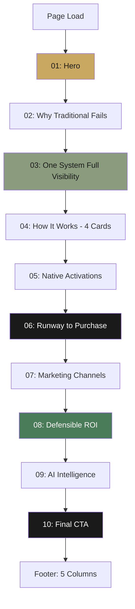
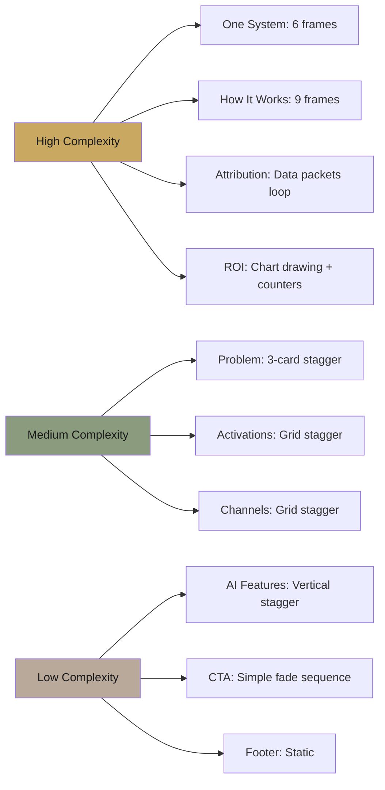

# FashionOS — Luxury Real Estate Sponsorship System
## Figma Make AI Multi-Step Prompts (Enhanced Edition)
### The Sponsorship Operating System • Real Estate Edition

---

# SECTION 1: HERO — THE SPONSORSHIP OPERATING SYSTEM

## Frame
```
Name: Hero / Real Estate
Height: 900px
Background: #FDFCFA (warm off-white)
Layout: Center-aligned vertical
```

## Content
```
Badge (12px, uppercase, #6B6B6B, letter-spacing 0.15em):
"INTRODUCING FASHIONOS"

Headline (88px, Canela serif, center, tight leading 1.1):
The Sponsorship
Operating System

Subhead (20px, Inter, center, #6B6B6B, line-height 1.6):
Turn luxury real estate placements into measurable sales through
fashion event activations and full purchase attribution

Primary CTA:
Text: "Request Access"
Style: #1A1A1A background, #FDFCFA text
Size: 56px height × 180px width
Border radius: 2px
Font: 16px, medium weight

Secondary Link:
Text: "or, explore features ↓"
Style: 18px, #6B6B6B, underline on hover
Hover: Underline draws left→right (250ms)

Trust Badge Row (14px, #6B6B6B, separated by 1px dividers):
"Used by 40+ Luxury Developers" | "Avg. 3.2× ROI" | "$47M Attributed Sales"
```

## Animation Sequence (3 Frames)
```
Frame 01 — Initial Load:
All elements: opacity 0

Frame 02 — Badge + Headline Entry:
Trigger: After Delay 200ms
- Badge: opacity 0 → 1 (400ms)
- Headline: y +16 → 0, opacity 0 → 1 (700ms, +100ms delay)
  Note: "Operating System" in italic emphasis
- Smart Animate, easing [0.16, 1, 0.3, 1]

Frame 03 — Content Cascade:
Trigger: After Delay 300ms
- Subhead: opacity 0 → 1 (500ms)
- Primary CTA: y +8 → 0, opacity 0 → 1 (400ms, +200ms delay)
- Secondary Link: opacity 0 → 1 (300ms, +400ms delay)
- Trust badges: opacity 0 → 1 (300ms, +700ms delay)
```

## Hover States
```
Primary CTA Component (create variant):
Default → Hover:
- y: 0 → -4
- Shadow: 0 2 8 rgba(26,26,26,0.08) → 0 8 24 rgba(26,26,26,0.16)
- Duration: 200ms
- Easing: ease-out

Interaction: While Hovering
Animation: Smart Animate
```

## Parallax Scroll (2 Layers)
```
Create 3 duplicate frames: Hero_Scroll_01 → Hero_Scroll_03

Layer Movement (Y-axis per frame):
- Background decorative elements: +20px (slowest, 0.5× speed)
- All content (badge, headline, CTAs): +40px (normal, 1× speed)

Prototype:
- Connect: On Drag (Vertical)
- Animation: Smart Animate
- Duration: 200ms
- Easing: Linear (required for smooth parallax)
```

---

# SECTION 2: THE PROBLEM — WHY TRADITIONAL SPONSORSHIP FAILS

## Frame
```
Name: Section / Problem
Height: 700px
Background: White
Top Margin: 160px
```

## Header
```
Headline (56px, Canela, center):
Why Traditional Sponsorship Fails

Subhead (18px, center, #6B6B6B, max-width 720px):
Luxury developers invest six figures in fashion event sponsorships,
yet three critical gaps make ROI impossible to prove
```

## Problem Cards (3 Horizontal, 360px × 340px each)
```
Layout: Centered row, 40px gap

Card Design:
- Background: #FDFCFA
- Border: 1px solid #E8E5E0
- Border radius: 8px
- Padding: 40px
- Shadow: 0 2 8 rgba(26,26,26,0.04)

Structure per card:
├── Number Badge (56px circle, outlined, 2px stroke #C9A961)
├── Problem Title (28px, Canela)
├── Description (16px, Inter, line-height 1.7, 5-6 lines)
└── Impact Statement (14px, italic, #C9A961)
```

### Card 01 — No Connection to Sales
```
Badge: 01
Title: No Connection to Sales

Description:
"Traditional sponsorships end when the event ends. There's zero 
infrastructure to connect attendee interest to property viewings, 
let alone track which interactions led to actual purchases."

Impact: "Result: $150K spent, $0 attributed revenue"

Icon Position: Top-right corner (24px, outlined property with broken link)
Accent Color: #C9A961 (gold, for badge + impact)
```

### Card 02 — Blind Audience Targeting
```
Badge: 02
Title: Blind Audience Targeting

Description:
"Sponsors pay premium rates assuming fashion event attendees can 
afford luxury real estate. But there's no verification of income 
brackets, no propensity scoring, no way to confirm buyer intent."

Impact: "Result: 90% of attendees not in-market"

Icon: Users with question mark (24px)
Accent Color: #8B9B7E (sage green)
```

### Card 03 — Zero Performance Intelligence
```
Badge: 03
Title: Zero Performance Intelligence

Description:
"No data on which property types resonate, which event moments 
drive interest, or which follow-up channels work. Every campaign 
starts from scratch with the same blind assumptions."

Impact: "Result: Impossible to optimize, improve, or justify"

Icon: Chart with X mark (24px)
Accent Color: #B8A99A (taupe)
```

## Animation Sequence
```
Trigger: Section enters viewport (50% visible)

Header animation:
- Headline: y +20 → 0, opacity 0 → 1 (600ms)
- Subhead: opacity 0 → 1 (400ms, +150ms delay)

Cards appear with stagger:
- Card 01: 0ms delay
- Card 02: 120ms delay
- Card 03: 240ms delay

Each card:
- y: +24 → 0
- opacity: 0 → 1
- scale: 0.98 → 1
- Duration: 600ms
- Easing: [0.16, 1, 0.3, 1]
```

## Hover Interaction
```
Card Hover State:
- y: 0 → -6
- Shadow: 0 2 8 rgba(26,26,26,0.04) → 0 8 24 rgba(26,26,26,0.12)
- Border: #E8E5E0 → accent color
- Number badge: Fill with accent color
- Duration: 250ms
```

---

# SECTION 3: ONE SYSTEM. FULL VISIBILITY.

## Frame
```
Name: Section / System Overview
Height: 1000px
Background: #FDFCFA
Layout: Radial composition (central hub + 4 modules)
```

## Header
```
Headline (64px, Canela, center):
One System. Full Visibility.

Subhead (20px, center, #6B6B6B, max-width 800px):
FashionOS connects event activations, property viewings, marketing
channels, and purchase attribution in one unified platform
```

## Central Hub Design
```
Outer Circle:
- Diameter: 280px
- Stroke: 2px solid #C9A961 (luxury gold)
- Fill: none
- Position: Absolute center

Inner Circle:
- Diameter: 240px
- Fill: White
- Shadow: 0 8 32 rgba(201,169,97,0.08)
- Border: 1px solid #E8E5E0

Hub Badge (center of inner circle):
- Text: "FashionOS" (28px, Canela)
- Color: #1A1A1A
- Position: Center-aligned

Hub Subtext (below badge):
- Text: "SPONSORSHIP SYSTEM"
- Font: 11px, Inter, uppercase
- Letter-spacing: 0.12em
- Color: #6B6B6B
```

## Module Cards (4, Radial Layout)
```
Card Size: 300px × 180px
Position: 45° diagonals from hub center
Distance from hub: 200px (edge to edge)

Card Design:
- Background: White
- Border: 1px solid #E8E5E0
- Border radius: 12px
- Padding: 28px
- Shadow: 0 4 16 rgba(26,26,26,0.06)

Card Structure:
├── Icon (40px, line style, accent color)
├── Title (20px, Canela, semibold)
├── Description (15px, Inter, 2 lines max)
└── Subtle arrow or indicator icon (12px, bottom-right)
```

### Module 01 — Event Activations (Top-Left)
```
Position: -135° from center (top-left diagonal)
Icon: Calendar with luxury property icon
Title: Event Activations
Description: "Luxury property showcases at fashion events"
Accent: #C9A961 (gold)
```

### Module 02 — Live Commerce (Top-Right)
```
Position: -45° from center (top-right diagonal)
Icon: Mobile phone with property listing
Title: Live Commerce
Description: "Direct booking flows from event to viewing"
Accent: #8B9B7E (sage green)
```

### Module 03 — Marketing Channels (Bottom-Left)
```
Position: 135° from center (bottom-left diagonal)
Icon: Broadcast/megaphone with channels
Title: Marketing Channels
Description: "Event, social, website, email distribution"
Accent: #B8A99A (taupe)
```

### Module 04 — ROI Analytics (Bottom-Right)
```
Position: 45° from center (bottom-right diagonal)
Icon: Bar chart with property icon
Title: ROI Analytics
Description: "Sales attribution and performance tracking"
Accent: #4A7C59 (forest green)
```

## Connection Lines (4 Diagonal Lines)
```
Each line connects hub center to module center:

Style:
- Stroke: 1px
- Color: #C9A961
- Opacity: 0.3
- Dash: 4px 4px
- End cap: Rounded

Lines:
01. Hub → Module 01 (top-left)
02. Hub → Module 02 (top-right)
03. Hub → Module 03 (bottom-left)
04. Hub → Module 04 (bottom-right)
```

## Animation Sequence (6 Frames)
```
Frame 01 — Initial State:
All elements: opacity 0

Frame 02 — Hub Outer Circle:
Trigger: After Delay 200ms
- Outer circle: strokeDashoffset 100 → 0
- Duration: 800ms
- Creates drawing effect

Frame 03 — Hub Inner + Badge:
Trigger: After Delay 300ms
- Inner circle: scale 0.9 → 1, opacity 0 → 1 (600ms)
- Hub badge: opacity 0 → 1 (400ms, +200ms delay)
- Hub subtext: opacity 0 → 1 (300ms, +400ms delay)

Frame 04 — Connection Lines Draw:
Trigger: After Delay 400ms
- All 4 lines: strokeDashoffset 100 → 0
- Duration: 700ms
- Stagger: 100ms per line
- Order: Clockwise (01 → 02 → 04 → 03)

Frame 05 — Modules Appear:
Trigger: After Delay 300ms
- All 4 modules in same clockwise order
- Each module: scale 0.95 → 1, opacity 0 → 1, y +12 → 0
- Duration: 500ms per module
- Stagger: 100ms

Frame 06 — Header Text:
Trigger: After Delay 200ms
- Headline: opacity 0 → 1, y +16 → 0 (500ms)
- Subhead: opacity 0 → 1 (400ms, +150ms delay)
```

## Hover Interactions
```
Module Card Hover (create component variants):
Default → Hover:
- scale: 1 → 1.03
- y: 0 → -4
- Shadow: 0 4 16 rgba(26,26,26,0.06) → 0 12 32 rgba(26,26,26,0.12)
- Border: #E8E5E0 → accent color
- Connected line: opacity 0.3 → 0.8, stroke-width 1px → 2px
- Duration: 250ms

Hub Glow on Any Module Hover:
- Inner circle shadow increases
- Duration: 250ms
```

---

# SECTION 4: HOW IT WORKS — 4-STEP PROCESS CARDS

## Frame
```
Name: Section / How It Works
Height: 900px
Background: White
Top Margin: 180px
```

## Header
```
Headline (56px, Canela, center):
How It Works

Subhead (18px, center, #6B6B6B, max-width 720px):
From audience discovery to purchase attribution—four connected
steps that transform sponsorship into measurable performance
```

## Process Cards (4 Horizontal, 280px × 520px each)
```
Layout: Horizontal row, centered
Gap: 32px between cards

Card Design:
- Background: Linear gradient (top: white, bottom: #FDFCFA)
- Border: 1px solid #E8E5E0
- Border radius: 16px
- Padding: 36px
- Shadow: 0 4 16 rgba(26,26,26,0.06)

Card Structure (top to bottom):
├── Step Number Badge (60px circle, outlined)
├── Icon (64px, line style, accent color)
├── Step Title (28px, Canela)
├── Description (16px, Inter, line-height 1.7, 6-7 lines)
├── Key Features (3 bullets, 14px)
└── Success Metric (small badge, 12px, italic)
```

### Card 01 — Identify High-Intent Buyers
```
Badge: 01
Icon: Target with magnifying glass + property
Title: Identify High-Intent Buyers

Description:
"Before the event begins, AI analyzes attendee data to identify 
which fashion event guests are actively in-market for luxury real 
estate. Income verification, browsing behavior, and purchase 
propensity scoring ensure you only activate for qualified buyers."

Key Features:
• Income bracket verification ($500K+ annual)
• Real estate search activity monitoring
• Luxury purchase propensity scoring

Success Metric: "87% buyer qualification accuracy"
Accent Color: #C9A961 (gold)
```

### Card 02 — Activate Premium Experiences
```
Badge: 02
Icon: Luxury building with spotlight
Title: Activate Premium Experiences

Description:
"Create integrated property showcases that feel native to fashion 
events. From branded VIP lounges with property renders to 
exclusive viewing scheduling at afterparties—every touchpoint is 
designed for luxury brand alignment."

Key Features:
• VIP lounge property displays
• White-glove viewing scheduling
• Branded valet arrival moments

Success Metric: "4,200 viewing bookings per campaign"
Accent Color: #8B9B7E (sage)
```

### Card 03 — Track Every Interaction
```
Badge: 03
Icon: Chain links with data points
Title: Track Every Interaction

Description:
"Mobile-first attribution captures every engagement from event 
interest to property viewing to purchase. QR-enabled brochures, 
automated follow-up sequences, and CRM integration ensure no 
buyer slips through the cracks."

Key Features:
• QR code property brochure downloads
• Automated viewing confirmation flows
• Full CRM integration (Salesforce, DMS)

Success Metric: "2,847 interactions tracked per event"
Accent Color: #B8A99A (taupe)
```

### Card 04 — Prove ROI with Attribution
```
Badge: 04
Icon: Dollar sign with property + checkmark
Title: Prove ROI with Attribution

Description:
"Multi-touch attribution with 6-12 month tracking windows 
connects event activations to actual property purchases. 
See exactly which moment, channel, and message led to each 
sale—with integration into your existing sales systems."

Key Features:
• 6-12 month attribution windows
• Multi-touch path analysis
• Sales system integration

Success Metric: "Average 3.2× ROI, $8.2M attributed per campaign"
Accent Color: #4A7C59 (forest green)
```

## Flow Arrows Between Cards
```
3 Curved Arrows (Card 01→02, 02→03, 03→04):

Design:
- Style: Curved path (subtle arc)
- Stroke: 2px
- Color: Linear gradient (from card accent → next card accent)
- Dashed: 6px 6px
- Length: ~32px
- Arrow head: Solid triangle (8px)

Example gradients:
- Arrow 01→02: #C9A961 → #8B9B7E
- Arrow 02→03: #8B9B7E → #B8A99A
- Arrow 03→04: #B8A99A → #4A7C59
```

## Animation Sequence (9 Frames for Full Reveal)
```
Frame 01 — Initial:
All elements: opacity 0

Frame 02 — Header:
Trigger: Section 50% visible
- Headline: y +20 → 0, opacity 0 → 1 (600ms)
- Subhead: opacity 0 → 1 (400ms, +150ms delay)

Frames 03-09 — Sequential Card + Arrow Reveal:
Frame 03: Card 01 appears
Frame 04: Arrow 01→02 draws
Frame 05: Card 02 appears
Frame 06: Arrow 02→03 draws
Frame 07: Card 03 appears
Frame 08: Arrow 03→04 draws
Frame 09: Card 04 appears

Each card entrance:
- y: +20 → 0
- opacity: 0 → 1
- scale: 0.98 → 1
- Duration: 500ms
- Delay between elements: 150ms

Arrow drawing:
- strokeDashoffset: 100 → 0
- Duration: 500ms
- Easing: ease-out

Total sequence duration: ~3 seconds
```

## Hover States
```
Card Hover:
- y: 0 → -6
- Shadow: 0 4 16 rgba(26,26,26,0.06) → 0 12 32 rgba(26,26,26,0.14)
- Border: #E8E5E0 → accent color
- Icon: rotate 3°, scale 1 → 1.05
- Step badge: fill with accent color
- Duration: 250ms

Adjacent Arrow Highlight (when hovering card):
- Opacity: current → 1
- Stroke-width: 2px → 3px
- Duration: 200ms
```

## Scroll Effect Enhancement
```
As user scrolls through section:
- Active card: scale 1, opacity 1
- Cards before active: scale 0.98, opacity 0.6
- Cards after active: scale 0.98, opacity 0.6
- Smooth transition: 400ms

Implementation:
Create 5 scroll states (initial + 4 active states, one per card)
Connect with On Scroll trigger
```

---

# SECTION 5: ACTIVATIONS THAT FEEL NATIVE

## Frame
```
Name: Section / Activations
Height: 1100px
Background: #FDFCFA
Top Margin: 180px
```

## Header
```
Headline (56px, Canela, center):
Activations That Feel Native

Subhead (18px, center, #6B6B6B):
Luxury property showcases designed to enhance—not interrupt—
the fashion event experience
```

## Image Grid (6 Images, 2 Rows × 3 Columns)
```
Grid Configuration:
- Layout: 2 rows, 3 columns
- Image size: 380px × 420px (portrait, 9:11 ratio)
- Gap: 20px horizontal, 24px vertical
- Total grid width: 1180px (centered)

Image Treatment:
- Border radius: 8px
- Editorial photography style
- Warm color grading (amber/gold tones)
- Subtle film grain overlay (2% opacity)
- Vignette: Subtle darkening at edges
```

## Image Overlays & Labels
```
Each image has gradient overlay + text label:

Overlay Gradient:
- Direction: Bottom to top
- Start: rgba(26,26,26,0.6) at bottom
- End: transparent at 50% height

Label Design:
- Position: Bottom-left, 24px padding
- Font: 18px, Canela, semibold
- Color: #FDFCFA (white)
- Optional subtext: 14px, opacity 0.9
```

### Image 01 — Luxury Property Talks
```
Image: Panel discussion with luxury condo render backdrop
Label: "Luxury Talks"
Subtext: "Developer panels with property visuals"
Position: Row 1, Column 1
```

### Image 02 — VIP Property Lounge
```
Image: Branded lounge with property display screens + models
Label: "VIP Property Lounge"
Subtext: "Curated property showcases"
Position: Row 1, Column 2
```

### Image 03 — Showroom Integration
```
Image: Life-size property render installation at fashion venue
Label: "Showroom Moment"
Subtext: "Immersive property installations"
Position: Row 1, Column 3
```

### Image 04 — QR Viewing Access
```
Image: Elegant QR code display for private viewings
Label: "Exclusive Viewing"
Subtext: "Instant viewing booking via QR"
Position: Row 2, Column 1
```

### Image 05 — Branded Valet Experience
```
Image: Luxury valet arrival with property branding
Label: "Red Carpet Arrival"
Subtext: "Branded arrival experiences"
Position: Row 2, Column 2
```

### Image 06 — Interactive Digital Wall
```
Image: Touchscreen property exploration wall at afterparty
Label: "Digital Wall"
Subtext: "Interactive property browsing"
Position: Row 2, Column 3
```

## Animation Sequence
```
Trigger: Section 40% visible

Header:
- Headline + Subhead: Standard fade-in (600ms)

Image Grid (Staggered by Row):
Row 1 Images (01, 02, 03):
- Image 01: 0ms delay
- Image 02: 80ms delay
- Image 03: 160ms delay

Row 2 Images (04, 05, 06):
- Image 04: 240ms delay
- Image 05: 320ms delay
- Image 06: 400ms delay

Each image entrance:
- opacity: 0 → 1
- scale: 0.98 → 1
- y: +12 → 0
- Duration: 600ms
- Easing: [0.16, 1, 0.3, 1]
```

## Hover Interactions
```
Image Hover State:
- Overlay opacity: 0.6 → 0.8
- Label y: 0 → -4
- scale: 1 → 1.02 (subtle zoom)
- Border: Add 1px solid rgba(201,169,97,0.3)
- Duration: 300ms
- Easing: ease-out

Cursor: pointer
```

---

# SECTION 6: FROM RUNWAY TO PURCHASE — ATTRIBUTION FLOW

## Frame
```
Name: Section / Attribution Flow
Height: 900px
Background: #1A1A1A (dark charcoal)
Text Color: #FDFCFA (warm white)
```

## Header
```
Headline (56px, Canela, white, center):
From Runway to Purchase

Subhead (18px, white, opacity 0.7, center):
Real-time data flow connecting fashion event moments
to luxury property sales
```

## Flow Diagram (7 Nodes, Horizontal Layout)
```
Node Container Width: 1200px (centered)
Node Spacing: Evenly distributed

Node Design (Glassmorphism):
- Size: 180px × 140px
- Background: rgba(255,255,255,0.06)
- Backdrop blur: 16px
- Border: 1px solid rgba(255,255,255,0.1)
- Border radius: 12px
- Padding: 20px
- Shadow: 0 4 16 rgba(0,0,0,0.3)

Node Content:
├── Icon (32px, white with accent tint)
├── Node Label (16px, white, semibold)
├── Data Type (12px, opacity 0.7, 2 lines max)
└── Small metric badge (if applicable)
```

### Node 01 — Fashion Event
```
Icon: Dress/runway icon
Label: "Fashion Event"
Data: "Event attendance, dwell time, engagement"
Accent Tint: #C9A961 (gold)
```

### Node 02 — Property Showcase
```
Icon: Luxury building icon
Label: "Property Showcase"
Data: "Display interactions, brochure downloads"
Accent Tint: #8B9B7E (sage)
```

### Node 03 — Interest Capture
```
Icon: Hand with mobile phone
Label: "Interest Capture"
Data: "QR scans, contact forms, inquiry submissions"
Accent Tint: #B8A99A (taupe)
```

### Node 04 — Viewing Booked
```
Icon: Calendar with checkmark
Label: "Viewing Booked"
Data: "Scheduled appointments, confirmed attendees"
Accent Tint: #4A7C59 (forest green)
```

### Node 05 — Property Visit
```
Icon: Door with key icon
Label: "Property Visit"
Data: "In-person tours, walkthrough engagement"
Accent Tint: #C9A961 (gold)
```

### Node 06 — Purchase Intent
```
Icon: Contract/document icon
Label: "Purchase Intent"
Data: "Offers made, financing applications"
Accent Tint: #8B9B7E (sage)
```

### Node 07 — Sale Closed
```
Icon: Keys icon
Label: "Sale Closed"
Data: "Signed contracts, attributed revenue"
Accent Tint: #4A7C59 (forest green, glowing)
```

## Connectors Between Nodes
```
6 Curved Arrows (01→02, 02→03, ..., 06→07):

Design:
- Style: Bezier curve path
- Stroke: 2px
- Color: Linear gradient (node accent → next node accent)
- Dashed: 6px 6px
- Arrow head: 10px triangle
- Glow effect: drop-shadow(0 0 8px currentColor)
```

## Large Metrics Display (Below Flow)
```
3 Metric Cards, Horizontal Layout
Card Size: 360px × 140px
Gap: 40px
Background: rgba(255,255,255,0.04)
Border: 1px solid rgba(255,255,255,0.08)
Border radius: 12px
Padding: 32px

Metric 01 — Event Interactions:
Number: "2,847" (72px, white, Canela)
Label: "Event Interactions" (16px, opacity 0.7)
Icon: Touch/interaction icon (24px, top-right)

Metric 02 — Viewings Booked:
Number: "287" (72px, white, Canela)
Label: "Property Viewings Booked" (16px, opacity 0.7)
Icon: Calendar icon (24px)

Metric 03 — Attributed Sales:
Number: "$8.2M" (72px, #C9A961, Canela)
Label: "Attributed Sales" (16px, opacity 0.7)
Icon: Dollar with check (24px, gold tint)
```

## Animation Sequence
```
Trigger: Section 50% visible

Header:
- Headline: opacity 0 → 1 (600ms)
- Subhead: opacity 0 → 1 (400ms, +150ms delay)

Flow Diagram (Sequential Left to Right):
- Node 01: 0ms delay
- Arrow 01→02: +150ms
- Node 02: +300ms
- Arrow 02→03: +450ms
- Node 03: +600ms
- (Continue pattern for all 7 nodes + 6 arrows)

Each node entrance:
- opacity: 0 → 1
- scale: 0.96 → 1
- y: +12 → 0
- Duration: 500ms

Arrow drawing:
- strokeDashoffset: 100 → 0
- Duration: 500ms

Metrics:
- Appear after all nodes visible (+500ms)
- Count up from 0 (1500ms)
- Stagger: 200ms per metric

Total sequence: ~4.5 seconds
```

## Data Packet Animation (Optional Loop)
```
Visual: Small glowing circles (8px diameter)
Color: Gradient (#C9A961 → #FDFCFA)
Glow: 0 0 12px rgba(201,169,97,0.8)
Movement: Travel along connector paths
Speed: 2500ms per full path (Node 01 → Node 07)
Loop: Infinite
Stagger: 500ms between packets
Opacity pulse: 0.6 → 1 → 0.6 (1000ms loop)

Implementation: CSS animation or Lottie file
```

## Hover States
```
Node Hover:
- Border: rgba(255,255,255,0.1) → rgba(201,169,97,0.4)
- Glow effect: box-shadow 0 0 24px rgba(201,169,97,0.3)
- Connected paths highlight (opacity increase)
- Duration: 250ms
```

---

# SECTION 7: MARKETING CHANNELS — OMNICHANNEL DISTRIBUTION

## Frame
```
Name: Section / Marketing Channels
Height: 900px
Background: White
Top Margin: 180px
```

## Header
```
Headline (56px, Canela, center):
Every Channel. One System.

Subhead (18px, center, #6B6B6B):
Property content automatically distributed across all marketing
channels with performance tracking at every touchpoint
```

## Channel Cards (4, 2×2 Grid)
```
Grid Configuration:
- Layout: 2 rows, 2 columns
- Card size: 560px × 380px
- Gap: 32px horizontal and vertical
- Total grid: 1152px width (centered)

Card Design:
- Background: #FDFCFA
- Border: 1px solid #E8E5E0
- Border radius: 12px
- Padding: 40px
- Shadow: 0 4 16 rgba(26,26,26,0.06)

Card Structure:
├── Icon (48px, accent color, top-left)
├── Channel Title (28px, Canela)
├── Description (16px, Inter, line-height 1.7, 4-5 lines)
├── Key Metrics (3 bullets, 14px, each with icon)
└── Visual Preview (small image/mockup, 120px × 80px, bottom-right)
```

### Channel 01 — Event Moments (Row 1, Col 1)
```
Icon: Camera with sparkles
Title: Event Moments
Accent Color: #C9A961

Description:
"Fashion week property showcases, VIP lounge activations, and 
branded experiences captured in real-time. Professional photography 
and video distributed across all channels within hours of the event."

Key Metrics:
📊 2.4M impressions per event
🎯 87% UHNW audience reach
💬 18.3% engagement rate

Visual: Photo grid showing event activation moments
```

### Channel 02 — Social Media (Row 1, Col 2)
```
Icon: Grid of social platform icons
Title: Social Media
Accent Color: #8B9B7E

Description:
"Instagram Stories, Reels, LinkedIn posts, and TikTok content 
auto-generated from event footage and property renders. Platform-
optimized formatting and captions created by AI."

Key Metrics:
📱 840K social reach
🔖 12K saves and shares
🔗 4.2% click-through to website

Visual: Social media mockups (IG, LinkedIn, TikTok)
```

### Channel 03 — Website Integration (Row 2, Col 1)
```
Icon: Browser window with property
Title: Website Integration
Accent Color: #B8A99A

Description:
"Event content automatically published to developer website, 
individual property listing pages, and investor relations portals. 
Real-time updates during events drive immediate traffic spikes."

Key Metrics:
🌐 34K website visitors post-event
⏱️ 8.2 min average session duration
🏠 2,847 property page views

Visual: Website mockup showing event content integration
```

### Channel 04 — Email & Retargeting (Row 2, Col 2)
```
Icon: Envelope with target/crosshair
Title: Email & Retargeting
Accent Color: #4A7C59

Description:
"Event attendees receive personalized property recommendations 
within 24 hours. Multi-channel retargeting campaigns follow 
interested buyers across web, social, and email."

Key Metrics:
📧 6,400 personalized emails sent
📬 42% open rate (3× industry avg)
📅 287 viewing appointments booked

Visual: Email template and retargeting ad mockups
```

## Animation Sequence
```
Trigger: Section 50% visible

Header:
- Standard fade-in (600ms)

Grid Reveal by Row:
Row 1 (Cards 01, 02):
- Card 01: 0ms delay
- Card 02: 100ms delay

Row 2 (Cards 03, 04):
- Card 03: 200ms delay
- Card 04: 300ms delay

Each card entrance:
- y: +20 → 0
- opacity: 0 → 1
- scale: 0.98 → 1
- Duration: 600ms
```

## Hover States
```
Card Hover:
- y: 0 → -6
- Shadow: 0 4 16 rgba(26,26,26,0.06) → 0 12 32 rgba(26,26,26,0.14)
- Border: #E8E5E0 → accent color
- Icon: scale 1 → 1.08, rotate 3°
- Visual preview: scale 1 → 1.05
- Duration: 250ms
```

---

# SECTION 8: DEFENSIBLE ROI — METRICS + CHARTS

## Frame
```
Name: Section / ROI
Height: 1000px
Background: #FDFCFA
Top Margin: 180px
```

## Header
```
Headline (56px, Canela, center):
Defensible ROI

Subhead (18px, center, #6B6B6B):
Real sponsor performance data from luxury real estate brands
using FashionOS—every metric backed by attribution data
```

## Layout: 3 KPI Cards (Top Row) + 2 Charts (Bottom Row)

### KPI Cards (3 Horizontal, 380px × 220px)
```
Card Design:
- Background: Linear gradient (white → #FDFCFA bottom)
- Border: 1px solid #E8E5E0
- Border radius: 12px
- Padding: 32px
- Shadow: 0 2 8 rgba(26,26,26,0.04)

Card Structure:
├── Icon (32px, accent color, top-right)
├── Label (14px, uppercase, letter-spacing 0.08em, #6B6B6B)
├── Metric (64px, Canela, bold)
├── Change Indicator (16px, with ↑ icon)
└── Source Note (12px, #6B6B6B, italic)
```

#### KPI 01 — Total Attributed Sales
```
Icon: Dollar sign in circle
Label: "TOTAL ATTRIBUTED SALES"
Metric: "$8.2M" (64px, Canela)
Change: "+340% vs. traditional sponsorship" (#4A7C59, with ↑)
Source: "From 3 campaigns, Q4 2024"
Accent Color: #C9A961
```

#### KPI 02 — Property Viewings
```
Icon: Calendar with checkmark
Label: "PROPERTY VIEWINGS BOOKED"
Metric: "287" (64px)
Change: "+520% vs. static placements" (#4A7C59, with ↑)
Source: "Across 6 fashion events, 2024"
Accent Color: #8B9B7E
```

#### KPI 03 — ROI Multiple
```
Icon: Trending chart
Label: "AVERAGE ROI MULTIPLE"
Metric: "3.2×" (64px)
Change: "Avg. property price: $2.8M" (#6B6B6B, no icon)
Source: "Sponsorship cost → Sale tracking"
Accent Color: #4A7C59
```

### Chart 01 — Sales by Property Type (Horizontal Bars)
```
Size: 560px × 400px
Position: Bottom row, left
Background: White
Border: 1px solid #E8E5E0
Border radius: 12px
Padding: 36px

Title: "Attributed Sales by Property Type" (20px, Canela)

5 Property Types (Horizontal Bars):
1. Luxury Condos: $3.4M (41%)
2. Penthouse Units: $2.8M (34%)
3. Townhomes: $1.2M (15%)
4. Villa/Estate: $0.6M (7%)
5. Commercial: $0.2M (3%)

Bar Design:
- Height: 56px
- Gap: 16px vertical
- Fill: Linear gradient (accent color → lighter shade)
- Background track: #F5F3F0
- Value label: Right-aligned, 18px, bold
- Percentage: Right-aligned, 14px, #6B6B6B

Bar Colors (gradients):
1. #C9A961 → #D4B67A
2. #8B9B7E → #A1AE94
3. #B8A99A → #C7BAAD
4. #4A7C59 → #5E9270
5. #6B6B6B → #8A8A8A

Animation:
- Bars fill left→right (scaleX 0 → 1)
- Duration: 1200ms per bar
- Stagger: 150ms
- Easing: [0.25, 0.46, 0.45, 0.94] (smooth data viz curve)
```

### Chart 02 — Buyer Journey Funnel
```
Size: 560px × 400px
Position: Bottom row, right
Background: White
Border: 1px solid #E8E5E0
Border radius: 12px
Padding: 36px

Title: "Event to Purchase Journey" (20px, Canela)

Funnel Stages (5, Top to Bottom):
1. Event Attendance: 12,400 (100%)
2. Property Interest Expressed: 2,847 (23.0%)
3. Viewing Scheduled: 287 (2.3%)
4. Offer Submitted: 47 (0.4%)
5. Sale Closed: 12 (0.1%)

Funnel Visual:
- Trapezoid shapes narrowing downward
- Width proportional to percentage
- Colors: Gradient from #C9A961 (top) → #4A7C59 (bottom)
- Each stage has:
  • Number (24px, bold, left-aligned)
  • Label (14px, left-aligned)
  • Percentage (14px, right-aligned, #6B6B6B)
- Connecting lines between stages (1px, dashed)

Animation:
- Stages appear top→bottom
- Each stage: opacity 0 → 1, scale 0.98 → 1
- Stagger: 200ms per stage
- Duration: 500ms
- Connecting lines draw after stages appear
```

## Animation Sequence
```
Trigger: Section 60% visible

Header:
- Headline + Subhead: Standard fade (600ms)

KPI Cards:
- All 3 fade in together (no stagger, cohesive data)
- opacity: 0 → 1, y +12 → 0
- Duration: 500ms
- Metrics count up from 0:
  • $8.2M: Count from $0 (1500ms)
  • 287: Count from 0 (1200ms)
  • 3.2×: Count from 0× (1200ms)
  • Delay: +300ms after cards visible

Charts:
- Animate after KPI counter complete (+200ms)
- Chart 01: Bars fill sequentially
- Chart 02: Funnel stages appear sequentially

Total sequence: ~4.5 seconds
```

## Hover States
```
KPI Card Hover:
- y: 0 → -4
- Shadow: increase
- Metric: scale 1 → 1.05
- Icon: rotate 5°
- Duration: 200ms

Chart Data Hover (Tooltip):
- Bar/Funnel segment hover shows tooltip
- Tooltip: Exact value + context
- Background: #1A1A1A
- Text: #FDFCFA
- Padding: 8px 12px
- Border radius: 6px
- Arrow pointer to data point
```

---

# SECTION 9: INTELLIGENCE THAT WORKS QUIETLY — AI FEATURES

## Frame
```
Name: Section / AI Intelligence
Height: 700px
Background: White
Top Margin: 180px
```

## Header
```
Headline (56px, Canela, center):
Intelligence That Works Quietly

Subhead (18px, center, #6B6B6B, max-width 800px):
AI-powered features running automatically in the background—
continuously learning and optimizing without manual intervention
```

## Feature List (4 Items, Vertical Single Column)
```
Layout: Centered, max-width 900px
Spacing: 56px vertical between items

Item Design:
- Layout: Horizontal (icon left, content right)
- Icon: 48px, accent color
- Content area: 800px width
- Border-bottom: 1px solid #E8E5E0 (except last item)
- Padding-bottom: 40px

Item Structure:
├── Icon (48px, left, accent color)
├── Title (28px, Canela, semibold)
├── Description (16px, Inter, line-height 1.7, 3-4 lines)
└── Technical Detail (14px, #6B6B6B, monospace font, optional)
```

### Feature 01 — Predictive Buyer Intent Scoring
```
Icon: Brain with property icon
Title: AI predicts buyer intent before events
Accent: #C9A961

Description:
"Machine learning analyzes 40+ behavioral signals—social media 
activity, website browsing patterns, luxury brand engagement, 
and income indicators—to score real estate purchase propensity. 
Only high-intent buyers receive activation resources."

Technical Detail: "Model accuracy: 87% | Retrained weekly on new data"
```

### Feature 02 — Property-Audience Matching
```
Icon: Target with property and user profiles
Title: AI matches properties to audience preferences
Accent: #8B9B7E

Description:
"Recommendation engine analyzes attendee demographics, stated 
preferences, browsing history, and location data to determine 
which properties to feature at which events. Maximizes relevance 
and reduces wasted impressions."

Technical Detail: "Engagement lift: +340% vs. generic showcases"
```

### Feature 03 — Automated Viewing Orchestration
```
Icon: Calendar with AI sparkles
Title: AI optimizes viewing schedules automatically
Accent: #B8A99A

Description:
"Intelligent scheduling system coordinates property viewings 
based on attendee availability, geographic proximity, property 
agent calendars, and historical conversion patterns. Zero manual 
coordination required."

Technical Detail: "Avg. time saved: 12 hours per campaign"
```

### Feature 04 — Self-Improving Attribution Models
```
Icon: Chart with circular arrows + AI
Title: AI refines attribution models over time
Accent: #4A7C59

Description:
"Multi-touch attribution algorithms continuously learn from 
campaign outcomes, adjusting credit distribution across event, 
social, website, and email touchpoints. Attribution accuracy 
improves with every campaign."

Technical Detail: "Attribution accuracy: 92% ±8% margin"
```

## Animation Sequence
```
Trigger: Section 50% visible

Header:
- Headline + Subhead: Standard fade (600ms)

Feature List (Vertical Stagger):
- Feature 01: 0ms delay
- Feature 02: 150ms delay
- Feature 03: 300ms delay
- Feature 04: 450ms delay

Each feature entrance:
- opacity: 0 → 1
- x: -20 → 0 (slide in from left)
- Duration: 500ms
- Easing: [0.16, 1, 0.3, 1]
```

## Hover States
```
Feature Item Hover:
- Background: transparent → rgba(253,252,250,0.6)
- Icon: scale 1 → 1.08, rotate 3°
- Title: color #1A1A1A → accent color
- Duration: 250ms
- Cursor: default (informational, not clickable)
```

---

# SECTION 10: FINAL CTA — TURN SPONSORSHIP INTO PERFORMANCE

## Frame
```
Name: Section / Final CTA
Height: 600px
Background: #1A1A1A (dark charcoal)
Text: #FDFCFA (warm white)
Top Margin: 200px
```

## Content
```
Headline (64px, Canela, white, center, line-height 1.2):
Turn Sponsorship
Into Performance

Subhead (20px, Inter, center, white opacity 0.8, max-width 720px):
Request access to FashionOS and see projected ROI for your
next luxury real estate campaign—before committing a single dollar

Primary CTA:
Text: "Request Access"
Style: White background, #1A1A1A text
Size: 56px height × 200px width
Font: 16px, semibold
Border radius: 2px
Hover: Background #FDFCFA → #F5F3F0, lift -6px

Secondary CTA:
Text: "Download Real Estate Playbook"
Style: Outlined, 1px white border
Size: 56px height × 260px width
Font: 16px, medium
Hover: Border 1px → 2px, subtle glow

CTA Layout: Horizontal row, 20px gap, centered

Trust Elements (below CTAs, 48px margin-top):
3 items in row, separated by 1px vertical dividers

Item 01: "Used by 40+ luxury developers"
Item 02: "Average $8.2M attributed sales per campaign"
Item 03: "Zero risk—preview ROI before launch"

Style: 14px, white opacity 0.7, centered
```

## Animation Sequence
```
Trigger: Section 50% visible

Headline:
- scale: 0.98 → 1
- opacity: 0 → 1
- Duration: 700ms

Subhead:
- opacity: 0 → 1
- Duration: 500ms
- Delay: +150ms

CTAs:
- Both fade in together
- y: +8 → 0
- opacity: 0 → 1
- Duration: 400ms
- Delay: +350ms

Trust Elements:
- opacity: 0 → 1
- Duration: 300ms
- Delay: +600ms
```

## Hover Interactions
```
Primary CTA Hover:
- Background: #FDFCFA → #F5F3F0
- y: 0 → -6
- Shadow: 0 8 32 rgba(255,255,255,0.16)
- Duration: 200ms
- Cursor: pointer

Secondary CTA Hover:
- Border: 1px → 2px
- Glow: box-shadow 0 0 16px rgba(255,255,255,0.2)
- Duration: 200ms
- Cursor: pointer
```

---

# FOOTER — 5-COLUMN NAVIGATION

## Frame
```
Name: Footer
Height: 500px
Background: #FDFCFA
Border-top: 1px solid #E8E5E0
Padding: 80px 100px
```

## Layout
```
5 Columns: ~220px each
Gap: 40px horizontal
Alignment: Top-aligned
```

### Column 01 — Platform
```
Heading: "Platform" (14px, uppercase, #6B6B6B, letter-spacing 0.1em)

Links (16px, #1A1A1A, line-height 2.4):
• How It Works
• Event Activations
• Marketing Channels
• AI Intelligence
• ROI Analytics
• Pricing

Hover: color #1A1A1A → #C9A961, underline
```

### Column 02 — Use Cases
```
Heading: "Use Cases"

Links:
• Luxury Condominiums
• Penthouse Collections
• Mixed-Use Developments
• Commercial Real Estate
• International Properties
• Pre-Construction Sales
```

### Column 03 — Resources
```
Heading: "Resources"

Links:
• Real Estate Playbook
• Case Studies Library
• ROI Calculator
• Event Calendar
• Developer Portal
• API Documentation
```

### Column 04 — Company
```
Heading: "Company"

Links:
• About FashionOS
• Careers
• Press & Media
• Contact Sales
• Partner Program
• Privacy Policy
• Terms of Service
```

### Column 05 — Connect
```
Heading: "Connect"

Links:
• LinkedIn
• Instagram
• Twitter/X
• YouTube
• Email Newsletter
• Developer Community

Social Icons: 20px, #6B6B6B, hover → #C9A961
```

## Footer Bottom
```
Layout: Horizontal, space-between
Margin-top: 64px
Border-top: 1px solid #E8E5E0
Padding-top: 32px

Left:
"© 2024 FashionOS. All rights reserved."
(12px, #6B6B6B)

Right:
"Made for luxury real estate developers."
(12px, #6B6B6B, italic)
```

---

# SCROLL EFFECTS & PARALLAX IMPLEMENTATION

## Global Scroll Progress Bar
```
Position: Fixed, top of viewport
z-index: 100
Height: 2px
Width: 100%
Background: #E8E5E0

Progress Fill:
- Gradient: linear-gradient(90deg, #C9A961 0%, #8B9B7E 50%, #4A7C59 100%)
- scaleX: 0 → 1 (tied to scroll percentage)
- Transform origin: left
- Transition: None (updates on scroll)

Visibility:
- opacity: 0 (when scroll < 800px)
- opacity: 1 (when scroll >= 800px)
- Transition: 300ms
```

## Hero Parallax (2 Layers)
```
Layer 01 — Background:
- Scroll speed: 0.5× (moves half as fast as scroll)
- Elements: Decorative shapes, subtle texture

Layer 02 — Content:
- Scroll speed: 1× (normal scroll)
- Elements: All text, CTAs, trust badges

Implementation (3 frames):
- Hero_Parallax_01 (scroll start)
- Hero_Parallax_02 (mid-scroll)
- Hero_Parallax_03 (scroll end)

Movement per frame:
- Background: y +20px
- Content: y +40px

Prototype:
- Trigger: On Drag (Vertical)
- Animation: Smart Animate
- Duration: 200ms
- Easing: Linear
```

## Section Scroll Triggers (All Sections)
```
Trigger Configuration:
- Method: Intersection Observer (Figma prototype: On Scroll)
- Threshold: 50% of section visible (or 60% for data-heavy sections)
- Once: true (animation plays once, doesn't reverse)

Sections with scroll triggers:
- Problem Cards: 50% visible
- One System: 50% visible
- How It Works: 50% visible
- Activations Grid: 40% visible
- Attribution Flow: 50% visible
- Marketing Channels: 50% visible
- ROI Dashboard: 60% visible
- AI Features: 50% visible
- Final CTA: 50% visible
```

## Active Card Highlight on Scroll (How It Works section)
```
As user scrolls through "How It Works":
- Active card (in viewport center): scale 1, opacity 1, accent border
- Inactive cards: scale 0.98, opacity 0.6, gray border
- Transition: 400ms, smooth

Implementation: 5 scroll states (one per card active)
- State 01: Card 01 active
- State 02: Card 02 active
- State 03: Card 03 active
- State 04: Card 04 active
- State 05: All cards neutral (past section)

Connect states with On Scroll trigger
```

---

# RESPONSIVE DESIGN (Mobile < 768px)

```
Global Changes:
- Max width: 100%
- Outer margins: 24px (was 100px)
- Section spacing: 100px (was 180px)
- All parallax: Disabled
- Animation durations: Reduced by 40%

Hero:
- Headline: 56px (was 88px)
- Layout: Vertical stack
- Trust badges: Vertical list (not horizontal row)

Problem Cards:
- Layout: Vertical stack
- Card width: 100%
- Card height: Auto (content-driven)
- Spacing: 20px between cards

One System:
- Hub diameter: 200px (was 280px)
- Modules: Vertical list below hub (not radial)
- Module width: 100%
- Connection lines: Removed
- Animation: Simplified (3 frames instead of 6)

How It Works:
- Cards: Vertical stack
- Card width: 100%
- Card height: 480px (was 520px)
- Arrows: Straight down (not curved)
- Active card scroll: Disabled (all cards same opacity)

Activations Grid:
- Layout: 2 columns (was 3)
- Image size: (100% width - gap) / 2
- Aspect ratio: Maintained (9:11)
- Gap: 16px (was 20px)

Attribution Flow:
- Layout: Vertical stack
- Node width: 100%
- Node height: 120px (was 140px)
- Connectors: Straight arrows pointing down
- Metrics: Vertical stack (was horizontal)
- Data packets: Static (no animation)

Marketing Channels:
- Layout: Vertical stack (was 2×2 grid)
- Card width: 100%
- Card height: Auto
- Visual preview: Full width (not bottom-right corner)

ROI Dashboard:
- KPIs: Vertical stack (was horizontal)
- Charts: Vertical stack, full width
- Chart height: 300px (was 400px)
- Bars: Compressed to fit mobile

AI Features:
- Same vertical layout (already mobile-friendly)
- Icon: 40px (was 48px)
- Slightly reduced padding

Final CTA:
- Headline: 48px (was 64px)
- CTAs: Vertical stack
- CTA width: 100%
- Trust elements: Vertical list

Footer:
- Columns: Vertical accordion (expandable)
- Or: Single column, all links expanded
- Footer bottom: Vertical stack, center-aligned

Touch Targets:
- All buttons: Min 44px height
- All links: Min 44px tap area
- Cards: Full card tappable
```

---

# PRODUCTION IMPLEMENTATION CHECKLIST

```
Phase 01 — Setup:
- [ ] Create new page: "Real Estate Sponsorship"
- [ ] Set up design system (colors, typography, spacing tokens)
- [ ] Create component library (buttons, cards, icons)
- [ ] Install fonts (Canela, Inter)

Phase 02 — Section Build (Sequential):
- [ ] Hero: 3 frames + parallax variants
- [ ] Problem: 3 cards + header
- [ ] One System: 6 frames + radial layout + hover states
- [ ] How It Works: 4 cards + 9 frames + arrows
- [ ] Activations: 6 images + grid + overlays
- [ ] Attribution Flow: 7 nodes + connectors + metrics + data packets
- [ ] Marketing Channels: 4 cards + 2×2 grid
- [ ] ROI Dashboard: 3 KPIs + 2 charts
- [ ] AI Features: 4 items vertical list
- [ ] Final CTA: Dark section with CTAs
- [ ] Footer: 5 columns navigation

Phase 03 — Animations:
- [ ] All section entrance sequences
- [ ] All hover states (buttons, cards, modules)
- [ ] Counter animations (KPIs, metrics)
- [ ] Chart drawing animations (bars, funnel)
- [ ] Data packet flow loop (attribution section)
- [ ] Scroll triggers set (50-60% thresholds)
- [ ] Hero parallax (2 layers, 3 frames)
- [ ] Active card scroll effect (How It Works)

Phase 04 — Responsive:
- [ ] Tablet variant (768-1023px)
- [ ] Mobile variant (<768px)
- [ ] Test all breakpoints
- [ ] Disable parallax on mobile
- [ ] Reduce animation durations (40% on mobile)
- [ ] Ensure 44px touch targets

Phase 05 — QA:
- [ ] Test all Smart Animate transitions
- [ ] Verify scroll triggers fire correctly
- [ ] Check parallax smoothness
- [ ] Validate counter animations count correctly
- [ ] Test all hover states
- [ ] Mobile: Test touch interactions
- [ ] Present mode: Full prototype walkthrough

Phase 06 — Handoff:
- [ ] Export design tokens (JSON)
- [ ] Document all animation sequences
- [ ] Provide easing curve values
- [ ] Export all icons (SVG, optimized)
- [ ] Optimize all images (WebP with JPG fallback)
- [ ] Create developer implementation guide
- [ ] Motion specification document
- [ ] Component usage documentation
```

---

# MERMAID DIAGRAMS

## Complete Page Structure


## Animation Complexity Breakdown


---

**END OF DOCUMENTATION**
