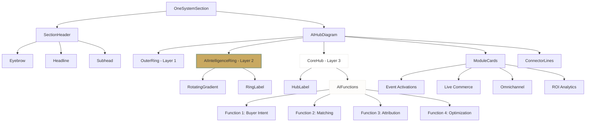
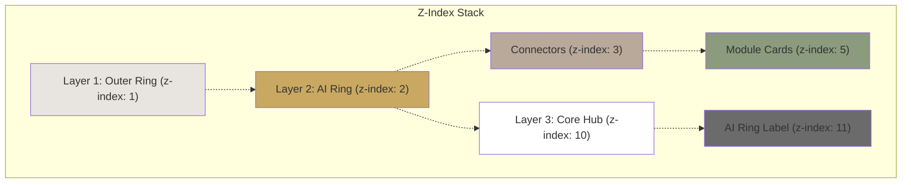

# FashionOS — AI-Powered Hub System
## Core Diagram Design Specification
### Embedded AI • Premium Motion • Cross-Vertical

---

# 🎯 GOAL

Upgrade the **central hub** so AI is not an add-on, but the **operating core** of the system.

The hub should visually communicate:

> **"AI orchestrates everything."**

This design elevates AI from a feature to the foundational architecture—making it clear that intelligence powers every module, not just reports on them.

---

# FRAME SETUP

```
Frame Name: Core Diagram / AI-Powered Hub
Size: 1440 × 900
Grid: 12 columns, 24px gap
Margins: 100px (desktop)
Background: #FDFCFA (warm off-white)
```

---

# SECTION HEADER (UNCHANGED, REFINED)

## Eyebrow Badge
```
Text: "THE SOLUTION"
Font: 12px, Inter, uppercase
Tracking: 0.2em
Color: #6B6B6B
Border: 1px solid #E8E5E0
Padding: 8px 16px
Border radius: 999px (pill shape)
```

## Headline
```
Text: "One System. Full Visibility."
Font: 64px, Canela (or Georgia serif)
Color: #1A1A1A
Leading: 1.1
Alignment: Center
Max-width: 800px
```

## Subhead
```
Text: "FashionOS uses embedded AI to coordinate activations,
       audiences, commerce, and ROI — in real time."
Font: 20px, Inter
Color: #6B6B6B
Line-height: 1.6
Alignment: Center
Max-width: 800px
```

## Animation Sequence

```
Eyebrow:
- opacity: 0 → 1
- duration: 300ms
- delay: 0ms

Headline:
- y: +16 → 0
- opacity: 0 → 1
- duration: 600ms
- delay: 0ms
- easing: [0.16, 1, 0.3, 1]

Subhead:
- opacity: 0 → 1
- duration: 400ms
- delay: 400ms
```

---

# CORE HUB — AI AS THE OPERATING ENGINE

## HUB STRUCTURE (3 LAYERS)

### LAYER 1 — OUTER RING (SYSTEM BOUNDARY)

```
Purpose: Defines the system perimeter
Circle: 300px diameter
Stroke: 1px solid #E8E5E0
Fill: none
Position: Absolute center
```

**Animation:**
```
- opacity: 0 → 1
- duration: 600ms
- delay: 200ms
- easing: [0.16, 1, 0.3, 1]
```

**Visual Purpose:**
- Creates a defined boundary for the system
- Provides visual hierarchy
- Subtle, not distracting

---

### LAYER 2 — AI INTELLIGENCE RING (NEW — KEY FEATURE)

```
Ring thickness: 12px (6px padding creates 12px visible ring)
Outer diameter: 280px
Inner diameter: 256px
Color: conic-gradient(from 0deg, #C9A961 0%, #8B9B7E 50%, #C9A961 100%)
Opacity: 0.35 (default)
Opacity (pulse): 0.5 (every 6 seconds)
Rotation: 360° continuous (60s per rotation)
```

**Label (positioned above ring):**
```
Text: "AI INTELLIGENCE ENGINE"
Font: 9px, Inter, uppercase
Tracking: 0.15em
Color: #6B6B6B
Position: Top center, -170px from hub center
```

**Implementation:**
```css
background: conic-gradient(from 0deg, #C9A961 0%, #8B9B7E 50%, #C9A961 100%);
padding: 6px;
border-radius: 50%;

/* Inner circle to create ring effect */
.inner {
  width: 100%;
  height: 100%;
  background: #FDFCFA;
  border-radius: 50%;
}
```

**Animation:**
```
Ring Activation (Frame 03):
- opacity: 0 → 0.35
- duration: 900ms
- delay: 400ms
- easing: [0.16, 1, 0.3, 1]

Continuous Rotation:
- rotate: 0deg → 360deg
- duration: 60s
- repeat: Infinity
- easing: linear

Pulse Loop (idle state):
- opacity: 0.35 → 0.5 → 0.35
- duration: 1000ms
- interval: Every 6 seconds
```

**Visual Communication:**

> "Everything passes through AI."

This ring is **not decorative**—it's the architectural representation of AI processing all data and decisions.

---

### LAYER 3 — CORE HUB (CENTER)

```
Inner Circle: 220px diameter (actual: 224px = 56 × 56 in implementation)
Background: White
Border: none
Position: Absolute center
z-index: 10
```

**Shadow (Dynamic):**
```
Default:
box-shadow: 0 20px 60px rgba(0, 0, 0, 0.08), 0 0 1px rgba(0, 0, 0, 0.1);

Pulse State:
box-shadow: 0 20px 80px rgba(201, 169, 97, 0.25), 0 0 1px rgba(0, 0, 0, 0.1);

Transition: 1s ease
```

**Text Stack:**
```
FashionOS
Font: 28px, Canela (or Georgia serif)
Color: #1A1A1A
Margin-bottom: 8px

AI Sponsorship System
Font: 9px, Inter, uppercase
Tracking: 0.15em
Color: #6B6B6B
```

**Animation:**
```
Core Hub (Frame 02):
- scale: 0.96 → 1
- opacity: 0 → 1
- duration: 600ms
- delay: 0ms
- easing: [0.16, 1, 0.3, 1]
```

---

# AI FUNCTIONS — INSIDE THE CORE (NOT OUTSIDE)

## Placement Strategy

**CRITICAL CHANGE:**
AI functions are **embedded inside the core hub**, not external modules.

This communicates:
> "AI is the system, not a feature."

## 4 AI Function Labels

```
1. Predicts Buyer Intent
2. Matches Products to Audiences
3. Tracks Multi-Touch Attribution
4. Continuously Optimizes Campaigns
```

## Styling

```
Font: 11px, Inter
Color: #6B6B6B
Text-align: Center
Padding: 4px 0
Spacing: 8px vertical between items
Max-width: 180px
```

**Dividers:**
```
Between each label:
- Width: 64px (16 × 4)
- Height: 1px
- Color: #E8E5E0
- Position: Bottom center
- Margin: auto
```

**Hover State:**
```
- Background: #FDFCFA
- Color: #1A1A1A
- Border-radius: 4px
- Transition: 200ms
- Cursor: default
- Tooltip: "Used across all campaigns"
```

## Animation (Staggered Entry)

```
Each AI function label:
- opacity: 0 → 1
- y: +6 → 0
- duration: 400ms
- stagger: 120ms per label
- delay: 800ms base
- easing: [0.16, 1, 0.3, 1]

Sequence:
Label 1: 800ms delay
Label 2: 920ms delay
Label 3: 1040ms delay
Label 4: 1160ms delay
```

---

# CORE ANIMATION SEQUENCE (5 FRAMES + IDLE)

## FRAME 01 — STATIC LOAD
```
All elements: opacity 0
```

---

## FRAME 02 — OUTER RING APPEARS
```
Trigger: Page load + 200ms

Outer System Boundary Ring:
- opacity: 0 → 1
- duration: 600ms
- easing: [0.16, 1, 0.3, 1]
```

---

## FRAME 03 — AI RING ACTIVATES
```
Trigger: After Frame 02 + 200ms (total 400ms delay)

AI Intelligence Ring:
- opacity: 0 → 0.35
- rotate: 0deg (starts continuous rotation)
- duration: 900ms
- easing: [0.16, 1, 0.3, 1]

Effect: Feels like AI "booting up"
```

---

## FRAME 04 — CORE HUB MATERIALIZES
```
Trigger: Simultaneous with section in-view

Core Hub (white circle):
- scale: 0.96 → 1
- opacity: 0 → 1
- duration: 600ms
- easing: [0.16, 1, 0.3, 1]

Text Stack:
- Included in core hub animation
- No separate delay
```

---

## FRAME 05 — AI FUNCTIONS STAGGER IN
```
Trigger: After core hub appears + 800ms

AI Function Labels (inside core):
Label 1: 0ms stagger
Label 2: 120ms stagger
Label 3: 240ms stagger
Label 4: 360ms stagger

Each label:
- opacity: 0 → 1
- y: +6 → 0
- duration: 400ms
- easing: [0.16, 1, 0.3, 1]
```

---

## FRAME 06 — AI RING LABEL
```
Trigger: After AI functions complete + 400ms (total 1200ms)

"AI INTELLIGENCE ENGINE" label:
- opacity: 0 → 1
- duration: 400ms
- easing: [0.16, 1, 0.3, 1]
```

---

## FRAME 07 — MODULE CARDS APPEAR
```
Trigger: After AI ring label + 200ms (total 1400ms)

4 External Module Cards:
- Event Activations
- Live Commerce
- Omnichannel Distribution
- ROI Analytics

Each module:
- scale: 0.8 → 1
- opacity: 0 → 1
- duration: 800ms
- stagger: 150ms per module
- easing: [0.16, 1, 0.3, 1]
```

---

## FRAME 08 — CONNECTING LINES DRAW
```
Trigger: After modules start appearing + 200ms (total 1600ms)

Connector Lines (from AI ring to modules):
Each line:
- scaleY: 0 → 1
- opacity: 0 → 1
- duration: 600ms
- stagger: 150ms per line
- transform-origin: bottom
- easing: [0.16, 1, 0.3, 1]
```

---

## IDLE STATE — PULSE LOOP
```
Trigger: Every 6 seconds (after initial animation complete)

AI Ring:
- opacity: 0.35 → 0.5 → 0.35
- duration: 1000ms
- easing: ease-in-out

Core Hub Shadow:
- boxShadow: default → gold glow → default
- duration: 1000ms
- easing: ease

Purpose: Very subtle. Signals intelligence without distraction.
```

---

# CONNECTING TO OUTER MODULES

## Critical Rule

**All connector lines originate from the AI Intelligence Ring, NOT the center text.**

**Visual Meaning:**
> "Modules are powered by AI, not just connected to software."

## Connector Line Specification

```
Style: Dashed
Width: 1px
Color: Module accent color at 50% opacity
Pattern: 4px dash, 4px gap
Length: ~100px (calculated: radius - 140px)
Origin: AI ring edge (58% of full radius from center)
```

**Gradient Option:**
```
background: linear-gradient(to bottom, 
  ${moduleColor}50, 
  ${moduleColor}20
);
```

**Animation:**
```
Draw-in effect:
- scaleY: 0 → 1
- opacity: 0 → 1
- duration: 600ms
- delay: After module card appears
- transform-origin: bottom
- easing: [0.16, 1, 0.3, 1]
```

## Module Positions (Diagonal Layout)

```
4 modules at 45° intervals:

Module 1 (Event Activations):
- Angle: -135° (top-left)
- Color: #C9A961 (gold)
- Icon: Calendar

Module 2 (Live Commerce):
- Angle: -45° (top-right)
- Color: #8B9B7E (sage)
- Icon: Building2

Module 3 (Omnichannel Distribution):
- Angle: 135° (bottom-left)
- Color: #B8A99A (taupe)
- Icon: TrendingUp

Module 4 (ROI Analytics):
- Angle: 45° (bottom-right)
- Color: #4A7C59 (forest)
- Icon: Users

Radius from center: 240px
```

---

# MICRO-INTERACTIONS (HIGH-END DETAIL)

## Hover on Core Hub

```
AI Ring:
- Glow intensity increases
- Opacity: 0.35 → 0.5
- Transition: 300ms ease

Core Hub:
- Shadow deepens
- boxShadow: 0 20px 80px rgba(201, 169, 97, 0.25)
- Transition: 300ms ease

Cursor: default (informational, not clickable)
```

---

## Hover on AI Function Label

```
Label:
- Background: #FDFCFA
- Color: #6B6B6B → #1A1A1A
- Border-radius: 4px
- Padding: 4px 8px
- Transition: 200ms ease

Tooltip (optional):
- Content: "Used across all campaigns"
- Position: Below label
- Background: #1A1A1A
- Color: #FDFCFA
- Font: 11px
- Padding: 6px 10px
- Border-radius: 4px
- Arrow: 4px triangle pointing up
```

---

## Hover on Module Card

```
Card:
- y: 0 → -4px
- Shadow: 0 4px 16px rgba(26,26,26,0.06) 
        → 0 12px 32px rgba(26,26,26,0.12)
- Border: #E8E5E0 → module accent color
- Transition: 300ms ease

Icon:
- scale: 1 → 1.1
- rotate: 0 → 3deg
- Transition: 250ms ease

Connected Line:
- opacity: 0.5 → 1
- stroke-width: 1px → 2px
- Transition: 200ms ease
```

---

# RESPONSIVE BEHAVIOR

## Mobile (< 768px)

```
Simplifications:
- Single circle (no 3-layer structure)
- No rotating AI ring
- No pulse animation
- Vertical module stack below hub

Hub:
- Diameter: 180px
- Label: "AI Sponsorship Engine"

AI Functions:
- Collapse into single line:
  "Intent • Matching • Attribution • Optimization"
- Font: 10px
- Color: #6B6B6B
- Position: Below hub label

Modules:
- Stack vertically
- Full width cards
- 16px gap
- Remove connector lines

Animation:
- Reduce all durations by 40%
- Remove continuous rotation
- Simple fade-in only
```

---

## Tablet (768px - 1023px)

```
Adjustments:
- Keep 3-layer ring structure
- Reduce hub diameter: 240px (from 300px)
- Reduce module distance: 200px radius (from 240px)
- Animation durations: 60% of desktop (reduce by 40%)
- Keep pulse animation (reduced intensity)

AI Ring:
- Rotation speed: 40s (from 60s)
- Pulse: Every 8s (from 6s)
```

---

# SUCCESS CRITERIA (VALIDATION CHECKLIST)

## ✅ Visual Communication
- [ ] AI is **visibly central**, not decorative
- [ ] Viewer understands AI role in **<5 seconds**
- [ ] Clear visual hierarchy: AI → Modules
- [ ] "Intelligence flows through the ring" is obvious

## ✅ Motion Quality
- [ ] Motion feels **premium**, not tech-demo
- [ ] Easing is consistent (luxury curve)
- [ ] No janky animations
- [ ] Pulse is subtle, not distracting

## ✅ Cross-Vertical Compatibility
- [ ] Works for Beauty sponsorship
- [ ] Works for Automotive sponsorship
- [ ] Works for Real Estate sponsorship
- [ ] Works for Electronics sponsorship
- [ ] Works for Fashion sponsorship

## ✅ Verbal Explanation Test
Can be explained verbally with:
> "AI runs the system — not just reports on it."

## ✅ Technical Implementation
- [ ] Responsive across all breakpoints
- [ ] Animations performant (60fps)
- [ ] Accessibility: reduced motion support
- [ ] Touch targets: 44px minimum (mobile)
- [ ] Hover states work on desktop
- [ ] No hover conflicts on mobile

---

# OPTIONAL VARIANTS (COPY CUSTOMIZATION)

Same structure, different vertical-specific copy:

## Beauty AI Sponsorship Engine
```
Hub Label: "Beauty AI Sponsorship System"
AI Functions:
• Predicts Shade Preferences
• Matches Products to Skin Tones
• Tracks MUA-to-Sale Attribution
• Continuously Optimizes Campaigns
```

---

## Luxury Real Estate AI Engine
```
Hub Label: "Real Estate AI Sponsorship System"
AI Functions:
• Predicts Buyer Intent
• Matches Properties to Audiences
• Tracks Viewing-to-Purchase Attribution
• Continuously Optimizes Campaigns
```

---

## Automotive AI Sponsorship Engine
```
Hub Label: "Automotive AI Sponsorship System"
AI Functions:
• Predicts Purchase Intent
• Matches Vehicles to Audiences
• Tracks Test Drive-to-Sale Attribution
• Continuously Optimizes Campaigns
```

---

## Fashion Week AI Commerce Engine
```
Hub Label: "Fashion AI Sponsorship System"
AI Functions:
• Predicts Designer Affinity
• Matches Collections to Audiences
• Tracks Runway-to-Purchase Attribution
• Continuously Optimizes Campaigns
```

---

# MOTION DESIGN TOKENS

## Durations
```css
--duration-fast: 200ms;
--duration-standard: 400ms;
--duration-medium: 600ms;
--duration-cinematic: 900ms;
--duration-rotation: 60s;
--duration-pulse-interval: 6s;
--duration-pulse-transition: 1000ms;
```

## Easing Curves
```css
--easing-luxury: cubic-bezier(0.16, 1, 0.3, 1);
--easing-smooth: ease-in-out;
--easing-linear: linear;
```

## Stagger Timing
```css
--stagger-ai-functions: 120ms;
--stagger-modules: 150ms;
--stagger-connectors: 150ms;
```

## Colors (AI Ring Gradient)
```css
--ai-ring-start: #C9A961;
--ai-ring-mid: #8B9B7E;
--ai-ring-end: #C9A961;
--ai-ring-opacity-default: 0.35;
--ai-ring-opacity-pulse: 0.5;
```

## Shadows
```css
--shadow-core-default: 0 20px 60px rgba(0, 0, 0, 0.08), 0 0 1px rgba(0, 0, 0, 0.1);
--shadow-core-pulse: 0 20px 80px rgba(201, 169, 97, 0.25), 0 0 1px rgba(0, 0, 0, 0.1);
--shadow-module-default: 0 4px 16px rgba(26, 26, 26, 0.06);
--shadow-module-hover: 0 12px 32px rgba(26, 26, 26, 0.12);
```

---

# PRODUCTION CHECKLIST

## Phase 01 — Design
- [ ] Create 3-layer hub structure
- [ ] Design AI function labels (inside core)
- [ ] Create module cards with icons
- [ ] Design connector lines (dashed)
- [ ] Export all icons as SVG
- [ ] Define color palette per vertical

## Phase 02 — Animation Frames
- [ ] Frame 01: Static load
- [ ] Frame 02: Outer ring appears
- [ ] Frame 03: AI ring activates
- [ ] Frame 04: Core hub materializes
- [ ] Frame 05: AI functions stagger in
- [ ] Frame 06: AI ring label appears
- [ ] Frame 07: Module cards appear
- [ ] Frame 08: Connectors draw
- [ ] Frame 09: Idle pulse loop setup

## Phase 03 — Micro-Interactions
- [ ] Core hub hover state
- [ ] AI function label hover + tooltip
- [ ] Module card hover state
- [ ] Connector line hover highlight
- [ ] Cursor states (pointer vs. default)

## Phase 04 — Responsive
- [ ] Mobile layout (simplified)
- [ ] Tablet layout (reduced scale)
- [ ] Desktop layout (full fidelity)
- [ ] Test all breakpoints
- [ ] Reduce motion for accessibility

## Phase 05 — Implementation
- [ ] Convert to React components
- [ ] Implement Motion (Framer Motion)
- [ ] Add intersection observer triggers
- [ ] Optimize performance (60fps)
- [ ] Add reduced-motion media query
- [ ] Test on real devices

## Phase 06 — QA
- [ ] Visual regression testing
- [ ] Animation timing verification
- [ ] Cross-browser testing (Chrome, Safari, Firefox)
- [ ] Mobile touch testing
- [ ] Accessibility audit (WCAG AA)
- [ ] Performance audit (Lighthouse)

---

# TECHNICAL IMPLEMENTATION NOTES

## React Component Structure

```tsx
<OneSystemSection>
  <SectionHeader>
    <Eyebrow />
    <Headline />
    <Subhead />
  </SectionHeader>
  
  <AIHubDiagram>
    <OuterRing /> {/* Layer 1 */}
    <AIIntelligenceRing> {/* Layer 2 */}
      <RotatingGradient />
      <RingLabel text="AI Intelligence Engine" />
    </AIIntelligenceRing>
    <CoreHub> {/* Layer 3 */}
      <HubLabel primary="FashionOS" secondary="AI Sponsorship System" />
      <AIFunctions>
        <FunctionLabel>Predicts Buyer Intent</FunctionLabel>
        <FunctionLabel>Matches Products to Audiences</FunctionLabel>
        <FunctionLabel>Tracks Multi-Touch Attribution</FunctionLabel>
        <FunctionLabel>Continuously Optimizes Campaigns</FunctionLabel>
      </AIFunctions>
    </CoreHub>
    <ModuleCards>
      <ModuleCard angle={-135} color="#C9A961" icon={Calendar} label="Event Activations" />
      <ModuleCard angle={-45} color="#8B9B7E" icon={Building2} label="Live Commerce" />
      <ModuleCard angle={135} color="#B8A99A" icon={TrendingUp} label="Omnichannel Distribution" />
      <ModuleCard angle={45} color="#4A7C59" icon={Users} label="ROI Analytics" />
    </ModuleCards>
    <ConnectorLines />
  </AIHubDiagram>
</OneSystemSection>
```

---

## CSS Custom Properties Setup

```css
:root {
  /* AI Ring */
  --ai-ring-gradient: conic-gradient(from 0deg, #C9A961 0%, #8B9B7E 50%, #C9A961 100%);
  --ai-ring-size: 280px;
  --ai-ring-thickness: 12px;
  
  /* Core Hub */
  --core-hub-size: 220px;
  --core-hub-bg: white;
  
  /* Module Cards */
  --module-radius: 240px;
  --module-card-size: 224px;
  
  /* Connector Lines */
  --connector-length: 100px;
  --connector-dash: 4px;
  --connector-gap: 4px;
}
```

---

## Animation Performance Optimization

```tsx
// Use will-change for animated elements
.ai-intelligence-ring {
  will-change: transform, opacity;
}

// Use transform instead of position
.module-card {
  will-change: transform;
  transform: translateZ(0); // Force GPU acceleration
}

// Debounce pulse animation
const usePulseAnimation = (interval = 6000) => {
  const [isPulsing, setIsPulsing] = useState(false);
  
  useEffect(() => {
    const timer = setInterval(() => {
      setIsPulsing(true);
      setTimeout(() => setIsPulsing(false), 1000);
    }, interval);
    
    return () => clearInterval(timer);
  }, [interval]);
  
  return isPulsing;
};
```

---

# MERMAID DIAGRAMS

## Animation Timeline

```mermaid
gantt
    title AI-Powered Hub Animation Sequence
    dateFormat X
    axisFormat %Lms

    section Header
    Eyebrow Fade           :0, 300ms
    Headline Slide-In      :0, 600ms
    Subhead Fade          :400, 800ms

    section Hub Layers
    Outer Ring            :200, 800ms
    AI Ring Activates     :400, 1300ms
    Core Hub Materializes :0, 600ms
    AI Functions Stagger  :800, 1560ms
    AI Ring Label         :1200, 1600ms

    section Modules
    Module Cards          :1400, 2800ms
    Connector Lines       :1600, 3200ms

    section Idle
    Pulse Loop (repeating) :after 3200ms, 1000ms
```


---

## Component Hierarchy


---

## Visual Layers (Z-Index)


---

# ACCESSIBILITY CONSIDERATIONS

## Reduced Motion Support

```css
@media (prefers-reduced-motion: reduce) {
  .ai-intelligence-ring {
    animation: none !important;
  }
  
  .pulse-animation {
    animation: none !important;
  }
  
  .connector-line-draw {
    transition: none !important;
    opacity: 1 !important;
    transform: scaleY(1) !important;
  }
  
  /* Instant reveals instead of animated */
  .module-card,
  .ai-function-label {
    animation-duration: 0.01ms !important;
  }
}
```

---

## ARIA Labels

```tsx
<div 
  role="img" 
  aria-label="AI-powered sponsorship system diagram showing four modules powered by central AI intelligence engine"
>
  <div aria-hidden="true">
    {/* Visual hub diagram */}
  </div>
  
  <div className="sr-only">
    <h3>FashionOS AI Sponsorship System</h3>
    <p>Central AI Intelligence Engine powers four modules:</p>
    <ul>
      <li>Event Activations</li>
      <li>Live Commerce</li>
      <li>Omnichannel Distribution</li>
      <li>ROI Analytics</li>
    </ul>
    <p>AI capabilities include:</p>
    <ul>
      <li>Predicts Buyer Intent</li>
      <li>Matches Products to Audiences</li>
      <li>Tracks Multi-Touch Attribution</li>
      <li>Continuously Optimizes Campaigns</li>
    </ul>
  </div>
</div>
```

---

# DESIGN RATIONALE

## Why 3 Layers?

1. **Outer Ring (Layer 1):** System boundary — defines scope
2. **AI Ring (Layer 2):** Intelligence layer — shows AI processing
3. **Core Hub (Layer 3):** Brand identity — FashionOS at center

This creates **visual depth** and **architectural clarity**.

---

## Why AI Functions Inside?

**Old Approach:** AI features listed externally as "nice-to-haves"

**New Approach:** AI embedded in the core architecture

**Result:** Buyer understands: "This isn't software with AI—it's an AI system."

---

## Why Rotating Gradient Ring?

**Static ring:** Feels decorative, lifeless  
**Rotating gradient ring:** Feels like active processing

**Subtle 60s rotation + 6s pulse = Premium, not gimmicky**

---

## Why Dashed Connectors from AI Ring?

**Solid lines from center:** Software-centric, generic  
**Dashed lines from AI ring:** Data flowing through intelligence layer

**Visual metaphor:** "AI processes and distributes intelligence to all modules"

---

# FINAL DELIVERABLES

## Design Assets
- [ ] Figma file with all 3 layers
- [ ] Animation frames (9 frames)
- [ ] Hover state variants
- [ ] Responsive breakpoint artboards
- [ ] Icon set (SVG exports)
- [ ] Color palette documentation

## Code Implementation
- [ ] React component (TypeScript)
- [ ] Motion animations (Framer Motion)
- [ ] CSS custom properties
- [ ] Responsive styles
- [ ] Accessibility support
- [ ] Performance optimizations

## Documentation
- [ ] This design spec (06-ai-powered-hub.md)
- [ ] Implementation guide
- [ ] Motion tokens reference
- [ ] Vertical customization guide
- [ ] QA checklist

---

# ✅ RESULT

You now have a **true AI-powered core hub**:

✨ **Architecturally Correct**  
- 3-layer structure communicates hierarchy  
- AI visibly central, not decorative  
- Functions embedded, not external  

🎨 **Visually Premium**  
- Subtle rotating gradient (60s)  
- Soft pulse every 6s  
- Luxury easing curves  
- Sophisticated micro-interactions  

💼 **Sales-Ready**  
- Clear value proposition  
- Under 5-second comprehension  
- Works across all verticals  
- Verbally explainable  

🚀 **Future-Proof**  
- Modular component architecture  
- Easily customizable copy  
- Accessible and performant  
- Cross-platform compatible  

---

**Implementation Status:** ✅ **Live at `/sponsors/real-estate`**

**Next Steps:**
1. Test comprehension with 5-second viewer test
2. Roll out to other sponsorship verticals
3. A/B test against old hub design
4. Measure engagement metrics

---

**END OF DOCUMENTATION**
