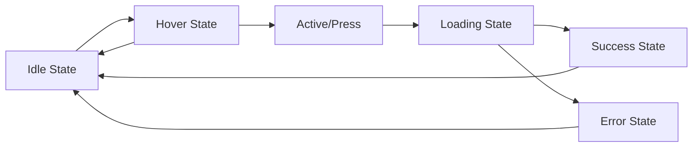
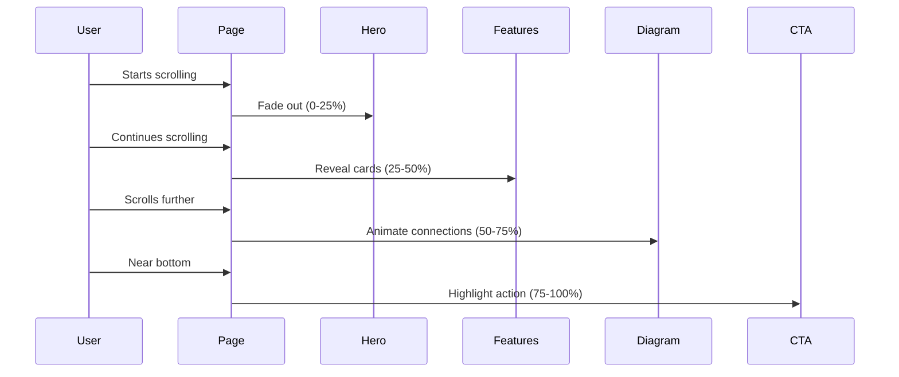
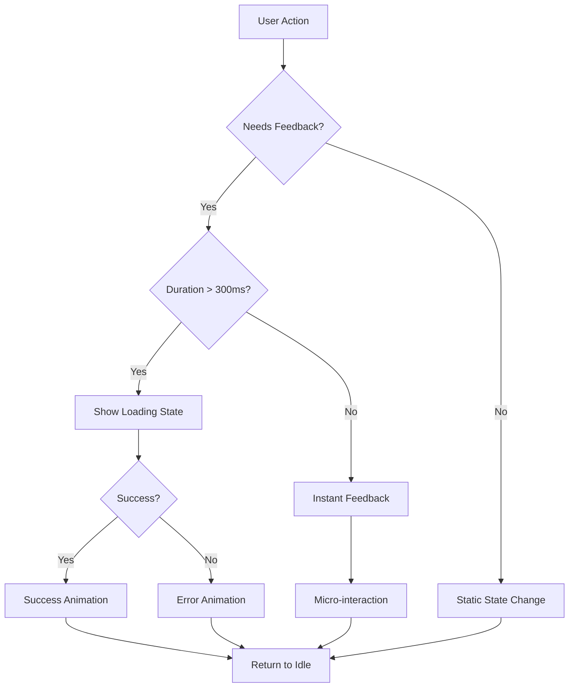
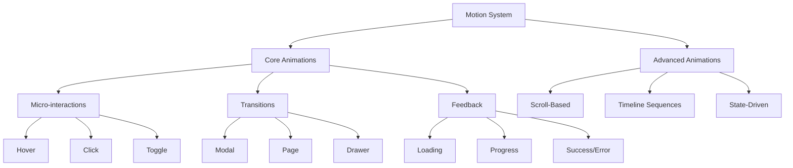

# 08 – Animation Planning & Success Guide

**Last Updated:** December 20, 2024  
**Version:** 1.0  
**Audience:** Product Designers, Design Teams, Product Managers, Developers

---

## 📌 Purpose of This Document

This guide explains **how to design, implement, and measure animations** in modern web applications. It helps teams:

- Choose the right animation for each interaction
- Understand when to use (and when to avoid) motion
- Design animations that feel premium, not gimmicky
- Create consistent, accessible motion systems
- Measure animation success with clear criteria

**Tone:** Calm, intelligent, practical  
**Goal:** Build motion that enhances experience, not distracts from it

---

## 🎬 Animation Categories: Core → Advanced

### A. Micro-interactions

**What it is:**  
Small, functional animations that respond to user input. They provide immediate feedback and make interfaces feel alive.

#### **Types:**

**1. Hover States**
- **What:** Visual change when cursor enters/exits an element
- **When to use:** Buttons, cards, links, interactive elements
- **When NOT to use:** On touch devices (no hover), critical CTAs that need instant recognition
- **Common mistakes:** Over-animating (scale too large), inconsistent timing across similar elements

**Example:**
```
Default → Hover (lift -4px, shadow increase, border color shift)
Duration: 200-300ms
Easing: ease-out
```

---

**2. Button Press Feedback**
- **What:** Visual response when user clicks/taps
- **When to use:** All interactive buttons, CTAs, form submissions
- **When NOT to use:** Static text, disabled states
- **Common mistakes:** No feedback = feels broken; too slow = feels laggy

**Example:**
```
Rest → Active (scale 0.98, brightness down 5%)
Duration: 100ms
Easing: ease-in
```

---

**3. Toggle / Switch Animations**
- **What:** Visual state change for binary controls
- **When to use:** Settings panels, feature toggles, filters
- **When NOT to use:** Single-use actions (use buttons instead)
- **Common mistakes:** No transition = feels jarring; too slow = feels unresponsive

**Example:**
```
OFF → ON: handle slides right, background shifts to accent color
Duration: 250ms
Easing: cubic-bezier(0.4, 0.0, 0.2, 1)
```

---

**4. Form Validation Feedback**
- **What:** Visual confirmation of input state (error, success, processing)
- **When to use:** Real-time validation, post-submit feedback
- **When NOT to use:** While user is actively typing (wait for blur)
- **Common mistakes:** Red shake on every keystroke = annoying; no feedback = confusing

**Example:**
```
Error: shake animation (3px left-right oscillation, 400ms)
Success: checkmark fade-in + green border
Processing: subtle pulse on input border
```

---

### B. Transitions

**What it is:**  
Animations that bridge two UI states, helping users understand spatial relationships and state changes.

#### **Types:**

**1. Page Transitions**
- **What:** Animation between route/page changes
- **When to use:** Multi-page apps, navigation between major sections
- **When NOT to use:** Fast, frequent navigation (e.g., tabs in same view)
- **Common mistakes:** Too slow (>600ms), direction doesn't match navigation logic

**Example:**
```
Page A → Page B: Fade out A (200ms) → Fade in B (300ms, delay 100ms)
Alternative: Slide left/right based on hierarchy
```

---

**2. Modal Open / Close**
- **What:** Overlay appears/disappears with backdrop
- **When to use:** Focused tasks, confirmations, detail views
- **When NOT to use:** Frequent actions (use inline expansion instead)
- **Common mistakes:** No backdrop fade = disorienting; too bouncy = unprofessional

**Example:**
```
Open: Backdrop fade 0→0.5 (200ms) + Modal scale 0.95→1 + fade (300ms)
Close: Reverse sequence, slightly faster (200ms total)
```

---

**3. Drawer / Sidebar Transitions**
- **What:** Panel slides in/out from edge of screen
- **When to use:** Navigation menus, filter panels, settings
- **When NOT to use:** Primary content (use page transitions)
- **Common mistakes:** Covers content without warning, no backdrop on mobile

**Example:**
```
Closed → Open: Slide from left (translateX -100% → 0%, 400ms)
Backdrop: Fade in simultaneously
```

---

**4. Tab Switching**
- **What:** Content swap with subtle motion to show change
- **When to use:** Organizing related content, settings sections
- **When NOT to use:** Unrelated content (use page transitions)
- **Common mistakes:** No animation = feels like flash; crossfade too slow

**Example:**
```
Tab A → Tab B: 
- Tab indicator slides to new position (250ms)
- Content crossfade (200ms) or slide horizontally (300ms)
```

---

### C. Motion for Feedback

**What it is:**  
Animations that communicate system status and guide user expectations during wait times.

#### **Types:**

**1. Loading States**
- **What:** Visual indicator that system is processing
- **When to use:** Any action taking >300ms
- **When NOT to use:** Instant operations (<100ms)
- **Common mistakes:** No loading state = feels broken; generic spinner = lazy design

**Example:**
```
Spinner: Continuous rotation (1s per cycle, linear easing)
Button loading: Disable + add inline spinner + "Processing..." text
```

---

**2. Progress Indicators**
- **What:** Visual representation of completion percentage
- **When to use:** Multi-step processes, file uploads, long operations
- **When NOT to use:** Unknown duration tasks (use infinite loader)
- **Common mistakes:** Progress bar going backwards, fake progress (jumps to 100%)

**Example:**
```
0% → 100%: Width animates smoothly, color shift on completion
Duration: Matches actual process time
```

---

**3. Skeleton Screens**
- **What:** Placeholder content that mimics layout while loading
- **When to use:** First page load, data fetching, image loading
- **When NOT to use:** Sub-second loads (causes flash)
- **Common mistakes:** Doesn't match final layout, no shimmer effect

**Example:**
```
Shimmer: Linear gradient moves left-to-right (1.5s loop)
Colors: #f0f0f0 → #e0e0e0 → #f0f0f0
```

---

**4. Success / Error Confirmations**
- **What:** Visual feedback that action completed or failed
- **When to use:** Form submissions, saves, deletions, critical actions
- **When NOT to use:** Non-critical auto-saves (use subtle indicator)
- **Common mistakes:** Auto-dismiss too fast, no icon/color coding

**Example:**
```
Success: Green checkmark scale-in (0.8→1, 300ms) + toast notification
Error: Red shake (300ms) + error message fade-in
Duration on screen: 3-5 seconds (user-dismissible)
```

---

### D. Scroll-Based Animations

**What it is:**  
Animations triggered by scroll position, creating dynamic, engaging experiences.

#### **Types:**

**1. Fade-in on Scroll**
- **What:** Content appears as user scrolls it into view
- **When to use:** Long-form content, landing pages, storytelling
- **When NOT to use:** Critical content above fold, navigation elements
- **Common mistakes:** Fade-in on every element = overwhelming; too slow = laggy feel

**Example:**
```
Trigger: Element enters viewport (margin: -100px)
Animation: opacity 0→1, translateY 20px→0
Duration: 600ms
Once: true (don't re-trigger)
```

---

**2. Staggered Card Reveals**
- **What:** Grid/list items appear sequentially with delay
- **When to use:** Product grids, feature lists, team photos
- **When NOT to use:** Large datasets (>20 items), search results
- **Common mistakes:** Stagger delay too long, applies to lazy-loaded content

**Example:**
```
Card 1: delay 0ms
Card 2: delay 100ms
Card 3: delay 200ms
...
Max delay: 800ms (cap for performance)
```

---

**3. Sticky Sections**
- **What:** Element stays fixed while scrolling through related content
- **When to use:** Navigation, section headers, comparison tables
- **When NOT to use:** On small screens (takes too much space)
- **Common mistakes:** Z-index conflicts, jumpy behavior on iOS

**Example:**
```
position: sticky
top: 0
Smooth transition when sticking/unsticking
Add shadow on scroll to show elevation
```

---

**4. Scroll-Driven Storytelling**
- **What:** Complex animations tied to scroll progress
- **When to use:** Marketing pages, case studies, immersive experiences
- **When NOT to use:** Utility apps, dashboards, transactional flows
- **Common mistakes:** Forces scrolling, breaks back button, inaccessible

**Example:**
```
Section 1 (0-25% scroll): Hero fades out
Section 2 (25-50% scroll): Diagram draws in
Section 3 (50-75% scroll): Stats count up
Section 4 (75-100% scroll): CTA slides in
```

---

### E. Advanced Motion

**What it is:**  
Sophisticated animations for premium, editorial experiences.

#### **Types:**

**1. Parallax**
- **What:** Background moves slower than foreground during scroll
- **When to use:** Hero sections, immersive landing pages
- **When NOT to use:** Content-heavy pages, mobile (causes jank)
- **Common mistakes:** Too aggressive (nausea-inducing), conflicts with scroll performance

**Example:**
```
Background layer: translateY = scrollY * 0.5
Foreground layer: translateY = scrollY * 1
Creates depth illusion
```

---

**2. Timeline-Based Sequences**
- **What:** Choreographed multi-element animations with precise timing
- **When to use:** Onboarding, product showcases, explainer sections
- **When NOT to use:** Frequently viewed pages (gets repetitive)
- **Common mistakes:** Can't be skipped, blocks interaction, too long

**Example:**
```
0.0s: Logo fades in
0.3s: Headline types in
0.8s: Subhead fades in
1.2s: CTA slides up
1.5s: Animation complete, UI interactive
```

---

**3. Animated Diagrams**
- **What:** SVG paths draw in, elements connect dynamically
- **When to use:** Explaining systems, architecture, processes
- **When NOT to use:** Simple illustrations (static is clearer)
- **Common mistakes:** Draws too slowly, no clear reading order

**Example:**
```
Hub appears → Connectors draw out → Spoke cards fade in
Each step: 400-600ms
Total sequence: 1.5-2.5s
```

---

**4. State-Driven UI Motion**
- **What:** Animations triggered by data/app state changes
- **When to use:** Live dashboards, notifications, real-time updates
- **When NOT to use:** Static content, archives
- **Common mistakes:** Over-animates frequent updates, causes seizure risk

**Example:**
```
New message: Badge pulse (1s)
Data refresh: Spinner on affected section only
Live update: Highlight row with yellow fade (2s)
```

---

## 🎯 Real-World UI Examples & Use Cases

### **E-Commerce Product Page**

**Micro-interactions:**
- Hover on product image → Zoom cursor, scale 1.05
- Click "Add to Cart" → Scale 0.98, then success checkmark
- Size selector → Border highlights, out-of-stock shakes

**Transitions:**
- Open size guide modal → Backdrop fade + modal slide up
- Switch product variant → Crossfade images (300ms)

**Feedback:**
- Adding to cart → Button shows spinner, then "Added!" with checkmark
- Out of stock → Shake animation + tooltip

---

### **SaaS Dashboard**

**Scroll Animations:**
- Stats cards fade in on scroll (staggered 100ms apart)
- Chart animates data on first view (draws lines over 1s)

**Micro-interactions:**
- Hover on chart data point → Tooltip appears
- Toggle dark mode → Smooth color transition (400ms)

**Feedback:**
- Saving settings → Progress bar at top
- API error → Toast notification slides in from top-right

---

### **Landing Page (Marketing)**

**Scroll Storytelling:**
- Hero: Parallax background, text fades out on scroll
- Features section: Cards reveal as user scrolls (staggered)
- Diagram section: SVG paths draw in sequentially
- CTA: Sticky on scroll past 70%

**Advanced Motion:**
- Logo animation on load (2s sequence)
- Testimonial carousel (auto-advance with smooth transitions)
- Video play on scroll into view (autoplay muted)

---

### **Mobile App Onboarding**

**Timeline Sequence:**
1. Welcome screen: Logo scale-in (0.9→1)
2. Step 1: Slide in from right
3. Step 2-4: Swipe gestures with smooth transitions
4. Completion: Confetti animation + CTA pulse

**Transitions:**
- Swipe between steps → Slide with momentum
- Skip button → Fade out all steps, jump to dashboard

---

## ✅ Success Criteria

### **Performance Metrics**

| Metric | Target | Why It Matters |
|--------|--------|----------------|
| Frame Rate | 60 FPS (16.6ms per frame) | Smooth, no jank |
| Animation Duration | 200-600ms (most cases) | Feels responsive |
| Time to Interactive | <100ms after animation | No blocking |
| CPU Usage | <30% during animation | Doesn't drain battery |

---

### **User Experience Metrics**

| Metric | Measurement | Success Threshold |
|--------|-------------|-------------------|
| Task Completion Rate | A/B test with/without animation | No decrease |
| User Complaints | Support tickets mentioning "slow" or "distracting" | <1% |
| Accessibility | Keyboard nav, reduced motion support | 100% compliant |
| Bounce Rate | Landing page with scroll animations | No increase |

---

### **Design Quality Checklist**

**Before Shipping:**
- [ ] All animations respect `prefers-reduced-motion` CSS media query
- [ ] No animation blocks user interaction (can be interrupted)
- [ ] Consistent easing across similar interactions
- [ ] Mobile performance tested (no jank on mid-range devices)
- [ ] Animations disabled during slow connections (optional)
- [ ] Loading states for all actions >300ms
- [ ] Hover states don't apply on touch devices
- [ ] Focus states visible for keyboard users

---

### **When Animation is Successful**

✅ **Users don't notice it** (feels natural)  
✅ **Provides clear feedback** (confirms actions)  
✅ **Guides attention** (shows relationships)  
✅ **Enhances brand** (feels premium)  
✅ **Performs well** (60 FPS, no jank)  
✅ **Accessible** (respects user preferences)

---

### **When Animation Has Failed**

❌ **Users comment on it** ("too slow", "distracting")  
❌ **Causes confusion** (unclear state changes)  
❌ **Blocks interaction** (can't skip, too long)  
❌ **Feels cheap** (bouncy, inconsistent)  
❌ **Causes jank** (drops frames, stutters)  
❌ **Excludes users** (no reduced motion support)

---

## 📊 Mermaid Diagrams

### A. UI State Flow



---

### B. Scroll-Driven Storytelling Sequence



---

### C. Animation Decision Logic



---

### D. Motion System Hierarchy



---

## 🎨 Best Practices Summary

### **Do's**

✅ **Start with purpose** – Every animation should have a reason (feedback, guidance, delight)  
✅ **Keep it fast** – Most animations should be 200-400ms  
✅ **Be consistent** – Same interaction = same animation across the app  
✅ **Respect user preferences** – Honor `prefers-reduced-motion`  
✅ **Test on real devices** – Especially mid-range mobile  
✅ **Use easing curves** – Natural motion feels better than linear  
✅ **Provide skip options** – Long sequences should be dismissible  
✅ **Measure performance** – Monitor FPS and CPU usage  

---

### **Don'ts**

❌ **Animate everything** – Static is often better  
❌ **Block interaction** – Users should always be in control  
❌ **Use complex easing** – Stick to ease-out, ease-in-out for most cases  
❌ **Ignore accessibility** – Motion can cause nausea/seizures  
❌ **Copy competitors blindly** – What works for Apple might not work for you  
❌ **Over-engineer** – CSS transitions often beat JavaScript  
❌ **Forget mobile** – Touch interactions are different from hover  
❌ **Animate critical content** – Instant is better for important info  

---

### **Core vs. Advanced Animation Guidance**

**Use Core Animations (A-C) when:**
- Building utility apps (dashboards, tools, SaaS)
- Performance is critical
- Team has limited animation experience
- Users need efficiency over delight

**Use Advanced Animations (D-E) when:**
- Building marketing sites, portfolios
- Brand experience is a differentiator
- You have animation/motion design expertise
- Users expect immersive, editorial experiences

---

### **How to Use This Document**

**For Designers:**
- Reference when choosing animation types
- Use success criteria to evaluate designs
- Share examples with developers for alignment

**For Product Managers:**
- Understand trade-offs (delight vs. performance)
- Prioritize animations that improve usability first
- Use metrics to justify animation investments

**For Developers:**
- Reference timing/easing specifications
- Use diagrams to understand state flows
- Validate against performance targets

---

## 📚 Further Reading

- **Motion Design Principles:** Google Material Motion, Apple Human Interface Guidelines
- **Web Performance:** web.dev/animations, CSS Triggers
- **Accessibility:** WCAG 2.1 Animation Guidelines, Vestibular Disorder considerations
- **Tools:** Framer Motion, GSAP, CSS Animations, Lottie

---

**End of Document**  
For questions or updates, contact the Design Systems team.
