# 10 – Natural Language Animation Prompts (Advanced)

**Last Updated:** December 20, 2024  
**Version:** 1.0  
**Audience:** Product Designers using Figma AI  
**Prerequisite:** Read `/docs/website/10-prompts-animations.md` first

---

## 📌 Purpose

This document contains **advanced animation patterns**, **accessibility guidelines**, and **complete prompt examples** for complex use cases.

---

## 🔥 Advanced Animation Patterns

### 1. Accordion / Collapse Animation

**Base Prompt:**
```
Create an accordion animation for [component name]. When expanded, the content should smoothly reveal by animating height from 0 to [height]px over [duration]ms. Content should also fade in (opacity 0→1) as it expands. When collapsed, reverse the animation. Include a chevron icon that rotates 90 degrees to indicate state.
```

**State Flow:**

```mermaid
stateDiagram-v2
    [*] --> Collapsed
    Collapsed --> Expanding: Click
    Expanding --> Expanded: 400ms complete
    Expanded --> Collapsing: Click
    Collapsing --> Collapsed: 300ms complete
    
    Collapsed: Height: 0<br/>Opacity: 0<br/>Chevron: 0°
    Expanded: Height: auto<br/>Opacity: 1<br/>Chevron: 90°
```



**Recommended Values:**
- Expand: 400ms ease-out
- Collapse: 300ms ease-in
- Chevron rotation: 200ms ease-out
- Max height: Use max-height if auto causes issues

---

### 2. Carousel / Slider Animation

**Base Prompt:**
```
Design a carousel animation for [component name]. Container width: [width]px. When advancing to next slide, current slide should slide out to the left (X: 0→-[width]px) while new slide slides in from right (X: [width]px→0). Duration: [duration]ms with ease-in-out timing. Include navigation dots that highlight active slide with scale animation.
```

**Slide Transition Flow:**

```mermaid
sequenceDiagram
    participant User
    participant Slide1
    participant Slide2
    participant Dots
    
    User->>Slide1: Click Next
    Slide1->>Slide1: Slide left (X: 0→-400px)
    Slide2->>Slide2: Slide in (X: 400px→0)
    Note over Slide1,Slide2: Simultaneous 500ms
    Dots->>Dots: Active dot shifts
    Slide2->>User: New slide visible
```



**Infinite Loop Pattern:**


**Recommended Values:**
- Slide duration: 500-600ms
- Easing: Ease-in-out
- Auto-advance: 3000-5000ms
- Pause on hover: true

**Complete Example:**
```
Create a carousel component:
- Container: 800×400px
- 5 slides total, show 1 at a time
- Slide transition: Current slides left while new slides from right, 500ms ease-in-out
- Navigation: Left/right arrows + dots
- Auto-advance: Every 4 seconds, pause on hover
- Dots: Active dot scales to 1.2 and changes to accent color (#3b82f6)
- Swipe support: Drag threshold 50px minimum
```

---

### 3. Parallax / Scroll Effects

**Base Prompt:**
```
Design a parallax scroll effect for [component name]. As user scrolls, this element should move at [speed]% of the scroll speed. For example, at 50% speed, when page scrolls 100px, element moves 50px. Combine with opacity fade based on scroll position for depth effect.
```

**Scroll-Based Calculation:**


**Layered Parallax:**


**Recommended Values:**
- Background: 30-50% speed
- Midground: 70-90% speed
- Foreground: 110-150% speed
- Test on mobile (can cause jank)

---

### 4. Morphing / Shape Transitions

**Base Prompt:**
```
Design a morphing animation for [component name]. Transform from [shape 1] to [shape 2] over [duration]ms. Use SVG path morphing for smooth transition. Ensure both shapes have same number of path points for clean morph.
```

**Icon Morph Example:**

```mermaid
stateDiagram-v2
    [*] --> Menu
    Menu --> Close: Click
    Close --> Menu: Click
    
    Menu: Three horizontal lines<br/>(hamburger icon)
    Close: X shape<br/>(close icon)
    
    note right of Menu: Top line rotates 45°<br/>Middle fades out<br/>Bottom rotates -45°<br/>Duration: 300ms
```

**Shape Sequence:**

```mermaid
flowchart LR
    A[Circle<br/>radius: 50px] -->|300ms| B[Square<br/>50×50px]
    B -->|300ms| C[Triangle<br/>base: 70px]
    C -->|300ms| D[Star<br/>5 points]
    D -->|300ms| A
```



**Recommended Values:**
- Duration: 400-600ms
- Easing: Ease-in-out
- Use SVG for best quality
- Match path point counts

---

### 5. Number Counting Animation

**Base Prompt:**
```
Design a number counting animation for [component name]. Animate from [start value] to [end value] over [duration]ms. Use ease-out timing so counting starts fast and slows near target. Format numbers with commas for thousands. Trigger when element scrolls into view.
```

**Counting Pattern:**


**Count Function:**


**Complete Example:**
```
Create a statistics counter for dashboard:
- Three numbers: "1,234 Users", "89%" Satisfaction, "$45.2K Revenue"
- Trigger when section is 60% visible
- Count duration: 2000ms with ease-out
- Users: Count from 0 to 1234, add commas
- Percentage: Count from 0 to 89, add "%" suffix
- Revenue: Count from 0 to 45.2, add "$" prefix and "K" suffix, show 1 decimal
- Stagger: Start each counter 200ms after previous
```

---

### 6. Typewriter Effect

**Base Prompt:**
```
Create a typewriter animation for [component name]. Text should appear character by character with [delay]ms between each character. Include a blinking cursor ("|" character) at the typing position that continues blinking after text completes. Blink cycle: 500ms on, 500ms off.
```

**Character Reveal Timeline:**


**With Cursor Animation:**


**Recommended Values:**
- Character delay: 30-80ms
- Cursor blink: 500ms cycle
- Use for: Hero text, code examples
- Max length: ~100 characters

---

## ♿ Accessibility Patterns

### 1. Reduced Motion Support

**Decision Flow:**


**Base Prompt:**
```
Create [animation] with reduced motion support. If user has prefers-reduced-motion enabled, replace [complex animation] with simple [fallback]. Full animation: [details]. Reduced animation: [simplified details].
```

**Example:**
```
Button hover animation with accessibility:
- Full motion: Scale to 1.05, lift 4px, shadow increase, 200ms
- Reduced motion: Only change background color, 100ms (no scale, no movement)
- Detection: Use @media (prefers-reduced-motion: reduce) in CSS
```

---

### 2. Keyboard Focus Animations

**Focus State Flow:**


**Base Prompt:**
```
Design keyboard focus animation for [component]. When user tabs to element, show clear focus indicator with smooth transition. Focus ring should fade in (opacity 0→1) and element should lift slightly (2px) over 150ms. Focus ring color: #3b82f6, 2px width, 2px offset.
```

---

## 🎯 Complete Prompt Examples

### E-Commerce Product Card

```
Create an interactive product card component:

STRUCTURE:
- Card: 280×400px, white background, 8px corner radius
- Product image: 280×220px (top)
- Title: 16px, bold, 16px top padding
- Price: 20px, accent color (#3b82f6), 8px top padding
- "Add to Cart" button: 120×40px, centered, 16px bottom margin

ANIMATIONS:

1. Card entrance (on scroll):
   - Trigger: 40% visible in viewport
   - Fade in from opacity 0 to 1
   - Slide up from Y: +30px to Y: 0
   - Duration: 500ms, ease-out
   - Stagger: If in grid, delay 120ms per card

2. Card hover:
   - Lift up 8px (translateY: -8px)
   - Shadow: blur 8px to 24px, opacity 0.1 to 0.15
   - Scale: 1.0 to 1.02
   - Duration: 250ms, ease-out

3. Image hover (nested):
   - Image scales to 1.05 within frame (overflow hidden)
   - Duration: 400ms, ease-out

4. Button states:
   - Default: Background #3b82f6, white text
   - Hover: Background #2563eb (darker), lift 2px
   - Click: Scale to 0.95 (100ms), then to 1.0 (150ms)
   - Loading: Show spinner, text "Adding...", disabled state
   - Success: Checkmark icon, text "Added!", green background, hold 2s, return to default

5. Wishlist heart icon (top-right corner):
   - Default: Outline heart, gray
   - Click: Scale to 1.3 with bounce, fill red, "pop" animation
   - Duration: 400ms with overshoot to 1.4, settle to 1.0

ACCESSIBILITY:
- Keyboard focus: Blue outline, 2px, offset 2px
- Reduced motion: Only fade, no scaling or movement
- ARIA labels: "Add [product name] to cart"
```

---

### Dashboard Analytics Card

```
Create an animated analytics card for dashboard:

STRUCTURE:
- Card: 400×240px, white background, 12px corner radius, shadow
- Header: "Monthly Revenue", 18px bold
- Large number: "$45,234", 32px, counts up on first view
- Trend indicator: "+12.5%", green, with up arrow
- Sparkline chart: 300×60px, line graph with 12 data points

ANIMATIONS:

1. Card entrance:
   - Fade in opacity 0→1, slide up Y: +20→0
   - Duration: 400ms, ease-out
   - Trigger: On page load, stagger 150ms if multiple cards

2. Number counting:
   - Trigger: When card fully visible
   - Count from 0 to 45234 over 2000ms
   - Ease-out timing (fast start, slow end)
   - Format with comma: "45,234"
   - Add "$" prefix

3. Trend indicator animation:
   - Fade in after number counting completes
   - Scale from 0.8 to 1.0
   - Duration: 300ms, ease-out

4. Sparkline draw:
   - Draw line from left to right
   - Start after trend indicator
   - Duration: 1000ms, ease-out
   - Line color: #3b82f6, 2px width
   - Fill gradient below line (blue fade)

5. Hover state (entire card):
   - Lift 4px, shadow blur 8px→16px
   - Duration: 200ms, ease-out

6. Data refresh animation:
   - When data updates, pulse the number
   - Scale 1.0→1.1→1.0
   - Color flash: default→accent→default
   - Duration: 500ms
   - Update sparkline with slide-in from right

ACCESSIBILITY:
- Screen reader announces: "Monthly revenue, forty-five thousand two hundred thirty-four dollars, up twelve point five percent"
- Reduced motion: Show final values instantly, no counting
- Keyboard focus: Entire card focusable for accessibility
```

---

### Notification Toast System

```
Design a notification toast system:

STRUCTURE:
- Toast container: 360×auto height, max-width 400px
- Position: Fixed top-right, 24px from top and right
- Multiple toasts stack vertically with 12px gap
- Toast types: Success (green), Error (red), Info (blue), Warning (orange)
- Layout: Icon (left) + Message (center) + Close button (right)

ANIMATIONS:

1. Toast entrance:
   - Start position: Y: -100px, opacity: 0, scale: 0.9
   - Slide down to Y: 0
   - Fade in opacity: 0→1
   - Scale: 0.9→1.0
   - Duration: 400ms, ease-out
   - If multiple toasts, existing ones slide down to make room (200ms)

2. Icon animation (per type):
   - Success: Checkmark draws in (path animation), green (#10b981)
   - Error: X draws in, shakes slightly, red (#ef4444)
   - Info: "i" fades in, blue (#3b82f6)
   - Warning: "!" pulses once, orange (#f59e0b)
   - Icon timing: 300ms after toast enters

3. Auto-dismiss sequence:
   - Hold visible for 5000ms (success/info) or 7000ms (error/warning)
   - Progress bar fills from 0→100% width during hold time
   - Progress bar color matches toast type
   - On complete: Slide up Y: 0→-100px, fade out, scale to 0.95
   - Exit duration: 300ms, ease-in

4. Manual dismiss (close button):
   - Hover: Scale 1.1, rotate 90°, color darkens
   - Click: Immediate exit animation (same as auto-dismiss)

5. Stack behavior:
   - Max 3 toasts visible simultaneously
   - New toast pushes oldest off top if at limit
   - All toasts slide down when one is removed
   - Smooth height animation: 300ms, ease-in-out

6. Hover pause:
   - On toast hover, pause auto-dismiss timer
   - Progress bar pauses
   - On hover leave, resume timer

ACCESSIBILITY:
- ARIA live region: role="alert" for errors, role="status" for success
- Keyboard: Focus close button, Enter/Space to dismiss
- Reduced motion: Fade only, no sliding or scaling
- Screen reader: Announce message immediately
```

---

### Multi-Step Form Wizard

```
Create a multi-step form wizard with animations:

STRUCTURE:
- Container: 600×500px, centered
- Progress indicator: 4 steps at top (Step 1→2→3→4)
- Content area: Form fields for current step
- Navigation: Back button (left), Next/Submit button (right)

ANIMATIONS:

1. Progress indicator:
   - Completed steps: Checkmark icon, blue fill
   - Current step: Pulsing blue ring, 2px width
   - Future steps: Gray outline, inactive
   - Progress line connects steps:
     * Unfilled: Gray background
     * Filled: Blue, fills left-to-right as steps complete
     * Duration: 400ms per segment, ease-out

2. Step transition (forward):
   - Current step content: Slide left (X: 0→-600px), fade out
   - New step content: Slide in from right (X: 600px→0), fade in
   - Both happen simultaneously
   - Duration: 400ms, ease-in-out
   - Completed step icon: Checkmark draws in after transition

3. Step transition (backward):
   - Reverse of forward: Slide right instead of left
   - Completed step icon: Checkmark draws out, returns to ring

4. Form field entrance (when step loads):
   - Fields fade in with stagger
   - Delay: 100ms between each field
   - Slide up Y: +15→0
   - Duration: 300ms per field, ease-out

5. Field validation:
   - Error: Border red, shake (-6px, +6px, -3px, 0), 400ms
   - Success: Border green, checkmark icon scales in
   - Real-time: Validate on blur, 200ms color transition

6. Navigation buttons:
   - Next/Submit hover: Lift 2px, shadow increase, scale 1.02
   - Click: Scale 0.95→1.0
   - Disabled state: Opacity 0.5, cursor not-allowed, no animations

7. Final submission:
   - Submit button: Transform to spinner, 300ms
   - Spinner rotates 360° per second
   - On success: Entire form fades out, success message fades in
   - Success icon: Large checkmark (80×80px) scales from 0→1.2→1.0
   - Celebration: Confetti particles (optional, can disable)

ACCESSIBILITY:
- Announce current step: "Step 2 of 4: Contact Information"
- Keyboard: Tab through fields, Enter to advance, Escape to cancel
- Error announcements: Screen reader speaks validation errors
- Reduced motion: Crossfade steps, no sliding
```

---

## 📐 Mermaid Diagram: Complete Animation System

**Overall Animation Architecture:**


---

**End of Advanced Prompts Document**

These patterns should cover 95% of animation needs in modern web applications. Remember to always test animations on real devices and respect user preferences for reduced motion.
