```mermaid
flowchart LR
    A[Hidden<br/>opacity: 0] -->|Trigger| B[Animating<br/>opacity: 0→1]
    B -->|Duration: 400ms<br/>Easing: ease-out| C[Visible<br/>opacity: 1]
```

# 10 – Natural Language Animation Prompts for Figma AI

**Last Updated:** December 20, 2024  
**Version:** 1.0  
**Audience:** Product Designers using Figma AI

---

## 📌 Overview

This document contains **natural language prompts** for creating animations in Figma using AI assistance. These prompts are:

- ✅ **Universal** - Work for any use case or design system
- ✅ **Clear** - Easy for Figma AI to understand and execute
- ✅ **Best Practice** - Follow animation design principles
- ✅ **Reusable** - Adaptable to different contexts

---

## 🎯 How to Use These Prompts

1. **Copy the base prompt** for the animation type you need
2. **Customize** with your specific context (component name, colors, timing)
3. **Add details** about your design system (spacing, typography, brand colors)
4. **Iterate** based on Figma AI's output
5. **Reference the Mermaid diagrams** to understand animation flow

---

## 📊 Core Animation Types with Mermaid Diagrams

### 1. Fade In / Fade Out

**Base Prompt:**
```
Create a fade-in animation for [component name]. The element should start completely transparent (opacity 0) and smoothly fade to fully visible (opacity 1) over [duration] milliseconds. Use an ease-out timing function for a natural feel. The animation should trigger when [trigger condition].
```

**Animation Flow:**



**Variations:**
- **Fade in from below:** "Start 20px below final position, fade in while sliding up"
- **Fade in from above:** "Start 20px above final position, fade in while sliding down"
- **Staggered fade:** "Fade in multiple children with 100ms delay between each"

**Recommended Values:**
- Duration: 300-600ms
- Easing: Ease-out
- Opacity: 0 → 1

---

### 2. Slide In / Slide Out

**Base Prompt:**
```
Design a slide-in animation for [component name]. The element should start [direction] of its final position and smoothly slide into place over [duration] milliseconds. Use an ease-out timing function. Combine with opacity fade (0 to 1) for a polished effect.
```

**Animation Flow:**


**Directional Options:**
- **From left:** "Start X: -40px, slide to X: 0"
- **From right:** "Start X: +40px, slide to X: 0"
- **From bottom:** "Start Y: +40px, slide to Y: 0"
- **From top:** "Start Y: -40px, slide to Y: 0"

**Recommended Values:**
- Duration: 400-600ms
- Offset: 20-40px
- Easing: Ease-out or Ease-in-out

---

### 3. Scale / Zoom

**Base Prompt:**
```
Create a scale animation for [component name]. The element should start at [scale value] of its original size and smoothly grow to full size (scale 1.0) over [duration] milliseconds. Use an ease-out timing function.
```

**Animation Flow:**



```mermaid
flowchart LR
    A[Small<br/>scale: 0.8<br/>opacity: 0] -->|Trigger| B[Growing<br/>scale: 0.8→1.0<br/>opacity: 0→1]
    B -->|400ms<br/>ease-out| C[Full Size<br/>scale: 1.0<br/>opacity: 1]
```

**With Bounce:**


**Variations:**
- **Pop in:** "Scale from 0.8 → 1.05 → 1.0 (slight overshoot)"
- **Gentle grow:** "Scale from 0.95 → 1.0"
- **Zoom out:** "Scale from 1.2 → 1.0"

**Recommended Values:**
- Duration: 300-500ms
- Start scale: 0.8-0.95
- Easing: Ease-out (or spring for bounce)

---

### 4. Hover Effects

**Base Prompt:**
```
Create a hover animation for [component name]. When the user hovers, the element should [effect] smoothly over [duration] milliseconds. When the cursor leaves, it should return to its original state with the same smooth transition.
```

**State Diagram:**

```mermaid
stateDiagram-v2
    [*] --> Default
    Default --> Hover: Mouse Enter
    Hover --> Default: Mouse Leave
    
    Default: scale: 1.0<br/>shadow: small<br/>Y: 0px
    Hover: scale: 1.02<br/>shadow: large<br/>Y: -4px
```

**Common Hover Effects:**
- **Lift:** "Move up 4px and increase shadow blur from 8px to 16px"
- **Scale:** "Grow to 105% of original size"
- **Brighten:** "Increase brightness by 10%"
- **Border highlight:** "Change border color from gray to accent color"

**Recommended Values:**
- Duration: 150-250ms
- Easing: Ease-out
- Scale: 1.02-1.05 max
- Lift: 2-4px

---

### 5. Click / Tap Interactions

**Base Prompt:**
```
Design a click animation for [component name]. When clicked, the element should [effect] for [duration] milliseconds, then return to normal. This provides immediate visual feedback.
```

**Interaction Flow:**


**Press-Release Pattern:**


**Recommended Values:**
- Press duration: 100ms (fast)
- Release duration: 150-200ms
- Scale down: 0.95-0.98
- Easing: Ease-in (press), Ease-out (release)

---

### 6. Loading States

**Base Prompt:**
```
Create a loading animation for [component name]. Design a [type] that indicates content is loading. The animation should loop continuously until content is ready, then smoothly transition to the loaded state.
```

**Spinner Loop:**

```mermaid
flowchart LR
    A[0°] -->|250ms| B[90°]
    B -->|250ms| C[180°]
    C -->|250ms| D[270°]
    D -->|250ms| A
    
    style A fill:#4A7C59
    style B fill:#4A7C59
    style C fill:#4A7C59
    style D fill:#4A7C59
```



**State Transition:**


**Types:**
- **Spinner:** "Rotating circle (360° per second)"
- **Skeleton:** "Pulsing gray shapes with shimmer overlay"
- **Progress bar:** "Fill from 0% to 100%"
- **Dots:** "Three dots pulsing sequentially"

**Recommended Values:**
- Spinner: 1000ms per rotation
- Pulse: 1500ms in/out cycle
- Shimmer: 1500ms sweep

---

### 7. Modal / Dialog Animations

**Base Prompt:**
```
Design a modal opening animation for [component name]. The modal should fade in (opacity 0 to 1) while scaling from 90% to 100% size. A backdrop should fade in behind it. Duration: [duration] milliseconds with ease-out timing. Reverse animation for closing.
```

**Open Sequence:**

```mermaid
sequenceDiagram
    participant Page
    participant Backdrop
    participant Modal
    
    Page->>Backdrop: Fade in (opacity 0→0.5)
    Note over Backdrop: 200ms
    Page->>Modal: Fade + Scale in
    Note over Modal: opacity 0→1<br/>scale 0.9→1.0<br/>300ms
    Modal->>Page: Animation Complete
```



**State Flow:**


**Recommended Values:**
- Backdrop fade: 200-300ms
- Modal animation: 300-400ms
- Start scale: 0.9
- Easing: Ease-out

---

### 8. Tab Switching

**Base Prompt:**
```
Create a tab switching animation for [component name]. When a user clicks a different tab, the current content should fade out while new content fades in. The active indicator should slide to the new tab smoothly over [duration] milliseconds.
```

**Tab Interaction Flow:**


**Indicator Animation:**

```mermaid
flowchart LR
    A[Tab 1 Active<br/>Indicator X: 0px] -->|Click Tab 2| B[Sliding<br/>X: 0→120px]
    B -->|250ms<br/>ease-out| C[Tab 2 Active<br/>Indicator X: 120px]
```



**Recommended Values:**
- Content crossfade: 200-300ms
- Indicator slide: 250-300ms
- Easing: Ease-out

---

### 9. Staggered Animations

**Base Prompt:**
```
Create a staggered animation for [component name]. Animate multiple child elements sequentially, with each element starting [delay] milliseconds after the previous one. Each element should [animation type].
```

**Stagger Pattern:**


**Cascade Flow:**


**Recommended Values:**
- Delay per item: 100-150ms
- Animation duration: 300-400ms
- Max items: 8-10
- Easing: Ease-out

---

### 10. Progress Indicators

**Base Prompt:**
```
Design a progress indicator for [component name]. Show progress from 0% to [target percentage] over [duration] milliseconds. The progress bar should fill smoothly from left to right, and the percentage number should count up simultaneously. Use ease-out timing.
```

**Progress Flow:**


**State Machine:**


**Recommended Values:**
- Fill duration: 400ms per step
- Number count: Matches fill duration
- Completion hold: 1500ms
- Easing: Ease-out

---

## 🎨 Advanced Animation Patterns

### 11. Multi-Step Sequences

**Timeline-Based Animation:**


**Base Prompt:**
```
Create a multi-step animation sequence for [component name]. Step 1: [description] over [duration]ms. Step 2: [description] over [duration]ms. Step 3: [description] over [duration]ms. Each step should transition smoothly to the next with [delay]ms between steps.
```

**State Progression:**


---

### 12. Scroll-Triggered Animations

**Scroll Detection Flow:**


**Base Prompt:**
```
Design a scroll-triggered animation for [component name]. When the user scrolls and this element becomes 50% visible in the viewport, trigger [animation type]. The animation should play once and not repeat on subsequent scrolls.
```

**Intersection Observer Pattern:**

```mermaid
sequenceDiagram
    participant Scroll
    participant Observer
    participant Element
    
    Scroll->>Observer: Scroll event
    Observer->>Observer: Check visibility
    Observer->>Element: 50% visible?
    Element->>Element: Trigger animation (once)
    Element->>Observer: Mark as animated
    Note over Observer: Don't re-trigger
```

---

### 13. State-Driven Animations

**Toggle State Machine:**

```mermaid
stateDiagram-v2
    [*] --> OFF
    OFF --> Animating_ON: Click
    Animating_ON --> ON: 250ms complete
    ON --> Animating_OFF: Click
    Animating_OFF --> OFF: 250ms complete
    
    OFF: Handle left<br/>Background gray
    ON: Handle right<br/>Background green
```

**Base Prompt:**
```
Create a state transition animation for [component name]. When the state changes from [state 1] to [state 2], smoothly animate all visual changes over [duration]ms. Changes include: [list properties]. All changes should happen simultaneously for a cohesive transition.
```

**Notification Badge States:**

```mermaid
flowchart TD
    A[Empty<br/>No badge] -->|New message| B[Appearing<br/>scale 0→1.2→1.0]
    B --> C[New<br/>Red badge + pulse]
    C -->|More messages| D[Counting<br/>Number increases]
    D --> C
    C -->|User reads| E[Viewed<br/>Color gray]
    E -->|Clear| F[Disappearing<br/>scale 1→0]
    F --> A
```

---

## 📋 Best Practices Summary

### Timing Guidelines

| Animation Type | Duration | Easing | Use Case |
|----------------|----------|--------|----------|
| Hover | 150-250ms | Ease-out | Interactive elements |
| Click | 100-200ms | Ease-in/out | Buttons, cards |
| Fade in | 300-600ms | Ease-out | Content reveals |
| Slide in | 400-600ms | Ease-out | Modals, panels |
| Scale | 300-500ms | Ease-out | Entrances, hover |
| Tab switch | 300-400ms | Ease-in-out | Navigation |
| Loading | 1000-2000ms | Linear | Spinners |
| Progress | 1000-3000ms | Ease-out | Progress bars |

---

### Easing Functions

```mermaid
graph LR
    A[Animation Start] --> B{Choose Easing}
    B -->|Natural deceleration| C[Ease-out]
    B -->|Smooth both ways| D[Ease-in-out]
    B -->|Constant speed| E[Linear]
    B -->|Playful bounce| F[Spring/Custom]
    
    C --> G[Most UI animations]
    D --> H[Bidirectional transitions]
    E --> I[Spinners, continuous]
    F --> J[Friendly interfaces]
```

---

### Decision Tree: Choosing Animation Type

```mermaid
flowchart TD
    A[Need Animation?] -->|User interaction| B[Hover or Click?]
    A -->|Content reveal| C[Fade or Slide?]
    A -->|State change| D[Instant or Animated?]
    A -->|Loading| E[Known or Unknown duration?]
    
    B -->|Hover| F[Lift + Shadow<br/>150-250ms]
    B -->|Click| G[Scale down/up<br/>100-200ms]
    
    C -->|Important| H[Slide in<br/>400-600ms]
    C -->|Subtle| I[Fade in<br/>300-400ms]
    
    D -->|Fast change| J[Animate<br/>200-300ms]
    D -->|Critical| K[Instant<br/>0ms]
    
    E -->|Known| L[Progress bar<br/>Actual duration]
    E -->|Unknown| M[Spinner<br/>Loop 1000-2000ms]
```

---

## 🛠️ Context-Specific Prompts

### Button Animation

```
Create a primary action button with:
1. Hover: Scale to 1.02, lift 2px, shadow blur 8px→16px, 200ms ease-out
2. Press: Scale to 0.95, 100ms ease-in
3. Release: Bounce to 1.02 then settle to 1.0, 200ms ease-out
4. Loading: Show spinner, disable interaction, 300ms transition
5. Success: Checkmark scale-in with bounce, 400ms, then return to default after 2s
```

### Card Grid Reveal

```
Design a 3×3 card grid (9 cards total) that reveals on scroll:
1. Trigger when grid is 30% visible in viewport
2. Cards fade in and slide up 20px
3. Stagger: 120ms delay between each card
4. Each card animation: 400ms ease-out
5. Total sequence: ~1400ms
6. Play once, don't repeat on scroll up
```

### Form Validation

```
Create form input with three states:
1. Default: Border 1px gray, no icon
2. Error: Border 2px red, shake animation (-8px, +8px, -4px, +4px, 0) over 400ms, red X icon fades in, error text appears below
3. Success: Border 2px green, checkmark icon scales in from 0.8→1.1→1.0 over 300ms
Transitions: 200ms ease-out between states
```

### Navigation Menu

```
Design a navigation menu with 5 items:
1. Items fade in on page load with 80ms stagger (total 400ms)
2. Active item has underline indicator
3. On click, indicator slides to new active item over 300ms ease-out
4. Hover: Text color shifts and scale to 1.05 over 200ms
5. Mobile: Menu slides in from left over 400ms when hamburger clicked
```

---

## 💡 Tips for Figma AI Success

1. **Be Specific with Numbers**
   - ❌ "Fade in quickly"
   - ✅ "Fade in over 300ms with ease-out timing"

2. **Describe Triggers Clearly**
   - ❌ "When it appears"
   - ✅ "When element is 50% visible in viewport"

3. **Specify All States**
   - ❌ "Make it hover"
   - ✅ "On hover: scale to 1.05. On hover end: return to 1.0. Both 200ms."

4. **Layer Multiple Effects**
   - ❌ "Slide in"
   - ✅ "Slide in from left (X: -40px→0) while fading in (opacity 0→1)"

5. **Include Context**
   - ❌ "Animate the button"
   - ✅ "Primary CTA button, 120×44px, #3b82f6 background, should lift on hover"

---

**End of Document**

For advanced patterns, accessibility considerations, and additional examples, see `/docs/website/10-prompts-animations-advanced.md`
