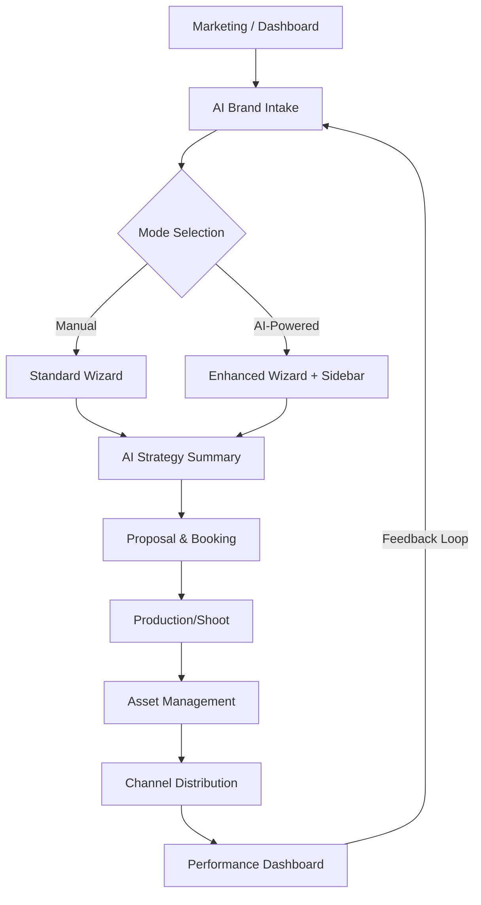

# FashionOS AI-Powered Shoot & Campaign System
**Status:** Master Design Plan  
**Role:** Senior Product Designer & UX Architect  
**Engine:** Gemini 3 (Pro + Flash)  
**Design System:** Luxury Utility

---

## 1. Product Vision: The Decision Engine
FashionOS moves beyond being a simple design tool to becoming a strategic **Decision Engine** for fashion brands. 
*   **Old Way:** Help me design/edit/post.
*   **FashionOS Way:** "What content should we create *right now* to increase sales or impact?"

### Core Value Proposition
1.  **Ingest:** actionable production plans from URLs + Social.
2.  **Reason:** Gemini 3 recommends *what* to shoot and *why*.
3.  **Close the Loop:** Shoot → Content → Channels → Performance → Revenue.

---

## 2. Information Architecture

---

## 3. Gemini 3 Integration Strategy

| Component | Model | Function |
| :--- | :--- | :--- |
| **Deep Reasoning** | **Gemini 3 Pro** | Strategy synthesis, final plan generation, complex ROI analysis. |
| **UI Suggestions** | **Gemini 3 Flash** | Inline suggestions per wizard step, fast recommendations, non-blocking UI updates. |
| **Context** | **URL Context Tool** | Analyze brand aesthetic, products, and color palette from live sites. |
| **Grounding** | **Google Search** | Competitor trends, seasonal benchmarks, market best practices. |

---

## 4. Screen Specifications

### Screen Set 1: Mode Selection
**Goal:** Establish trust and offer the "Co-pilot" path.
*   **UI:** Split card layout.
*   **Option A: Manual Setup** - "I know exactly what I want."
*   **Option B: AI-Powered Setup (Recommended)** - "Analyze my brand and suggest a winning plan."
    *   *Value:* We analyze brand & channels, suggest optimal plans, you approve every step.
*   **CTA:** "Continue with AI" (Primary), "Set up manually" (Secondary).

### Screen Set 2: AI Brand Intake
**Goal:** Gather intelligence context.
*   **Inputs:**
    *   Website URL
    *   Instagram Handle
    *   Amazon/Shopify Links
    *   Optional: Focus Keywords / Competitor References
*   **State:** "Analyzing brand, products, channels..." (Transparency is key).
*   **Tools:** Triggers URL Context + Search Grounding.

### Screen Set 3: Shoot Wizard (Enhanced)
**Goal:** Granular configuration with intelligent guidance.
*   **Layout:** Existing Wizard steps + **Collapsible Right Sidebar**.
*   **Steps:**
    1.  **Shoot Type:** (Photo/Video) -> AI suggests based on channel gaps.
    2.  **Category:** (Fashion/Beauty) -> AI detects from URL.
    3.  **Style:** (Editorial/Street) -> AI matches brand aesthetic.
    4.  **Scenes:** -> AI optimizes for budget vs. variety.
    5.  **Talent:** -> AI benchmarks against high-performing competitors.
    6.  **Upgrades:** -> AI calculates ROI on styling/retouching.
    7.  **Channels:** -> AI ensures format coverage (9:16 vs 4:5).
*   **Sidebar Card:**
    *   **Recommendation:** "Add Video Clips"
    *   **Reason:** "Your Instagram engagement is 40% lower on static posts vs. reels."
    *   **Confidence:** High/Medium.
    *   **Action:** Apply / Ignore.

### Screen Set 4: AI Strategy Summary (The "Brain")
**Goal:** The synthesis moment. Decision time.
*   **Layout:** Dual-Column.
*   **Left (User Plan):** Editable receipt of choices.
*   **Right (AI Insights Panel):**
    *   **Shot Mix:** "Recommended: 70% E-comm / 30% Editorial."
    *   **Outputs:** "Est. 45 assets across 3 channels."
    *   **Optimization:** "Amazon requires white background compliance."
    *   **Risk Alerts:** "Missing sound design for video assets."
    *   **ROI Rationale:** "Projected +20% conversion lift based on similar campaigns."

### Screen Set 5: Proposal & Booking
**Goal:** Transactional closure.
*   **Content:** Final Shot List, Usage Rights, Timeline, Price.
*   **Actions:** Confirm, Pay, Schedule.

### Screen Set 6: Campaign Dashboard
**Goal:** Closed-loop marketing.
*   **Sections:**
    *   **Assets:** The produced photos/videos.
    *   **Channels:** Connection to IG, TikTok, Shopify.
    *   **Performance:** Views, CTR, Sales attribution.
    *   **Next Steps:** AI Insight - "What to create next."

### Screen Set 7: Events & Shows Extension
**Goal:** Physical world orchestration.
*   **Features:** Runway run-of-show, Sponsor placement CRM, Ticketing.
*   **AI Assist:** "Generate content capture plan for Backstage."

---

## 5. User Journeys

### Journey 1: The AI-First User (Speed & Strategy)
1.  **Entry:** "I need a Summer Campaign."
2.  **Intake:** Pastes URL + Instagram.
3.  **AI Plan:** Gemini generates a full draft in <10s.
4.  **Review:** User tweaks 2 scenes.
5.  **Action:** Books proposal. **Total Time: < 3 mins.**

### Journey 2: The Manual User (Control)
1.  **Entry:** Selects Manual Mode.
2.  **Wizard:** Steps through choices.
3.  **Assist:** Clicks "AI Suggest" on *Talent* step only.
4.  **Action:** Books proposal.

### Journey 3: The Continuous Cycle (Power User)
1.  **Dashboard:** Sees "Engagement dropping on TikTok."
2.  **Insight:** AI suggests "Short-form BTS video shoot."
3.  **Action:** One-click launch into Wizard pre-filled with Video/BTS settings.

---

## 6. Interaction & Motion Guidelines
*   **Style:** Editorial, Calm, Minimal, High-Contrast Typography.
*   **AI Motion:** Suggestions **slide in softly** from the right.
*   **Confidence:** Indicators animate subtly (fill up).
*   **Transitions:** No aggressive modals. Smooth cross-fades.
*   **Mobile:** Large touch targets, Sticky bottom CTAs.

---

## 7. Implementation Checklist
- [ ] Create `WizardContext` for AI state.
- [ ] Implement `ModeSelection` screen.
- [ ] Build `IntakeForm` with URL analysis mock.
- [ ] Refactor `ShootWizard` to support Sidebar props.
- [ ] Design `StrategySummary` component.
- [ ] connect `CampaignDashboard` to completed projects.
