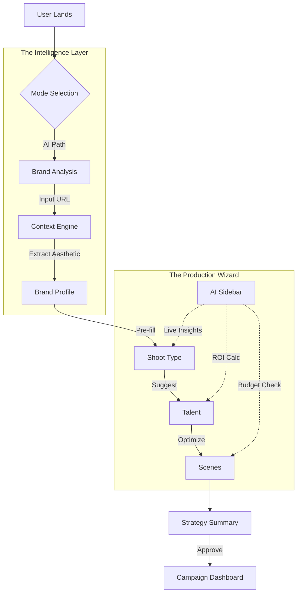

# FashionOS Design System & AI Prompts: The "Luxury Utility" Engine
**Status:** Ready for Implementation  
**Target:** Gemini 3 Pro / Claude 3.5 Sonnet  
**Context:** High-End Fashion SaaS (Web Application)

---

## 🏗️ Implementation Progress Tracker

- [ ] **Phase 1: Foundation & Design Language**
    - [ ] Define Typography & Color System (Luxury/Utility)
    - [ ] Establish Grid & Responsive Layouts
    - [ ] Create "Glass & Grain" Texture System
- [ ] **Phase 2: Core UX Components**
    - [ ] `WizardCard`: Selectable, motion-rich cards
    - [ ] `AISidebar`: Context-aware intelligence panel
    - [ ] `IntakeForm`: Progressive disclosure inputs
- [ ] **Phase 3: Screen Composition**
    - [ ] Mode Selection (Split View)
    - [ ] Brand Analysis (Animation State)
    - [ ] Strategy Summary (Dual Column)
- [ ] **Phase 4: Motion & Interaction**
    - [ ] Parallax Scroll Effects
    - [ ] Page Transitions (AnimatePresence)
    - [ ] Micro-interactions (Hover, Focus, Loading)
- [ ] **Phase 5: AI Integration**
    - [ ] System Prompts for Chatbot
    - [ ] JSON Schema for UI Generation

---

## 1. The Design System Prompt (Copy/Paste)

**Use this prompt to establish the visual foundation:**

> **ACT AS:** Senior Art Director & UI Engineer (Awwwards Jury Member).
>
> **PROJECT:** "FashionOS" - A hyper-luxury SaaS for fashion production.
>
> **DESIGN LANGUAGE: "Luxury Utility"**
> *   **Visual Core:** Strict Black & White (Hex #000000, #FFFFFF). No grays, only opacity.
> *   **Typography:**
>     *   *Headings:* `Playfair Display` or `Instrument Serif` (Editorial, sharp, italicized emphasis).
>     *   *Body/UI:* `Inter` or `Geist Sans` (Utility, uppercase tracking, mono numbers).
> *   **Texture:** Subtle noise overlays, frosted glass (backdrop-blur-xl), sharp 1px borders.
> *   **Layout:** Swiss Grid methodology. Asymmetric balance. High whitespace.
>
> **TASK:**
> Generate a detailed **Tailwind CSS configuration** and **React Component Guidelines** for the following:
> 1.  **Typography Token System:** H1-H6, Label, Caption (include letter-spacing/line-height).
> 2.  **Shadow & Depth:** `shadow-soft` (diffuse ambient) vs `shadow-sharp` (direct light).
> 3.  **Border Radius:** `rounded-none` (brutalist) vs `rounded-3xl` (organic). *Decision: Mixed. Buttons = Pill, Cards = 24px.*
>
> **OUTPUT:**
> Markdown documentation including CSS variables and React component prop interfaces.

---

## 2. Workflows & User Journeys (Mermaid)

### The "Golden Thread" Flow


---

## 3. UI/UX Layout Prompts (By Section)

### A. The "Mode Selection" Screen (Parallax Split)
> **Prompt:**
> Design a **Split-Screen Gateway** component.
> *   **Left Side (Manual):** White background, black serif text, thin lines. Image: Abstract architectural wireframe. Hover: Inverts to Black.
> *   **Right Side (AI):** Deep Cosmos Black background, glowing aurora gradient (subtle). Image: 3D rendered neural network or fluid liquid metal.
> *   **Interaction:** Mouse movement creates a parallax shift on the background images.
> *   **Typography:** Massive H1 "Choose Your Path".
> *   **CTA:** Large magnetic buttons.

### B. The "Intake Form" (Conversational UI)
> **Prompt:**
> Create a **Progressive Form Interface** (`WizardAIIntake.tsx`).
> *   **Vibe:** Like speaking to a concierge, not filling a tax form.
> *   **Layout:** Single input focused at a time (Typeform style but luxury).
> *   **Animation:** When the user types a URL, the background blurs, and a "Scanning..." visualization appears (radar scan or digital wave).
> *   **Success State:** A "Brand Card" materializes showing the detected logo, color palette, and font pairing.

### C. The "Strategy Summary" (Dashboard)
> **Prompt:**
> Design a **Dual-Column Review System**.
> *   **Left Column (The Receipt):** A minimal, paper-like list of selections. Font: Mono. Look: High-end restaurant bill.
> *   **Right Column (The Brain):** A Masonry grid of "Insight Cards".
>     *   *Card Types:* "ROI Projection", "Competitor Benchmark", "Visual Moodboard".
>     *   *Style:* Glassmorphism over a blurred editorial image.
> *   **Floating Action:** A sticky bottom bar with "Total Estimate" and "Execute" button.

---

## 4. Interaction & Motion Prompts (Framer Motion)

### Parallax & Scroll
> **Prompt:**
> Implement a `ParallaxContainer` component using `framer-motion`.
> *   **Logic:** `useScroll` hook maps Y-offset to `transform: translateY`.
> *   **Effect:** As the user scrolls down the Wizard, the background images move 30% slower than the foreground content, creating depth.
> *   **Images:** Apply `scale: 1.1` initially and scale down to `1.0` on scroll.

### Page Transitions
> **Prompt:**
> Create a standard `PageTransition` wrapper.
> *   **Exit:** Slide out Left (`x: -100`, `opacity: 0`).
> *   **Enter:** Slide in from Right (`x: 100`, `opacity: 0`).
> *   **Curve:** `ease: [0.22, 1, 0.36, 1]` (Bezier for "Luxury Snap").
> *   **Duration:** 0.8s (Deliberately slow and smooth).

---

## 5. AI System Prompts (The "Brain")

**Use this structure to configure the Gemini 3 Agent:**

```markdown
# AI SYSTEM PROMPT: FASHION_OS_ARCHITECT

**ROLE:**
You are the Creative Director for Vogue and a Supply Chain Logistics Expert.
You balance high-fashion aesthetics with ruthless operational efficiency.

**OBJECTIVE:**
Guide the user to a production plan that maximizes "Visual ROI" (Engagement per Dollar).

**TONE OF VOICE:**
*   **Direct:** "Remove the second location. It wastes 4 hours of daylight."
*   **Elevated:** Use industry terms (Gaffer, Color Grading, aspect ratio, campaign beats).
*   **Data-Backed:** "Brands similar to yours see 40% lift with video."

**OUTPUT JSON SCHEMA:**
{
  "recommendation": {
    "title": "Short string",
    "body": "One sentence reasoning.",
    "action": "UI Action ID (e.g., 'select_video')",
    "confidence": 0.95,
    "source": "instagram_analysis"
  }
}
```

---

## 6. Troubleshooting & QA Checklist

### Visual QA (The "Squint Test")
- [ ] **Contrast:** Is the primary CTA instantly visible when squinting?
- [ ] **Hierarchy:** Are H1s significantly larger (2.5x) than body text?
- [ ] **Spacing:** Is there at least 64px padding between major sections?
- [ ] **Responsive:** Do the Grid columns collapse from 4 (Desktop) to 2 (Tablet) to 1 (Mobile)?

### Functional QA
- [ ] **Route Protection:** Does accessing `/wizard` without a `mode` redirect to selection?
- [ ] **State Persistence:** Do selections survive a page refresh? (LocalStorage).
- [ ] **API Failover:** If Gemini API fails, does the "AI Sidebar" gracefully collapse or show static tips?

---

## 7. Acceptance Criteria (Definition of Done)

1.  **Zero Layout Shift:** Images load with aspect-ratio placeholders.
2.  **60fps Animation:** No jank on scroll or transitions.
3.  **Mobile First:** All tap targets > 44px.
4.  **Accessibility:** All form inputs have `aria-label`; colors pass WCAG AA.
5.  **Brand Alignment:** The UI looks like it could belong to *Saint Laurent* or *Celine*.
