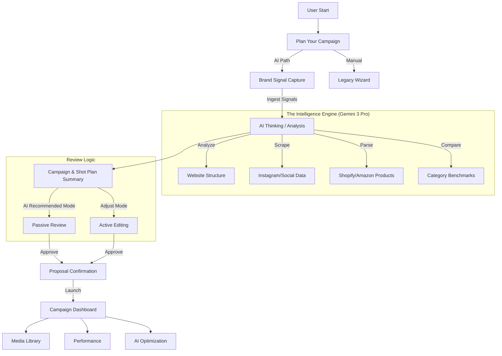

# FashionOS Brand Shoot AI Flow: Prompts & Implementation Plan (Refined)
**Status:** Ready for Design Generation  
**Target:** Gemini 3 Pro / Claude 3.5 Sonnet  
**Context:** Premium AI-Native SaaS for Fashion Production  

---

## 🏗️ Implementation Progress Tracker

- [ ] **Phase 1: Design Language & Core Flow**
    - [ ] Define "Calm Luxury" Typography & Color System
    - [ ] Create Global Component Library (Cards, Badges, Buttons)
    - [ ] Map User Journey (Mermaid Diagram)
- [ ] **Phase 2: Screen Generation (AI Prompts)**
    - [ ] Screen 1: Plan Your Campaign (Route Selection)
    - [ ] Screen 2: **Brand Signal Capture** (Formerly Brand Intake)
    - [ ] Screen 3: AI Thinking (Analysis State)
    - [ ] Screen 4: **Core** Campaign & Shot Plan Summary (With Adjust Mode)
    - [ ] Screen 5: Proposal Confirmation
- [ ] **Phase 3: Dashboard Ecosystem**
    - [ ] Screen 6: Campaign Overview
    - [ ] Screen 7: Media Library (DAM)
    - [ ] Screen 8: Performance Analytics
    - [ ] Screen 9: AI Optimization Center
- [ ] **Phase 4: Responsive & Interaction**
    - [ ] Mobile-Specific Card Behaviors
    - [ ] Tablet/Desktop Grid Adaptations
    - [ ] Micro-interactions & Transitions

---

## 🎨 Global Design Philosophy

**Visual Style:** "Calm Luxury"
*   **Aesthetic:** Editorial clarity, outcome-driven, soft shadows, rounded cards, generous spacing.
*   **Palette:** Calm neutral palette (Off-whites, Charcoals, Deep Blacks), used for hierarchy.
*   **Typography:**
    *   *Headings:* Elegant Display Serif (e.g., Playfair Display, Instrument Serif).
    *   *Body:* Clean Sans-Serif (e.g., Inter, Geist) for utility and data.
*   **Interaction Model:** AI suggests → User approves/adjusts. No auto-commit. No dead ends.

**Responsive Rules:**
*   **Mobile:** Stacked layout, single column.
*   **Tablet:** 2-column grid.
*   **Desktop:** 3-column max, high whitespace.

---

## 🗺️ System Architecture (Mermaid)

### The "AI-Only" User Journey

---

## 🖥️ Screen-by-Screen Design Prompts

### 1️⃣ Screen — Plan Your Campaign
**Route:** `/start`
**Figma Frame:** `Start_Campaign_Selection`

> **FIGMA PROMPT — Plan Your Campaign**
> **ROLE:** Senior Product Designer
> **PURPOSE:** Route users into an AI-powered creative flow vs manual setup.
> **LAYOUT:** Center-aligned, vertically balanced.
>
> **UI COMPONENTS:**
> 1.  **Primary Card (Hero):**
>     *   **Title:** "AI Creative Partner"
>     *   **Badge:** "Recommended" (Pill shape, subtle glow).
>     *   **Description:** "We analyze your brand, products, and channels to generate a sales-focused content plan."
>     *   **CTA:** Large Button "Continue with AI →" (Black, full width on mobile).
> 2.  **Secondary Action:**
>     *   **Text Link:** "Use manual setup" (Subtle, gray, underlined on hover).
>
> **RESPONSIVE:**
> *   *Mobile:* Cards stacked vertically. Full-width buttons.
> *   *Desktop:* Centered floating card with generous whitespace.

### 2️⃣ Screen — Brand Signal Capture
*(Refinement: Renamed from "Brand Intake" to emphasize data ingestion over form filling)*

**Route:** `/brand-signal-capture`
**Figma Frame:** `Brand_Signal_Capture`

> **FIGMA PROMPT — Create Brand Profile**
> **ROLE:** Senior UX Architect & Data Pipeline Designer
> **PURPOSE:** Collect digital signals for the AI to process. Not a "form", but a "connector".
> **STYLE:** Minimal, technical but elegant.
>
> **UI COMPONENTS:**
> 1.  **Header:** "Connect Brand Signals" (Serif H1).
> 2.  **Signal Sources (Stacked Input Group):**
>     *   **Website:** "Enter URL to scan site structure..." (Globe icon).
>     *   **Social:** "@instagram_handle for visual analysis..." (Instagram icon).
>     *   **Commerce:** "Shopify/Amazon link for product parsing..." (Tag icon).
> 3.  **Primary CTA:** "Start Signal Analysis" (Sticky bottom on mobile).
> 4.  **Micro-copy:** "We extract color palettes, font pairings, and product details automatically."

### 3️⃣ Screen — AI Thinking / Analysis State
**Route:** `/ai-thinking`
**Figma Frame:** `AI_Analysis_Loader`

> **FIGMA PROMPT — Analyzing Brand DNA**
> **ROLE:** Senior Product Designer
> **PURPOSE:** Build trust during AI reasoning without anxiety.
> **STYLE:** Calm, ethereal motion.
>
> **UI COMPONENTS:**
> 1.  **Central Visualization:** Abstract "Thinking" orb or wave (Gemini/Google colors or Monochrome).
> 2.  **Status Text (Rotating):**
>     *   "Analyzing website structure..."
>     *   "Extracting product imagery..."
>     *   "Studying Instagram performance..."
>     *   "Comparing category benchmarks..."
>     *   "Building campaign logic..."
> 3.  **Badge:** "Powered by Gemini 3 Pro" (Trust indicator).
> 4.  **Transition:** Smooth fade out when complete.

### 4️⃣ 🚨 CORE SCREEN — Campaign & Shot Plan Summary
*(Refinement: Added "Adjust Mode" and "Directional ROI")*

**Route:** `/campaign-summary`
**Figma Frame:** `Campaign_Summary_Dashboard`

> **FIGMA PROMPT — Your Campaign Plan**
> **ROLE:** Senior Product Designer + AI UX Architect
> **PURPOSE:** The "Brain" of FashionOS. Presents the AI's strategy for approval.
> **LAYOUT:** Scrollable vertical sections. Masonry grid for assets.
>
> **HEADER ACTION:**
> *   **Mode Switcher:** A segmented control at the top right.
>     *   `[ AI Recommended ✓ ]` (Default, Read-only view, Clean).
>     *   `[ Adjust Mode ✎ ]` (Active state, Reveals edit controls on cards).
>
> **SECTIONS:**
> 1.  **Section A: Strategy Card**
>     *   Campaign Type, Primary Goal (Conversion), Channels (auto-selected).
>     *   **Badge:** "AI Generated Strategy".
> 2.  **Section B: Extracted Brand Assets**
>     *   Grid of images from URL/Insta.
>     *   **Meta:** Source, Suggested Usage, Channel Fit overlay.
> 3.  **Section C: Shot List (The "Meat")**
>     *   *Photography Cards:* Packshots, Lifestyle, Detail. Include: Quantity, Channel, Rationale ("Why this shot?").
>     *   *Video Cards:* Product Demos, TikToks, Amazon Loops. Include: Format, Purpose (Ads/Organic).
> 4.  **Section D: Scenes & Services**
>     *   Styling direction, Props, Studio vs Location.
> 5.  **Section E: Channel Output Matrix**
>     *   Simple table: Channel (Row) x Content Type (Col) = Quantity.
> 6.  **Section F: ROI & Prioritization (Directional)**
>     *   *Refinement:* Do NOT show specific percentages (e.g., "+18%").
>     *   **Indicators:** Use "High Impact", "Medium Impact", "Brand Awareness Builder".
>     *   **Visuals:** Simple bar indicators or color-coded tags (Green/Yellow).
>     *   **Copy:** "Strong PDP performance based on competitor analysis."
>
> **ACTIONS:**
> *   **Primary CTA:** "Approve & Generate Proposal" (Floating or Sticky Bottom).
> *   **Secondary:** "Download PDF", "Switch to Adjust Mode".

### 5️⃣ Screen — Proposal Confirmation
**Route:** `/proposal`
**Figma Frame:** `Proposal_Ready`

> **FIGMA PROMPT — Proposal Ready**
> **PURPOSE:** Confirm execution readiness.
> **CONTENT:**
> *   Approved campaign summary (Visual recap).
> *   Services included list.
> *   Timeline snapshot.
> *   Estimated Investment (Price).
> **CTA:** "Confirm & Launch Campaign".

### 6️⃣ — 9️⃣ Dashboard Ecosystem (Post-Launch)
**Route:** `/dashboard/*`

> **FIGMA PROMPT — Campaign Dashboard Ecosystem**
> **SCREENS:**
> 1.  **Campaign Overview:** Active campaign status, timeline, shot list progress. AI Panel for "Next Best Action".
> 2.  **Media Library (DAM):** Grid of produced assets. Filters for Channel/Usage. AI suggestions for reuse.
> 3.  **Performance:** Charts for **Directional ROI** (High/Med/Low). AI recommendations for scaling.
> 4.  **AI Optimization Center:** Cards for "New Video Ideas", "Channel Gaps", "Ad Optimization".

---

## 📱 Mobile-Only Card Behaviors & Responsive Rules

**Mobile Strategy:**
1.  **Stacking:** All horizontal grids convert to vertical stacks with 16px spacing.
2.  **Touch Targets:** All clickable elements minimum 44px height.
3.  **Sticky CTAs:** Primary actions fixed to bottom of viewport with backdrop blur.
4.  **Horizontal Scroll:** Use for "Asset Grids" or "Channel Matrix" to save vertical space.

**Figma Auto-Layout Specs:**
*   **Containers:** `Padding: 24px` (Desktop), `16px` (Mobile).
*   **Gap:** `32px` (Section), `16px` (Card internals).
*   **Corner Radius:** `24px` (Cards), `100px` (Buttons).
*   **Shadow:** `0px 4px 24px rgba(0,0,0,0.04)` (Soft luxury lift).

---

## ✅ Success Criteria & Production Checklist

### Acceptance Tests (The "Definition of Done")
- [ ] **Zero Config Start:** User can reach the "Analysis" state with just ONE signal (URL).
- [ ] **Visual Hierarchy:** Strategy (Why) comes before Tactics (What).
- [ ] **Adjust Mode:** Users cannot edit cards unless "Adjust Mode" is toggled on.
- [ ] **Trust Signals:** ROI is shown as High/Med/Low, not fake percentages.
- [ ] **Responsiveness:** Dashboard tables convert to card views on mobile.
- [ ] **Performance:** Analysis state animation plays smoothly (60fps) while data fetches.

### Production Ready Checklist
- [ ] **Routes:** All routes (`/start`, `/brand-signal-capture`, `/campaign-summary`) configured in `App.tsx`.
- [ ] **State Management:** "Wizard State" persists via LocalStorage or URL params (shareable links).
- [ ] **Error Handling:** "Retry Analysis" option if scraping fails.
- [ ] **Empty States:** "No assets found" fallback UI for brand extraction.
- [ ] **Legal:** "Generated by AI - Check before publishing" disclaimer on all creative outputs.
