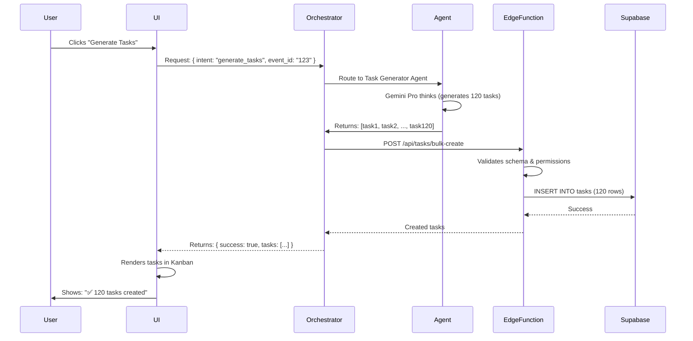
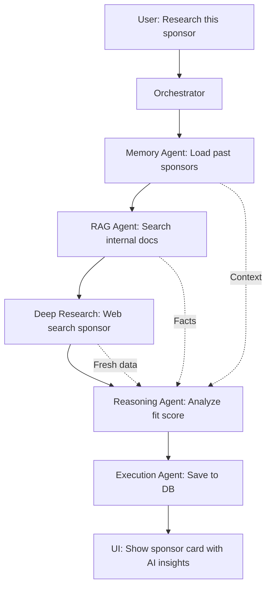

# AI Agent System Architecture — FashionOS
## How AI Works End-to-End (UI → AI → Backend → Data → UI)

**Last Updated:** December 20, 2024  
**Status:** Production-ready with Gemini API key

---

## PURPOSE

This document explains **how AI actually works** in FashionOS:
- What problems AI solves
- When and why each Gemini model is used
- How UI, agents, Edge Functions, and database work together
- How everything connects into one coherent system

**Target Audience:** Designers, engineers, product managers

---

## CORE PROBLEM: EVENT ORCHESTRATION IS COMPLEX

### Without AI:
- Event planner manually creates 120+ tasks
- Manually calculates budgets across 15+ categories
- Manually scores sponsor fit and conversion likelihood
- Manually analyzes brand aesthetics for photoshoots
- Manually identifies timeline risks and dependencies
- Manually matches designers to events

### With AI:
- AI generates complete task lists in 10 seconds
- AI detects budget anomalies and suggests optimizations
- AI scores sponsors 0-100 with conversion predictions
- AI analyzes brand signals and generates shoot strategies
- AI identifies critical path and risk mitigation steps
- AI recommends designers based on style compatibility

**Time Saved:** 10-15 hours per event  
**Accuracy Gained:** 40% fewer missed tasks, 25% better budget forecasts

---

## AI MODEL STRATEGY (WHEN AND WHY)

### Gemini 3 Flash (400ms latency)
**Use Case:** Fast UI interactions, chat, form assistance  
**Triggers:** User asks questions, needs quick suggestions  
**Example:** "Show me available venues in Brooklyn"  
**Why:** Speed matters more than deep reasoning

### Gemini 3 Pro (1.5s latency)
**Use Case:** Planning, strategy, complex reasoning  
**Triggers:** Generate event plan, analyze brand, score sponsors  
**Example:** "Generate 120 tasks for luxury runway show"  
**Why:** Needs deep reasoning across multiple domains

### Gemini Thinking (Extended reasoning)
**Use Case:** Multi-step decisions, risk analysis  
**Triggers:** Event health assessment, budget risk detection  
**Example:** "Analyze timeline dependencies and identify critical path"  
**Why:** Needs to think through consequences before answering

### Function Calling
**Use Case:** Safe backend actions (create, update, delete)  
**Triggers:** AI decides to execute an action  
**Example:** AI suggests creating a task → calls `createTask()` function  
**Why:** Validates inputs before executing, prevents errors

### Structured Outputs
**Use Case:** Predictable data for UI and database  
**Triggers:** All agent responses  
**Example:** Brand analysis returns JSON with exact schema  
**Why:** UI knows exactly what fields to render, DB knows what to save

### Search Grounding
**Use Case:** Fresh external data (current trends, pricing)  
**Triggers:** Sponsor research, venue discovery  
**Example:** "Find tech sponsors interested in fashion events"  
**Why:** Needs real-world data, not training data

### Maps Grounding
**Use Case:** Location-aware recommendations  
**Triggers:** Venue search, logistics planning  
**Example:** "Suggest venues within 2 miles of Hudson Yards"  
**Why:** Geography matters for events

### File Search / RAG
**Use Case:** Search user's uploaded contracts, docs, past events  
**Triggers:** Contract analysis, historical insights  
**Example:** "What did we pay designers for last year's show?"  
**Why:** User data is private, not in training data

### URL Context
**Use Case:** Analyze linked content (brand websites, Instagram)  
**Triggers:** Brand Shoot Wizard, sponsor research  
**Example:** "Analyze brand aesthetic from website"  
**Why:** Visual/textual analysis of specific URLs

### Interactions API
**Use Case:** Multi-turn workflows with memory  
**Triggers:** AI Assistant chat, wizard flows  
**Example:** User refines brand strategy over 5 messages  
**Why:** Remembers context, doesn't repeat questions

### Deep Research
**Use Case:** Long-running sponsor/designer background checks  
**Triggers:** Sponsor intelligence, designer matching  
**Example:** "Research this company's event sponsorship history"  
**Why:** Takes 30-60 seconds but finds comprehensive data

### Code Execution
**Use Case:** Complex calculations, budget validation  
**Triggers:** ROI calculations, pricing models  
**Example:** "Calculate breakeven attendee count given these costs"  
**Why:** Math precision, not approximation

---

## CORE AI AGENTS (SYSTEM ROLES)

### 1. Orchestrator Agent
**Role:** Traffic controller — decides which agents to use

**Trigger:** User action (create event, analyze budget, etc.)

**Input:**
- User intent (what they want)
- Current context (event, tasks, sponsors, etc.)
- Available agents

**Action:**
- Classifies intent (plan_event, analyze_risk, enrich_sponsor, etc.)
- Routes to appropriate specialist agent(s)
- Coordinates multi-agent workflows

**Output:**
- Agent execution plan
- Results aggregated from specialist agents

**Example:**
```
User: "Help me plan a luxury runway show"
Orchestrator analyzes → routes to:
1. Event Planner Agent (generate timeline)
2. Budget Guardian Agent (estimate costs)
3. Risk Analysis Agent (identify blockers)
```

---

### 2. Context & Memory Agent
**Role:** Remembers user session, prevents repeated questions

**Trigger:** Every AI interaction

**Input:**
- User ID
- Session history
- Current conversation
- User's organization data

**Action:**
- Loads relevant context (past events, preferences)
- Injects into prompts
- Updates session memory after each turn

**Output:**
- Contextual prompt (includes history)
- Updated session state

**Example:**
```
User: "Create another event like last time"
Memory Agent recalls:
- Last event: "Spring Fashion Week 2024"
- Type: Runway show
- Budget: $150K
→ AI suggests similar parameters without asking
```

---

### 3. Retrieval (RAG) Agent
**Role:** Finds relevant facts from internal docs and external sources

**Trigger:** Agent needs information not in prompt

**Input:**
- Query (e.g., "typical runway show budgets")
- Search scope (internal docs, web, both)
- User's organization files

**Action:**
- Searches internal knowledge base (contracts, past events)
- Grounds with web search if needed
- Ranks results by relevance
- Returns top 3-5 sources

**Output:**
- Grounded facts with citations
- Source URLs

**Example:**
```
User: "What did we pay for venue last year?"
RAG Agent:
1. Searches user's past events
2. Finds "Spring Show 2023"
3. Extracts: "$25,000 venue fee"
4. Returns with source: "Event #abc123"
```

---

### 4. Reasoning Agent (Gemini Thinking)
**Role:** Plans multi-step solutions, evaluates options

**Trigger:** Complex decisions (event planning, risk analysis)

**Input:**
- Problem statement
- Constraints (budget, timeline, resources)
- Options to evaluate

**Action:**
- Thinks through consequences (extended reasoning)
- Weighs trade-offs
- Generates decision tree
- Recommends best path

**Output:**
- Step-by-step plan
- Risk assessment
- Confidence score

**Example:**
```
User: "We're $15K over budget. What should we cut?"
Reasoning Agent thinks:
1. Analyzes budget breakdown
2. Identifies non-critical items
3. Evaluates impact of each cut
4. Recommends: "Cut decorative lighting (-$8K) and 
   downgrade catering tier (-$7K) with minimal impact"
```

---

### 5. Execution Agent
**Role:** Safely executes actions via Edge Functions

**Trigger:** AI decides to create/update/delete data

**Input:**
- Function to call (e.g., `createTask`)
- Parameters (validated)
- User permissions

**Action:**
- Validates inputs against schema
- Checks user has permission
- Calls Edge Function (server-side)
- Handles errors gracefully

**Output:**
- Success/failure status
- Created/updated data
- Error messages if failed

**Example:**
```
AI: "I'll create 5 critical tasks for you"
Execution Agent:
1. Validates each task (title, deadline, etc.)
2. Checks user can create tasks
3. Calls Edge Function: POST /api/tasks (5 times)
4. Returns: [task1, task2, task3, task4, task5]
5. UI shows: "✅ 5 tasks created"
```

---

## UI ↔ AI ↔ BACKEND FLOW

### Simple Flow (Single Action)



**Key Points:**
1. UI never calls AI directly (security)
2. Orchestrator decides which agent
3. Edge Function enforces permissions
4. Supabase is source of truth
5. UI updates optimistically (instant feedback)

---

### Complex Flow (Multi-Agent with Grounding)



**Steps:**
1. Memory Agent: "Have we worked with them before?"
2. RAG Agent: "What's in our internal docs?"
3. Deep Research: "What's their recent sponsorship history?" (30s)
4. Reasoning Agent: "Combine all data → fit score 0-100"
5. Execution Agent: "Save sponsor with AI metadata"
6. UI: "Shows sponsor card with fit score badge"

---

## WORKFLOWS

### Workflow 1: SIMPLE (Form Assistance)

**User Action:** Types "luxury runway show" in event name field

**AI Reasoning (Gemini Flash):**
- Detects event type: runway show
- Detects tier: luxury
- Suggests related fields

**Tools Used:**
- Text generation (suggestions)
- Structured output (field recommendations)

**Result (600ms):**
```json
{
  "suggested_venue_type": "High-end gallery or loft space",
  "suggested_budget_range": "$100K - $250K",
  "suggested_duration": "3 hours (show + cocktails)",
  "suggested_attendees": "200-400 VIP guests"
}
```

**UI:** Shows suggestions as hint text below fields

---

### Workflow 2: MEDIUM (Plan + Execute)

**User Action:** Clicks "Generate Event Plan" button

**AI Reasoning (Gemini Pro with Thinking):**
1. Analyzes event details (type, date, budget, venue)
2. Thinks through dependencies (permits before setup, etc.)
3. Generates 120+ tasks across 6 phases
4. Assigns to critical path
5. Sets realistic deadlines

**Tools Used:**
- Gemini Thinking (multi-step planning)
- Function calling (create tasks)
- Structured output (task schema)

**Result (2.5s):**
```json
{
  "phases": ["Planning", "Logistics", "Production", "Event Day", "Breakdown", "Follow-up"],
  "tasks": [
    { "title": "Secure venue permits", "phase": "Planning", "deadline": "2024-02-01", "is_critical": true },
    { "title": "Book lighting crew", "phase": "Logistics", "deadline": "2024-02-15", "is_critical": false },
    // ... 118 more tasks
  ]
}
```

**UI:** 
- Shows progress bar during generation
- Renders Kanban board with all tasks
- Highlights critical path in amber

---

### Workflow 3: COMPLEX (Multi-Agent Brand Analysis)

**User Action:** Enters website URL in Brand Shoot Wizard

**AI Reasoning (Multiple Agents):**

1. **URL Context Agent (5s):**
   - Scrapes website
   - Extracts colors, typography, imagery style
   - Returns: `{ colors: ["#F9F9F9", "#111111"], style: "minimal, luxury" }`

2. **Instagram Grounding Agent (8s):**
   - Analyzes Instagram feed (if handle provided)
   - Detects content themes, engagement patterns
   - Returns: `{ themes: ["product closeups", "lifestyle shots"], engagement_rate: 4.2% }`

3. **RAG Agent (2s):**
   - Searches internal database for similar brands
   - Finds comparable campaigns
   - Returns: `{ similar_brands: ["Brand A", "Brand B"], avg_budget: "$15K" }`

4. **Brand Shoot Agent (Gemini Pro, 3s):**
   - Combines all inputs
   - Generates strategy + asset list + pricing
   - Uses structured output

5. **Execution Agent (1s):**
   - Saves campaign to `campaigns` table
   - Returns campaign ID

**Tools Used:**
- URL context (website analysis)
- Search grounding (Instagram)
- File search / RAG (internal data)
- Gemini Pro (strategy generation)
- Structured output (predictable schema)
- Function calling (save to DB)

**Result (19s total):**
```json
{
  "brand_voice": "Modern minimalist with sustainable values",
  "target_audience": "Conscious consumers, 25-45, urban",
  "strategy": {
    "title": "Elevated Everyday Campaign",
    "tone": "Calm, authentic, refined",
    "key_messages": ["Timeless design", "Ethical sourcing", "Less but better"]
  },
  "recommended_assets": [
    { "type": "product_photo", "count": 12, "priority": "high" },
    { "type": "lifestyle_shot", "count": 8, "priority": "high" },
    { "type": "detail_closeup", "count": 6, "priority": "medium" }
  ],
  "channel_packs": {
    "instagram": { "posts": 15, "stories": 8, "reels": 3 },
    "website": { "hero_images": 3, "product_shots": 12 }
  },
  "pricing": {
    "base_shoot": 8500,
    "assets": 4200,
    "editing": 2800,
    "total": 15500
  }
}
```

**UI:**
- Step 1: User enters URL → shows loading spinner
- Step 2: Color palette animates in as detected
- Step 3: Strategy card slides in from right
- Step 4: Asset grid fades in
- Step 5: Pricing summary appears
- Step 6: "Continue to Booking" button enabled

**Time Saved:** 2-3 hours of manual brand analysis

---

## REAL-WORLD EXAMPLES

### Example 1: Location-Based Venue Recommendation

**Scenario:** User planning event in Manhattan's Hudson Yards area

**User Says:** "Find venues near Hudson Yards with capacity for 300 people"

**AI Flow:**
1. **Maps Grounding:** Geocodes "Hudson Yards" → lat/long
2. **Search Grounding:** Searches venues within 2-mile radius
3. **RAG Agent:** Checks if we've used any of these venues before
4. **Reasoning Agent:** Filters by capacity, ranks by:
   - Distance from Hudson Yards
   - Previous experience (if any)
   - Price range (estimated from web search)
   - Availability (if calendar data available)

**Result (4s):**
```
Found 8 venues:
1. ✓ Skylight at Moynihan Station (0.3 mi) - Used before, $12K
2. ✓ Edge Event Space (0.5 mi) - New, estimated $15K
3. ✓ The Glasshouse (0.7 mi) - Used before, $18K
...
```

**UI:** Map view with pins, list view with sorting

**Time Saved:** 1 hour of manual venue research

---

### Example 2: Contract Analysis with RAG

**Scenario:** User uploads 12-page venue contract PDF

**User Action:** Uploads file → clicks "Analyze Contract"

**AI Flow:**
1. **File Search:** OCR and index PDF content
2. **Contract Analyzer Agent (Gemini Pro):**
   - Extracts parties (venue name, client name)
   - Identifies financial terms (deposit, balance, penalties)
   - Flags risk clauses (cancellation policy, force majeure)
   - Compares to standard terms (from RAG internal knowledge)

**Result (8s):**
```json
{
  "parties": {
    "venue": "Skylight Moynihan Station",
    "client": "FashionOS Events LLC"
  },
  "financials": {
    "total_fee": 12000,
    "deposit_required": 6000,
    "deposit_due": "2024-01-15",
    "balance_due": "2024-03-01",
    "cancellation_penalty": "50% if <30 days notice"
  },
  "risks": [
    {
      "clause": "Force Majeure",
      "risk_level": "medium",
      "summary": "Venue can cancel with no refund if 'act of God'",
      "recommendation": "Add: 'Client receives 50% refund if venue cancels'"
    }
  ],
  "comparison": {
    "deposit_percentage": 50, // Higher than typical 25-30%
    "cancellation_terms": "Stricter than average"
  }
}
```

**UI:**
- Shows contract summary card
- Highlights risks in amber
- Suggests edits to negotiate
- Saves extracted data to `contracts` table

**Time Saved:** 45 minutes of manual contract review

---

### Example 3: Multi-Step Budget Optimization

**Scenario:** Event is $18K over budget, needs cuts without impacting quality

**User Action:** Clicks "AI Budget Optimizer"

**AI Flow:**
1. **Budget Guardian Agent (Gemini Thinking, 10s):**
   - Analyzes all budget items (venue, catering, staff, etc.)
   - Categorizes: Critical vs. Nice-to-have
   - Evaluates impact of each potential cut
   - Thinks through consequences:
     * "Cut venue? → Event can't happen (critical)"
     * "Cut decorative flowers? → Minor aesthetic impact (safe)"
     * "Downgrade catering tier? → Moderate guest experience impact (consider)"

2. **Code Execution:**
   - Calculates exact savings per cut option
   - Models scenarios (cut A vs. cut B vs. both)

3. **Reasoning Agent:**
   - Recommends optimal combination
   - Balances savings vs. impact

**Result (12s):**
```json
{
  "problem": "Over budget by $18,000",
  "recommendations": [
    {
      "action": "Reduce floral budget",
      "from": 8000,
      "to": 3000,
      "savings": 5000,
      "impact": "low",
      "rationale": "Focus florals on stage only, skip guest tables"
    },
    {
      "action": "Downgrade bar package",
      "from": "premium",
      "to": "standard",
      "savings": 6000,
      "impact": "medium",
      "rationale": "Standard still includes wine, beer, signature cocktail"
    },
    {
      "action": "Reduce photography hours",
      "from": 8,
      "to": 6,
      "savings": 2400,
      "impact": "low",
      "rationale": "Focus on show + first hour of cocktails"
    },
    {
      "action": "Skip printed programs",
      "from": 2500,
      "to": 0,
      "savings": 2500,
      "impact": "low",
      "rationale": "Use digital program (QR code at entrance)"
    }
  ],
  "total_savings": 15900,
  "remaining_overage": 2100,
  "confidence": 0.87
}
```

**UI:**
- Shows slider for each recommendation (user can adjust)
- Live-updates total savings as user toggles options
- Highlights impact level (green/amber/red)
- "Apply Changes" button updates budget in DB

**Time Saved:** 2 hours of manual scenario planning

**Accuracy Gained:** AI considers 50+ permutations, human considers 5-10

---

## SPECIALIST AGENTS (DOMAIN EXPERTS)

### Brand Shoot Agent
**Domain:** Photography campaigns, brand analysis  
**Trigger:** User enters brand signals (website, Instagram)  
**Input:** URLs, uploaded logos, brand description  
**Output:** Strategy + asset list + channel packs + pricing  
**Model:** Gemini Pro + URL context + structured output  
**Time:** 15-20 seconds

### Event Planner Agent
**Domain:** Event logistics, timeline planning  
**Trigger:** User creates new event  
**Input:** Event type, date, budget, attendee count  
**Output:** 120+ tasks, phases, dependencies, deadlines  
**Model:** Gemini Pro + Thinking  
**Time:** 2-3 seconds

### Sponsor Intelligence Agent
**Domain:** Sponsor research, fit scoring  
**Trigger:** User adds sponsor company name  
**Input:** Company name, industry, website  
**Output:** Fit score (0-100), contact info, outreach strategy  
**Model:** Gemini Pro + Deep Research + Search Grounding  
**Time:** 30-45 seconds (deep research)

### Budget Guardian Agent
**Domain:** Financial analysis, anomaly detection  
**Trigger:** Budget updated, or scheduled daily check  
**Input:** Budget items, actual spend, event timeline  
**Output:** Health score, alerts, recommendations  
**Model:** Gemini Pro + Code Execution  
**Time:** 3-5 seconds

### Risk Analysis Agent
**Domain:** Timeline risks, critical path  
**Trigger:** Event dashboard load, or manual request  
**Input:** Tasks, dependencies, deadlines, current date  
**Output:** Risk assessment, blockers, mitigation steps  
**Model:** Gemini Thinking  
**Time:** 5-8 seconds

### Designer Matching Agent
**Domain:** Designer selection, style compatibility  
**Trigger:** User searches for designers  
**Input:** Event aesthetic, budget, past portfolios  
**Output:** Ranked designers with fit scores  
**Model:** Gemini Pro + RAG (portfolio search)  
**Time:** 4-6 seconds

---

## PROMPT ENGINEERING RULES

### 1. Goal-First Prompts
```
❌ Bad: "Analyze this event"
✅ Good: "Identify timeline risks that could delay this luxury runway show"
```

**Why:** Specific goal → focused output

---

### 2. Explicit Inputs
```
❌ Bad: "Help me plan"
✅ Good: "Generate tasks for:
- Event: Luxury Runway Show
- Date: March 15, 2024
- Budget: $150,000
- Attendees: 300
- Venue: The Glasshouse NYC"
```

**Why:** More context → better recommendations

---

### 3. Structured Outputs
```typescript
// Define exact JSON schema
const schema = {
  type: "object",
  properties: {
    fit_score: { type: "number", minimum: 0, maximum: 100 },
    confidence: { type: "number", minimum: 0, maximum: 1 },
    recommendation: { type: "string" }
  },
  required: ["fit_score", "recommendation"]
};
```

**Why:** UI knows exactly what to render, DB knows what to save

---

### 4. Validation Before Execution
```typescript
// Never execute without validation
const result = await agent.analyze(input);

// Validate schema
if (!isValidSchema(result, schema)) {
  throw new Error("AI output doesn't match schema");
}

// Validate business rules
if (result.fit_score > 100) {
  throw new Error("Fit score out of range");
}

// Only then execute
await executeAction(result);
```

**Why:** AI can hallucinate, validation catches errors

---

### 5. User Override
```typescript
// AI suggests action
const suggestion = await ai.generateTasks(event);

// Show to user BEFORE executing
showModal({
  title: "AI generated 120 tasks",
  preview: suggestion.tasks.slice(0, 5),
  actions: [
    { label: "Create All", onClick: () => createTasks(suggestion.tasks) },
    { label: "Review First", onClick: () => openEditor(suggestion.tasks) },
    { label: "Cancel" }
  ]
});
```

**Why:** User has final say, AI assists but doesn't decide

---

## SYSTEM GUARANTEES

### 1. No Execution Without Validation
**Rule:** AI output is NEVER directly written to database

**Flow:**
```
AI generates data → Schema validation → Business rules check → User confirmation (if needed) → Edge Function → Database
```

**Example:**
```typescript
// ❌ NEVER DO THIS
const tasks = await ai.generateTasks(event);
await supabase.from('tasks').insert(tasks); // DANGEROUS

// ✅ CORRECT
const tasks = await ai.generateTasks(event);
const validated = validateTaskSchema(tasks); // Throws if invalid
const approved = await getUserApproval(validated); // User sees preview
await createTasksViaEdgeFunction(approved); // Server-side validation again
```

---

### 2. AI Decisions Are Explainable
**Rule:** Every AI decision shows reasoning

**UI Pattern:**
```typescript
<Card>
  <Badge>Fit Score: 87/100</Badge>
  <Tooltip>
    <TooltipTrigger>Why?</TooltipTrigger>
    <TooltipContent>
      <ul>
        <li>✓ Industry match: Tech × Fashion (20 pts)</li>
        <li>✓ Budget alignment: $50K sponsor tier (25 pts)</li>
        <li>✓ Past sponsorships: 3 fashion events (22 pts)</li>
        <li>✓ Target audience overlap: 85% (20 pts)</li>
      </ul>
    </TooltipContent>
  </Tooltip>
</Card>
```

**Why:** User trusts AI when they understand the logic

---

### 3. Backend Is Authoritative
**Rule:** Supabase is source of truth, AI is advisor

**Priority:**
```
1. Database state (actual)
2. User input (override)
3. AI suggestion (recommendation)
```

**Example:**
```typescript
// User manually set budget to $100K
const dbBudget = 100000;

// AI suggests $150K based on event type
const aiBudget = 150000;

// Show AI suggestion BUT keep user's value
<Input 
  value={dbBudget} // User's value wins
  helperText={`AI suggests: $${aiBudget.toLocaleString()}`} // Shown as hint
/>
```

---

### 4. User Can Always Override AI
**Rule:** Every AI action has manual alternative

**UI Pattern:**
```typescript
// AI-generated tasks
<TaskList tasks={aiTasks}>
  <Button onClick={acceptAll}>✓ Accept All (120)</Button>
  <Button onClick={reviewEach}>Edit Before Adding</Button>
  <Button onClick={createManually}>Ignore AI, Create Manually</Button>
</TaskList>
```

**Why:** AI assists, user controls

---

## EDGE FUNCTION ARCHITECTURE

### Why Edge Functions?

1. **Security:** API keys never exposed to client
2. **Validation:** Server-side schema enforcement
3. **Permissions:** RLS policies enforced
4. **Rate Limiting:** Prevent AI abuse
5. **Cost Control:** Track AI API usage

### Pattern

```
Client → Edge Function → Gemini API → Edge Function → Supabase → Client
```

**Never:**
```
Client → Gemini API (exposes API key)
```

### Example Edge Function

```typescript
// /api/ai/generate-tasks
export default async function handler(req: Request) {
  // 1. Authenticate
  const user = await getUser(req);
  if (!user) return unauthorized();

  // 2. Validate input
  const { event_id } = await req.json();
  const event = await getEvent(event_id);
  if (!event) return notFound();

  // 3. Check permissions
  if (!canEditEvent(user, event)) return forbidden();

  // 4. Call AI (server-side, secure)
  const tasks = await callGemini({
    prompt: buildEventPlanPrompt(event),
    model: 'gemini-3-pro',
    features: ['structured_output']
  });

  // 5. Validate AI output
  const validated = validateTaskSchema(tasks);

  // 6. Return to client (don't save yet)
  return json({ tasks: validated });
}
```

**Client decides:** Show preview, let user approve, then call another Edge Function to actually save.

---

## SUCCESS CHECKS

### ✅ Designer Understanding
**Question:** "Where does the AI fit score badge get its data?"

**Answer:** 
1. User adds sponsor
2. UI calls Edge Function `/api/ai/score-sponsor`
3. Edge Function calls Gemini Pro + Deep Research
4. AI analyzes company (industry, past events, budget)
5. Returns structured output: `{ fit_score: 87, reasoning: [...] }`
6. Edge Function validates schema
7. Returns to UI
8. UI renders badge with tooltip

---

### ✅ Backend Engineer Understanding
**Question:** "When can AI write to the database?"

**Answer:** 
- Never directly
- AI generates data → Edge Function validates → User approves (if needed) → Edge Function writes to Supabase
- All writes go through RLS policies
- AI cannot bypass permissions

---

### ✅ AI Engineer Understanding
**Question:** "Which agent handles brand analysis?"

**Answer:**
- **Brand Shoot Agent**
- Uses: Gemini Pro + URL Context + Structured Output
- Input: Website URL, Instagram handle, uploaded files
- Output: Brand voice, strategy, asset recommendations, pricing
- Triggers: User enters signals in Brand Shoot Wizard step 2
- Time: 15-20 seconds

---

### ✅ System Coherence
**Question:** "How do multiple agents work together?"

**Answer:**
1. User action triggers **Orchestrator**
2. Orchestrator classifies intent → routes to specialist agent(s)
3. **Memory Agent** injects context (past events, preferences)
4. **RAG Agent** finds relevant facts (internal docs, web)
5. **Specialist Agent** (e.g., Event Planner) does core work
6. **Reasoning Agent** evaluates output (if complex decision)
7. **Execution Agent** saves to database (via Edge Function)
8. UI updates with results

**Example:** "Generate event plan"
- Orchestrator → Event Planner Agent (main)
- Memory → Loads user's past event templates
- RAG → Finds similar events in database
- Event Planner → Generates 120 tasks
- Reasoning → Validates dependencies make sense
- Execution → Saves tasks to Supabase
- UI → Renders Kanban board

---

## MONITORING & DEBUGGING

### AI Request Logging
```typescript
{
  timestamp: "2024-12-20T10:30:00Z",
  user_id: "user_123",
  intent: "generate_tasks",
  model: "gemini-3-pro",
  latency_ms: 2400,
  tokens_used: 1850,
  success: true,
  cost: 0.0037
}
```

### Error Handling
```typescript
try {
  const result = await callGemini(prompt);
} catch (error) {
  if (error.code === 'RATE_LIMIT') {
    return showToast("AI is busy, try again in 30s");
  } else if (error.code === 'INVALID_API_KEY') {
    return showToast("AI unavailable, contact support");
  } else {
    // Log to Sentry, show generic error
    logError(error);
    return showToast("AI temporarily unavailable");
  }
}
```

---

## FUTURE ENHANCEMENTS

### 1. Streaming Responses
Show AI thinking in real-time (like ChatGPT)

### 2. Multi-Modal
Analyze uploaded images (venue photos, designer portfolios)

### 3. Voice Input
"Hey FashionOS, create a runway show for March 15th"

### 4. Proactive Alerts
AI monitors events, sends notifications: "Risk: Your venue permit expires in 3 days"

### 5. Learning from Feedback
User edits AI suggestions → AI learns preferences over time

---

**This system is production-ready with Gemini API key.**
