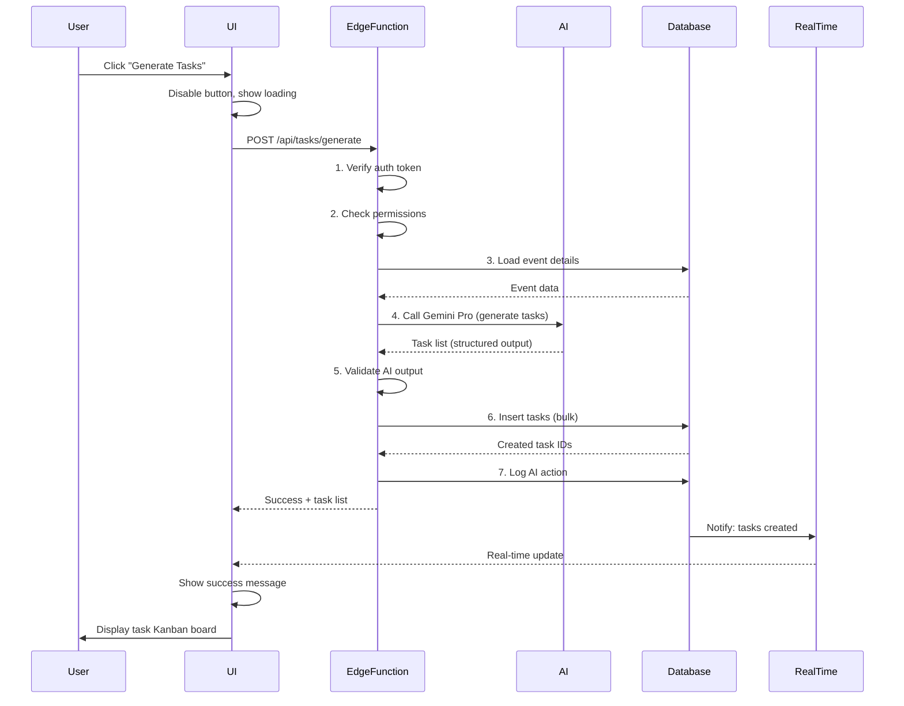

# Frontend ↔ Backend Wiring Rules — FashionOS
## Safe Data Flow, AI Integration, End-to-End Validation

**Last Updated:** December 20, 2024  
**Status:** Production-ready ruleset

---

## 1. PURPOSE — What "Wiring" Means

**Wiring** is the complete data flow from user action to database persistence and back:

**UI Event** → **API Call** → **Edge Function** → **Database Write/Read** → **UI Update**

Every action follows this pattern:
- User triggers action (button, form submit, AI chat)
- Frontend calls backend (never writes to DB directly)
- Backend validates, executes, responds
- Frontend shows result (loading → success/error)

**AI actions are always executed through backend boundaries** — no direct client-side AI writes.

---

## 2. SYSTEM COMPONENTS

### Frontend Layer
**Responsibilities:**
- Render UI (screens, forms, dashboards)
- Capture user input
- Validate UX (format, required fields)
- Show loading/error/empty states
- Optimistic updates (show change before backend confirms)
- Real-time subscriptions (live data updates)

**NEVER:**
- Write directly to database
- Make decisions about permissions
- Execute AI actions client-side
- Trust its own state as authoritative

---

### Backend Layer (Supabase)
**Responsibilities:**
- Store all data (single source of truth)
- Enforce Row Level Security (RLS) policies
- Handle authentication
- Validate business rules
- Execute database triggers
- Manage real-time subscriptions

**Authority:**
- Backend state always wins over frontend state
- If frontend shows X but backend has Y → backend is correct
- Frontend must sync to backend, never assume

---

### Edge Functions Layer
**Responsibilities:**
- Safe action execution (create, update, delete)
- Input validation (schema + business rules)
- Permission checks (who can do what)
- AI orchestration (call Gemini, process results)
- Complex business logic
- Idempotent operations (safe to retry)
- Logging and audit trail
- External API integration

**Pattern:**
```
POST /api/events/generate-tasks
  → Authenticate user
  → Validate event exists + user has access
  → Call AI (Gemini Pro)
  → Validate AI output
  → Write to database
  → Return result to UI
```

---

### AI Layer (Gemini)
**Responsibilities:**
- Generate recommendations (tasks, budgets, strategies)
- Score and rank options (sponsors, designers, venues)
- Analyze documents (contracts, brand signals)
- Answer questions (chat, assistant)

**Constraints:**
- AI NEVER writes to database directly
- AI outputs always validated before persistence
- AI calls happen server-side only (API key never exposed)
- All AI actions logged (input, model, output, timestamp)

---

### Logging & Observability
**Responsibilities:**
- Audit trail (who did what, when)
- AI action tracking (prompts, responses, costs)
- Error monitoring (Sentry, LogRocket)
- Performance metrics (latency, success rates)

**Requirements:**
- Every Edge Function logs: user, action, input, output, duration
- AI calls log: model, prompt, tokens used, cost, result
- Errors log: stack trace, user context, reproduction steps

---

### Storage Layer (Supabase Storage)
**Responsibilities:**
- Store files (contracts, photos, logos)
- Enforce access policies (who can view/upload)
- Generate signed URLs (temporary access)
- Organize by bucket (public, private, user-specific)

**Buckets:**
- `public` → Publicly accessible images (event photos, designer portfolios)
- `private` → Authenticated-only (contracts, internal docs)
- `user-uploads` → User-specific files (logos, media)

---

## 3. WIRING RULES (NON-NEGOTIABLE)

### Rule 1: Auth First
**Every backend call checks authentication.**

**Flow:**
1. User makes request
2. Backend extracts auth token from request
3. Backend verifies token with Supabase Auth
4. If invalid → 401 Unauthorized (stop)
5. If valid → continue to permission check

**UI Responsibility:**
- Include auth token in every request (automatic with Supabase client)
- Handle 401 by redirecting to login
- Never assume "user is logged in" without backend confirmation

---

### Rule 2: Backend Is Authoritative
**Frontend state is a cache; backend state is truth.**

**Examples:**
- Frontend shows event status: "Draft"
- Backend shows event status: "Published"
- **Winner:** Backend (Published)
- **Action:** Frontend re-syncs

**Pattern:**
- Frontend optimistically updates (instant feedback)
- Backend confirms or rejects
- If rejected → frontend reverts + shows error
- If confirmed → frontend keeps change

---

### Rule 3: One Source of Truth for IDs
**Backend generates all IDs.**

**Flow:**
1. User creates event (frontend doesn't generate ID)
2. Frontend sends: `{ name: "Spring Show", date: "2024-03-15" }`
3. Backend creates record, generates ID: `event_abc123`
4. Backend returns: `{ id: "event_abc123", name: "Spring Show", ... }`
5. Frontend stores ID for future references

**NEVER:**
- Frontend generates UUIDs (backend might reject)
- Frontend assumes ID structure
- Frontend uses temporary IDs that need reconciliation

---

### Rule 4: Validation Boundaries
**Frontend validates UX; backend validates truth.**

**Frontend Validation (User Experience):**
- Required fields filled
- Email format valid
- Date is future date
- Budget is positive number
- **Purpose:** Instant feedback, prevent submission errors

**Backend Validation (Business Rules):**
- User has permission to create event
- Event date doesn't conflict with existing event
- Budget doesn't exceed organization limit
- Venue is available on that date
- **Purpose:** Enforce constraints, prevent data corruption

**Both layers validate independently** — never trust frontend validation alone.

---

### Rule 5: Idempotency
**Safe to retry the same request multiple times.**

**Pattern:**
- User clicks "Create Event" button
- Request sent to backend
- Network timeout (uncertain if it succeeded)
- User clicks again
- Backend detects duplicate (same event name + date within 1 minute)
- Backend returns existing event (doesn't create duplicate)

**Implementation:**
- Use idempotency keys (unique request ID)
- Backend checks: "Have I seen this key before?"
- If yes → return cached result
- If no → execute + cache result

**UI Responsibility:**
- Disable button after first click (prevent accidental double-submit)
- Show loading spinner
- Don't re-enable until response received

---

### Rule 6: Error Contracts
**Errors have two audiences: users and developers.**

**User-Facing Error (UI shows this):**
```
{
  "message": "Event name is already taken. Please choose a different name.",
  "action": "retry",
  "field": "name"
}
```

**Developer Error (Logs capture this):**
```
{
  "error": "duplicate_key_violation",
  "table": "events",
  "constraint": "events_name_organization_id_key",
  "stack_trace": "...",
  "request_id": "req_xyz789"
}
```

**UI displays:**
- User-friendly message (what went wrong)
- Suggested action (what to do next)
- Highlighted field (where to fix)

**Logs capture:**
- Technical error type
- Full context for debugging
- Request ID (link to full trace)

---

### Rule 7: No Direct DB Writes from Client
**Frontend NEVER writes to database directly.**

**❌ WRONG:**
```
Frontend → supabase.from('events').insert({ name: 'Show' })
```

**✅ CORRECT:**
```
Frontend → POST /api/events/create { name: 'Show' }
  → Edge Function validates
  → Edge Function writes to DB
  → Edge Function returns result
Frontend ← { id: 'event_123', name: 'Show' }
```

**Why:**
- Backend enforces business rules
- Backend validates permissions
- Backend logs all actions
- Backend guarantees data integrity

**Exception:**
- Reads are allowed (with RLS policies enforced)
- Real-time subscriptions are allowed (read-only)

---

### Rule 8: AI Cannot Perform Side Effects Directly
**AI generates recommendations; Edge Functions execute them.**

**❌ WRONG:**
```
AI suggests: "Create task: Book venue"
  → AI calls database.insert(task)
```

**✅ CORRECT:**
```
AI suggests: "Create task: Book venue"
  → AI returns: { action: 'create_task', params: { title: 'Book venue' } }
  → Edge Function validates params
  → Edge Function calls database.insert(task)
  → Edge Function returns result
```

**Why:**
- AI can hallucinate invalid data
- AI doesn't understand permissions
- AI outputs must be validated
- AI actions must be auditable

---

### Rule 9: All AI Outputs Stored & Traceable
**Every AI call is logged with inputs, model, and results.**

**Audit Record:**
```
{
  "timestamp": "2024-12-20T10:30:00Z",
  "user_id": "user_123",
  "intent": "generate_event_tasks",
  "model": "gemini-3-pro",
  "input": { "event_id": "event_abc", "event_type": "runway_show" },
  "output": { "tasks": [ ... ] },
  "tokens_used": 1850,
  "latency_ms": 2400,
  "cost_usd": 0.0037,
  "success": true
}
```

**Why:**
- Debug AI failures
- Track AI costs
- Improve prompts over time
- User can see "why AI suggested this"

---

## 4. REQUEST/RESPONSE CONTRACTS

### Standard Request Shape
**Every backend call includes:**

**Required Inputs:**
- Authentication token (automatic with Supabase client)
- Action identifier (endpoint path)
- Request payload (validated data)
- Idempotency key (for write operations)

**Example:**
```
POST /api/sponsors/create
Headers:
  Authorization: Bearer <token>
  X-Idempotency-Key: req_xyz789
Body:
  { "company_name": "Chanel", "industry": "luxury_fashion" }
```

---

### Standard Response Shape
**Every backend response includes:**

**Success Response:**
```
{
  "success": true,
  "data": { ... },
  "meta": {
    "timestamp": "2024-12-20T10:30:00Z",
    "request_id": "req_xyz789"
  }
}
```

**Error Response:**
```
{
  "success": false,
  "error": {
    "code": "PERMISSION_DENIED",
    "message": "You don't have permission to create sponsors",
    "field": null,
    "action": "contact_admin"
  },
  "meta": {
    "timestamp": "2024-12-20T10:30:00Z",
    "request_id": "req_xyz789"
  }
}
```

---

### Standard Error Types
**Frontend handles these error codes:**

**`UNAUTHENTICATED` (401)**
- User not logged in
- Token expired
- **Action:** Redirect to login

**`PERMISSION_DENIED` (403)**
- User lacks required permission
- **Action:** Show "Contact admin" message

**`VALIDATION_ERROR` (400)**
- Invalid input (missing field, wrong format)
- **Action:** Highlight field, show error message

**`NOT_FOUND` (404)**
- Resource doesn't exist
- **Action:** Show "Not found" page or redirect

**`CONFLICT` (409)**
- Duplicate resource (e.g., event name taken)
- **Action:** Ask user to modify input

**`RATE_LIMIT` (429)**
- Too many requests
- **Action:** Show "Please wait" message, retry after delay

**`SERVER_ERROR` (500)**
- Unexpected backend failure
- **Action:** Show "Try again" message, log to Sentry

**`AI_FAILURE` (503)**
- AI service unavailable or timed out
- **Action:** Show manual fallback option

---

### Status Lifecycle States
**Long-running operations have states:**

**Created** → Operation initiated
- UI shows: "Starting..."
- Backend: Job queued

**Processing** → Operation in progress
- UI shows: Progress bar (if % available) or spinner
- Backend: Job executing

**Completed** → Operation succeeded
- UI shows: Success message + result
- Backend: Job finished, result stored

**Failed** → Operation failed
- UI shows: Error message + retry button
- Backend: Job failed, error logged

**Cancelled** → User stopped operation
- UI shows: "Cancelled" message
- Backend: Job terminated, partial cleanup

---

### What UI Shows at Each State

**Created:**
```
[ ⏳ ] Generating event plan...
```

**Processing:**
```
[ ⏳ ] Generating event plan... (45%)
AI is analyzing event details...
```

**Completed:**
```
[ ✓ ] Plan generated successfully!
Created 120 tasks across 6 phases.
[View Tasks]
```

**Failed:**
```
[ ✗ ] Plan generation failed
AI service temporarily unavailable.
[Try Again] [Create Manually]
```

---

## 5. EVENT FLOW (UI → BACKEND → UI)

### Flow Diagram



---

### Form Submit Flow

**User fills out "Create Event" form:**

1. **User types** → Frontend validates format (UX feedback)
   - Name: Required, min 3 chars
   - Date: Must be future date
   - Budget: Positive number

2. **User clicks "Create"** → Frontend disables button, shows spinner

3. **Frontend sends** → `POST /api/events/create`
   ```
   { name: "Spring Show", date: "2024-03-15", budget: 150000 }
   ```

4. **Edge Function validates:**
   - User authenticated? (Check token)
   - User has `create_events` permission?
   - Event name not taken?
   - Date available (no conflicts)?
   - Budget within org limits?

5. **Edge Function creates event** → Database insert

6. **Database returns** → `{ id: "event_abc123", ... }`

7. **Edge Function responds** → `{ success: true, data: { id: "event_abc123", ... } }`

8. **Frontend receives** → Hides spinner, shows success toast

9. **Frontend navigates** → `/events/event_abc123` (event detail page)

10. **Real-time subscription fires** → Other users see new event in list

---

### Chat Action Button Click

**User in AI Assistant chat clicks "Generate Event Plan":**

1. **User clicks button** → UI shows "Generating..." in chat

2. **Frontend sends** → `POST /api/ai/generate-plan`
   ```
   {
     event_id: "event_abc123",
     intent: "generate_event_plan",
     context: { event_type: "runway_show", budget: 150000 }
   }
   ```

3. **Edge Function:**
   - Authenticates user
   - Loads event details from database
   - Calls Orchestrator Agent
   - Orchestrator routes to Event Planner Agent (Gemini Pro)

4. **AI generates plan** (2-3 seconds)
   - 120 tasks across 6 phases
   - Dependencies identified
   - Deadlines calculated

5. **Edge Function validates AI output:**
   - Tasks match expected schema?
   - Dates are logical (permits before setup)?
   - All required fields present?

6. **Edge Function responds** → Returns task list (does NOT save yet)

7. **Frontend shows preview** → Modal with task summary
   ```
   "AI generated 120 tasks. Review before adding."
   [Preview] [Create All] [Edit First] [Cancel]
   ```

8. **User clicks "Create All"** → Frontend sends second request
   ```
   POST /api/tasks/bulk-create
   { event_id: "event_abc123", tasks: [ ... ] }
   ```

9. **Edge Function creates tasks** → Bulk insert to database

10. **Frontend navigates** → `/events/event_abc123/tasks` (Kanban view)

---

### "Generate Plan" Click (Long-Running)

**User clicks "Deep Research Sponsor":**

1. **Frontend creates job** → `POST /api/sponsors/research-start`
   ```
   { sponsor_id: "sponsor_xyz", depth: "comprehensive" }
   ```

2. **Edge Function creates job record** → Database
   ```
   { id: "job_123", status: "created", type: "sponsor_research" }
   ```

3. **Edge Function returns immediately** → `{ job_id: "job_123" }`

4. **Frontend navigates** → `/jobs/job_123/status` (status page)

5. **Edge Function starts async job** (background)
   - Deep Research Agent calls Gemini (30-60 seconds)
   - Searches web for sponsor history
   - Analyzes sponsorship patterns
   - Calculates fit score

6. **Frontend polls status** → `GET /api/jobs/job_123` every 2 seconds
   ```
   { status: "processing", progress: 45, message: "Analyzing sponsorship history..." }
   ```

7. **UI updates progress bar** → Shows current step

8. **Job completes** → Edge Function updates job status
   ```
   { status: "completed", result: { fit_score: 87, ... } }
   ```

9. **Frontend detects completion** → Stops polling

10. **UI shows result** → Sponsor detail page with AI insights

---

### "Save / Export / Book" Action

**User clicks "Save to Database" after AI generation:**

1. **Frontend validates locally:**
   - All required fields filled?
   - Formats valid?
   - No obvious errors?

2. **Frontend sends** → `POST /api/{resource}/save`
   ```
   { resource_type: "campaign", data: { ... }, ai_metadata: { model: "gemini-3-pro", ... } }
   ```

3. **Edge Function validates again** (backend authority):
   - Schema matches database table?
   - User has permission to save?
   - No conflicts with existing data?

4. **Edge Function saves:**
   - Main resource (campaign)
   - AI metadata (separate audit table)
   - Relationships (links to events, sponsors, etc.)

5. **Edge Function returns** → `{ id: "campaign_abc", ... }`

6. **Frontend shows success** → Toast notification + redirect

7. **Real-time update** → Dashboard widgets refresh with new campaign

---

## 6. EDGE FUNCTION RULES

### Rule 1: One Function = One Responsibility
**Each Edge Function does ONE thing.**

**Examples:**
- `/api/events/create` → Create event (not update or delete)
- `/api/tasks/bulk-create` → Create multiple tasks (not generate)
- `/api/ai/generate-tasks` → Generate task list (not save)

**Why:**
- Easier to test
- Easier to debug
- Easier to secure (granular permissions)
- Easier to optimize (cache, rate-limit individually)

---

### Rule 2: Input Validation & Permission Checks
**Every Edge Function validates inputs and permissions.**

**Validation Order:**
1. **Authentication:** Valid token?
2. **Permission:** User allowed to do this?
3. **Schema:** Input matches expected shape?
4. **Business rules:** Constraints satisfied?

**Example:**
```
POST /api/events/delete
  1. User authenticated? (Check token)
  2. User owns event OR has admin role?
  3. Event ID is valid UUID?
  4. Event is not published? (can't delete published events)
```

**If any check fails** → Return error, stop execution

---

### Rule 3: Consistent Naming
**Edge Functions follow naming convention:**

**Pattern:** `/api/{resource}/{action}`

**Examples:**
- `/api/events/create`
- `/api/events/update`
- `/api/events/delete`
- `/api/events/list`
- `/api/events/get`
- `/api/tasks/generate` (AI action)
- `/api/sponsors/research` (AI action)

**Resource names:** Plural (events, tasks, sponsors)  
**Action names:** Verb (create, update, delete, generate, research)

---

### Rule 4: Stable Outputs for UI
**Edge Functions return predictable, versioned schemas.**

**Example:**
```
POST /api/events/create
Response (v1):
  { id, name, date, status, created_at, updated_at }

If we need more fields later (v2):
  { id, name, date, status, created_at, updated_at, venue_id, budget }

Frontend specifies version:
  Headers: { X-API-Version: "v1" }
```

**Why:**
- Frontend doesn't break when backend changes
- Can test new versions before switching
- Clear migration path

---

### Rule 5: Logging Required
**Every Edge Function logs execution.**

**Minimum logged:**
- User ID
- Action (endpoint + method)
- Input (sanitized, no passwords)
- Output (success or error)
- Duration (milliseconds)
- Timestamp

**Example log entry:**
```
{
  "timestamp": "2024-12-20T10:30:00Z",
  "user_id": "user_123",
  "endpoint": "/api/events/create",
  "method": "POST",
  "input": { "name": "Spring Show", "date": "2024-03-15" },
  "output": { "success": true, "id": "event_abc123" },
  "duration_ms": 245,
  "ip_address": "192.168.1.1"
}
```

---

### Rule 6: Timeouts & Fallback Behavior
**Edge Functions have time limits and graceful failures.**

**Timeouts:**
- Simple actions (CRUD): 5 seconds max
- AI actions (fast): 10 seconds max
- AI actions (deep research): 60 seconds max
- If exceeded → return timeout error

**Fallback Behavior:**
- **Timeout:** Return partial result if possible, or error with retry option
- **AI failure:** Offer manual alternative ("AI unavailable, create manually?")
- **DB failure:** Show cached data with warning ("Showing stale data, refresh to retry")

**Example:**
```
POST /api/ai/generate-tasks (timeout: 10s)

If AI responds in 8s → Return task list
If AI responds in 12s → Return timeout error:
  {
    "error": "AI_TIMEOUT",
    "message": "Task generation is taking longer than expected. Try again or create tasks manually.",
    "actions": ["retry", "manual"]
  }
```

---

### Rule 7: Async Workflow Pattern
**Long-running tasks use job + polling or webhooks.**

**Pattern:**
1. **Start job** → Returns job ID immediately
2. **Poll status** → Frontend checks job status every N seconds
3. **Completion** → Job status changes to "completed" or "failed"
4. **Result** → Frontend fetches result

**Example:**
```
POST /api/sponsors/research-start
Response: { job_id: "job_123", status: "created" }

GET /api/jobs/job_123
Response: { status: "processing", progress: 30 }

GET /api/jobs/job_123 (later)
Response: { status: "completed", result: { fit_score: 87, ... } }
```

**Alternative:** Webhooks (for background jobs)
```
POST /api/sponsors/research-start
  { sponsor_id: "xyz", webhook_url: "https://app.com/webhook" }

Backend calls webhook when done:
  POST https://app.com/webhook
  { job_id: "job_123", status: "completed", result: { ... } }
```

---

## 7. AI WIRING RULES (GEMINI)

### Model Selection Rules

**Gemini 3 Flash** (400ms latency)
- **Use for:** Quick UI assistance, chat responses, form suggestions
- **Triggers:** User types question, requests autocomplete, clicks hint
- **Example:** "Suggest venue types for luxury runway show"

**Gemini 3 Pro** (1.5s latency)
- **Use for:** Reasoning, planning, strategy generation
- **Triggers:** "Generate event plan", "Analyze brand", "Score sponsor"
- **Example:** "Generate 120 tasks for Spring Fashion Week"

**Gemini Thinking** (5-10s latency)
- **Use for:** Multi-step decisions, risk analysis, optimization
- **Triggers:** "Analyze timeline risks", "Optimize budget", "Evaluate options"
- **Example:** "Find $18K in budget cuts with minimal impact"

---

### Tool Selection Rules

**Function Calling**
- **Use for:** AI needs to trigger actions (create, update, delete)
- **Pattern:** AI decides action → returns function call → Edge Function executes
- **Example:** AI suggests "Create task: Book venue" → returns `create_task({ title: "Book venue" })`

**Structured Outputs**
- **Use for:** Predictable UI + database writes
- **Pattern:** AI returns JSON matching exact schema
- **Example:** Brand analysis returns `{ voice: string, aesthetic: string, values: string[] }`

**Search Grounding**
- **Use for:** Fresh external data (trends, pricing, news)
- **Triggers:** "Research sponsor background", "Find current venue prices"
- **Example:** "What's Chanel's recent sponsorship activity?"

**Maps Grounding**
- **Use for:** Location-aware recommendations
- **Triggers:** Venue search, logistics planning
- **Example:** "Find venues within 2 miles of Hudson Yards"

**File Search / RAG**
- **Use for:** Internal docs, user-uploaded files
- **Triggers:** Contract analysis, past event lookup
- **Example:** "What did we pay for venue last year?" → searches past events

**URL Context**
- **Use for:** Analyze linked content (websites, Instagram)
- **Triggers:** Brand Shoot Wizard, sponsor research
- **Example:** "Analyze brand aesthetic from www.example.com"

---

### AI Trigger Rules

**Rule:** AI triggers must be explicit — button click or confirmed intent.

**✅ Explicit Triggers:**
- User clicks "Generate Tasks" button
- User types "Generate event plan" in chat + confirms
- User selects "AI Assistant" option in dropdown

**❌ Implicit Triggers (FORBIDDEN):**
- User opens event page → AI auto-generates plan (unwanted cost)
- User types in form → AI auto-fills (annoying, unexpected)
- User views dashboard → AI auto-runs analysis (slow, wasteful)

**Why:**
- User expects AI action (no surprises)
- User controls costs (AI calls cost money)
- User can choose manual alternative

---

### AI Output Validation

**Every AI response is validated before use.**

**Validation Steps:**
1. **Schema check:** Output matches expected shape?
2. **Business rules:** Values are logical? (dates, numbers, enums)
3. **Safety check:** No harmful content, PII leaks, or hallucinated data?

**Example:**
```
AI generates tasks:
  [
    { title: "Book venue", deadline: "2024-02-01", phase: "Planning" },
    { title: "Send invites", deadline: "2024-01-15", phase: "Marketing" }
  ]

Validation:
  ✓ Schema: All tasks have title, deadline, phase
  ✓ Business rules: Deadlines are future dates
  ✗ Logic error: "Send invites" before "Book venue" (no venue confirmed yet)

Action: Flag logic error, ask user to review order
```

---

### AI Logging (Mandatory)

**Every AI call logs:**
- User ID (who triggered)
- Intent (what they wanted)
- Model (Flash, Pro, Thinking)
- Input (prompt + context)
- Output (structured result)
- Tokens used
- Cost (USD)
- Latency (ms)
- Success/failure

**Why:**
- Debug failures ("Why did AI suggest this?")
- Track costs ("How much did we spend on AI this month?")
- Improve prompts ("This prompt is too slow, optimize it")
- User transparency ("Show me why AI scored this sponsor 87")

---

## 8. WORKFLOWS (3 LEVELS)

### SIMPLE WORKFLOW — Immediate Result

**Scenario:** User creates sponsor

**Screens Involved:**
- `/sponsors` (list)
- `/sponsors/create` (form)

**Flow:**
1. User clicks "Add Sponsor"
2. Form opens
3. User fills: Company name, industry, website
4. User clicks "Create"
5. Frontend validates format (UX)
6. Frontend sends: `POST /api/sponsors/create`
7. Edge Function validates + creates sponsor
8. Edge Function returns: `{ id: "sponsor_xyz", ... }`
9. Frontend shows success toast
10. Frontend navigates to: `/sponsors/sponsor_xyz`

**Validation Points:**
- Frontend: Required fields, email format
- Backend: Company name not duplicate, user has permission

**Failure Modes:**
- Duplicate company name → Show error: "Company already exists. Did you mean to update?"
- Network failure → Show retry button
- Permission denied → Show "Contact admin" message

**Success Criteria:**
- Sponsor appears in list
- Sponsor detail page loads
- Real-time subscription notifies other users

**Time:** <1 second

---

### MEDIUM WORKFLOW — AI Plans, User Approves, Backend Executes

**Scenario:** User generates event tasks

**Screens Involved:**
- `/events/:id` (event detail)
- Task generation modal (preview)
- `/events/:id/tasks` (Kanban)

**Flow:**
1. User clicks "Generate Tasks" button
2. Frontend shows loading modal
3. Frontend sends: `POST /api/ai/generate-tasks { event_id }`
4. Edge Function loads event details
5. Edge Function calls Event Planner Agent (Gemini Pro, 2-3s)
6. AI returns 120 tasks (structured output)
7. Edge Function validates task schema
8. Edge Function returns task list (NOT saved yet)
9. Frontend shows preview modal:
   ```
   "AI generated 120 tasks across 6 phases"
   [Preview First 10] [Create All] [Edit] [Cancel]
   ```
10. User clicks "Create All"
11. Frontend sends: `POST /api/tasks/bulk-create { tasks }`
12. Edge Function validates + creates tasks
13. Edge Function returns: `{ created_count: 120 }`
14. Frontend shows success
15. Frontend navigates to Kanban board

**Validation Points:**
- AI output: Schema valid, dates logical
- Backend: User has permission, event exists

**Failure Modes:**
- AI timeout → Show manual option: "Create tasks manually"
- Validation fails → Show error: "AI generated invalid data. Try again?"
- Partial save → Show: "Created 80/120 tasks. Retry remaining?"

**Success Criteria:**
- All 120 tasks created
- Tasks appear in Kanban board
- Dependencies correctly linked
- Critical path identified

**Time:** 5-10 seconds total

---

### COMPLEX WORKFLOW — Multi-Step Job with Progress Tracking

**Scenario:** User triggers deep sponsor research

**Screens Involved:**
- `/sponsors/:id` (sponsor detail)
- `/jobs/:id/status` (progress page)
- `/sponsors/:id` (updated with AI insights)

**Flow:**

**Phase 1: Initiation**
1. User clicks "Deep Research" button
2. Frontend shows confirmation modal:
   ```
   "This will analyze sponsor history and may take 30-60 seconds. Continue?"
   [Start Research] [Cancel]
   ```
3. User clicks "Start Research"
4. Frontend sends: `POST /api/sponsors/research-start { sponsor_id }`
5. Edge Function creates job record: `{ id: "job_123", status: "created" }`
6. Edge Function returns: `{ job_id: "job_123" }`
7. Frontend navigates to: `/jobs/job_123/status`

**Phase 2: Processing**
8. Frontend polls status: `GET /api/jobs/job_123` every 2 seconds
9. Edge Function (background) runs Sponsor Intelligence Agent:
   - Step 1: Search Grounding (web search for company)
   - Step 2: Deep Research (sponsorship history)
   - Step 3: RAG (check internal database for past interactions)
   - Step 4: Reasoning (calculate fit score)
   - Updates job status: `{ status: "processing", progress: 25, message: "Searching web..." }`
10. Frontend shows progress:
    ```
    [ ⏳ ] Researching sponsor... (25%)
    Searching web for sponsorship history...
    ```
11. Job continues through steps (progress: 50%, 75%, 100%)

**Phase 3: Completion**
12. Edge Function finishes, updates job:
    ```
    { status: "completed", result: { fit_score: 87, rationale: [...], contacts: [...] } }
    ```
13. Frontend detects completion (polling returns "completed")
14. Frontend stops polling
15. Frontend shows success modal:
    ```
    "Research complete! Fit score: 87/100"
    [View Insights] [Save to Sponsor]
    ```
16. User clicks "Save to Sponsor"
17. Frontend sends: `POST /api/sponsors/update { sponsor_id, ai_insights: { ... } }`
18. Edge Function saves insights to sponsor record
19. Frontend navigates back to: `/sponsors/sponsor_xyz`
20. Sponsor detail page shows AI insights (fit score badge, recommended actions)

**Validation Points:**
- Job creation: User has permission
- AI output: Schema valid, fit score 0-100
- Save: Sponsor exists, user can edit

**Failure Modes:**
- AI timeout (60s) → Show: "Research timed out. Retry with limited scope?"
- Partial failure (web search failed) → Show: "Research incomplete (missing web data). View partial results?"
- Save fails → Show: "Insights generated but not saved. Retry save?"

**Success Criteria:**
- Job completes successfully
- Fit score calculated (0-100)
- Insights saved to sponsor record
- UI shows fit score badge with tooltip
- User can see full research report

**Time:** 30-60 seconds

**Partial Saves:**
- Step 1 complete → Save: "web_search_results"
- Step 2 complete → Save: "sponsorship_history"
- Step 3 complete → Save: "internal_interactions"
- Final → Save: "fit_score" + "recommendations"

**User can cancel:**
- User clicks "Cancel" during processing
- Frontend sends: `POST /api/jobs/job_123/cancel`
- Edge Function terminates job
- Partial results saved (if any)
- UI shows: "Research cancelled. Partial results available."

---

## 9. REAL-WORLD EXAMPLES

### EXAMPLE 1: User Generates Venue Recommendations and Saves Them

**Trigger:** User planning event, needs venue suggestions

**Screens:**
- `/events/:id/edit` (event form)
- Venue recommendation modal

**Step-by-Step:**

1. **User fills event details:**
   - Event type: Runway show
   - Location: Manhattan, Hudson Yards
   - Capacity: 300 guests
   - Budget: $150,000

2. **User clicks "Suggest Venues" button** (AI trigger)

3. **Frontend validates input:**
   - Location specified? ✓
   - Capacity > 0? ✓
   - Budget > 0? ✓

4. **Frontend sends request:**
   ```
   POST /api/ai/suggest-venues
   {
     location: "Hudson Yards, Manhattan",
     capacity: 300,
     budget: 150000,
     event_type: "runway_show"
   }
   ```

5. **Edge Function processes:**
   - Authenticates user
   - Validates event exists
   - Calls Orchestrator Agent
   - Orchestrator routes to Venue Finder Agent
   - Uses Maps Grounding (geocode "Hudson Yards")
   - Uses Search Grounding (find venues nearby)
   - Uses RAG (check if we've used any venues before)
   - Uses Reasoning (rank by distance, price, past experience)

6. **AI returns recommendations (4 seconds):**
   ```
   [
     { name: "Skylight Moynihan", distance_mi: 0.3, price: 12000, used_before: true, fit_score: 92 },
     { name: "Edge Event Space", distance_mi: 0.5, price: 15000, used_before: false, fit_score: 88 },
     { name: "The Glasshouse", distance_mi: 0.7, price: 18000, used_before: true, fit_score: 85 }
   ]
   ```

7. **Edge Function validates:**
   - Schema correct? ✓
   - All venues have required fields? ✓
   - Fit scores 0-100? ✓

8. **Edge Function returns recommendations** (NOT saved yet)

9. **Frontend shows modal:**
   ```
   "AI found 3 venues near Hudson Yards"
   
   [Map view with pins]
   
   List:
   ✓ Skylight Moynihan (0.3 mi) - $12K - Used before (92% fit)
   ✓ Edge Event Space (0.5 mi) - $15K - New venue (88% fit)
   ✓ The Glasshouse (0.7 mi) - $18K - Used before (85% fit)
   
   [Save to Event] [Explore More] [Cancel]
   ```

10. **User clicks "Save to Event"**

11. **Frontend sends:**
    ```
    POST /api/events/save-venue-recommendations
    {
      event_id: "event_abc",
      recommendations: [ ... ],
      ai_metadata: { model: "gemini-3-pro", prompt: "...", timestamp: "..." }
    }
    ```

12. **Edge Function saves:**
    - Creates `venue_recommendations` records linked to event
    - Stores AI metadata (model, prompt, result)
    - Logs action

13. **Edge Function returns:** `{ saved_count: 3 }`

14. **Frontend shows success:**
    ```
    "✓ 3 venue recommendations saved"
    ```

15. **Frontend updates event detail page:**
    - Shows "Recommended Venues" section
    - User can click venue to see details
    - User can book venue directly

**AI Role:**
- Maps Grounding: Geocode location, find venues within radius
- Search Grounding: Get current venue availability/pricing
- RAG: Check internal database for past usage
- Reasoning: Rank venues by fit score

**Final UI Outcome:**
- Event has saved venue recommendations
- User can compare options
- User can book with one click
- Next user sees "3 venue options available"

**Time:** 4-5 seconds (AI) + 1 second (save) = 5-6 seconds total

---

### EXAMPLE 2: User Uploads Contract → RAG Summarizes → Dashboard Updates

**Trigger:** User uploads venue contract PDF

**Screens:**
- `/events/:id/contracts` (contracts tab)
- Contract upload modal
- Contract analysis results
- `/dashboard` (command center)

**Step-by-Step:**

1. **User navigates to:** `/events/event_abc/contracts`

2. **User clicks "Upload Contract"** button

3. **File picker opens**, user selects: `venue-contract.pdf` (12 pages)

4. **Frontend validates file:**
   - Type: PDF ✓
   - Size: < 10MB ✓

5. **Frontend uploads to Supabase Storage:**
   ```
   POST /storage/v1/object/private/event_abc/venue-contract.pdf
   ```

6. **Storage returns:** `{ path: "event_abc/venue-contract.pdf" }`

7. **Frontend sends analysis request:**
   ```
   POST /api/contracts/analyze
   {
     file_path: "event_abc/venue-contract.pdf",
     event_id: "event_abc",
     contract_type: "venue"
   }
   ```

8. **Edge Function processes:**
   - Authenticates user
   - Verifies user can access file (RLS policy)
   - Downloads PDF from storage
   - Calls Contract Analyzer Agent
   - Uses File Search (OCR + index PDF)
   - Uses RAG (compare to standard contract templates)
   - Uses Reasoning (identify risks, extract key terms)

9. **AI analyzes (8 seconds):**
   - Extracts parties (venue name, client name)
   - Identifies financial terms (deposit, balance, penalties)
   - Flags risk clauses (cancellation policy, force majeure)
   - Compares to standard terms

10. **AI returns structured output:**
    ```
    {
      parties: { venue: "Skylight Moynihan", client: "FashionOS Events LLC" },
      financials: {
        total_fee: 12000,
        deposit_required: 6000,
        deposit_due: "2024-01-15",
        balance_due: "2024-03-01",
        cancellation_penalty: "50% if <30 days notice"
      },
      risks: [
        {
          clause: "Force Majeure",
          risk_level: "medium",
          summary: "Venue can cancel with no refund if 'act of God'",
          recommendation: "Add: 'Client receives 50% refund if venue cancels'"
        }
      ],
      comparison: {
        deposit_percentage: 50, // Higher than typical 25-30%
        cancellation_terms: "Stricter than average"
      }
    }
    ```

11. **Edge Function validates:**
    - Schema correct? ✓
    - All required fields present? ✓

12. **Edge Function saves:**
    - Creates `contracts` record:
      ```
      {
        id: "contract_123",
        event_id: "event_abc",
        file_path: "event_abc/venue-contract.pdf",
        type: "venue",
        status: "analyzed",
        ai_summary: { ... }
      }
      ```
    - Logs AI action

13. **Edge Function returns:** `{ contract_id: "contract_123", summary: { ... } }`

14. **Frontend shows analysis results:**
    ```
    Contract Summary:
    
    Parties:
    - Venue: Skylight Moynihan
    - Client: FashionOS Events LLC
    
    Financial Terms:
    - Total: $12,000
    - Deposit: $6,000 (50%) due Jan 15
    - Balance: $6,000 due Mar 1
    
    ⚠️ Risks Identified:
    - Force Majeure clause (medium risk)
      "Venue can cancel with no refund if 'act of God'"
      💡 Recommendation: Negotiate 50% refund if venue cancels
    
    [Save Contract] [Flag for Review] [Download]
    ```

15. **User clicks "Save Contract"** (already saved, just confirming)

16. **Real-time subscription fires** → Dashboard updates

17. **Dashboard (Command Center) shows:**
    - New widget: "Contract Uploaded" (event timeline)
    - Risk badge: "⚠️ 1 medium-risk clause identified"
    - Next action: "Review venue contract force majeure clause"

18. **Other users see update:**
    - Event detail page shows "1 contract uploaded"
    - Notification: "Venue contract uploaded by [User] - 1 risk flagged"

**AI Role:**
- File Search: OCR PDF, extract text, index content
- RAG: Compare to standard contract templates from knowledge base
- Reasoning: Identify unusual clauses, calculate risk levels

**Final UI Outcome:**
- Contract stored in Supabase Storage
- AI summary saved to database
- Dashboard shows contract status
- User can review risks before signing
- Next user sees contract already analyzed

**Time:** 8-10 seconds (AI analysis) + 1 second (save) = 9-11 seconds total

---

### EXAMPLE 3: User Triggers Multi-Step Sponsor Outreach Automation

**Trigger:** User wants to automate sponsor outreach for event

**Screens:**
- `/sponsors` (list)
- Outreach wizard (multi-step)
- `/jobs/:id/status` (progress)
- `/sponsors` (updated with outreach status)

**Step-by-Step:**

**PHASE 1: Setup (User Input)**

1. **User navigates to:** `/sponsors`

2. **User clicks "Automate Outreach"** button

3. **Wizard opens** (Step 1: Select Sponsors)
   ```
   Select sponsors to contact:
   ☑ Chanel (fit: 92%)
   ☑ Dior (fit: 88%)
   ☑ Louis Vuitton (fit: 85%)
   ☐ Nike (fit: 45%) - Low fit
   
   [3 selected] [Next]
   ```

4. **User clicks "Next"** → Step 2: Configure Message

5. **Wizard shows template:**
   ```
   Email Template:
   
   Subject: Partnership Opportunity - [Event Name]
   
   Dear [Sponsor Name],
   
   We're hosting [Event Name] on [Date] and would love [Company] as a sponsor.
   
   Event details:
   - Type: [Event Type]
   - Attendees: [Count]
   - Tier: [Luxury/Premium]
   
   [AI will personalize based on sponsor research]
   
   [Preview] [Next]
   ```

6. **User clicks "Next"** → Step 3: Review & Launch

7. **Wizard shows summary:**
   ```
   Ready to launch outreach:
   - 3 sponsors selected
   - AI will personalize each message
   - Estimated time: 2-3 minutes
   
   Steps:
   1. Research each sponsor (Deep Research)
   2. Personalize message
   3. Save draft emails
   4. (Optional) Send automatically
   
   [Launch] [Cancel]
   ```

8. **User clicks "Launch"**

**PHASE 2: Job Execution (Backend)**

9. **Frontend sends:**
   ```
   POST /api/sponsors/outreach-automation
   {
     sponsor_ids: ["sponsor_1", "sponsor_2", "sponsor_3"],
     event_id: "event_abc",
     template_id: "template_luxury_event",
     auto_send: false
   }
   ```

10. **Edge Function creates job:**
    ```
    {
      id: "job_456",
      type: "sponsor_outreach",
      status: "created",
      total_steps: 9, // 3 sponsors × 3 steps each
      completed_steps: 0
    }
    ```

11. **Edge Function returns:** `{ job_id: "job_456" }`

12. **Frontend navigates to:** `/jobs/job_456/status`

13. **Frontend polls status** (every 2 seconds)

14. **Background job runs** (Orchestrator coordinates):

    **For each sponsor (sequential):**
    
    **Sponsor 1 (Chanel):**
    - Step 1: Deep Research Agent (30s)
      - Searches web for recent Chanel sponsorships
      - Finds: "Chanel sponsored Paris Fashion Week 2023"
      - Updates job: `{ completed_steps: 1, message: "Researching Chanel..." }`
    
    - Step 2: Message Personalization Agent (3s)
      - Injects research findings into template
      - Personalizes: "We noticed your sponsorship of Paris Fashion Week and think you'd be a perfect fit..."
      - Updates job: `{ completed_steps: 2, message: "Personalizing Chanel message..." }`
    
    - Step 3: Save Draft
      - Creates `outreach_emails` record
      - Status: "draft"
      - Updates job: `{ completed_steps: 3, message: "Chanel draft saved" }`
    
    **Sponsor 2 (Dior):** (Repeat steps 1-3)
    - Updates job progress: 4, 5, 6
    
    **Sponsor 3 (Louis Vuitton):** (Repeat steps 1-3)
    - Updates job progress: 7, 8, 9

15. **Job completes** (2-3 minutes total)
    ```
    {
      status: "completed",
      completed_steps: 9,
      result: {
        drafts_created: 3,
        ready_to_send: true
      }
    }
    ```

**PHASE 3: Review & Send (User Action)**

16. **Frontend detects completion** (polling returns "completed")

17. **Frontend shows success:**
    ```
    ✓ Outreach drafts ready!
    
    3 personalized emails created:
    - Chanel (fit: 92%) - Draft ready
    - Dior (fit: 88%) - Draft ready
    - Louis Vuitton (fit: 85%) - Draft ready
    
    [Review Drafts] [Send All] [Cancel]
    ```

18. **User clicks "Review Drafts"**

19. **Frontend navigates to:** `/sponsors/outreach-drafts`

20. **UI shows draft list:**
    ```
    Draft 1: Chanel
    Subject: Partnership Opportunity - Spring Fashion Week 2024
    
    Dear Chanel Team,
    
    We're hosting Spring Fashion Week 2024 on March 15 and would love Chanel as a sponsor.
    
    We noticed your sponsorship of Paris Fashion Week 2023 and think you'd be a perfect fit for our luxury runway show targeting high-net-worth attendees.
    
    [Edit] [Send Now] [Delete]
    ```

21. **User reviews, edits if needed, clicks "Send Now"** (or "Send All")

22. **Frontend sends:**
    ```
    POST /api/outreach/send
    { draft_ids: ["draft_1", "draft_2", "draft_3"] }
    ```

23. **Edge Function sends emails** (via email service)

24. **Edge Function updates records:**
    ```
    outreach_emails:
      status: "draft" → "sent"
      sent_at: "2024-12-20T10:30:00Z"
    ```

25. **Frontend shows confirmation:**
    ```
    ✓ 3 emails sent successfully!
    
    Next: Track responses in Sponsor CRM
    ```

26. **Real-time updates:**
    - Sponsor list shows: "Outreach sent" badge
    - Dashboard shows: "3 sponsors contacted today"
    - Timeline shows: "Automated outreach completed"

**AI Role:**
- **Orchestrator:** Coordinates 3-sponsor workflow
- **Deep Research Agent:** Researches each sponsor (30s each)
- **Message Personalization Agent:** Customizes template (3s each)
- **Search Grounding:** Finds recent sponsor activity
- **Reasoning:** Determines best talking points per sponsor

**Final UI Outcome:**
- 3 personalized emails sent
- Outreach status tracked in CRM
- Dashboard shows outreach activity
- User can track responses
- Next action: "Follow up in 3 days"

**Progress States:**
```
0% - Created
11% - Researching Chanel...
22% - Personalizing Chanel message...
33% - Chanel draft saved
44% - Researching Dior...
55% - Personalizing Dior message...
66% - Dior draft saved
77% - Researching Louis Vuitton...
88% - Personalizing Louis Vuitton message...
100% - All drafts ready!
```

**Time:** 2-3 minutes (mostly Deep Research AI calls)

**Partial Saves:**
- Each draft saved immediately after creation
- If job fails at step 5 → 2 drafts already saved, user can send those
- User can resume or retry remaining sponsors

---

## 10. TESTING & VALIDATION (MANDATORY)

### Authentication & Permission Tests

**Test 1: Unauthenticated Request**
```
GIVEN: User is not logged in
WHEN: User tries to create event
THEN: 
  - API returns 401 Unauthorized
  - UI redirects to login page
  - No event created in database
```

**Test 2: Permission Denied**
```
GIVEN: User logged in but lacks "create_events" permission
WHEN: User clicks "Create Event"
THEN:
  - API returns 403 Forbidden
  - UI shows "Contact admin for permission"
  - No event created
```

**Test 3: Valid Permission**
```
GIVEN: User logged in with "create_events" permission
WHEN: User creates event
THEN:
  - API returns 200 OK
  - Event created in database
  - UI shows success + navigates to event detail
```

---

### Network Failure & Retry Tests

**Test 4: Network Timeout (Partial Failure)**
```
GIVEN: User submits form
WHEN: Network timeout occurs after 5 seconds
THEN:
  - UI shows "Request timed out"
  - UI shows [Retry] button
  - No duplicate records if user retries
  - Idempotency key prevents double-submission
```

**Test 5: Partial Data Save**
```
GIVEN: User uploads 10 photos
WHEN: Network fails after 6 photos uploaded
THEN:
  - UI shows "6/10 photos uploaded"
  - UI offers [Resume Upload] button
  - Resume continues from photo 7 (not 1)
```

**Test 6: Offline Handling**
```
GIVEN: User goes offline
WHEN: User tries to save event
THEN:
  - UI detects offline state
  - UI shows "You're offline. Changes will save when reconnected."
  - UI queues action
  - When online → auto-retry + show success
```

---

### Idempotency Tests

**Test 7: Double-Click Submit**
```
GIVEN: User clicks "Create Event" button
WHEN: User accidentally double-clicks (2 requests sent <100ms apart)
THEN:
  - Backend receives 2 requests with same idempotency key
  - Backend creates 1 event only
  - Both requests return same event ID
  - UI shows 1 success message
```

**Test 8: Manual Retry (Same Data)**
```
GIVEN: User creates event "Spring Show"
WHEN: Request fails, user clicks "Retry" with same data
THEN:
  - Backend detects duplicate (same name + date within 1 minute)
  - Backend returns existing event
  - No duplicate created
```

---

### AI Failure Fallback Tests

**Test 9: AI Timeout**
```
GIVEN: User clicks "Generate Tasks"
WHEN: AI takes >10 seconds (timeout)
THEN:
  - UI shows "AI timed out"
  - UI shows manual fallback: [Create Tasks Manually]
  - User can proceed without AI
```

**Test 10: AI Returns Invalid Data**
```
GIVEN: User requests sponsor research
WHEN: AI returns fit_score: 150 (invalid, should be 0-100)
THEN:
  - Backend validation fails
  - Backend returns error: "AI output validation failed"
  - UI shows: "AI error. Try again or research manually?"
  - No invalid data saved
```

**Test 11: AI Service Unavailable**
```
GIVEN: Gemini API is down
WHEN: User clicks "Generate Plan"
THEN:
  - Backend returns 503 Service Unavailable
  - UI shows: "AI temporarily unavailable"
  - UI shows manual alternative: [Plan Manually]
  - User can continue workflow without AI
```

---

### Data Consistency Tests

**Test 12: ID Consistency**
```
GIVEN: User creates event
WHEN: Backend returns event_id: "event_abc123"
THEN:
  - Frontend stores: "event_abc123"
  - All subsequent requests use: "event_abc123"
  - Database record has: id = "event_abc123"
  - Real-time subscription references: "event_abc123"
```

**Test 13: Timestamp Consistency**
```
GIVEN: Event created at: 2024-12-20T10:30:00Z
WHEN: User views event in different timezones
THEN:
  - Database stores: UTC timestamp
  - UI displays: User's local timezone
  - Consistent across all users
```

**Test 14: Status Consistency**
```
GIVEN: Event status is "draft"
WHEN: User publishes event
THEN:
  - Backend updates: status = "published"
  - Frontend updates immediately (optimistic)
  - Real-time subscription notifies other users
  - All users see: "published"
  - Status cannot revert to "draft" (one-way transition)
```

---

### Real-Time Sync Tests

**Test 15: Multi-User Edit**
```
GIVEN: User A and User B viewing same event
WHEN: User A updates event name
THEN:
  - User A sees change immediately (optimistic update)
  - User B sees change within 2 seconds (real-time subscription)
  - Database has updated name
  - No conflicts
```

**Test 16: Optimistic Update Rollback**
```
GIVEN: User updates event name to "Spring Show"
WHEN: Backend rejects (duplicate name)
THEN:
  - Frontend optimistically showed "Spring Show"
  - Backend returns error
  - Frontend reverts to original name
  - UI shows error: "Name already taken"
```

---

### Edge Cases

**Test 17: Empty State**
```
GIVEN: User has no events
WHEN: User navigates to /events
THEN:
  - UI shows empty state (not blank page)
  - UI shows: "No events yet. Create your first event."
  - UI shows [Create Event] button
```

**Test 18: Deleted Resource**
```
GIVEN: User viewing event detail page
WHEN: Another user deletes that event
THEN:
  - Real-time subscription detects deletion
  - UI shows: "This event was deleted"
  - UI navigates to event list
```

**Test 19: Large Dataset**
```
GIVEN: Event has 500 tasks
WHEN: User loads task Kanban
THEN:
  - UI loads first 50 tasks (pagination)
  - UI shows: "Showing 50 of 500 tasks"
  - UI loads more on scroll (infinite scroll)
  - No performance issues
```

---

## 11. PRODUCTION CHECKLIST

### Security Boundaries Enforced

- [ ] All Edge Functions check authentication (no unauthenticated access)
- [ ] All Edge Functions check permissions (role-based access)
- [ ] All database tables have RLS policies (no direct client writes)
- [ ] All file uploads validated (type, size, malware scan)
- [ ] All user inputs sanitized (prevent XSS, SQL injection)
- [ ] API keys never exposed to client (stored in environment variables)
- [ ] AI prompts don't leak PII (sanitized before sending to Gemini)
- [ ] CORS configured correctly (only allow trusted origins)
- [ ] Rate limiting enabled (prevent abuse)
- [ ] All sensitive data encrypted at rest

---

### Logs Exist for All Actions

- [ ] All Edge Function calls logged (user, action, input, output, duration)
- [ ] All AI calls logged (model, prompt, tokens, cost, result)
- [ ] All errors logged (stack trace, context, user ID)
- [ ] All file uploads logged (user, filename, size, timestamp)
- [ ] All permission denials logged (user, attempted action, reason)
- [ ] Logs queryable (can find "all actions by user X" or "all AI calls today")
- [ ] Logs retained for 90 days minimum
- [ ] Alerts configured for critical errors (email/Slack notification)

---

### UI Has Required States

- [ ] Every screen has loading state (skeleton or spinner)
- [ ] Every screen has empty state (helpful message + CTA)
- [ ] Every screen has error state (user-friendly message + retry)
- [ ] Every form has validation errors (inline, field-specific)
- [ ] Every long action has progress indicator (%, steps, or time remaining)
- [ ] Every success action has confirmation (toast, modal, or redirect)
- [ ] No blank screens (always show something)

---

### Mobile Responsiveness Verified

- [ ] All screens tested on mobile (375px width)
- [ ] All forms usable on mobile (large touch targets)
- [ ] All tables responsive (horizontal scroll or stacked view)
- [ ] All modals fit on mobile screen
- [ ] All navigation accessible (hamburger menu if needed)
- [ ] All images optimized for mobile (lazy loading)
- [ ] No horizontal scroll on mobile

---

### AI Actions Auditable & Reversible

- [ ] All AI outputs stored (prompt + result + metadata)
- [ ] User can see "why AI suggested this" (show reasoning)
- [ ] User can undo AI actions (delete AI-generated tasks)
- [ ] User can edit AI outputs (before or after saving)
- [ ] All AI costs tracked (per user, per action, per month)
- [ ] AI actions have version history (can see what changed)
- [ ] Failed AI calls don't block user (manual fallback always available)

---

### Performance Targets Met

- [ ] Lighthouse Performance score >90
- [ ] First Contentful Paint <1.5s
- [ ] Time to Interactive <3s
- [ ] API response time <500ms (simple queries)
- [ ] AI response time <5s (fast models), <60s (deep research)
- [ ] Real-time updates appear <2s after change
- [ ] Images lazy-loaded (don't load offscreen images)
- [ ] Code split by route (don't load entire app upfront)

---

### Data Integrity Verified

- [ ] All database constraints defined (foreign keys, unique, not null)
- [ ] All cascading deletes configured (delete event → delete tasks)
- [ ] All timestamps use UTC (consistent across timezones)
- [ ] All IDs generated by backend (UUIDs or auto-increment)
- [ ] All relationships enforced (can't create task for non-existent event)
- [ ] All status transitions valid (draft → published, not published → draft)
- [ ] All backups configured (daily snapshots)

---

### End-to-End Tests Pass

- [ ] User can register → login → create event → logout → login → see event
- [ ] User can upload file → file appears → delete file → file gone
- [ ] User can trigger AI → see progress → see result → save result
- [ ] User can edit resource → changes persist → other users see changes
- [ ] User can delete resource → resource gone → references cleaned up
- [ ] Error scenarios handled (network failure, AI timeout, permission denied)

---

**PRODUCTION READY = All checkboxes checked** ✅
